<!-- more -->

얼마 전 다른 분들의 작업물을 구경하던 중 신기한 것을 발견... 

<figure style="text-align: center;">
    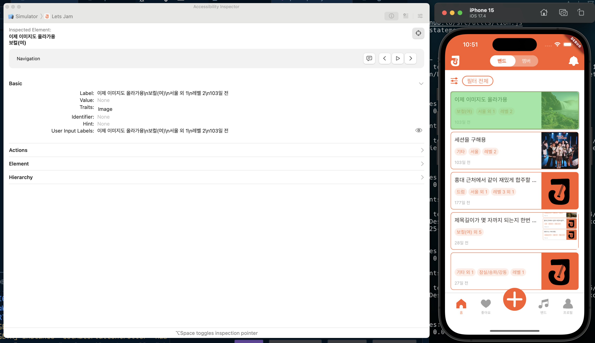
    <figcaption>사진은 그냥 개인 프로젝트 캡쳐 ㅎ</figcaption>
</figure>

모바일 접근성 테스트를 기깔나게 할 수 있다니! 

게다가 별도로 설치해야 하는 도구가 아니라, xcode에서 기본 제공해주는

**Xcode Accessibility Inspector** 라는 것이었다.

사실 이렇게 검색만 해도 나온다. ㅎ

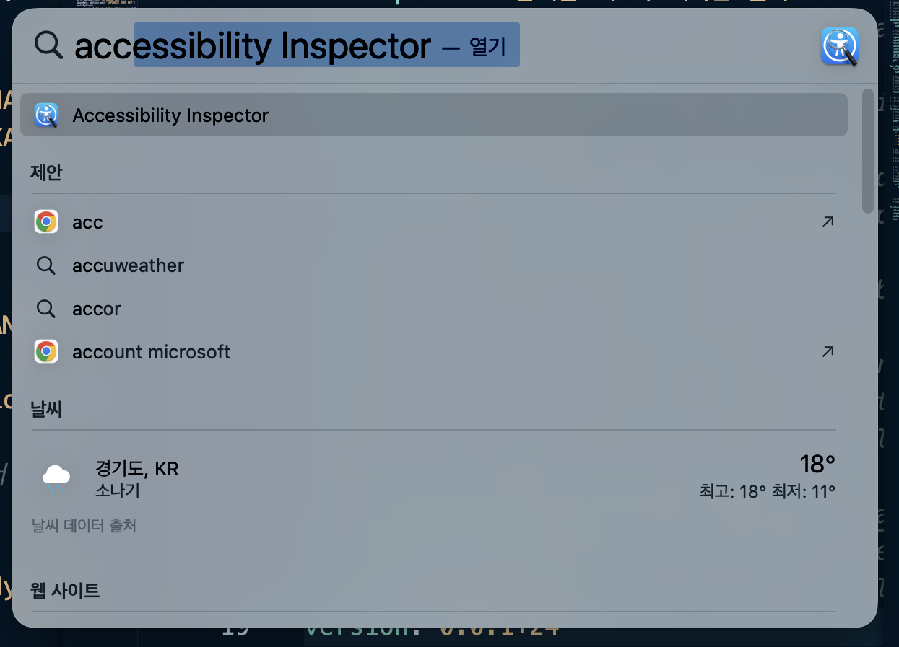
 

게다가 무려 한국말로는 **손 쉬운 사용**!! 

그렇다. 아이폰 기본 설정에 있는 손 쉬운 사용 기능을 개발자가 섬세하게 만들어낼 수 있는 보조 도구였다. 

## 흐린 눈 불가

---

앱을 실행시키고 inspector에서 연결한 뒤,
시뮬레이터 요소에 손을 갖다 대면 이렇게 기본 정보들을 보여준다. 

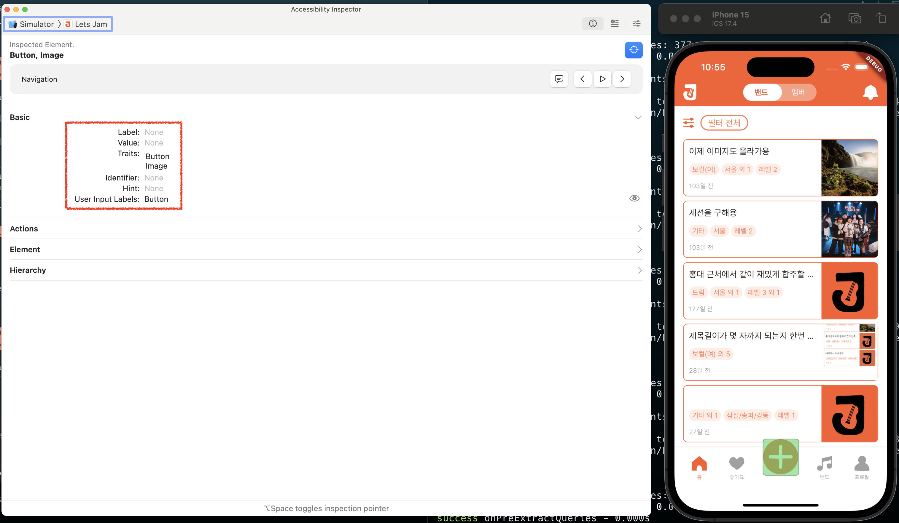
 

각 속성에 대한 구체적인 설명은 지피티한테 물어봄. ㅎ

**Label (레이블)**
- 정의: 해당 UI 요소를 대표하는 짧은 텍스트.
- VoiceOver 사용 예시: 버튼 위에 "Play"라고 적혀 있다면, "Play"가 label로 설정되어 있어야 함.
- 사용 목적: 사용자가 요소가 무엇을 의미하는지 이해할 수 있도록 설명.
- 설정 방법: `accessibilityLabel` 속성 사용.

**Value (값)**
- 정의: UI 요소의 현재 상태나 값을 나타냄.
- 예시:
    - 슬라이더의 현재 위치 값 (예: "50%")
    - 스위치의 상태 (예: "On" / "Off")
    - VoiceOver 사용 예시: "Volume, 50 percent"
- 설정 방법: `accessibilityValue` 속성 사용.

**Traits (특성)**
- 정의: UI 요소의 기능적 특성을 설명하는 플래그들.
- 예시:
    - `.button` → 버튼처럼 작동함
    - `.link` → 링크임
    - `.selected` → 선택됨
    - `.header` → 섹션 헤더임
- VoiceOver 사용 예시: "Play, button"
- 설정 방법: `accessibilityTraits` 속성 사용 (여러 개를 [] 배열로 설정 가능)

**Identifier (식별자)**
- 정의: UI 테스트(특히 UI Test)에 사용되는 고유 ID.
- VoiceOver에는 노출되지 않음.
- 사용 목적: 자동화 테스트에서 요소를 식별하는 데 사용.
- 설정 방법: `accessibilityIdentifier` 속성 사용

**Hint (힌트)**
- 정의: 요소를 어떻게 사용할 수 있는지에 대한 추가 설명.
- VoiceOver 사용 예시: "Double tap to play"
- 설정 방법: `accessibilityHint` 속성 사용

**User Input Labels (사용자 입력 레이블)**
- 정의: 사용자가 음성 입력(예: Siri나 Voice Control)을 사용할 때 어떤 단어로 이 요소를 참조할 수 있는지를 지정.
- 예시: "시작" 버튼에 대해 "Start"나 "Go"와 같은 별칭을 등록할 수 있음.
- 설정 방법: `accessibilityUserInputLabels` 속성 사용 (iOS 13 이상)

다 `accessibilityXXX` 속성을 이용하는 것 같은데, 내 사이드프로젝트 앱은 flutter로 개발했다. 🥹

그래서 flutter에서 방법을 뒤져서 잘못된 Label과 Traits를 고쳐봤다. flutter에서는 `Semantic()` 위젯을 사용한다. 

과연 결과는?

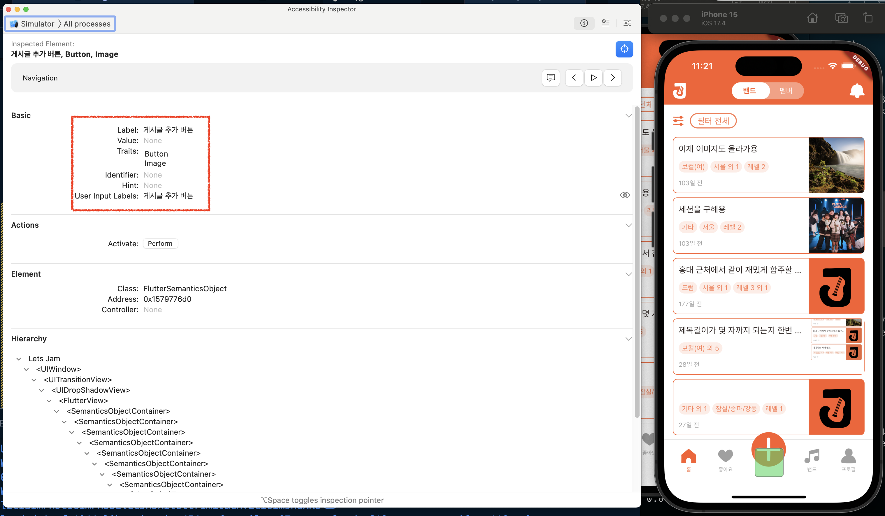
 

잘 반영됐다. 와! 이거 할 맛 나는구만.

## Basic 그 이상

---

Basic에 있는 속성만 해도 이렇게 많은데 밑에 뭐가 복잡한 게 줄줄이 더 있다.

**Actions**는 정말로 해당 요소에 붙어있는 액션을 수행해준다.

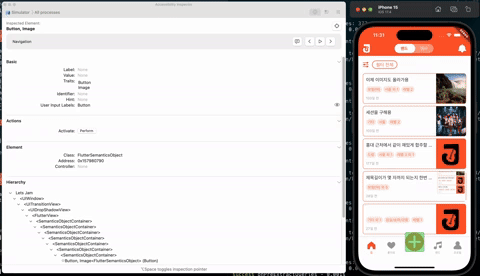

**Element**는 해당 요소의 근원(?)과 메모리 주소값을 보여주는 것 같다.

Flutter로 개발했기에 `FlutterSemanticsObject`라고 뜨고,

iOS 네이티브 개발에서 사용하는 Controller는 그래서 안 뜨나보다.

마지막으로 **Hierarchy**는, 

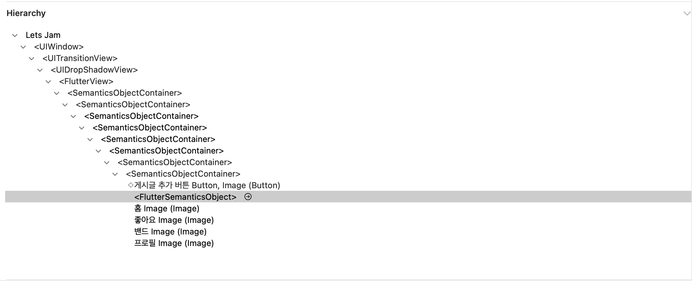
 

flutter의 장풍식💨 개발화면을 그대로 잘 보여준다. 

## 맘 졸이는 감사

---

이렇게 접근성 수정을 다 했어. 하지만 절대 안심할 수 없다. 

요즘 들어 더더욱 중요해지는 접근성에 따라 정상적으로 앱 운영을 위한 감사가 언제 불쑥 들어닥칠지 모른다.

이 Inspector에서는 뭘 더 고쳐야 할지 모르는 사람들을 위해 **Audit** 기능을 제공한다.

우측 상단의 뭘 표시하는지 알 수 없는 버튼을 누르면, **Run Audit** 버튼이 나온다.

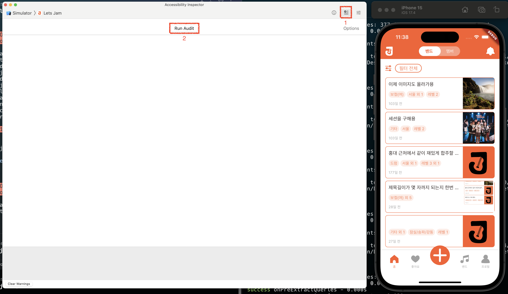
 

두려움에 떨면서 돌려보자.

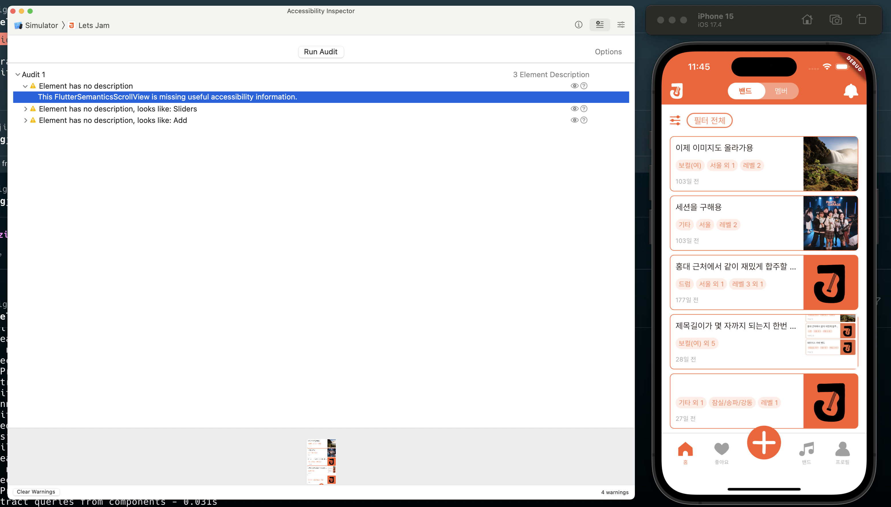
 

다행히(?) 3개밖에 안 나온다. 

그런데 사실 앱 전체가 아니라 이 화면에서만 3개니까. ㅎ

화면 하단에 어디가 잘못됐는지도 명확히 프리뷰로 집어준다.

게다가 자세히 보면 옆에 눈과 물음표 모양이 있다. 더 섬뜩해진다.

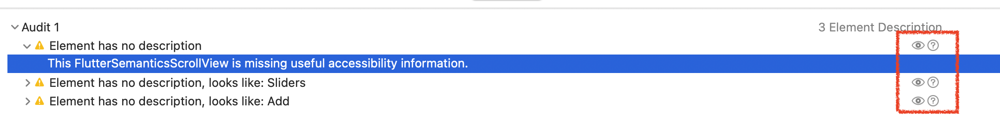
 

눈알을 클릭해보니 어디가 잘못 됐는지 똑똑히 보라는 듯 더 큰 프리뷰로 알려주고,

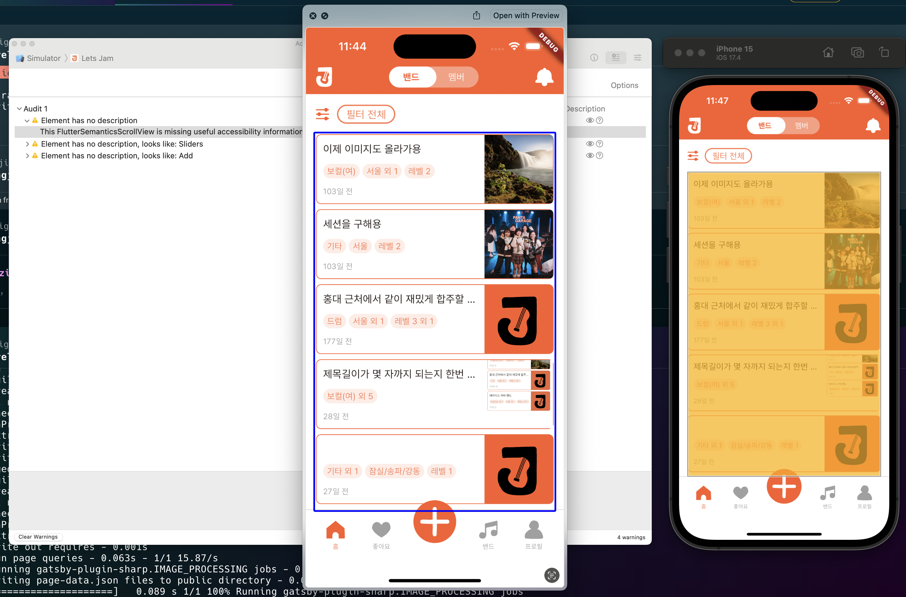
 

물음표를 클릭해보니 친절하게 고치는 방법까지 알려준다.

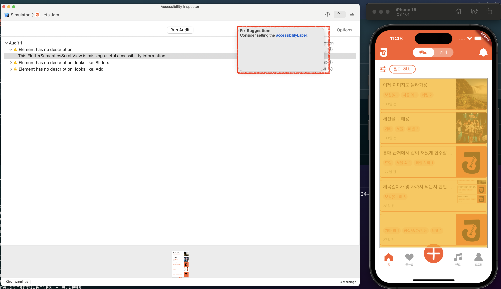
 

이제는 더 이상 물러날 곳이 없다.

## 더 친절한 도움

---

마지막으로, 우측 상단의 가장 오른쪽 버튼을 눌러보면

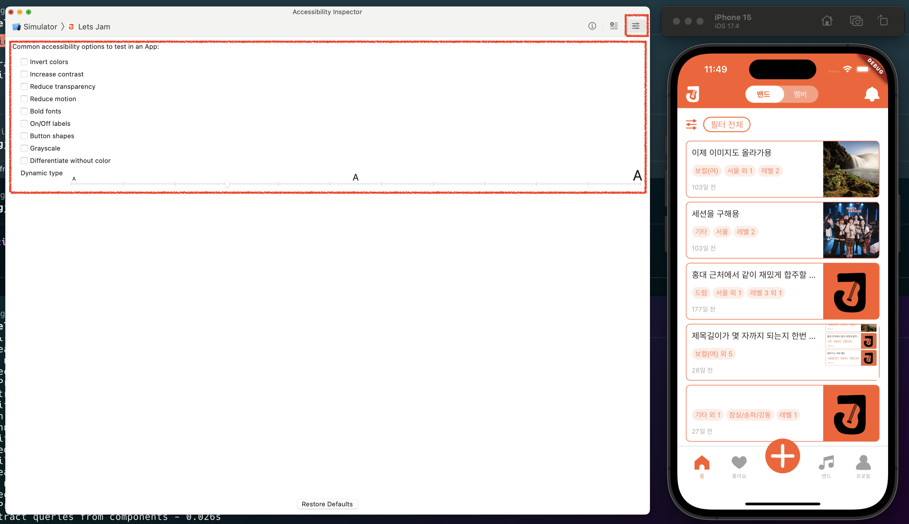

이렇게 앱에서 고치면 좋을 속성들에 대해서 친절한 가이드라인도 알려주고,

더큰 텍스트에 대한 테스트도 가능하다.

당연히 졸속으로 만든 내 앱은 더큰 텍스트 따위 지원할 리 없다. ㅎ

## 마무리

--- 

평생을(??) 웹 개발만 하다가, 모바일 웹뷰 개발을 하니 낯선 점도 많고

그 와중에 접근성은 아예 잊고 살았다.

더큰 텍스트 그건 또 뭔데... 🥲 

웹 개발할 때 크롬의 여러 도구를 이용해 접근성 테스트를 했던 것처럼,

모바일에서도 이런 도구가 기본으로 제공될 것이라는 생각을 잘 못했던 것 같다.

이만큼 친절하게 필요한 정보만 잘 안내해주는 만큼,

앞으로 훌륭한 모바일 웹뷰 개발자(..)로 거듭나기 위해 이제는 더 이상 외면하지 말아야겠다.

회사 프로덕트에서도, 내 사이드 프로젝트에서도.

우하하! 🤭 

## 참고자료

---

- https://zeddios.tistory.com/444
- https://velog.io/@ryan-son/Xcode-Accessibility-Accessibility-Inspector

