얼마만의 위클리 외 블로그 글 작성인지! 

어떻게 시작해야 하는지도 어색할 만큼 오랜만이구만… 

## 들어가며

---

최근 취업 후 거의 처음으로 사이드프로젝트를 시작하며 앱 개발을 하게 되었다.

멀티플랫폼 앱 개발의 근본 React Native를 선택할 것인지, 최근에 또 핫하고 빠른 속도로 개발이 가능하다는 Flutter를 선택할 것인지 고민한 끝에… 

둘 다 튜토리얼 강의를 들어보고 선택하기로 했다. 


### React Native

사실 취업 전에 잠깐 React Native로 간단한 앱을 만들어보기도 했고, JavaScript 프레임워크기 때문에 별다른 어려움 없이 개발할 수 있겠다는 생각이 들었다. 그리고 아직 국내 시장 점유율이나 레퍼런스도 React Native가 훨씬 많아보이고… 

하지만 React Native로 개발하며 마주하게 된다는 여러 네이티브 관련 문제들을 잘 해결할 수 있을지도 의문이었고, 왠지 나에게 신선하지 않아 😬 고민되는 지점들이 있었다.

### Flutter

Flutter를 배워볼 거라고 생각하지도 못했는데, 일단 한번 어떻게 생겼나 구경해보자 하던 참에 팀원 분께서 적극 추천하셨던(취업 시장에서도 ㅋㅋ) 터라 배워보게 되었다. Dart 기반의 프레임워크라 Dart 언어도 새로 배워야 한다는 점이 좀 걸렸지만, 어차피 요즘 한가했기 때문에 🙃 

그리고 디자이너와 함께하는 사이드프로젝트 개발에서, 디자이너의 꿈을 펼치기에도 더 자유로운 Flutter가 적합할지도 모른다는 생각이 들었다. 아직 확실히 결정한 것은 아니지만, 나… Flutter로 개발해볼지도? 

이번에는 비교적 익숙해서 입문 단계에서는 별 다른 어려움이 없었던 React Native 말고, 완전 제멋대로 기상천외 천방지축 여러번 충격을 안겨줬지만 그래서 흥미롭기도 했던 Dart와 Flutter의 문법들에 대해 소개해보려고 한다. 

> 👉 Dart와 Flutter를 배우며 블로그 주인장 개인이 느낀 독특한 점들을 소개하는 글로, Dart 및 Flutter의 동작 원리나 기본 개념에 대해서는 설명하지 않을 거다.
> 

## 오직 Flutter를 위한 언어, Dart

---

구글에서 만든 Dart 언어는 Flutter 프레임워크를 위해 탄생한 언어라고 해도 과언이 아닐 것이다. 오죽하면 Dart 공식 홈페이지에서도 ‘UI에 최적화된 언어’라고 소개하고 있으며, 공식 동영상에서도 ‘Why Flutter uses Dart’라고 소개할까… 왜 Flutter가 Dart를 사용하냐니. Flutter 만들려고 만든 언어가 Dart잖아 -_- 쓸데없는 잘난척 쩐다.

[동영상 링크](https://www.youtube.com/watch?v=5F-6n_2XWR8&embeds_referring_euri=https%3A%2F%2Fdart-ko.dev%2F&embeds_referring_origin=https%3A%2F%2Fdart-ko.dev&source_ve_path=Mjg2NjY&feature=emb_logo)

공홈의 동영상을 실행해본 김에 끝까지 Java, Swift, JavaScript에 익숙한 개발자라면 금방 배울 수 있을 거라고 한다. 나… 우연찮게 세 개 다 배워본 사람에 속하잖아? Swift는 거의 모르지만. 어쩐지 대부분의 문법이 JavaScript 같으면서도 Java의 객체지향을 짬뽕시켜놓은 듯한 느낌을 받았다. 

## JavaScript인줄 알았는데 Java인 Dart

---

Dart에서는 다음과 같이 `var`로 변수를 선언할 수도 있지만,

```dart
var name = "zig"
```

클래스에서 변수나 프로퍼티를 선언하는 경우 명시적으로 변수의 값을 명시하는 방법을 많이 사용하는 것 같다.

```dart
String name = "zig"
```

`String`과 같은 타입들은 Java에서 사용하는 타입 선언과 유사한데, 한 가지 신기한 것은 변수의 타입을 모를 때 사용하는 `dynamic`이다.

```dart
dynamic name; 
```

변수가 어떤 타입인지 알 수 없는 경우(ex. json) 등에 사용한다. 이때 또 편리한 것은 dynamic을 쓰고 데이터를 체크할 수 있다는 점

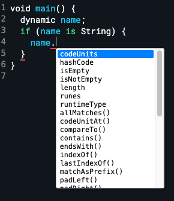

JavaScript에서는 TypeScript를 써야지만 비로소 해주는 걸 Dart는 알아서 해주잖아? Dart는 널(null) 타입 안정성을 지원할 뿐만 아니라, [컴파일타임](https://dart-ko.dev/language/type-system)과 [런타임 검사](https://dart-ko.dev/language/type-system#%EB%9F%B0%ED%83%80%EC%9E%84-%EA%B2%80%EC%82%AC)를 사용하여 타입 안정성도 지원해준다. 

정말 이런저런 언어 다 나오는 거 지켜보다가 알짜배기 기능들만 쏙쏙 골라넣은 느낌.

게다가 더욱 더 Java같은 건, 변수 선언에 추가 접근자들을 사용할 수도 있다. 그것은 바로 `final`과 `late`.

변수 선언 후에 변수의 값을 수정할 수 없게 만들려면, `final`을 사용한다.

```dart
final String name = "zig";
```

그리고 초기 데이터 없이 변수를 선언하고 싶다면, `late` 를 사용한다. 이때 `final`과 같이 사용할 수도 있음!

```dart
late final String name;
// do something...
name = "zig;
```

값을 미리 알지 못하는 경우(ex. API 응답값) 활용하면 좋다.

추가로, Dart에서는 변수 선언 시 위에서 사용한 `var` 대신 `const`도 사용할 수 있는데, Dart의 `const`는 JavaScript의 `const`와 다르다.

JavaScript의 `const`는 Dart의 `final`과 비슷하다. Dart에서 `const`는 컴파일타임의 변수를 만들어준다. 즉 `const`는 컴파일타임에 알고 있어야 하는 값(ex. 앱에서 사용할 상수들)이다. 런타임, 예를 들면 API 응답을 통해 받거나 사용자가 입력해야 하는 값이면 `const`가 될 수 없는 것이다. 

정리하면,

- `final` - 런타임에 값이 결정되는 값
- `const` - 컴파일타임에 값이 결정되는 값

이라고 할 수 있다! 

## 빌트인 옵션이 짱짱한 Dart

---

클래스 기반의 타입을 제공하는 Dart는, 타입이 명시된 변수에서 기본으로 사용할 수 있는 타입 한정 빌트인 메소드들을 많이 제공한다.

<p style="display: flex; justify-content: center; gap: 16px">
  <span style="width: 280px">
    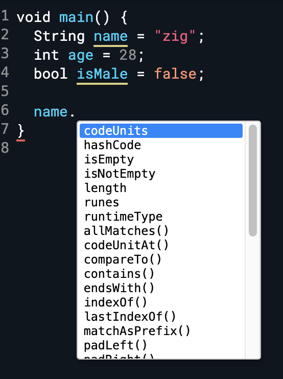
  </span>
  <span style="width: 292px">
    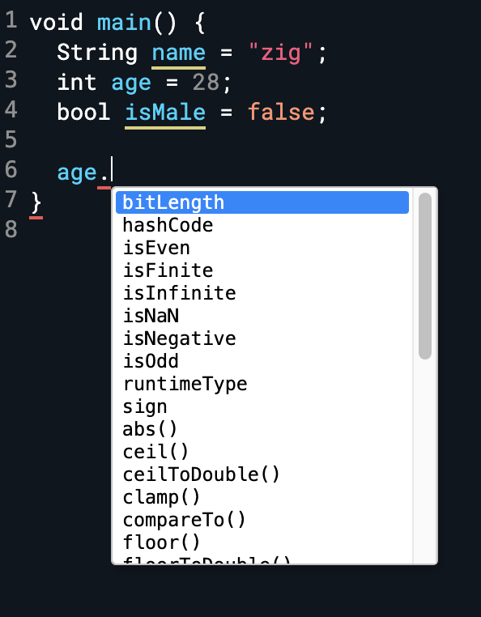
  </span>
</p>

예를 들어 [Dart의 String class](https://api.dart.dev/stable/1.10.1/dart-core/String-class.html) 문서에만 들어가봐도, 

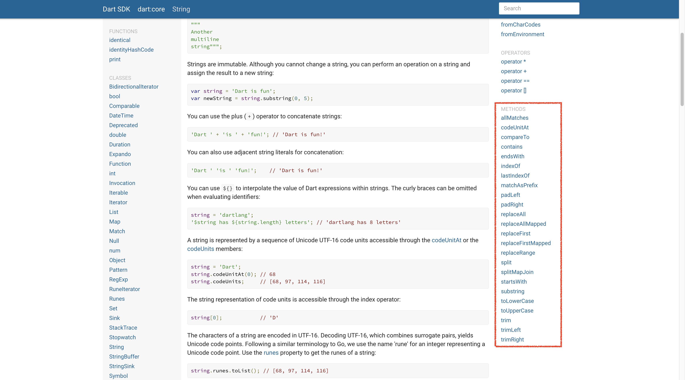
<br />

이렇게 무수한 메서드를 제공해준다고… 너 좀 편하다? 

JavaScript를 써본 사람들이라면, JavaScript에서도 이런것좀 지원해주지 생각이 들지 싶은, 이름만 봐도 대강 느낌이 오는 메서드들이 줄줄이다. 

예를 들면 이런 것도.

```dart
void main() {
  var numbers = [1, 2, 3, 4];
  print(numbers.last);
}

// 4
```

흑흑. 멋지다 

## 해달라는 대로 다 해주는 Dart

---

Dart의 collection if, 그리고 collection for

```dart
var giveMeFive = true;
var numbers = [1, 2, 3, 4, if (giveMeFive) 5];
```

```dart
var oldFriends = ['nico', 'lynn'];
var newFriends = [
	'lewis',
	'ralph',
	'darren',
	for (var friend in oldFriends) "❤️ $friend"
]
```

이런 문법 파이썬에서도 됐던가, 싶은데 그건 좀 달랐던 것 같다. 배열을 통짜로 만들 때는 가능했던 것 같은데, 이렇게 배열의 일부 요소들에만 적용해주는 것은… 정말 개발자 친화적인 언어라고 자뻑이 심해도 인정해주겠다 Dart 

## 그런데 조금 헷갈리기도…

---

얼마 전에 ‘프로그래머의 뇌’에서 읽었다. 비슷한 언어를 배울 때에는 학습 속도가 빠르다는 장점이 있지만, 그 내용이 이미 장기 기억에 있는 기억과 충돌될 경우 해당 개념을 지우고 다시 학습해야 하기 때문에 오히려 더 어렵다는 내용. 내가 프랑스어 전공을 하고 스페인어를 배울 때 처음엔 개꿀이라고 생각했지만, 프랑스어에서 여성 명사인 단어를 스페인어에서 남성 명사로 마주했을 때의 공포와 충격 같은 것.

JavaScript 장기기억자인(ㅋㅋ) 나에게도 조금은 낯설었던, 하지만 이해가 안 가는 것은 아니었던 Dart의 문법 몇 가지

### Named Parameters

Dart의 함수 파라미터에서도 named parameters를 지원한다.

```dart
String sayHello({ 
	String name = 'anon', 
	int age = 99, 
	String country = 'wakanda' 
}) {
	return "Hello $name, you are $age, and you come from $country";
}

void main() {
	print(sayHello(
		name: "zig", 
		age: 19, 
		country: "korea"
	));
}
```

함수 선언부는 JavaScript와 비슷하긴 한데, 호출부에서 중괄호(`{}`)가 없어졌잖아 😵

물론 Dart처럼 쓰는 게 코드를 한 글자라도 더 절약할 수 있고, 간단하긴 하다.

하지만 JavaScript 쓰던 습관이 있는 사람에게는 조금 헷갈릴 수 있을 것

### 클래스 사용 방식

- **인스턴스 생성 시 `new` 를 붙여도 되고 안 붙여도 된다.**
    
    …그냥 붙이는 걸로 통일하면 안돼? ㅠ
    
- **Dart class에서는 `this`를 써도 안 써도 되는데, 클래스 메서드 내의 `this`는 사용하지 않는 것을 권장한다.**
    
    …그냥 다 붙이면 안돼? ㅠ
    

## Dart도 객체 지향 언어였어!

---

방금 살짝 언급했지만, 오랜만에 다시 만나는 객체 지향 언어인 Dart. 클래스 사용 방식에도 많은 고민을 넣은 것이 분명하다.

기본적으로 클래스를 선언하고, 생성자에 인자를 전달하는 방법은 다음과 같다.

```dart
class Player {
  late final String name;
  late int xp;
  
  Player(String name, int xp) {
    this.name = name;
    this.xp = xp;
  }
  
  void sayHello() {
    print("Hi my name is $name");
  }
}

void main() {
  var player = Player("zig", 1500);
  player.sayHello();
}
```

그렇지만 생성자에 중복을 제거하고 더 간단히 작성할 수 있는 방법이 있으니,

```dart
class Player {
  final String name;
  int xp;
  
  Player(this.name, this.xp);
  
  void sayHello() {
    print("Hi my name is $name");
  }
}

void main() {
  var player = Player("zig", 1500);
  player.sayHello();
}
```

😲 너네 정말, 그동안 코드 치기 귀찮아서 이번엔 아예 쉽게 만들려고 작정을 했구나? 

게다가 생성자에 named argument를 사용할 경우 이렇게도 해준다.

```dart
class Player {
  final String name;
  int xp;
  String team;
  int age;
  
  Player({
    required this.name,
    required this.xp,
    required this.team,
    required this.age
  });
  
  void sayHello() {
    print("Hi my name is $name");
  }
}

void main() {
  var player = Player(
    name: "zig",
    xp: 1200,
    team: "blue",
    age: 21
  );
  player.sayHello();
}
```

조금 낯설지만 익숙해지면 유용할 것 같으니 우선 칭찬해줄게… 👏

근데 여기까지는 친해지기 그른 것 같다. Dart class의 `:` 문법 

```dart
class Player {
  final String name;
  int xp, age;
  String team;
  
  Player.createBluePlayer({ required String name, required int age }) : 
	  this.age = age,
	  this.name = name,
	  this.team = "blue",
	  this.xp = 0;
	  
	// 요렇게도 가능 
  Player.createRedPlayer(String name, int age) : 
    this.age = age,
    this.name = name,
    this.team = "red",
    this.xp = 0;
}

void main() {
  var bluePlayer = Player.createBluePlayer(
    name: "zig",
    age: 21
  );
  bluePlayer.sayHello();
  var redPlayer = Player.createRedPlayer("yung", 25);
  redPlayer.sayHello();
}
```

😇

## Flutter의 모든 것, Widget

---

이제 드디어 Flutter로 넘어왔다.

Flutter의 거의 모든 코드는 Widget으로 이루어져 있다. 

아무리 모듈을 분리해도 결국엔…

```dart
@override
Widget build(BuildContext context) {
  return Scaffold(
    backgroundColor: Colors.white,
    appBar: AppBar(
      elevation: 2,
      surfaceTintColor: Colors.white,
      shadowColor: Colors.black,
      backgroundColor: Colors.white,
      foregroundColor: Colors.green,
      actions: [
        IconButton(
            onPressed: onHeartTap,
            icon: Icon(
              isLiked ? Icons.favorite : Icons.favorite_outline_outlined,
            ))
      ],
      title: Text(
        widget.title,
        style: const TextStyle(
          fontSize: 26,
        ),
      ),
    ),
    body: SingleChildScrollView(
      child: Padding(
        padding: const EdgeInsets.all(50),
        child: Column(
          children: [
            Row(
              mainAxisAlignment: MainAxisAlignment.center,
              children: [
                Hero(
                  tag: widget.id,
                  child: Container(
                    width: 250,
                    clipBehavior: Clip.hardEdge,
                    decoration: BoxDecoration(
                        borderRadius: BorderRadius.circular(15),
                        boxShadow: [
                          BoxShadow(
                            blurRadius: 15,
                            offset: const Offset(10, 10),
                            color: Colors.black.withOpacity(0.5),
                          )
                        ]),
                    child: Image.network(
                      widget.thumb,
                      headers: const {
                        'Referer': 'https://comic.naver.com',
                      },
                    ),
                  ),
                )
              ],
            ),
            const SizedBox(
              height: 25,
            ),
            FutureBuilder(
                future: webtoon,
                builder: (context, snapshot) {
                  if (snapshot.hasData) {
                    return Column(
                      crossAxisAlignment: CrossAxisAlignment.start,
                      children: [
                        Text(
                          snapshot.data!.about,
                          style: const TextStyle(
                            fontSize: 16,
                          ),
                        ),
                        const SizedBox(
                          height: 15,
                        ),
                        Text(
                          '${snapshot.data!.genre} / ${snapshot.data!.age}',
                          style: const TextStyle(
                            fontSize: 16,
                          ),
                        ),
                      ],
                    );
                  }
                  return const Text("...");
                }),
            const SizedBox(
              height: 25,
            ),
            FutureBuilder(
                future: episodes,
                builder: (context, snapshot) {
                  if (snapshot.hasData) {
                    return Column(
                      children: [
                        for (var episode in snapshot.data!)
                          Episode(episode: episode, webtoonId: widget.id)
                      ],
                    );
                  }
                  return Container();
                })
          ],
        ),
      ),
    ),
  );
}
```

그리고 Dart 타입 클래스의 빌트인 메서드들처럼, 엄청난 param들을 제공하는 Flutter의 Widget들

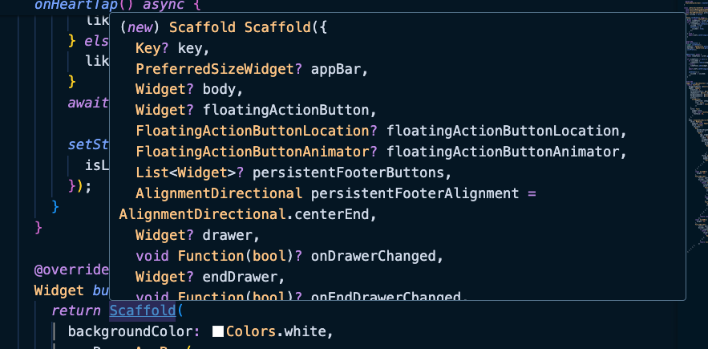
<br />

유용하긴 유용한데, 궁금하다고 이걸 다 사용해보다간 머리가 터질 게 분명해.

React Native와 Flutter, Ionic을 모두 사용해보고 비교분석한 어느 글에서도 Flutter의 중첩 Widget 구조는 개노답이 될 수도 있다고 얘기한 걸 본 적이 있다. 

그래도 이 수많은 중첩 괄호들의 끝에 vscode는 이것이 어떤 Widget의 클로징 괄호였는지 알려준다 ㅎㅎ

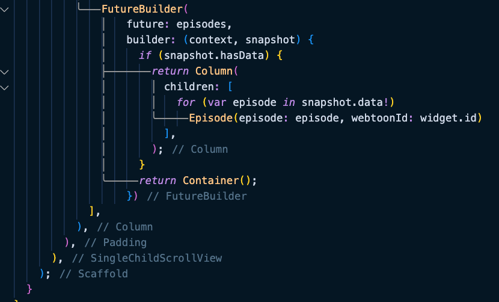
<br />

그리고 새 Widget으로 감싸거나 분리할 때는 노란 전구를 눌러주면 알아서 해준다.

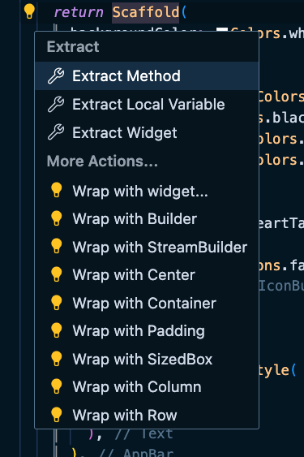
<br />

이 정도면 Copilot급 친절함. ㅇㅈ? 

## 디버깅에 진심인 Flutter

---

vscode에 dart devtools만 설치하면, 엄청난 디버깅 도구를 제공해준다.

우측 상단 요 버튼을 클릭하면


<br />

Flutter로 작성한 앱을 시뮬레이터에 띄워주고, 변경사항도 Hot Reloading을 통해 시뮬레이터에 즉시 반영해준다

그리고 대망의 Widget Inspector.

Layout이 헷갈린다면 요걸 눌러보자


<br />
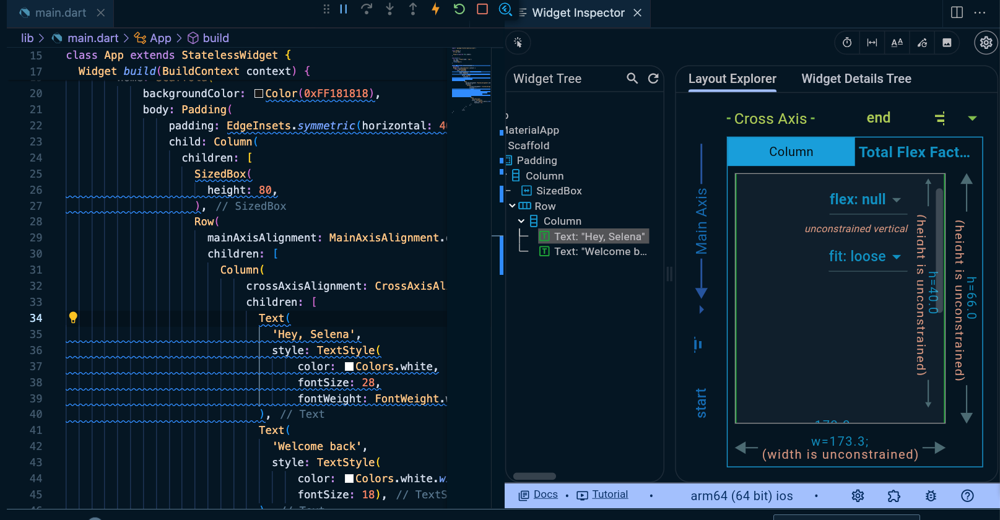
<br />

대박!

align 등을 다른 값으로 선택하면 해당 값으로 미리보기도 보여준다

그리고 다음 버튼을 활성화하면 simulator에서 마우스클릭 시 어떤 widget인지 보여준다 


<br />

앱 개발할 때 항상 신경 쓰이는, 디바이스의 여백을 알려주는 기능도 있다

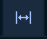
<br />

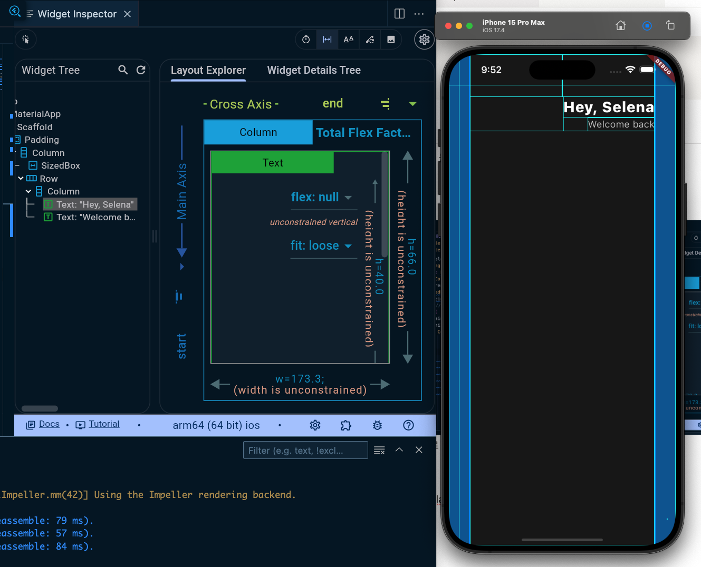
<br />

추가로, 디버깅 도구는 아니지만 UI 버그 시 Flutter는 이렇게도 알려준다.

<div style="width: 400px; margin: auto" >
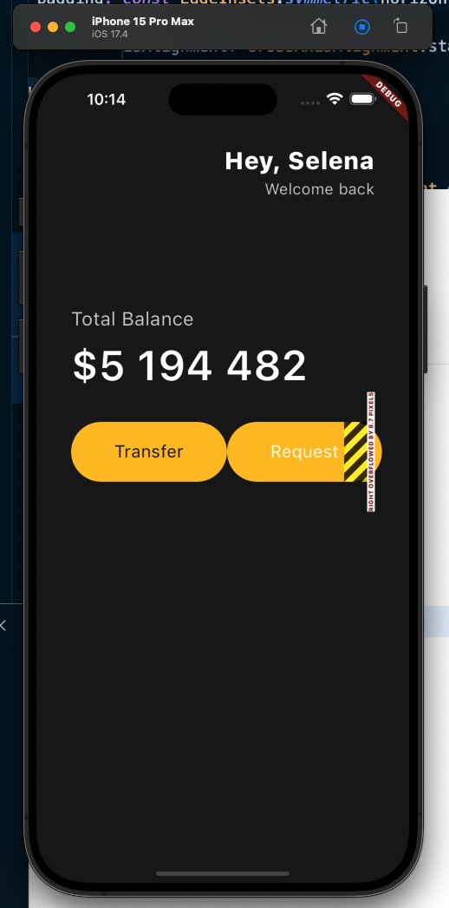
</div>
<br />

개발자가 만든 요소가 화면에서 8.7px 벗어났다고 알려주다니! 제법이군.

(물론 디버깅 쉘에서도 알려준다.) 


## 제법 React를 따라한 구석이 있을지도

---

### setState

Flutter에도 React의 `setState()` 와 같은 state updater 함수가 있다. 이름도 똑같은 `setState()`. 

상태로 선언한 값을 그냥 바꾸면 안 되고, `setState()` 를 호출해야지만 클래스(위젯)이 데이터의 변경을 감지하고 UI를 업데이트한다.

즉 flutter에게 최신의 데이터를 보여달라고 하려면 `setState()`를 호출해야 한다.

하지만 flutter에서 state를 그렇게 많이 사용하진 않는다고 한다. 어쩌라고? 

### Widget Lifecycle

React 컴포넌트 클래스의 라이프사이클 트라우마가 생긴 것만 같다… 

근데 사실 별거 없다. 

Flutter의 `StatefulWidget`은, UI를 그려주는 `build()` 말고 다음과 같은 핵심 라이프사이클을 갖고 있다.

- `initState()`
    - 대부분의 상황에서는 필요 없음
    - 그냥 클래스 프로퍼티로 선언하면 됨
    - 그러나 종종 부모 요소에 의존하는 데이터를 초기화하고 싶은 경우나, API를 사용한 데이터인 경우
    - 중요한 것은 `initState()` 메서드가 `build()` 보다 항상 먼저 나와야 함
    - 그리고 `initState()`는 딱 한번만 호출됨
- `dispose()`
    - 위젯이 스크린에서 제거될 때 호출되는 메서드
    - 위젯이 위젯 트리에서 제거되기 전에 무언가를 취소하는 곳

## 최적화도 알아서 해줄게

---

개인적으로 Flutter 튜토리얼을 하며 감동 받은 포인트 중 하나는, `FutureBuilder`도 `BuildContext`도 아닌, 뜬금없는 `ListView` 였다. 

`ListView` 는 많은 양의 데이터를 연속적으로 보여주고 싶을 때 사용하는 위젯으로, 여러 항목을 나열하는 데 최적화되어 있다. 

`FutureBuilder`를 통해 가져온 비동기 데이터 목록을 다음과 같이 보여주는 방법도 있지만,

```dart
return ListView(
  children: [
    for (var webtoon in snapshot.data!) Text(webtoon.title)
  ],
);
```

좀 더 최적화된 옵션을 사용할 수 있다. 

그것은 바로 `ListView.builder()` 를 사용하는 것

`ListView.builder()` 에서는 scroll과 list의 개수를 정할 수 있다. 

`required`인 `itemBuilder()` 메서드를 사용하여 사용자가 보고 있는 아이템만을 build하고, 보고 있지 않은 것은 메모리에서 삭제한다. 어떤 아이템이 build되는지 아닌지는 `itemBuilder()`의 index를 통해서만 알 수 있다.

`즉 ListView.builder()` 는 모든 아이템을 한 번에 만드는 대신 만들려는 아이템에 `itemBuilder()` 함수를 실행하여, index로 아이템에 접근해가며 UI를 필요한 순간에 만드는 것이다. 

```dart
return ListView.builder(
  scrollDirection: Axis.horizontal,
  itemCount: snapshot.data!.length,
  itemBuilder: (context, index) {
    var webtoon = snapshot.data![index];
    return Text(webtoon.title);
  },
);
```

스크롤하면서 인덱스를 찍으면 즉시 만들어지는 것을 볼 수 있다.

<iframe src="https://giphy.com/embed/LHk0sYlzHWFtC0FJz4" width="480" height="360" frameBorder="0" class="giphy-embed" allowFullScreen></iframe><p><a href="https://giphy.com/gifs/LHk0sYlzHWFtC0FJz4">via GIPHY</a></p>


앱 개발을 본격적으로 해본 적은 없지만, 거의 모든 앱에서 필요한 기능이 아닐까 싶다. 웹에서도 목록 렌더링에 인피니트 스크롤을 때리니, 페이지네이션을 때리니 서버와의 협업이 무조건 필요한 경우가 대다수였는데, 이토록 알아서 해주다니… 너 인정이다 


<br />

## 마무리하며

---

Dart를 내가 정말 배울까 싶었는데, 위기에 닥치면(?) 뭔들 못하리... 

단순히 새로운 언어와 프레임워크를 배우는 것 뿐만 아니라, '이 사람들이 그동안 이게 불편해서 이렇게까지 했구나', '정말 심혈을 기울인 포인트들이 있구나' 싶은 포인트들이 있어서 때로는 감탄하며, 때로는 당황하며 배웠다. 

이제 앱을 만들어볼... 수 있을까? 😵