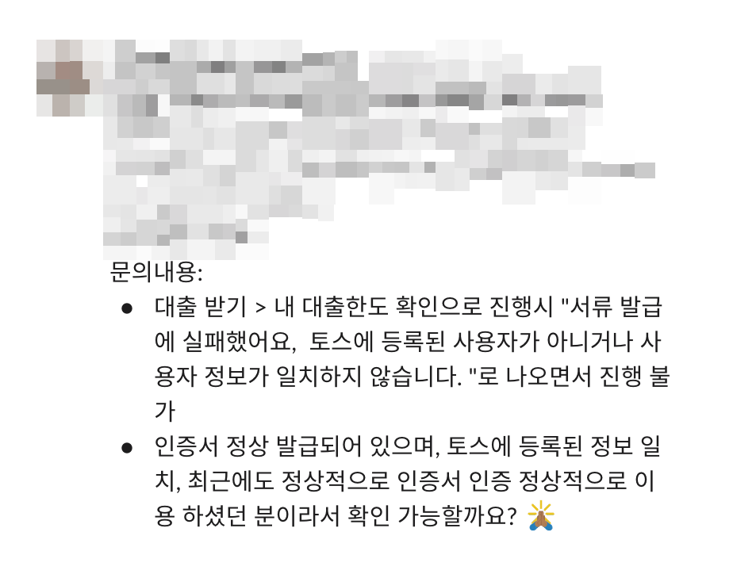
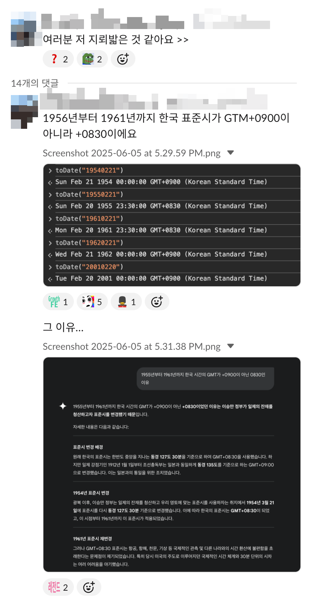
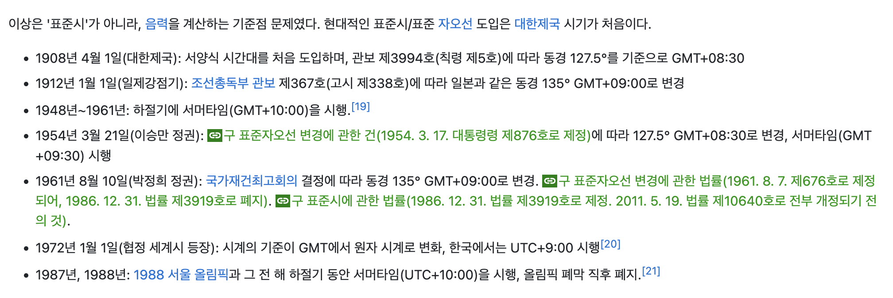

<!-- more -->

---

 

토스 대출팀에 들어온지 어언 3개월... 

휴가로 자리를 비운 새 어김없이(?) CS건이 접수되는데.

<figure style="text-align: center;">
    
</figure>

많은 사람들이 등장해 문제 원인을 파악했고, 핵심은 서비스에 등록된 회원정보와, 유저가 입력한 개인정보가 다르게 들어왔다는 것!

하지만 그 원인은 알 수가 없었다. 

하지만 두 정보는 다를 수가 없을 텐데? 🤔 

(유저가 잘못된 개인정보를 입력했더라도, 개인정보 검증 단계에서 실패했을 것이다.)

<figure style="text-align: center;">
    
    <figcaption>이게 대체 무슨 일이야...</figcaption>
</figure>

사건이 미궁 속으로 빠지던 와중, 어느 동료가 꺼낸 충격적인 😱 소식 

<figure style="text-align: center;">
    
</figure>

즉, 프론트에서 날짜를 한국 표준시에 맞춰 포맷팅을 하는데 1955년~1961년까지 한국의 표준시가 +09:00에서 +08:30으로 바뀐 것이 적용되어,

(예를 들어) 57년 6월 14일 출생인 유저의 생년월일 포맷팅이 6월 14일 자정에서 30분 전인 13일 23:30으로 포맷팅되고 있었던 것이다.

<figure style="text-align: center;">
    
</figure>

길지 않은 개발 인생 이런 억까는 또 처음 본다. 

사유는 캡쳐에 잠깐 나온 대로 **해당 시기, 이승만 정부가 일제의 잔재를 청산하고자 표준시를 변경했기 때문**이라고 한다.
 
~~아니 근데 한 시간씩 깔끔하게 옮길 거면 옮기지 왜 때문에 애매하게 30분 당기는지?~~ 

참고로, 나무위키에 검색해봤더니 참 많이도 바꿨다. 😇 

<figure style="text-align: center;">
    
</figure>

프론트 개발 하려면 역사 공부도 해야 하는 시대

파보면 또 이런 게 나올 수도 있지 않을까? 

디지털 고고학자가 필요해질지도... 🕵️‍♀️ 

