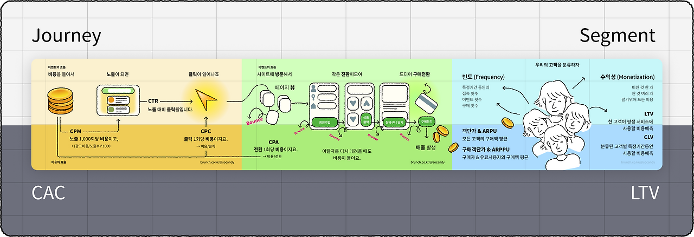

## 💡 Newly Learend

---

### git rerere

어떻게 읽는거지... '레레레'도 아니고.

당연히 내가 모르는 영단어가 있겠거니 싶어 검색해봤는데, 그런 것도 없단다.
 
Git 문서에 들어가보니, "reuse recorded resolution"이라고... ㅋㅋㅋ

즉, "기록해둔 충돌 해결 방법을 다시 사용하는" 방법 

`git rerere`는 병합 충돌(merge conflict)을 한 번 해결하면 그 해결 내용을 기억해 두고,
나중에 같은 충돌이 또 발생할 때 자동으로 같은 방식으로 해결해 주는 기능이다. 

```bash
git config --global rerere.enabled true
```

위와 같이 설정하면 Git이 자동으로 rerere를 사용해서, 같은 충돌이 반복될 때 매번 수동으로 수정하지 않아도 된다. 

**Ref** 
- https://johngrib.github.io/wiki/git/rerere/
- https://git-scm.com/book/ko/v2/Git-%EB%8F%84%EA%B5%AC-Rerere

### 선언적 프로그래밍에 대한 착각과 오해

선언적 프로그래밍은 '관계'를 설명한다.

> 요리 레시피를 생각해보자. 
> 절차적 접근은 레시피와 같다. “물 2컵을 끓인다, 면을 넣고 3분간 끓인다, 스프를 넣고 1분간 더 끓인다, 그릇에 담는다”라는 시간의 흐름에 따른 행동 지침이다.
> 반면 선언적 접근은 관계를 표현한다. “라면 = 삶은 면 + 스프 + 뜨거운 물의 조합”이라는 재료들 사이의 본질적 관계를 나타낸다.
<br />

실무에서는, 

- 비즈니스 로직과 상태 관리 ➡️ 선언적 접근
- 인프라 레벨과 성능 최적화 ➡️ 절차적 접근

**Ref** https://evan-moon.github.io/2025/09/07/declarative-programming-misconceptions-and-essence/

## 📍 Monthly Pinned

---

### 나를 만들어준 소프트웨어 에세이들

개발력 떨어질 때, 공부하고 싶을 때 읽어보면 유익할 글들

그중 처음 알게 된, "Parse, don't validate" 공부하기 > [📌블로그]()

**Ref** https://refactoringenglish.com/blog/software-essays-that-shaped-me/

### 60대까지 현역, 40년간 개발자로 살아남은 비결

'궁금함이 병인 것 같다'라는 개발자 진광헌님.

60대는 커녕, 40대에는 이 일을 할 수 있을까 의문인 나는 요즘 무엇이 궁금할까? 💭

그의 말처럼, 오히려 '남들이 기피하는 프로젝트를 골라' 기술 스펙트럼을 넓히는 것도 나와 잘 맞을 것 같다. 

**Ref** https://yozm.wishket.com/magazine/detail/3385/

### IT 불황에서 살아남기: 서바이벌 키트 모음

끝없이, 그리고 빠르게 쏟아지는 AI 툴의 홍수 속에서

이들을 '서바이벌 키트'라고 지칭하는 게 웃기다. (나도 살려줘~)

그중 저자가 은근히(?) 광고하고 있는 NotebookLM은 개발자도, 비개발자도 할루시네이션을 피해 잘 활용해볼 수 있지 않을까? 

**Ref** 
- https://yozm.wishket.com/magazine/detail/3380/
- https://yozm.wishket.com/magazine/detail/3178/

### AI로 10분 만에 테스트 코드 완성하기

AI와 함께 명세(Specification)를 먼저 정의하고 개발을 진행하는 SDD(Spec-Driven Develepment)!

무조건 AI로 빠르게 제품을 찍어내는 것이 아닌, 스펙을 함께 정의하고 시작하는 방식의 활용법도 좋아 보임.

단, 지나치게 세세한 지시보다는 적절한 자유도를 부여하고, 대신 우선순위를 설정하여 인간이 최종 실행 여부를 결정하는 것이 핵심!

**Ref** https://yozm.wishket.com/magazine/detail/3399/

### 서비스 기획자가 꼭 알아야 할 '핵심 지표' 가이드 

각 퍼널 별로, 헷갈릴 수 있는 영어 단축어 지표들을 쉽게 설명해준 가이드 


<br />

**Ref** https://yozm.wishket.com/magazine/detail/3390/

### 비개발 의사결정자를 위해 기술을 명확하게 설명하는 법

엔지니어들이 타 직군과의 자신있는 소통을 위해 알아야 할 '기술 명확성' 

**Ref** https://blogbyash.com/translation/provide-technical-clarity/

### 실무자를 위한 자바스크립트 '가비지 컬렉션' 가이드

클로저, 이벤트 리스너, DOM 참조 누수 등 자바스크립트를 사용하는 개발자들이 흔히 놓치기 쉬운 참조 해제들! 

크롬 DevTools에서도 현재 해제되지 않는 객체들을 쉽게 확인할 수 있다.
 
**Ref** https://yozm.wishket.com/magazine/detail/3404/

### 기획부터 편집까지, AI로 뚝딱 만드는 영상 제작 가이드

나도 아무래도 유튜브를 시작해 볼까... 📽️

**Ref** https://yozm.wishket.com/magazine/detail/3408/

### 우아한 디버깅 툴 2부: 좀 더 편하게 일하기 위한 개선들

QA 재현을 위한 세션 리플레이, 디바이스와 사용자 정보를 연결한 슬랙 DM 및 자동 티켓 생성, Network Rewrite 등 실무에서 정말 유용하게 사용할 수 있는 디버깅 연구들. 

**Ref** https://techblog.woowahan.com/23457/

### 이슈와 문제의 차이점

- 이슈는 처리하는 것 - 정해진 업무를 하는 와중에 나타난 장애물
- 문제는 해결하는 것 - 새롭게 추진해야 하는 목표 및 목표 달성 과정의 어려움 

> 문제는 해결 및 재발 방지까지 고려하는 것!

### 프로덕트는 어떻게 관계를 설계할까 

> '결국 관계를 만들려는 이유' 
<br />

'사용자와 콘텐츠의 상호작용'을 넘어서 '사용자와 사용자 간의 상호작용'이 자연스럽게 발생하도록. 

우리 프로덕트를 어떻게 '사람 냄새'나는 서비스로 만들지, 고민해보자! 🧚 

**Ref** https://brunch.co.kr/@kkmd/210

## 🧺 Wrap up 

--- 

말 그대로 순삭당한 10월... 🫥 

추석 연휴로 시작하여, 너무 힘들어 홧김의 결정(?)까지 내릴뻔 했던 10월 말.

그 와중에 본격적으로 시작되었던 친구들과의 만남은 의외로 즐기는 중 🕺 