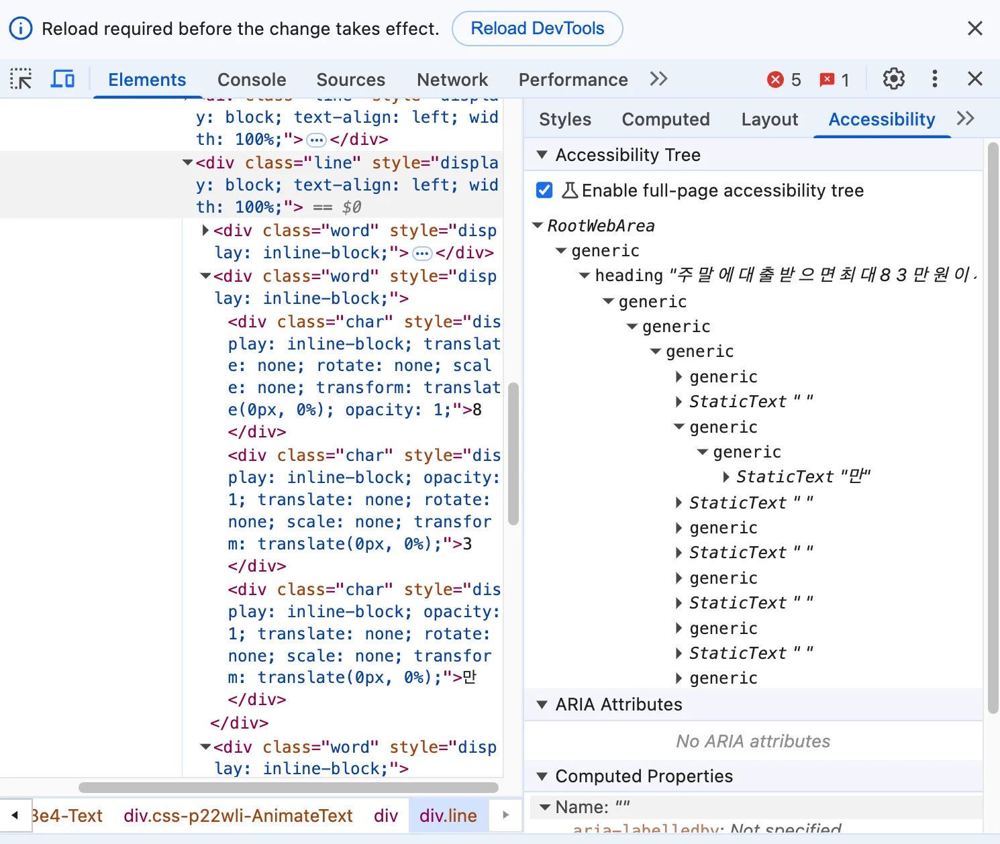
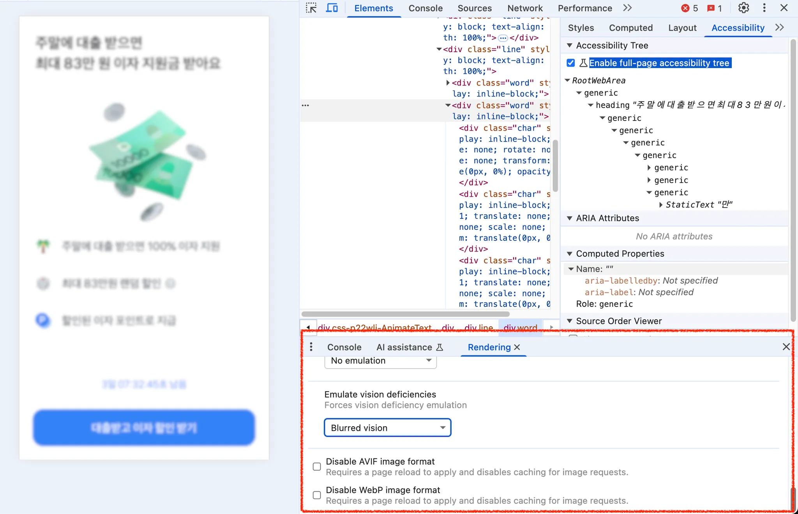
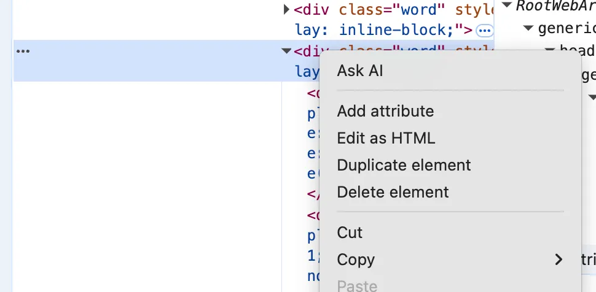
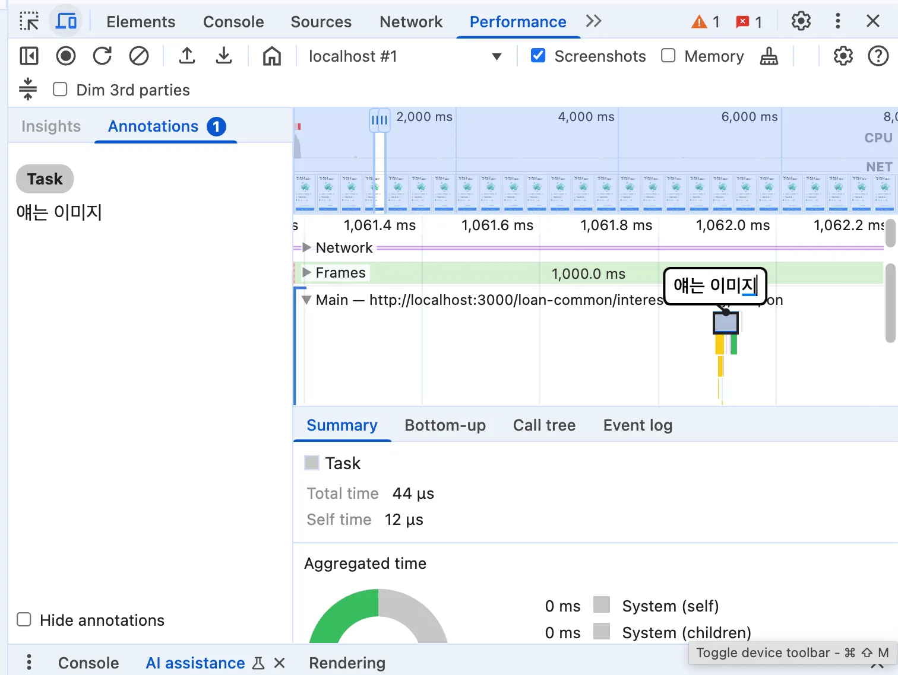
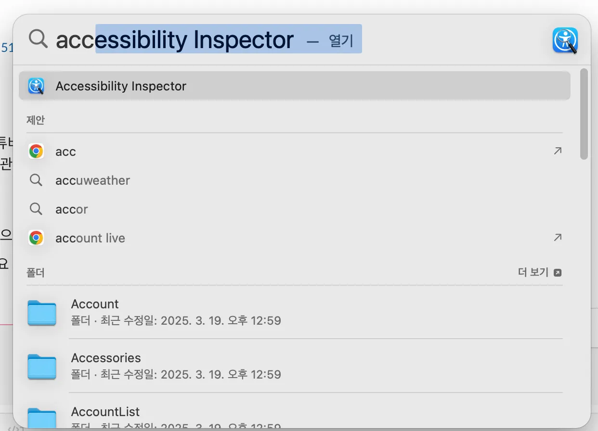
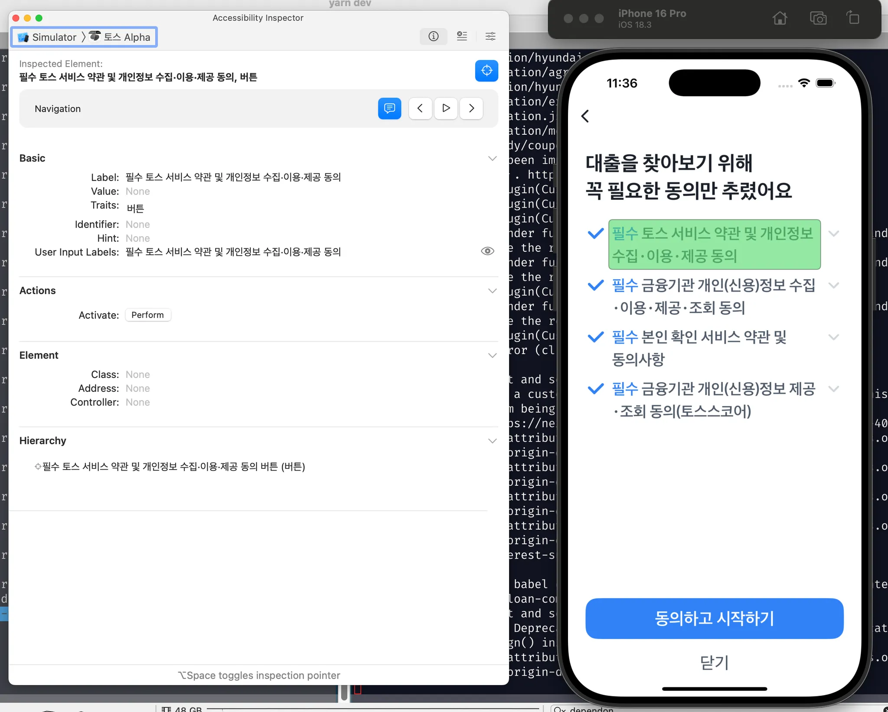

## Preface

---

하루하루 휙 휙 적당히 바쁘게 지내다보니 어느덧 한 달

## Newly Learend

---

### 프론트엔드 SSR 서버 트래킹 Sentry

프론트엔드에서 SSR을 사용할 때 SSR 서버 에러 트래킹 용도로 Sentry를 따로 설정할 수 있다.
    
    
1. **클라이언트와 서버 Sentry 인스턴스 분리**

- 서버 측과 클라이언트 측에 각각 다른 Sentry 설정을 할 수 있다.

- 두 환경을 구분하기 위해 다른 DSN을 사용하거나, 같은 DSN을 사용하되 환경(environment)이나 태그를 다르게 설정할 수 있다.

2. **Next.js 환경에서의 설정 예시**

```jsx
// 서버 측 Sentry 설정
if (typeof window === 'undefined') {
    Sentry.init({
        dsn: 'YOUR_SERVER_DSN',
        environment: 'server',
        // 서버 관련 추가 설정
    });
}

// 클라이언트 측 Sentry 설정
else {
    Sentry.init({
        dsn: 'YOUR_CLIENT_DSN',
        environment: 'client',
        // 클라이언트 관련 추가 설정
    });
}

```

3. **context 및 태그 설정**

```jsx
Sentry.configureScope((scope) => {
    scope.setTag('rendering', 'server');
    // 서버 관련 추가 정보
});

```

4. **프레임워크별 통합 활용**

- Next.js, Nuxt.js 등 SSR 프레임워크에는 Sentry와의 통합을 위한 공식 패키지가 있다.

- 예: `@sentry/nextjs`는 Next.js 앱에서 클라이언트와 서버 에러를 모두 캡처하도록 설계되어 있다.

SSR 서버 에러를 효과적으로 트래킹하려면 서버 환경에 맞는 적절한 설정(타임아웃, 예외 처리 등)과 함께 서버 컨텍스트 정보(요청 데이터, 사용자 정보 등)를 추가하는 것이 좋다.

**Ref** ChatGPT

### `date-fns` 

- 날짜와 시간 라이브러리

- 국제화 등 최신 기능 지원

- 타입스크립트 지원, 속도가 빠르고 가벼움

- functional 포맷으로, 개별적으로 필요한 함수들만 가져와 사용할 수 있다.

- summertime(윤년) 표시 가능

**Ref** https://www.npmjs.com/package/date-fns

### CSS

Credit Scoring System, 신용평가모형

대출 가심사 시 사용된다.

(당연히 스타일 적는 CSS인줄 알았네 ㅎ;)

### 크롬 개발자 도구 Tips

- CSS Overview
    - https://developer.chrome.com/docs/devtools/css-overview
    - 웹페이지에서 쓰인 색상 및 contrast issue들을 보여줌

- 웹접근성 리더 VOX
    - https://chromewebstore.google.com/detail/vox/hnjkeajcokeekolbfiniekmanfidmkhd?hl=ko&gl=001

- Accessibility
    - Element → 요소 선택 → Accessibility
    - Enable full-page accessibility tree 선택
    
    
    
- Rendering
    - Emulate vision deficiencies
    - blurred 등, 색맹일 때 어떻게 나오는지 보여준다.
            
    
            
- AI Assistant
    
    
    
- Performance > Add Label
    
    
    
    - 다른 요소와 linking도 할 수 있다.
    
### cache zstd

Zstandard (zstd)는 **압축률이 높고 빠른 압축 알고리즘**으로, 캐시 압축에도 사용할 수 있다. Facebook에서 개발했으며, 2015년에 개발되고 1년 뒤에 오픈 소스로 공개되었다.

### xcode Accessibility Inspector
    




자세한 글은 [👉여기](https://zigsong.github.io/etc/xcode-accessibility-inspector/)에서 🤭 

### webpack `dependOn`

- `dependOn` 옵션은 여러 진입점에서 공통 모듈을 공유할 때 사용한다. 이 옵션을 사용하면 공통 모듈이 한 번만 번들링되며, 각 진입점에서 중복으로 포함되지 않는다. 그 결과 번들 크기가 줄어들어 로딩 속도를 최적화할 수 있다.

- 예를 들어, 다음과 같이 `app`에 `dependOn` 옵션으로 `shared`를 지정하면, `app` 번들 파일을 만들 때 `shared` 번들 파일을 참조한다.
    
    ```jsx
    // webpack.config.js
    module.exports = {
        entry: {
        app: {
            import: "./src/admin.tsx",
            dependOn: "shared",
        },
        shared: {
            import: "./src/shared.js",
        },
        },
        //...
    };
    ```


- `shared`에는 공통 모듈만 포함된다.

- `app`은 `shared`에 의존한다.

**Ref** https://webpack.kr/concepts/entry-points/
        
### ATF(Above The Fold)

처음에 보이는 영역을 ATF라고 부른다. **스크롤을 잘하지 않는 사용자들을 위해서 필요한 개념** 이다. 이 화면이 전부가 아니라, 스크롤 밑에도 기능이 있다는 것을 화면이 짤리는 것을 통해 보여 줄수 있다.

### `Document.visibilityState`

- document가 background 또는 보이지 않는 탭(다른 탭)에 있는지, 또는 pre-rendering을 위해 로드 된 것인지를 알 수 있다.

- `'visible'` : 페이지 내용은 적어도 부분적으로 보일 수 니다. 실제로 이는 페이지가 최소화 되지 않은 창(브라우저)에서의 선택된 탭 을 의미한다.

- `'hidden`' : 페이지 내용은 사용자에게 표시되지 않는다. 실제로 이는 document가 background-tap(다른 탭)이거나, 최소화 된 창의 일부이거나, OS 화면 잠금이 활성 상태임을 의미한다.

**Ref** https://developer.mozilla.org/ko/docs/Web/API/Document/visibilityState

### 자바스크립트의 별의별 `Array`

- `Int16Array` https://developer.mozilla.org/ko/docs/Web/JavaScript/Reference/Global_Objects/Int16Array

- `Uint8Array` https://developer.mozilla.org/ko/docs/Web/JavaScript/Reference/Global_Objects/Uint8Array

### `install-peerdeps`

특정 라이브러리 사용 시, 해당 라이브러리가 의존하는 peer deps를 모두 설치해주는 명령어
    
```bash
npx install-peerdeps [설치하려는 라이브러리명]
```

### `.yarn/__virtual__`

`.yarn/__virtual__` 디렉토리는 Yarn 2+ (Berry)의 PnP(Plug'n'Play) 기능에서 사용되는 가상 디렉토리다.  주요 특징과 내용은 다음과 같다:
    
1. **가상 의존성 관리**:
    - 실제 패키지 파일이 아닌 가상 링크를 포함
    - PnP 방식으로 의존성을 관리하기 위한 메타데이터
    - 패키지 간의 의존성 관계를 정의하는 심볼릭 링크

2. **주요 내용**:
    - next-virtual-*: Next.js 관련 가상 패키지
    - react-virtual-*: React 관련 가상 패키지
    - webpack-virtual-*: Webpack 관련 가상 패키지
    - @babel-virtual-*: Babel 관련 가상 패키지

3. **작동 방식**:
    - 실제 패키지 파일은 .yarn/cache에 저장
    - .yarn/__virtual__은 이 캐시된 패키지들에 대한 가상 링크 제공
    - Node.js가 패키지를 찾을 때 이 가상 링크를 통해 실제 파일에 접근

4. **장점**:
    - 디스크 공간 절약
    - 빠른 의존성 설치
    - 정확한 의존성 관리
    - 호이스팅 문제 방지

5. **주의사항**:
    - 직접 수정하면 안 됨
    - Yarn이 자동으로 관리
    - .gitignore에 포함되어야 함
    
이 디렉토리는 Yarn PnP의 핵심 부분이며, 패키지 관리의 효율성과 정확성을 보장합니다.

**Ref** https://yarnpkg.com/advanced/pnp-spec#virtual-folders

### `next build` 시 생성되는 파일의 차이

- 서버: server/remoteEntry.js
    - ✅ **서버 사이드 전용 코드**
    - 이 디렉토리는 **SSR(Server Side Rendering)** 또는 **API 라우트**와 관련된 **Node.js 실행용 코드**를 담고 있다.
    - Node.js 환경에서만 실행되며, **브라우저로 전송되지 않다**.

- 클라이언트: static/chunks/remoteEntry.js
    - ✅ **클라이언트 사이드 번들 (브라우저 전송용)**
    - 브라우저에서 실행될 **JS 코드의 청크(chunk)** 들이 들어간다.
    - React 컴포넌트, 클라이언트 사이드 라우팅 코드, `useEffect`, `useState` 등 브라우저용 코드가 여기에 포함된다.

**Ref** ChatGPT

### `yarn why [query]`

패키지가 왜 설치되었는지 알려준다.

이 내용은 다른 의존하는 패키지들이나 package.json의 manifest에 명시적으로 기재된 내용에 기반한다.

**Ref**  https://classic.yarnpkg.com/lang/en/docs/cli/why/

### css `widows`

페이지, 영역, 또는 열의 상단에 반드시 보여야 하는 블록 컨테이너의 최소 숫자를 의미한다. 

**Ref** https://developer.mozilla.org/en-US/docs/Web/CSS/widows

### ts-pattern의 `.exhaustive()` vs `.run()`

- `.exhaustive()`
    - 모든 가능한 케이스가 처리되었는지 컴파일 타임에 체크한다
    - 모든 케이스를 빠짐없이 처리해야 하는 경우 (예: 상태 관리, 에러 처리)

- `.run()`
    - 실제로 매칭된 패턴의 결과를 실행한다
    - 일부 케이스만 처리해도 되는 경우 (예: 조건부 UI 렌더링)

### p-value

- 내가 얻은 결과가 우연히 나올 확률
- p-value < **0.05** → 우연일 가능성이 낮다고 보고, 가설을 기각해.
- p-value > **0.05** → 그냥 우연히 그랬을 수도 있다고 보고, 가설을 유지해.


## Monthly Pinned

---

### 왜 왓챠 웹은 Remix로 마이그레이션했을까?

Next.js가 아닌 Remix를 택한(!) 이유와 

점진적 마이그레이션의 과정을 소개한 글

과도기에 두 가지 버전의 react-router를 사용하게 됐는데,

나도 용기내서 해볼걸 그랬다. 😇 

**Ref** https://medium.com/watcha/왜-왓챠-웹은-remix로-마이그레이션했을까-dbb710acd758

### Sidekik

내 로컬 파일, 폴더, 웹사이트에 기반하여 응답해주는 로컬 LLM

왠지 제목도 맘에 든다. 

근데 항상 이런 LLM 볼 때마다 드는 생각.

장기 털어가는 건 아니겠지? 🤔

**Ref** https://github.com/johnbean393/Sidekick

### 알아두면 쓸데있는 개발자 도구 - App 편

회사컴에만 이것저것 깔아두고 개인 노트북은 똥인 상태 그대로 쓰는 나... 😅 

사실 여기 소개된 몇 개 도구는 나도 써봤는데, 적응이 어렵더라.

'구름 입력기'는 한국인들한테 필수템이 될 수도 있겠다!

**Ref** https://haril.dev/blog/2025/03/16/Best-Tools-of-2025-Apps

### 의존성 그래프를 활용한 프로젝트 시각화 — 사이드 이펙트 한눈에 파악하기

디펜던시 그래프가 아닌, 말 그대로 프로젝트의 디렉토리/파일 구조와 의존성을 시각화했다.

특히 이 부분이 공감간다.

> 대표적으로 프로젝트에서 처음 수정해 보는 페이지를 마주치게 된다면, 다음과 같은 생각이 자연스럽게 따라 나오는 것 같아요.
> 👨‍💻(엔지니어) : DashBoard 페이지는 처음 건드려보는데, 얼마나 복잡한 페이지일까?

😵‍💫😵‍💫😵‍💫

이런 시각화를 잘 하면, 우리 PO도 설득할 수 있을까? 🙃 

**Ref** https://medium.com/daangn/의존성-그래프를-활용한-프로젝트-시각화-사이드-이펙트-한눈에-파악하기-eec17d5aabb295%9C%EB%88%88%EC%97%90-%ED%8C%8C%EC%95%85%ED%95%98%EA%B8%B0-eec17d5aabb2

### The Best Programmers I Know

TL;DR

- Read the Reference
- Know Your Tools Really Well
- Read The Error Message
- Break Down Problems
- Don’t Be Afraid To Get Your Hands Dirty
- Always Help Others
- Write
- Never Stop Learning
- Status Doesn’t Matter
- Build a Reputation
- Have Patience
- Never Blame the Computer
- Don’t Be Afraid to Say “I Don’t Know”
- Don’t Guess
- Keep It Simple

흔하지만 흔하지 않게 곱씹어 볼 만한 좋은 프로그래머의 자질들 

몇 가지는 지키려고 하지만 사실 일을 하다 보면 쉽지 않은 게 사실

그래도 가끔은 잊지 않고 다시 상기시켜보려고 노력해야겠다!

**Ref** https://endler.dev/2025/best-programmers/

### 코드 한 줄로 경험하는 React 동시성의 마법

고속도로 차량 그림을 통해 동시성이 필요한 이유와 동작 방식에 대해 귀엽고 친절하게 설명한 글 😃

React 문서 파기 잠깐 할 때 `Lane` 개념 정말 머리아팠는데... 

조금은 알 것 같기도 하다.

비트 연산과 아직 친하진 않지만, 이런 곳에 비트 연산이 쓰이는구나. 

**Ref** https://tech.remember.co.kr/코드-한-줄로-경험하는-react-동시성의-마법-5ff18aee148d

### 선제적 장애 대응을 위한 Sentry 최적화 적용기

Sentry 최적화는 항상 많은 프론트엔드 개발자들의 고질적인 고민 🤦‍♀️ 

열심히 설정해 놔도 노이즈가 되기 일쑤다.

Sentry를 효과적으로 사용하기 위한 여러 설정들로 글을 쓴 멋진 내 전 직장 동료들 

나도 슬쩍 건드려 봐야지

**Ref** https://techblog.woowahan.com/21604/

### 테크니컬 라이팅 가이드

토스에선 참 이런 걸 잘 만든다. 😲

특히, **AI와 함께 쓰기**는 정말 트렌디한 걸

**Ref** https://technical-writing.dev/tutorial/review-prompt.html

## Wrap up 

--- 

아! 이제 슬슬 토스인이 되어가는가? 

안 지치려고 적당히만 열심히 하는 중.

그런데 한 달 풀로 채우고 글 쓰려니 무지 많다. 

중간에 의미 있는 포스팅도 쓰긴 썼지만. 

영업일이 줄어든대도 다음주 5월 연휴가 그저 기대되는 나 🤩 