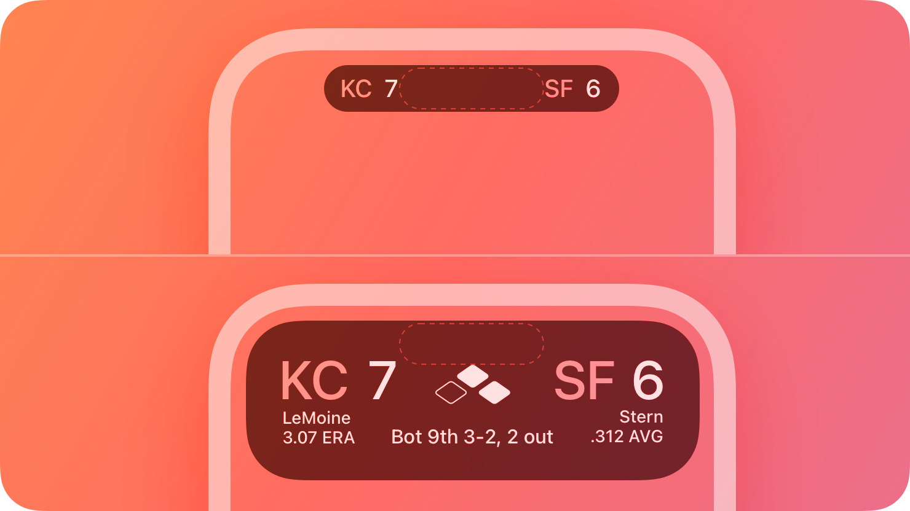

## Newly Learend
    
---

### `aspect-ratio`

CSS의 `aspect-ratio`를 사용해서 요소의 종횡 비율을 조정할 수 있다. 

```css
.div {
    aspect-ratio: auto;
    aspect-ratio: 1 / 1;
    aspect-ratio: 16 / 9;
    aspect-ratio: 0.5;
}
```

**Ref** https://developer.mozilla.org/en-US/docs/Web/CSS/aspect-ratio

### ios live activity

앱의 최신 정보를 표시하여, 사람들이 이벤트 또는 작업의 진행상황을 한눈에 볼 수 있도록 한다.

사실 아이폰 유저라면 모두 본 적이 있을 것! 



**Ref** https://zeddios.tistory.com/1382

### mise

프로그래밍 언어나 도구의 버전을 관리하는 데 사용되는 개발 환경 관리 도구이다.

흔히 Node.js, Ruby, Python, Java 같은 언어들의 여러 버전들을 프로젝트마다 다르게 설정하고 싶은 경우, `mise`를 통해 손쉽게 관리할 수 있다.

다양한 프로젝트마다 서로 다른 버전의 Node.js, bun, yarn 등을 요구할 때 빠르게 전환이 가능하며, 팀원 간에 `.tool-versions` 또는 `.mise.toml` 파일만 공유하면 동일한 개발 환경을 맞출 수 있다.

CLI UX도 간결하고 빠르기 때문에 `nvm`, `asdf` 등보다 실용적이라는 평가를 받는다.

> 요즘 왠지 프랑스어 이름이 유행인듯? 👨‍🍳

**Ref** https://mise.jdx.dev/getting-started.html

## Monthly Pinned

---

### 리액트 쿼리 실무 팁

항상 애매하게 헷갈리는 react-query의 여러 상태들, 그리고 query key 사용법!!

**Ref** https://jeonghwan-kim.github.io/2025/05/18/react-query-tips

### 캐시 전략을 활용한 병렬 빌드

모노레포의 고질적인 문제 오랜 빌드 시간! 

우리 회사도... 알아서 캐시 전략 잘 쓰고 있겠지? 🙄 

**Ref** https://tech.socarcorp.kr/fe/2025/06/10/monorepo-ci-cd-pipeline.html

### 유혹되는 사용자: 멈출 수 없는 스크롤과 새로고침 

페이지 넘기기, 잠시 기다리기, 페이지 당겼다 떼기 등...

내 유튜브 쇼츠 알고리즘이 이렇게 되고 있었다니! 😈 

자칫하면 다크 패턴이 될 수도 있는 '유도'와 '유혹' 사이, 

프로덕트를 만드는 사람이라면 함께 고민해 봐야 하는 뽀인트

**Ref** https://brunch.co.kr/@greening/34

### SQL vs NoSQL, 우리 서비스엔 뭐가 정답일까? 

서비스의 특성에 따라 정할 수 있다. 

SQL은 '정확성'과 '무결성'이 특징이라면, NoSQL은 '속도'와 '확장성'을 우선해야 하는 상황에서 진가를 발휘한다. 

SQL이 권장되는 경우

- 금융 서비스
- 항공 예약 시스템
- ERP 시스템

NoSQL이 권장되는 경우

- 스트리밍 서비스
- 로켓배송 시스템
- 실시간 위치 게임 

(SQL로 개발을 시작했지만 NoSQL이 그냥 쉽길래 계속 써온 프론트 개발자...)

**Ref** https://yozm.wishket.com/magazine/detail/3169/

### 탐색을 돕는 광고 UX를 만들 수 있을까? 

UX가 재밌어 보이게 되는 글 

**Ref** https://techblog.gccompany.co.kr/탐색을-돕는-광고-ux를-만들-수-있을까-c024f6c7636b

### '카카오 글씨'

배민에 이어 카카오도 서체를 내다니! 

큰 글씨, 작은 글씨, 초성만, 그리고 자주 사용하는 리가처(Ligature)에 대한 고려까지

MZ스러운 것 같기도 

**Ref** https://www.kakaocorp.com/page/detail/11594

### CSS로 구현하는 Scroll-driven Animation 가이드

CSS 언제 이렇게 진화했니..? 

- 별도의 JS나 라이브러리 없이, CSS만으로 스크롤 연동 애니메이션 구현 가능
- `animation-timeline: scroll() / view()` 등 CSS 속성으로 스크롤 위치, 뷰포트 진입 등에 따라 애니메이션 진행
- `animation-range` 속성으로 애니메이션이 뷰포트 내 어느 구간에서 시작/종료할지 상세 조절
- 움직임에 민감한 사용자를 위해 `prefers-reduced-motion` 미디어 쿼리 활용 권장
- Safari 26 beta부터 지원하며, CSS 기반 스크롤 애니메이션의 활용 폭이 크게 넓어짐

이거 분명히 인스타그램 때문이다 

**Ref** https://news.hada.io/topic?id=21677

## Wrap up 

---

6월 초엔 올해 준비했던 큰 이벤트도 끝내고 

어느덧 토스에서의 3MR 기간도 끝나고

이제 "아직 할 만 한데?" 따위의 말은 나오지 못하고 

날은 너무 꿉꿉해! 

내가 한국 여름을 지독히도 싫어했던 이유를 잊고 있었어... 