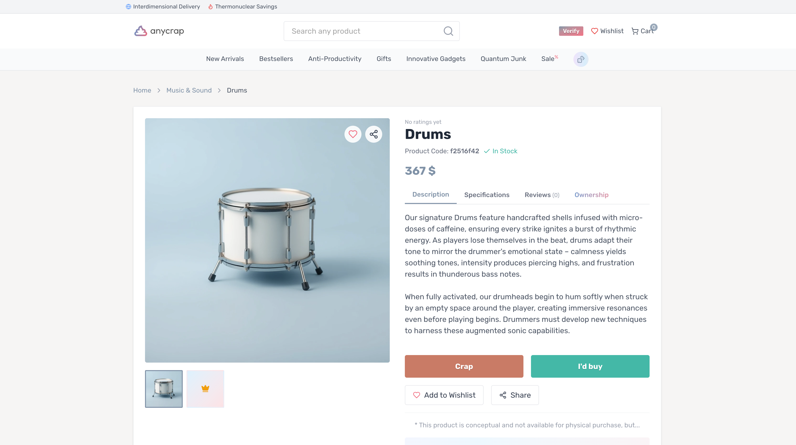

## 💡 Newly Learend

---

### onClick vs onPointerUp

- `onClick`
	- 사용자가 마우스를 눌렀다가 떼었을 때 발생
	- 사용자가 어떤 요소를 "실행"하려는 확실한 액션으로 인식될 때 실행
	- **"완료된 선택"**을 의미

- `onPointerUp`
	- 사용자가 화면에 누른 포인터(마우스 버튼, 펜, 터치 등)를 떼는 순간 발생
	- Pointer Events API로, 입력 장치 종류(터치, 펜, 마우스)를 통합적으로 처리
	- **"포인터가 떼어졌다"**는 물리적 사실만 알려줌
	- 클릭 여부와 무관하게 무조건 발생(마우스로 버튼을 눌렀다가 요소 밖에서 떼어도 pointerup은 발생하지만, click은 발생하지 않음)

이 두 이벤트의 차이를 이용하면 '미세 스크롤'로 인한 클릭 취소 문제를 해결할 수 있다.

사용자가 버튼을 누를 때 손가락이 미세하게 움직이면, 브라우저는 이를 스크롤로 인식하고 `onClick` 이벤트를 취소해버린다. 
하지만 `onPointerUp`은 사용자가 손가락을 떼기만 하면 스크롤 여부와 상관없이 무조건 실행된다.

따라서 `onPointerUp` 이벤트는 사용자의 사소한 손가락 움직임에도 훨씬 더 안정적으로 반응하여, UX 개선이 이뤄질 수 있다.
    
### slider의 A11y 속성

`<input type="range" />` 또는 `<div role="progressbar" />`로 만들 수 있는, 일명 '슬라이더'에 적용할 수 있는 접근성 속성들이 있다. 
- `aria-valuenow` - 슬라이더의 현재값
- `aria-valuemin` - 슬라이더가 나타낼 수 있는 최소값
- `aria-valuemax` - 슬라이더가 나타낼 수 있는 최대값
- `aria-valuetext` - `aria-valuenow`를 사람이 이해할 수 있는 값으로 표시한 것

## 📍 Monthly Pinned

---

### 저는 고등학생 입니다. AI가 제 교육을 무너뜨리고 있어요

AI 시대에 개발을 배우기 시작한 예비 개발자부터,

굳이 AI부터 도입되지 않아도 될 것 같은 교육 현장의 학생들까지.

기술을 사용하지 않으면 어쩔 수 없이 도태되고 느려지니 결국 모두가 위험하다 하면서도 모두가 사용할 수밖에 없는 시대.

내가 바라는 미래는 결코 아니다. 

**Ref** https://news.hada.io/topic?id=22908

### 프로덕트 엔지니어(The Product Engineer)

전통적인 소프트웨어 엔지니어링이 점차 그 영향력을 잃어간지는 오래 된 것 같다.

프로덕트 엔지니어가 되어야겠다는, 어떻게 보면 당연한 수순의 꿈을 꿔왔지만

AI와 접목하여 프로덕트 스킬을 가꾸어 나가려면 정말 가만히 앉아만 있어서는 안 될듯? 🤷‍♀️ 

**Ref** https://news.hada.io/topic?id=22833

### AnyCrap - 입력한 검색어로 상품을 생성하는 스토어

얘는 진짜 좀,,, 신선해 보임! 🫧 

'drums'로 만들어낸 상품. 왠지 애정이 간다.


<br />

**Ref** https://news.hada.io/topic?id=23063

### UTF-8은 뛰어난 설계임

아무 생각 없이 사용했었는데.

'서로 다른 언어와 문자의 수백만 가지 캐릭터를 하나의 체계로 아우르면서도 기존 ASCII와 호환되는 구조' 라니. 

생각해 보면 대단한 것 같긴 하다. 

바벨탑 이야기를 무너뜨릴 만한 인코딩이잖아! 

**Ref** https://news.hada.io/topic?id=23059

### FE 최적화, 비즈니스로 시작해서 엔지니어링으로 끝내기

적어도, 다음 세 가지 원칙 정도를 유념하고 최적화를 진행하면 엔지니어링 부담도 덜하고, 보다 확실한 개선을 이뤄낼 수 있을 것 같다. 

- p75 LCP is All You Need
- 최적화는 비싼 작업이에요. 비싼 지면에만 진행해요.
- 1초를 줄이기 위해서는 50ms, 100ms를 줄이는 작업 수십 개가 누적되어야 해요.

> 성능 개선은 결국 티끌 모아 태산! ⛰️ 
<br />

**Ref** https://medium.com/daangn/fe-최적화-비즈니스로-시작해서-엔지니어링으로-끝내기-75029185363e

### 애플 아이폰, 한국서도 RCS 허용

> RCS는 문자메시지의 진화된 세계 표준 규격으로 그룹 채팅, 고품질 사진 전송, 읽음 확인과 ‘입력 중’ 표시 등 보다 편리하고 풍부한 메시징 경험을 제공한다. 
<br />

디바이스의 기본 피쳐로 제공한다. 별거 아닐테지만 왠지 신기하다 😮 


<br />

**Ref** https://news.hada.io/topic?id=23154

### Next.js SSR 서버를 위한 모니터링 시스템 구축

그라파나를 진짜 잘 써봐야 할텐데! 

프론트에서도 할 수 있다 💨

(도커 스터디가 끝나면, 한 번 도전?) 

**Ref** https://tech.kakao.com/posts/744

### 상태 관리 라이브러리 만들기

시그널 패턴과, 함수형 프로그래밍의 `Lens` 개념을 조합하여 만든 상태관리 라이브러리 `state-ref`

- 시그널 패턴
	- 사용자가 특정 값을 사용하려는 순간, 코드 실행 과정 속에서 자동으로 구독 관계가 형성되는 방식. 이렇게 수집된 콜백 함수는 해당 값이 갱신될 때마다 실행된다. 즉, 기존의 '구독 → 실행' 과정을 따로 명시하지 않고도, 실행 흐름 속에 자연스럽게 '구독'을 녹여낸 패턴이라고 할 수 있다.
	```tsx
	Object.defineProperty(Signal.prototype, "value", {
		get(this: Signal) {
			const node = addDependency(this);
			...
			return this._value;
		},
		set(this: Signal, value) {
			this._value = value;
			...
			node._target._notify(); // 구독 함수들 실행
			...
		},
	});
	```

- 함수형 프로그래밍의 `Lens` 
	- Lens는 **자료구조의 특정 부분을 안전하게 접근(get)하고 수정(set)하는 함수 조합기(combinator)**
	- JS 객체, Haskell record, deeply nested 구조에서도 부분 데이터를 다루는 로직을 깔끔하게 추상화할 수 있다.
	- 중첩된 구조에서도 불변성을 유지하면서 읽기/수정을 함수 합성으로 다룰 수 있다.
	```tsx
	// lens: prop을 바라보는 렌즈
	const lensProp = key => ({
		get: obj => obj[key],
		set: (val, obj) => ({ ...obj, [key]: val })
	});

	// 사용
	const user = { name: "Alice", age: 30 };
	const nameLens = lensProp("name");

	// 읽기
	console.log(nameLens.get(user)); // "Alice"

	// 쓰기 (불변성 유지)
	const updated = nameLens.set("Bob", user);
	console.log(updated); // { name: "Bob", age: 30 }
	```

자바스크립트의 빌트인 API인 `Proxy`라는 큰 틀을 사용해서, 값을 꺼내거나 변경할 때 구독 함수를 통해 값의 업데이트를 받을지를 결정한다. 

**Ref** https://subtleflo.com/ko/2025/9/14/building-the-state-management-library

### slack CLI

커맨드 하나로 슬랙 앱을 생성하고 관리할 수 있다. 

예) 

- `slack activity` - 슬랙 앱 활동 로그를 보여준다.
- `slack app` - 앱을 설치하고, 삭제하고, 설치된 앱 목록을 보여준다.
- `slack auth` - 로컬 팀 권한을 추가하거나 삭제한다.

**Ref** https://docs.slack.dev/tools/slack-cli/

### n8n

노드 기반의 AI 워크플로우 자동화 도구. 코딩 없이 시각적 인터페이스를 통해 다양한 서비스와 애플리케이션을 연결하여 자동화 워크플로우를 구축할 수 있다. (drag&drop 방식)

**Ref** 
- https://n8n.io/
- https://wikidocs.net/290882

## 🧺 Wrap up 

--- 

날씨가 선선해지는 듯 싶지만 나는 여전히 열이 너무 많은 인간이고! 🥵 

본격적으로 모든 사람들을 만나면서, 이제 완전한 2막을 정말 현실적으로 맞이해가는 듯한 시간들 

어떤 의미에선 전쟁이긴 하지만, 전쟁 같은 시간들이 대부분 나와는 잘 맞았던 것 같다? 🙄 