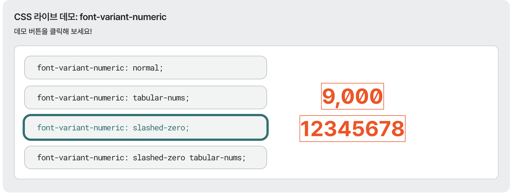

## 💡 Newly Learend

--- 

### nuqs

React 애플리케이션을 위한 URL 쿼리 파라미터 관리 라이브러리

URL을 통해 애플리케이션 상태를 관리할 수 있다. 

```jsx
"use client";

import { parseAsInteger, useQueryState } from "nuqs";

export function Demo() {
  const [hello, setHello] = useQueryState("hello", { defaultValue: "" });
  const [count, setCount] = useQueryState(
    "count",
    parseAsInteger.withDefault(0),
  );
  return (
    <>
      <button onClick={() => setCount((c) => c + 1)}>Count: {count}</button>
      <input
        value={hello}
        placeholder="Enter your name"
        onChange={(e) => setHello(e.target.value || null)}
      />
      <p>Hello, {hello || "anonymous visitor"}!</p>
    </>
  );
}
```

**Ref** https://nuqs.dev/

### `window.closed`

참조한 창이 닫혔는지 여부를 나타낸다.

```jsx
if (window.opener && !window.opener.closed) {
  window.opener.location.href = "https://www.mozilla.org";
}
```

URL을 바꾸기 전, 현재 창을 띄운 창의 존재 유무를 `window.opener` 속성으로 검사하고, `closed` 속성으로 이미 닫히지는 않았는지도 검사한다.

**Ref** https://developer.mozilla.org/ko/docs/Web/API/Window/closed

### normalize('NFC')

자바스크립트에서 유니코드 문자열을 정규화(normalization) 하기 위해 사용한다.

눈에는 똑같아 보이는 문자가 내부적으로 다르게 표현될 수 있기 때문이다.

예를 들어 한글 "가"는 두 가지 방식으로 저장될 수 있다.

- NFC (조합형): 가 → 하나의 코드포인트 U+AC00
- NFD (분해형): ㄱ + ㅏ → 두 개의 코드포인트 U+1100 + U+1161

둘 다 화면에는 "가"로 보이지만, 문자열 비교(`===`)를 하면 다른 값으로 판정된다.
`normalize('NFC')`를 호출하면 분해된 형태를 하나로 합쳐주기 때문에, 비교나 검색이 일관되게 동작한다.

macOS 파일 시스템은 파일명을 NFD로 저장하므로, `normalize('NFC')`를 사용하면 한글 파일명을 다룰 때 비교가 깨지는 문제를 방지할 수 있다.

### zodResolver로 form validation하기
    
zod의 `zodResolver`를 사용하여 react-hook-form의 `resolver`에 넣는다. form에 입력된 값들의 스키마 유효성 검사를 할 수 있다. 


```jsx
import { useForm } from 'react-hook-form';
import { z } from 'zod';
import { zodResolver } from '@hookform/resolvers/zod';

const schema = z.object({
  email: z.string().email('올바른 이메일을 입력해주세요'),
  password: z.string().min(8, '8자 이상 입력해주세요'),
});

type Form = z.infer<typeof schema>;

export default function LoginForm() {
  const {
    register,
    handleSubmit,
    formState: { errors },
  } = useForm<Form>({
    resolver: zodResolver(schema),
  });

  const onSubmit = (data: Form) => {
    console.log(data);
  };

  return (
    <form onSubmit={handleSubmit(onSubmit)}>
      <input {...register('email')} placeholder="이메일" />
      {errors.email && <p>{errors.email.message}</p>}

      <input type="password" {...register('password')} placeholder="비밀번호" />
      {errors.password && <p>{errors.password.message}</p>}

      <button type="submit">로그인</button>
    </form>
  );
}
```
    
### jotai와 atom

jotai에서는 초기값을 atom으로 생성하고, `useAtom` 훅으로 값을 조회/변경할 수 있다. 

'원자'라는 뜻처럼, jotai는 atomic한 접근 방식을 따르고 있다. 가장 작은 단위의 값을 기본으로, 파생된 값을 만들어 사용할 수도 있다. 

atom의 값은 컴포넌트 트리 상에 저장되며, 더 이상 사용되지 않는 값은 가비지 컬렉션의 대상이 된다. 

**Ref** https://medium.com/pinkfong/jotai는-조-타이-라고-읽습니다-6498535abe11

### font-variant-numeric

CSS의 `font-variant-numeric` 속성을 사용하면 숫자 형식과 관련된 스타일과 가독성을 개선하거나 텍스트와 숫자가 어우러지는 방식을 세밀하게 제어할 수 있다.



근데 어쩌다... 숫자 0에 이런 슬래시(/) 기호를 쓰게 됐을까? 그냥 동그라미와 구분하기 위해서? 🤔 

**Ref** 
- https://developer.mozilla.org/en-US/docs/Web/CSS/Reference/Properties/font-variant-numeric
- https://codingeverybody.kr/css-font-variant-numeric-%EC%86%8D%EC%84%B1/

### query abort하기 

fetch와 같은 통신에서 필요한 경우 [`AbortController`](https://developer.mozilla.org/ko/docs/Web/API/AbortController) 객체를 통해 취소할 수 있게 해주는 신호 객체인 `AbortSignal`을 사용한다. 

tanstack query에서 다음과 같이 작성한다. 
    
```tsx
const query = useQuery({
  queryKey: ['todos'],
  queryFn: async ({ signal }) => {
    const todosResponse = await fetch('/todos', {
      signal,
    })
    const todos = await todosResponse.json()

    const todoDetails = todos.map(async ({ details }) => {
      const response = await fetch(details, {
        signal,
      })
      return response.json()
    })

    return Promise.all(todoDetails)
  },
})
```

- **자동 전달**: TanStack Query가 queryFn에 `signal`을 자동으로 전달한다.
- **자동 취소**: 컴포넌트 언마운트, 새로운 요청 발생 시 이전 요청이 자동으로 취소된다. 

**Ref** 
- https://tanstack.com/query/v5/docs/framework/react/guides/query-cancellation#default-behavior
- https://developer.mozilla.org/ko/docs/Web/API/AbortSignal

### TypeScript `satisfies` 

변수가 특정 타입을 만족하는지 확인하되, 타입 추론은 유지한다.

예를 들어, 

```tsx   
rest satisfies EmptyObject;
```

위 코드는 "rest 객체가 EmptyObject 타입을 만족해야 한다"는 제약 조건을 컴파일 타임에 검증한다. 

```tsx
// 컴포넌트에서 정확히 필요한 props만 받고 있는지 검증
function Button({
  onClick,
  children,
  disabled,
  ...rest
}: ButtonProps) {
  rest satisfies EmptyObject;  // 예상치 못한 props 차단
  
  return (
    <button onClick={onClick} disabled={disabled}>
      {children}
    </button>
  );
}

// ❌ 이렇게 쓰면 에러
<Button 
  onClick={handler} 
  unknownProp="value"  // 🚨 컴파일 에러!
/>

```

### Virtuoso

- react virtualization 라이브러리
- 리스트, 그리드, 테이블, 채팅 인터페이스에 사용한다. 

**Ref** https://virtuoso.dev/

### Sheety

Google 스프레드시트를 REST API로 즉시 변환해주는 서비스

백엔드 서버 없이 간 단한 HTTP 요청과 URL로 스프레드시트의 데이터를 읽고 쓸 수 있다.

**Ref** https://sheety.co/

### mutex
    
**Mut**ual **Ex**clusion(상호 배제)의 줄임말로, 멀티스레드 프로그래밍에서 공유 자원에 대한 동시 접근을 막는 동기화 도구.

여러 스레드가 동시에 같은 변수나 데이터를 수정하면 예측 불가능한 결과(race condition)가 발생합니다. Mutex로 한 번에 하나의 스레드만 접근하도록 보장합니다.

```c
pthread_mutex_lock(&mutex);    // 잠금 획득
// 공유 자원 접근
pthread_mutex_unlock(&mutex);  // 잠금 해제
```

**주의점:**
- 잠금을 걸고 해제하지 않으면 데드락(교착 상태)이 발생할 수 있음
- 성능 오버헤드가 있으므로 꼭 필요한 구간에만 사용

### git worktree

하나의 Git 저장소에서 여러 브랜치를 동시에 체크아웃할 수 있게 해주는 기능이다.

보통은 브랜치를 전환하려면 `git checkout`이나 `git switch`로 왔다 갔다 해야 하는데, `worktree`를 쓰면 브랜치마다 별도의 작업 디렉토리를 만들어서 동시에 열어놓고 작업할 수 있다. 

```bash
# 새 worktree 생성 (feature 브랜치를 ../feature-dir에 체크아웃)
git worktree add ../feature-dir feature-branch

# 목록 확인
git worktree list

# 작업 끝나면 제거
git worktree remove ../feature-dir
```

이때 `.git` 디렉토리는 공유하면서 작업 디렉토리만 분리하는 것이라, clone을 여러 개 하는 것보다 디스크도 절약되고 관리도 간편하다.

**Ref** https://git-scm.com/docs/git-worktree
    
## 📍 Monthly Pinned

---

### 개발자에게 '신뢰 쌓기'가 중요한 이유 

1. 데드라인과 커밋먼트: "할 수 있다"와 "할 것이다"의 차이 
2. 투명한 커뮤니케이션: 문제를 숨기지 않기 
3. 일관성 있는 코드 품질: 오늘도 내일도 A급 코드 
4. 코드의 책임감 있는 주인 되기: "제가 만든 기능이니, 모니터링하겠습니다" 
5. 겸손하게 인정하기: 최고의 개발자는 자신의 무지를 인정한다 

### 만드는 건 이제 10분이면 끝. 근데 누가 돈 낼 건데? 

통째로 바뀌고 있는 개발 패러다임 속에서, 프로덕트 사 줄 사람 찾기 🕵️ 

### deepdives.ai - 바이브 코딩으로 만든 개미 투자자용 AI 서비스 

여러 fancy한 UI들을 짬뽕했는데 그렇게 부담스럽지 않은! 

**Ref** 
- https://news.hada.io/topic?id=25661
- https://deep-dives.ai/deep-dive

### 프론트엔드에서 천만 개 데이터를 실시간으로 처리하는 법: WebGL과 GPGPU

GPGPU, 즉 GPU를 이용한 연산을 사용하여 프론트엔드에서 천만 개 이상의 방대한 데이터를 그려낸다. 
CPU에 비해 한번에 병렬적으로 연산을 처리할 수 있는 GPU를 이용하면 성능을 최대한으로 끌어올릴 수 있다. 

WebGL을 사용하여 GPGPU를 개발, 방대한 데이터를 처리할 수 있게 되었지만 
데이터 변경, 정밀도, 수동 메모리 관리 문제 등 아직까지 마주할 수밖에 없는 한계도 명확히 인지해야 할 것

**Ref** https://yozm.wishket.com/magazine/detail/3563/

### 나는 "유용한 존재가 되는 것"에 중독되어 있다.

그래서 개발자들이 때로 AI를 미워하는 것일지도 🤷‍♀️ 

**Ref** 
- https://news.hada.io/topic?id=25999
- https://www.seangoedecke.com/addicted-to-being-useful/

### AI 기본법, AI로 만들었다고 표기해야할까요?

결국 AI 관련 법이 나오고 말았다 🧑‍⚖️ 

요즘 AI가 생성하는 자료가 너무 많아서, 책임지는 사람도 없고, 위험하긴 해... 

**Ref** https://blog.secondbrush.co.kr/dailyprompt-671/

## 🧺 Wrap up 

---

많은 이에게 새로운 출발인 1월이지만

그렇게 야심차게 시작하진 않아서 그런지, 아니면 또 다시 아홉 수라 그런지 위태롭고 휘청거렸던 새해 첫 달 

그래도, 작년 한 해 버텼던 일들 풀리기도 하고 있으니 

그렇게 미워하지만은 말아보자.

그리고, 원래 신년 계획은 구정부터잖아? 🦆 

