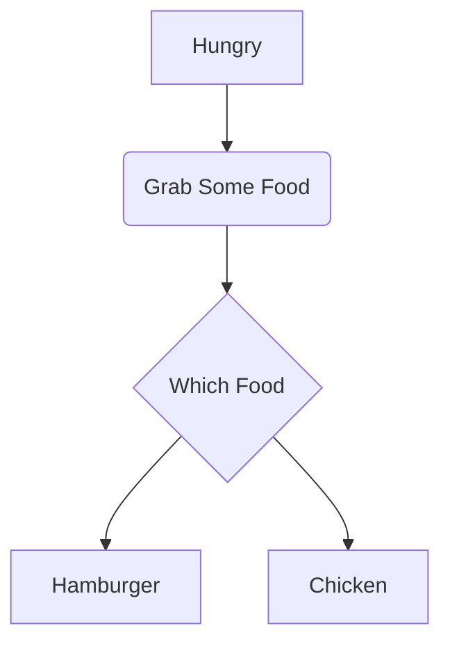
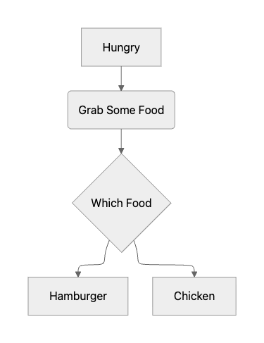

## 💡 Newly Learend

--- 

### useHydrateAtoms

- Jotai의 유틸리티 훅으로, Jotai atom에 초기값을 주입(hydrate)하는 역할
- `useHydrateAtoms` vs 직접 `atom.init` 설정의 차이

```jsx
// atom 선언 시 초기값 — 정적이고, 서버 데이터를 넣을 수 없음
const _contractAtom = atom<ContractAtomValue>(null);
```

```jsx 
// useHydrateAtoms — 런타임에 서버 데이터로 초기값을 동적으로 설정
useHydrateAtoms([[_contractAtom, serverData]]);
``` 

SSR이나 비동기 데이터로 atom을 초기화해야 할 때 `useHydrateAtoms`가 필요하다. 일반적인 atom(initialValue)은 정적 값만 받을 수 있기 때문이다.

### suspensive
- https://suspensive.org/ko/docs/introduction

- **@suspensive/react**
  React Suspense를 더 쉽게 사용하기 위한 핵심 유틸리티
	```jsx
	import { Suspense, ErrorBoundary, Delay } from '@suspensive/react'

	<ErrorBoundary fallback={<Error />}>
		<Suspense fallback={<Loading />}>
			<AsyncComponent />
		</Suspense>
	</ErrorBoundary>
	```

- 주요 기능:
	- `<Suspense>` - 개선된 Suspense 컴포넌트
	- `<ErrorBoundary>` - 에러 처리
	- `<Delay>` - 로딩 UI 지연 표시
	- `<ErrorBoundaryGroup>` - 다중 에러 바운더리 관리

- **@suspensive/react-query**
	React Query + Suspense 통합 전용
	```jsx
	import { useSuspenseQuery } from '@suspensive/react-query'

	function UserProfile() {
		const { data } = useSuspenseQuery({
			queryKey: ['user'],
			queryFn: fetchUser
		})
		
		return <div>{data.name}</div> // data는 항상 존재
	}
	```

- 주요 기능:
	- `useSuspenseQuery` - Suspense 모드 쿼리
	- `useSuspenseQueries` - 다중 쿼리
	- `useSuspenseInfiniteQuery` - 무한 스크롤
	- `queryOptions` - 타입 안전한 옵션

요약하면 다음과 같다. 

- `@suspensive/react` - Suspense 일반 유틸리티
- `@suspensive/react-query` - React Query 전용 Suspense 훅

### `<video>`의 `poster`

```jsx
<video poster="...">
```

`poster` 속성은 비디오가 다운로드되거나, 사용자가 시작 버튼을 누를 때까지 보여줄 이미지를 명시한다. `poster` 속성이 없으면, 비디오의 첫 번째 프레임이 대신 사용된다. 

**Ref** https://www.w3schools.com/tags/att_video_poster.asp

### OIDC

OIDC(OpenID Connect)는 OAuth 2.0 프레임워크 상위에서 작동하는 인증(Authentication) 프로토콜로, 사용자의 신원을 안전하게 확인하고 정보를 공유하는 표준화된 방식이다. JSON 기반의 ID 토큰(JWT)을 사용하여 애플리케이션에 사용자 신원을 제공하며, SSO(Single Sign-On) 환경 구현에 핵심적으로 사용된다.

### claude - context window

"컨텍스트 윈도우"는 응답 자체를 포함하여 언어 모델이 응답을 생성할 때 참조할 수 있는 모든 텍스트를 의미한다. Claude가 한 번에 "볼 수 있는" 텍스트의 양으로, 이 범위 안에 있는 것만 인식하고 활용할 수 있다. 

다음 데이터들이 컨텍스트 윈도우 안에 들어간다.

- 시스템 프롬프트 / CLAUDE.md
- 대화 내역 (이전 메시지 전부)
- 업로드한 파일, 코드
- 도구 호출 결과 (검색, 실행 결과 등)
- Claude의 응답

토큰이 만료되면 잘린다! 😬

**🍯 꿀팁**

Claude Code에서 컨텍스트가 부족해질 때는 `/compact` 명령어로 대화를 요약·압축하거나, 중간 결과물을 파일로 저장해서 컨텍스트 창 밖으로 빼내는 게 좋다.

**Ref** https://platform.claude.com/docs/ko/build-with-claude/context-windows#1m-token-context-window

### onPointerEnter vs onMouseEnter
    
둘 다 요소에 커서가 들어올 때 발생하지만, 지원하는 입력 장치가 다르다. 

|  | onMouseEnter | onPointerEnter |
| --- | --- | --- |
| **마우스** | O | O |
| **터치스크린** | X | O |
| **펜/스타일러스** | X | O |
| **이벤트 객체** | MouseEvent | PointerEvent |
| **브라우저 지원** | 모든 브라우저 | IE11+, 모던 브라우저 |

PointerEvent는 입력 장치에 대한 더 많은 정보를 제공합니다:

```tsx
onPointerEnter={(e) => {
	e.pointerType  // "mouse" | "pen" | "touch"
	e.pressure     // 압력 (0~1)
	e.tiltX        // 펜 기울기
	e.pointerId    // 멀티터치 구분용 ID
}}
```

| 상황 | 추천 |
| --- | --- |
| 마우스만 고려 | onMouseEnter |
| 터치/펜 지원 필요 | onPointerEnter |
| 크로스 플랫폼 (모바일 포함) | onPointerEnter |

### react-hook-form의 `trigger`

수동으로 input의 validation을 실행한다.

**Ref** https://react-hook-form.com/docs/useform/trigger

### yarnrc.yml

yarn berry의 설정 파일로, yarn 1의 `.yarnrc`와는 다른 형식을 갖는다. 

주로 쓰이는 설정들은 다음과 같다. 

- 패키지 매니저 설정

	```yaml
	yarnPath: .yarn/releases/yarn-4.0.0.cjs  # 사용할 Yarn 버전 경로
	nodeLinker: node-modules                  # 의존성 설치 방식
	```

- 레지스트리 설정

	```yaml
	npmRegistryServer: "https://registry.npmjs.org"

	# 특정 스코프만 다른 레지스트리 사용
	npmScopes:
		mycompany:
			npmRegistryServer: "https://npm.mycompany.com"
	```

- 인증 설정

	```yaml
	npmAuthToken: "your-token-here"

	# 레지스트리별 인증
	npmRegistries:
		"https://npm.mycompany.com":
			npmAuthToken: "${MY_NPM_TOKEN}"  # 환경변수 사용 가능
	```

- 캐시 설정

	```yaml
	cacheFolder: .yarn/cache          # 캐시 저장 위치
	enableGlobalCache: false          # 글로벌 캐시 사용 여부
	compressionLevel: mixed           # 캐시 압축 레벨
	```

- 플러그인

	```yaml
	plugins:
  - path: .yarn/plugins/@yarnpkg/plugin-workspace-tools.cjs
    spec: "@yarnpkg/plugin-workspace-tools"
	```

### mermaid

Mermaid는 **텍스트로 다이어그램을 그리는 JavaScript 라이브러리**로, FlowChart, Sequence Diagram, State Diagram, ERD를 생성할 수 있다. 





**Ref** https://mermaid.js.org/intro/
    
### tmux

- terminal multiplexer, 하나의 터미널에서 다중의 여러 터미널을 분할하여 사용할 수 있게 해주는 도구
- 사용자가 세션을 분할하고 여러 작업을 동시에 수행할 수 있음
- 네트워크 연결이 끊어져도 작업이 계속 수행됨 -> **데몬** 개념을 사용하기 때문!

### claude agent team

다음과 같은 명령어를 통해 여러 에이전트를 동시에 협업시킬 수 있다. 

```
I'm designing a CLI tool that helps developers track TODO comments across
their codebase. Create an agent team to explore this from different angles: one
teammate on UX, one on technical architecture, one playing devil's advocate.
```
**Ref** https://code.claude.com/docs/en/agent-teams

## 📍 Monthly Pinned

--- 

### AGENTS.md

**Ref** https://agents.md/

### Anthropic에서 소개하는 Opus 4.6 최대한 활용하기 

- 지시사항을 더 정확하게 따른다
- 행동하기 전에 맥락을 파악한다
- 어려운 작업에서 끈기 있게 작업한다
- 더 적극적으로 의견을 제시한다
- 더 강력한 글쓰기를 제공한다

역할 설정을 하지 않고도, 제공된 맥락에 따라 적절하게 추론해 내는 능력은 좋은 것 같다.

역할 설정 은근 귀찮았었어 🤷‍♀️

**Ref** https://claude.com/resources/tutorials/get-the-most-from-claude-opus-4-6

### AI 에이전트 코딩 80% 시대, 개발자의 진짜 문제는 '이해 부채' 

AI가 그럴듯하게 구현해둔 코드를, 나중에 설명할 수 없게 된다면? 

AI 코딩 에이전트의 상용화와 생산성 사이의 관계는 정말 끊임없이 의심해봐야 할 토픽인 것 같다. 

아무튼, 개발자의 정체성이 '코드를 쓰는 사람'이 아닌 '소프트웨어로 문제를 해결하는 사람'이라는 본질은 변하지 않음에 주목해야 할 듯하다. 

**Ref** https://addyo.substack.com/p/the-80-problem-in-agentic-coding

### Object vs Map vs Set, 언제 무엇을 써야 할까? 

- 서버/로컬스토리지에 전송할 레코드/JSON 데이터가 필요하다면 -> **Object**
- 조회 중심의, 딕셔너리/인덱스/캐시를 쓰고 싶다면 -> **Map** 
- 중복 없는 집합과 포함 여부 체크가 중요하다면 -> **Set**

무지성 Object를 쓰는 대신, 자바스크립트의 여러 비슷하지만 또 다른 API들을 잘 활용해보자. 

**Ref** https://yozm.wishket.com/magazine/detail/3597

### 장애허용성

**장애허용성**이란 시스템을 구성하는 일부 구성 요소에서 장애가 발생하더라도(하나 이상의 결함이 존재하더라도) 시스템이 정상적으로 동작을 계속할 수 있도록 해주는 특성이다. 애플리케이션에서 예기치 않은 방식으로 문제가 발생할 수 있음을 항상 염두에 두고, 그러한 상황을 우아하게 처리할 수 있어야 한다. 

리액트 애플리케이션에서 장애허용성을 갖추는 대표적인 방식은 **에러 바운더리**가 있다. 에러 바운더리를 추가하는 일은 쉽지만, 이를 어디에 배치할지 적절한 위치를 찾는 일은 까다롭다. 

최상위에 에러 바운더리 하나만 두면, 한 부분에서 문제가 발생할 때 애플리케이션 전체가 함께 무너진다. 반대로, 에러 바운더리가 너무 많은 경우 사용성을 크게 저해할 수 있다. 

에러 바운더리를 적절하게 배치하는 방법은 애플리케이션마다 다르지만, 가장 좋은 접근은 애플리케이션에서 기능 경계를 식별하고, 그 경계에 에러 바운더리를 배치하는 것이다. 

UI는 종종 재귀적인 구조를 가진다. 에러 바운더리를 배치할 떄는, '이 컴포넌트에서 발생한 에러가 형제 컴포넌트에 어떤 영향을 미치는가?'를 고려해야 한다.  섹션을 상호 간 의존성이 있는지 여부로 구분하다 보면, 기능 경계를 발견할 수 있다. 

마지막으로, 장애허용성을 테스트하기 위해 애플리케이션에 직접 들어가서 의도적으로 무언가를 망가뜨려보는 것이 좋다. (이를 카오스 엔지니어링이라고도 한다!) 

**Ref** https://imnotadevleoper.tistory.com/379

### Linear

많이 사용하던 것 같지만, 나는 이번에 처음 알게 된 노션 + 지라 짬뽕한 (이제 AI도 짬뽕한) 깔끔한 도구 

**Ref** https://linear.app/?ref=seesaw

### 리액트에서 데코레이터 쓰기 - LLM이 못해주는 클린코드

리액트에서 횡단 관심사 - 여러 함수에 걸쳐 반복되는 부가 로직 - 의 문제를 데코레이터 패턴으로 풀어낸 글. 

원래 메서드를 `try~catch`로 감싸기만 하면 데코레이터를 만들 수 있다.

```jsx
// 에러 핸들링 데코레이터
function OnError(handler: (error: unknown) => void) {
  return function (target: any, key: string, descriptor: PropertyDescriptor) {
    const original = descriptor.value

    descriptor.value = async function (...args: any[]) {
      try {
        return await original.apply(this, args)
      } catch (error) {
        handler(error)
        throw error
      }
    }

    return descriptor
  }
}
```

여러 데코레이터를 조합해서 쌓을 수 있으며, 이러한 코드는 코드 스스로가 자기 자신을 설명할 수 있게 된다. 

middleware 등의 패턴은 많이 봤는데, 리액트에서 데코레이터라니 신선하면서도 잘 활용할 수 있을 것 같다. 

### 우리는 왜 어떤 코드를 읽기 쉽다고 느낄까

- 정보(코드)를 일정한 단위로 패키징함으로써 우리 뇌의 작업 슬롯에 들어가는 맥락을 제어하자
- 근접성/유사성의 원칙에 따라 서로 연관 있는 정보(코드)를 가까운 곳에 위치시키자 
- 인지 부하를 줄이기 위해 일관된 네이밍, 적절한 함수 분리, 명확한 타입 선언이 중요하다. 
- 뇌는 끊임없이 다음에 올 정보를 예측한다. 

기술 레벨에서의 '클린 코드'가 아니라, 무의식적으로 느끼고 있었던 심리학의 패턴을 코드에 녹여낼 수 있는 점이 재미있다! 

## 🧺 Wrap up 

---

다행히도 2월은 점차 나아졌고, 나만의 구정 목표들도 갖춰졌고, 다시 갓생(?)을 살아낼 용기가 생겼다. 

다시 넘어질 수도 있겠지만 또 언젠가 지나가고, 나아질 거라고 믿는 힘이 필요한 것 같다. 

하루하루 소화시킬 새 없이 쏟아지는 AI 신기술의 폭포 속에서 나를 지켜내는 힘도 필요하고. 

구정의 목표들로 인해 이미 출발해버린 3월은 더 바빠지겠지만, 정신 없어지지만 말자! 