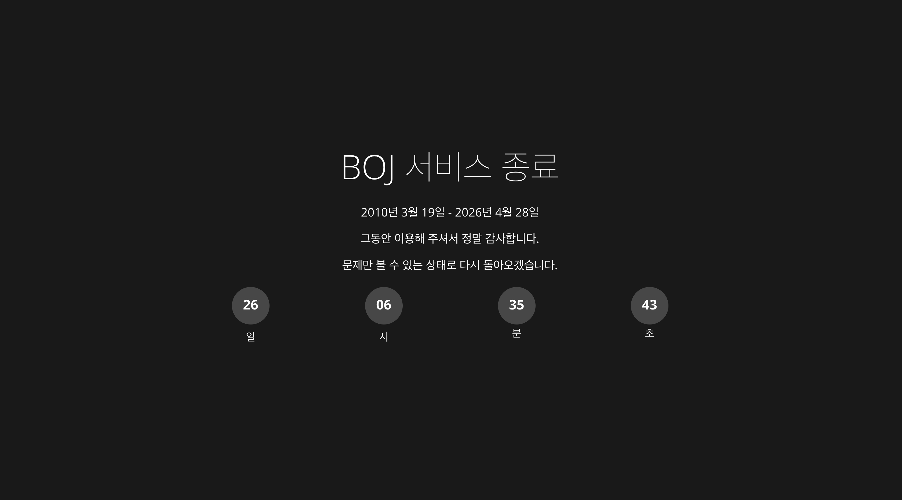

## 💡 Newly Learend

--- 

### tanstack/react-form의 `isDirty` vs `isDefaultValue` 

- `isDirty`: 폼의 필드 값 중 어느 하나라도 사용자에 의해서 바뀌었다면 `true`.

- `isDefaultValue`: 폼의 모든 필드들이 기본값과 같은지를 나타낸다. 

사용자가 폼 필드의 값을 건드렸으나 기본값과 동일하게 수정했다면 `isDirty`는 `true`, `isDefaultValue`도 `true`라는 점에 주의해야 한다.

`isDirty`의 정반대 기능을 사용하려면 `isPristine`을 사용한다.

**Ref** https://tanstack.com/form/latest/docs/reference/type-aliases/DerivedFormState#isdefaultvalue

### react query의 deterministic hash

React Query(TanStack Query)의 `queryKey`는 객체의 **참조(Reference)**가 아니라 내부의 **값(Value)**을 기준으로 동작한다. 객체의 메모리 주소가 바뀌어도 그 안의 데이터가 동일하다면 React Query는 이를 '같은 키'로 인식하여 불필요한 refetch를 수행하지 않는다.

**Deterministic Hashing(결정론적 해싱)**이란, 입력값이 같다면 어떤 환경에서든, 언제든 항상 동일한 결과값을 만들어내는 방식을 의미한다.

예를 들면, 일반적인 자바스크립트 객체 비교(`{a:1} === {a:1}`)는 `false`가 나오지만, React Query는 내부적으로 객체를 직렬화(Serialization)하여 비교한다. 

아래 두 객체는 참조 주소도 다르고 키의 순서도 다르지만, React Query는 동일한 키로 간주한다..
> - `{ 종목: '삼성전자', 가격: 70000 }`
> - `{ 가격: 70000, 종목: '삼성전자' }`

그렇다면 `queryKey`는 왜 이렇게 설계되었을까?

만약 참조(Reference)를 기준으로 리랜더링 여부를 결정했다면, 개발자는 매번 `useMemo`를 사용해 `queryKey`를 감싸야 했을 것이다. 

```jsx
const { data } = useQuery({
	queryKey: ['user', { id: 1, type: 'admin' }], // 리랜더링 시마다 새 객체가 생성되지만 값은 같음
queryFn: fetchUser,
});
```

주의할 점은, 모든 것이 다 해싱되는 것은 아니다. `JSON.stringify()`로 표현할 수 없는 값들은 주의해야 한다. 

- **함수(Functions):** 객체 내부에 함수가 포함되어 있으면 직렬화 과정에서 무시되거나 의도치 않게 동작할 수 있다.
- **Symbol/Undefined:** 역시 직렬화 시 문제가 생길 수 있다.
- **비표준 객체:** `Map`, `Set`, `Date` 등은 일반적인 객체와 다르게 취급될 수 있으므로 가급적 원시값(Primitive)이나 평범한 객체(Plain Object)를 키로 사용하는 것이 권장된다.

### version skew

[Next.js는 버전 차이로](https://www.industrialempathy.com/posts/version-skew/) 인한 대부분의 문제를 자동으로 해결한다. 또한 새로운 에셋이 감지되면 애플리케이션을 자동으로 다시 로드하여 새로운 에셋을 가져온다. 예를 들어 빌드 ID가 일치하지 않으면 페이지 간 전환 시 미리 가져온 값을 사용하는 대신 강제 탐색을 수행한다.

**Ref** 
- https://www.industrialempathy.com/posts/version-skew/
- https://nextjs.org/docs/14/pages/building-your-application/deploying#version-skew

## 📍 Monthly Pinned

--- 

### 효율적인 디자인을 위한 크롬 확장 프로그램 7가지 

디자인 뿐만 아니라, 전 직군 (특히 프론트엔드 개발자)들도 유용하게 쓸 수 있는 여러 브라우저 확장 프로그램들

**Ref** https://yozm.wishket.com/magazine/detail/3689/

### Claude Code의 숨겨진 강력한 기능들 15가지

1. 모바일 앱
2. 모바일·웹·데스크탑·터미널 간 세션 이동
3. /loop 및 /schedule
4. Hooks
5. Cowork Dispatch
6. Chrome 확장 — 프론트엔드 작업
7. Claude Desktop 앱 — 웹 서버 자동 실행 및 테스트
8. 세션 포크 (Fork)
9. /btw — 사이드 쿼리
10. Git Worktrees
11. /batch — 대규모 병렬 팬아웃
12. --bare 플래그 — SDK 시작 속도 최적화
13. --add-dir — 다중 저장소 접근
14. --agent — 커스텀 에이전트
15. /voice — 음성 입력

**Ref** https://news.hada.io/topic?id=28021

### 흩어져 있는 AI 자산, ‘MCP stdio’로 헤쳐모여!

개인 간, 팀 간 흩어져 있는 AI 자산을 중앙화하여 관리할 수 있는 MCP 서버 

### 프롬프트에서 하네스까지 — AI 에이전틱 패턴 4년의 기록

프롬프트 엔지니어링 - 컨텍스트 엔지니어링 - 하네스 엔지니어링까지. AI 에이전트 패턴은 이전 시대의 실패로 다시 탄생한다. 

2022년 Github Copilot의 시대에서 컨텍스트는 현재 파일 하나. 5개월 뒤 등장한 ChatGPT는 모든 것을 '말하기'의 문제로 바꾸었다. 프롬프트 엔지니어링 시대의 탄생인 것이다. 

이 시기 학계에서는 '추론'을 '프롬프트'로 유도하여 환각을 줄이는 에이전트의 원형을 마들어 냈고, 모델이 자기 스스로를 수정하고 도구와 계획을 사용하며, 여러 에이전트들이 협업하는 패턴을 만들어냈다. 

하지만 프롬프트가 소비하는 컨텍스트는 한계를 맞이하기 시작했고, 이맘때쯤 Cursor가 등장한다. Cursor는 코드베이스의 모든 파일을 재귀적으로 스캔하여 프로젝트 단위의 변경을 가능케 했다. 

이에 이어 AI 코딩 도구들이 우후죽순 탄생하기 시작했고, 'Vibe Coding'이 탄생하게 된다. 누구나 손쉽게 코드를 작성하지만, 아무도 이해하지 못하는 코드들이 쌓이며 이슈와 보안 취약점들이 증가했다. '엄밀함'이 사라진 것이다. 

2025년에는 컨텍스트 엔지니어링이 시작되었고, 핵심 질문은 '어떤 말을 해야 하나'가 아닌, '어떤 정보를 넣어야 하나'로 이동했다. 

Anthropic은 Write/Select/Compress/Isolate의 4가지 원칙을 내놓았고, 컨텍스트 윈도우의 효율적인 활용을 위한 연구에 집중하였다. 

Anthropic에서 만든 MCP(Model Context Protocol)는 LLM이 외부 도구와 연결하는 표준 방식이 되었고, 스킬/서브 에이전트/스웜 으로 작고 전문화된 단위를 조합하는 패턴이 등장했다. 

하지만 이렇게 미친듯한 속도로 흥행했던 컨텍스트 시대도 점차 저물어갔다. 완벽한 컨텍스트를 구성해도, 이를 소비하는 시스템의 설계가 허술하면 여전히 실패했던 것이다. 

2026년, 마침내 '하네스 엔지니어링'이 등장한다. 하네스란 '에이전트에서 모델을 뺀 나머지 전부'를 가리키는 마로, 고삐와 안장과 굴레를 갖추어 말을 통제한다는 뜻이다. 코드가 안정적으로 생성될 수 있는 환경을 설계하는 것이다.

하네스가 채워지며 ralph 패턴이 등장했고, 보안은 더욱 엄밀해졌다. 가드레일은 기능을 제약하는 것이 아니라 신뢰성 확보의 필수 요소가 되었다. 

지난 몇 년 동안 AI 에이전틱 패턴의 각 시대는 이전 시대를 대체하지 않고 포함하며 진화해 왔다. 엄밀함은 사라지지 않고, 역할만이 계속 바뀐다. 그러므로 여기서 끝이 아닌, 새로운 트렌드를 열 다음 시대를 맞이할 준비를 해야 한다. 

**Ref** https://bits-bytes-nn.github.io/insights/agentic-ai/2026/04/05/evolution-of-ai-agentic-patterns.html

### BOJ 서비스 종료


<br />

한 사람이 시작한 사이드 프로젝트가 16년간 업계 인프라 역할을 했다는 것. 

시대가 크게 변화하며 어쩔 수 없는 선택이었겠지만, 하나의 역사가 막을 내리는 것 같아 기분이 오묘하다. 

AI 에이전트가 알고리즘 쯤은 몇 초 만에 뚝딱 풀어낼 수 있는 시대에, 인간이 몇 시간 동안 머리를 싸매며 문제를 푸는 것은 무의미해졌지만, 근본적인 문제 해결의 힘과 수학적 사고력이 완전히 무용해진 것 같아 아쉽기도 하다. 

**Ref** https://yozm.wishket.com/magazine/detail/3712/

### AI 코딩 시대, 더이상 성장하지 않는 개발자들

한동안은 AI를 거부(?)하거나 이렇게 내 역할이 대체되는 것에 반발이 있었음에도, 어쩔 수 없이 AI를 점점 더 많이 사용하며 그에 의존하다 보니 예전보다 머리를 훨씬 덜 쓰고 있다는 생각은 든다. 그리고 그 점이 나 역시 두렵다. 

'배움'이 실종된 시대. 단숨에 뚝딱 얻어낸 정답보다 몇날 며칠이고 어렵게 끙끙대며 얻은 지식이야말로 진짜 내 지식이 된다는 것. 단순한 내 느낌이 아니라 실제 학계에서도 연구된 사실이었다. 

뇌를 사용하여 정보를 직접 생성해내는 과정의 가치가 점점 희미해져 간다. 코딩에 있어서도 마찬 가지다. 처음 개발 언어를 배우고, 그 조각 지식들을 통합하고, 그러다 보면 이제는 앞선 두 단계를 의식하지 않고도 자연스럽게 몸이 먼저 기억하는 자동화 단계에 이른다. 반복적인 수행을 통해 기억은 장기적으로 강화되고, 자연스레 '경험'이 되는 것이다. 

어떠한 분야의 '전문가'는 하나의 청크에 담을 수 있는 정보의 양이 초보자보다 크다. 정보를 패턴으로 기억하는 것이다. 앞서 얘기한 반복화된 경험들이 쌓여 '전문가'가 되고, 코딩의 영역에서 전문가는 수없이 학습된 패턴을 통해 실무 코드를 보면 곧바로 그 동작을 예측하거나 오류를 발견할 수 있게 된다. 

AI의 등장으로 개발자가 직접 코드를 고민하고 작성하는 과정은 거의 사라졌다. 물론 과거라면 개발자가 끙끙대며 머리를 썼어야 할 시간을 획기적으로 줄여주긴 했지만, 그로 인해 개발자가 최종적으로 얻을 수 있었던 장기 기억 역시 사라져간다. 코드를 직접 생성하지 않았기 때문에, 기억에 깊이 각인되지 않는다. 

AI는 모든 학습 과정에서 발생하는 마찰을 극적으로 줄여버렸다. 생산성 관점에서 이는 혁명이다. 하지만 모든 개발자, 특히 아직 마찰을 덜 겪어본 주니어 개발자에게 이 마찰 단계의 누락은 치명적일 수 있다. 코드에 대한 기초 체력이 없는 채로 AI만 사용하며 경력은 쌓이는 것이다. 

성장의 핵심 원리는 뇌에 부하를 거는 것이다. AI에게 코드를 맡기기 전에 자신도 스스로 설계해 보는 것. 의도적으로 어려운 길을 가는 것. 지금 당장은 무의미하고 시간 낭비처럼 보일 수 있어도, 경력이 쌓이며 가장 필요한 '스스로 판단하는 능력'을 기르는 힘이 된다. 고통스러운 과정 없이는 아무것도 얻을 수 없다는 것, 꼰대같은 말일지 모른다. 하지만 AI가 생성한 코드들이 범람하는 시대에 스스로를 지키는 힘이 될 것이다. 

**Ref** https://evan-moon.github.io/2026/04/18/developers-who-stopped-growing-in-ai-era/

### 세탁기와 AI가 벌어준 시간은 다 어디로 갔을까?

인류는 세탁기와 로봇청소기를 발명하여 가사 노동을 혁신적으로 줄였고, 이제는 AI를 통해 수십 장의 기획서를 단 몇 초만에 완성하는 압도적인 '시간 단축'의 기술을 손에 쥐었다. 

그런데 현대인은 과거 그 어느 때보다 더 바쁘고, 늘 시간에 쫓기며 번아웃을 호소한다. 

기술이 아껴준 시간은 결코 '휴식'으로 이어지지 않았다. 우리는 AI가 1시간 걸릴 일을 5분 만에 끝내주면, 남은 55분 동안 여유를 즐기는 것이 아니라 '5분짜리 일을 11개 더' 욱여넣어 처리한다. 

이것이 바로 완벽한 기술이 낳은 '생산성의 역설'이다. 

**Ref** https://eopla.net/magazines/41512

### 에이전트 하네스 완전 해부 

모델은 지능을 품고, 하네스는 그 지능을 유용하게 만드는 시스템.

**Ref** https://yozm.wishket.com/magazine/detail/3718/

### Lightning CSS로 CSS 빌드 속도 극한까지 올리기

Lightning CSS는 Rust로 작성된 CSS 파서(parser), 변환기(transformer), 번들러(bundler), 압축기(minifier)이다. 내부적으로는 Mozilla가 Firefox 브라우저를 위해 만든 cssparser와 selectors 크레이트를 사용한다. 실제 브라우저가 CSS를 파싱하는 것과 동일한 방식으로 모든 규칙, 속성, 값을 완전히 파싱하기 때문에 정확도가 매우 높다. 또한, 싱글 스레드만으로 초당 270만 줄 이상의 CSS를 처리할 수 있다고 한다. 

역시 Rust가 갓갓인가... 

**Ref** https://daleseo.com/lightning-css/

## 🧺 Wrap up 

---

유난히 힘들어서 부정하고 싶었던 날들을 진단하고 치료해왔던 한 달이었다. 

처음으로 팀원들과 남해도 다녀오고, 반짝반짝 빛나는 바다와 청량한 날씨, 배터지도록 먹었던 신선한 해산물들까지 

짝꿍과 간만에 소소하고도 편안한 날들도 보내고, 올해 하고 싶던 버킷리스트들도 깨나가는 중.

5월은 더 따뜻한 시간들이 가득했으면 좋겠다. 🌞