## 열흘 간의 무박 해커톤

---

2024 우아한스터디 - 프롬프트 참 잘하는 집 (ㅋㅋ)에서 열심히 프롬프트 엔지니어링을 공부하던 와중, 스터디원의 제안으로 모두가 참가하게 된 비사이드x포텐데이 해커톤 (https://bside.best/potenday)

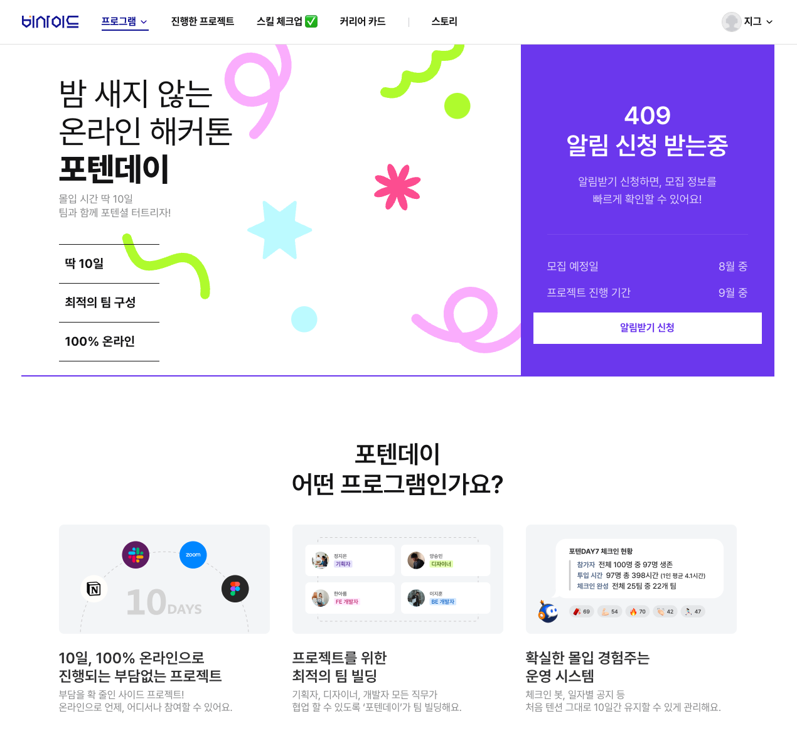
 

> 밤 새지 않는 온라인 해커톤!
> 

제발… 내가 원하던 거자나. 다들 이제 나이 먹고 그러면 밤 샐 힘 없자나. 개발자가 밤 새는 거 자랑 아니자나…

 

그리하여 당차게 신청해버렸다. 

내가 좀 길게 해외 여행 가는 동안 스터디 구성원 내에서 팀을 짜주었고, 

하고 싶었던, ‘인사이드그램 감정일기’ 프로젝트에 합류해서 7월부터 사부작사부작 기획을 시작했다.

멤버는 총 3명. 서버 개발자 1명, 프론트 개발자 2명. 

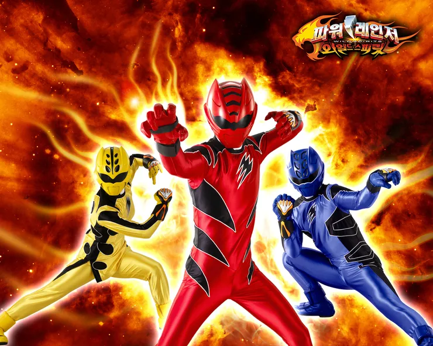
 

근데 이제 기획과 디자인도 우리가 알아서 해야 하는. ㅎ

## 의외로 순탄했던 시작

---

처음에 아이디어가 막 쏟아졌다. 인사이드그램 1,2를 모두 아주 감명 깊게 눈물 좔좔 쏟으며 보고 난 직후라 과몰입 Max인 상태. 

피그잼에 모두 열정 넘치게 아이디어를 쏟아붓던 기획 단계. 하하호호 웃으면서 세부기획들을 잡아나가며, 우리 정말 대박 나는거 아닌가 하는 생각을 했다. 한편으로 회의의 끝에는 조금 걱정이 되긴 했다. (내가 개발해야 하니까 ^^) 

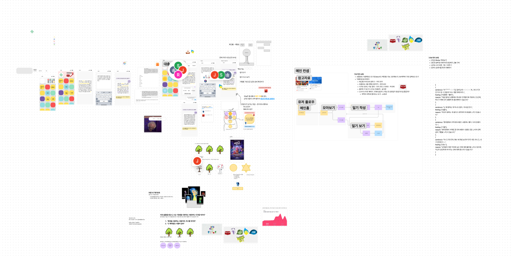
 

이제 막 배워보고 있던 Flutter를 이용해서 앱 개발하겠다고 나섰다. 개발자가 칼을 들었으면 무라도 베야지. 오랜만에 개인 레포도 하나 파버렸다. 

https://github.com/zigsong/insidegram

프로덕트 이름도 내가 지었다. ‘인사이드그램’.

지인개발자1로부터 표절 의혹에 휘말렸지만. 

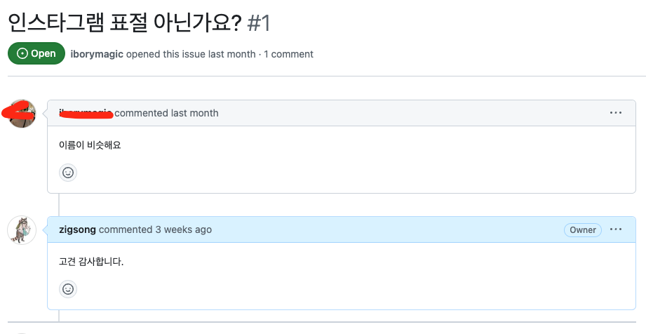
 

사실 팀원이 디즈니에 허가 받으려고 했는데, 일단 잘 되는거 봐서 *^^*

## 뜻대로 되는 듯 안 되는 듯 Flutter

---

Flutter 이제 막 튜토리얼 들었는데 뭔 자신으로 개발해보겠다고 했는지! 

일단 개발 과정에서 2가지 큰 어려움이 있었다.

1. **supabase + 카카오 로그인 연동**

사실 인증 붙일 생각은 기획에 없었는데… 유저별로 데이터 만들어주려면 토큰이 필요하자나 ㅠ 개발 과정의 절반 정도를 인증에 쏟은 것 같다.

카카오 developers… 문의하면 친절하긴 한데, 앱에서 은근 까다롭긴 하다. 사실 내가 앱에 붙여본 게 처음이라 그런 것 같기도 하고 ㅎ flutter 앱으로 개발하다보니 android manifest 파일, iOS info.plist 파일 모두 건드려야 했다. 그냥 다 해주는 줄 알았지 

 

그리고 supabase redirect URL 대체 뭘 붙이라는 건지! 결국 그냥 보이는 대로 다 때려넣었더니 그중 하나 얻어걸려서 인증 후 redirect까지 성공 

그런데 웹으로 배포하면서 redirect가 안 돼서 다시 하루 날림!

1. **레이아웃 고장났으면 알려달라고…**

뭐만 툭 건들면 레이아웃 에러나는 자식. 그래도 로컬 디버깅 익스텐션에서는 뭐가 문젠지 친절하게 알려주기라도 한다.

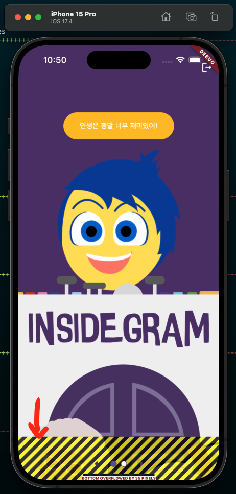
 

근데 왜! 🤬 웹에 배포하면 에러 메시지 그따구로만 보여주냐고… 

`Another exception was thrown: Instance of 'minified:d1<void>'`

한참 헤매다가 겨우 짐작 가는 내용 찾아서 수정했다. 

이건 내가 flutter 디버깅 실력이 아직 부족해서 그런 것 같기도 하다.

## 포텐데이 모각프

---

모각x 이거 누가 처음에 만들어낸 말인지. 지루한 말이지만 이것만큼 입에 착 붙는 개발 신조어가 또 없다. 

암튼 처음으로 팀원들 보던 날. 역삼역 바로 앞에 위치한, 우연찮게도 짝꿍이의 회사 건물과 같은 곳에 위치한 ncloud 오피스에서 진행했다. 

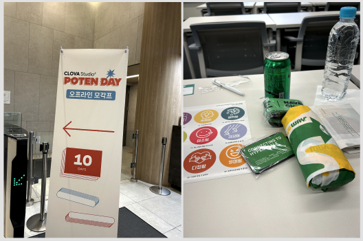
 

사진 찍은 게 이거밖에 없다. 저 요상한 꿀피부… 따위가 적혀있는 스티커를 서로의 첫인상에 맞게 붙여준 후, 서브웨이를 허겁지겁 먹어치우고 미친듯이 개발만 했다. 게다가 팀원 한 명은 저 날 해외여행 가서 둘이 숨죽이고 함.

## 프로덕트에 AI 집어넣기

---

요번 해커톤의 특징. ncloud의 HyperClova X를 사용하여 개발해야 한다는 것 

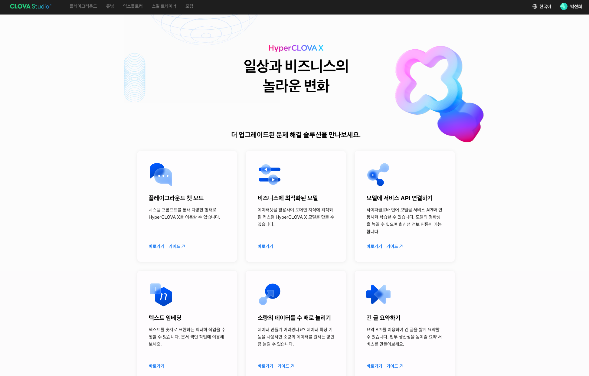
 

**HyperClova X,** 

참 이름 잘 지은 것 같다. 간지나는 건 다 갖다 붙였으면서도 지저분하지 않아.  

HyperClova X의 다음 기능들을 활용하여 인사이드그램의 피처들을 개발했다. 

**1. 일기의 감정을 분석하여 감정 분석과 감정이 반응을 생성** 
    
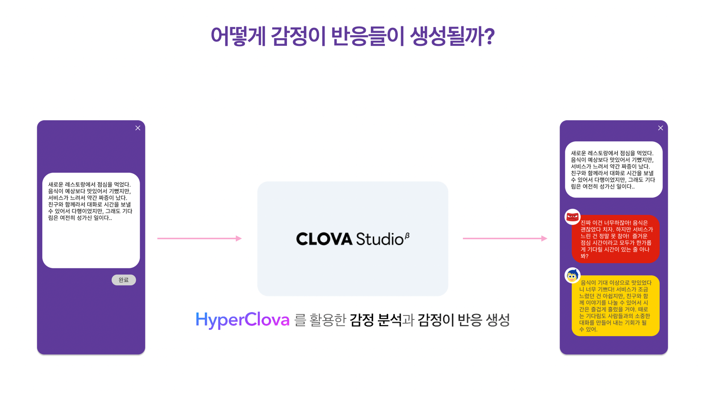
 

처음엔 우리가 정한 인사이드아웃의 캐릭터들과 다른 감정들 (ex. 초조, 희망 등)이 나오기도 했고, ‘불안’이와 ‘당황’, ‘까칠’이 등 캐릭터가 약간 겹치는 애들은 의도한 것과 다른 감정이 나오기도 했다. (사실 그 의도라 해봤자 input을 작성하는 나의 주관적인 의도지, 어쩌면 AI의 분석 결과가 더 맞을지도 모른다.) 

감정 분석 결과 나오는 감정이들은 퓨샷(few-shot) 프롬프팅을 이용하여 감정을 제한된 범위에서 학습시키고 원하는 포맷의 결과가 나오도록 했다.

> **퓨샷(few-shot) 프롬프트**
프롬프트에서 데모를 제공하여 모델이 더 나은 성능을 발휘하도록 유도하는 문맥 내 학습을 가능하게 하는 기술로 사용할 수 있다.
> 

**2. 데이터 확장을 이용하여 감정이를 학습시킬 데이터셋 생성**
    
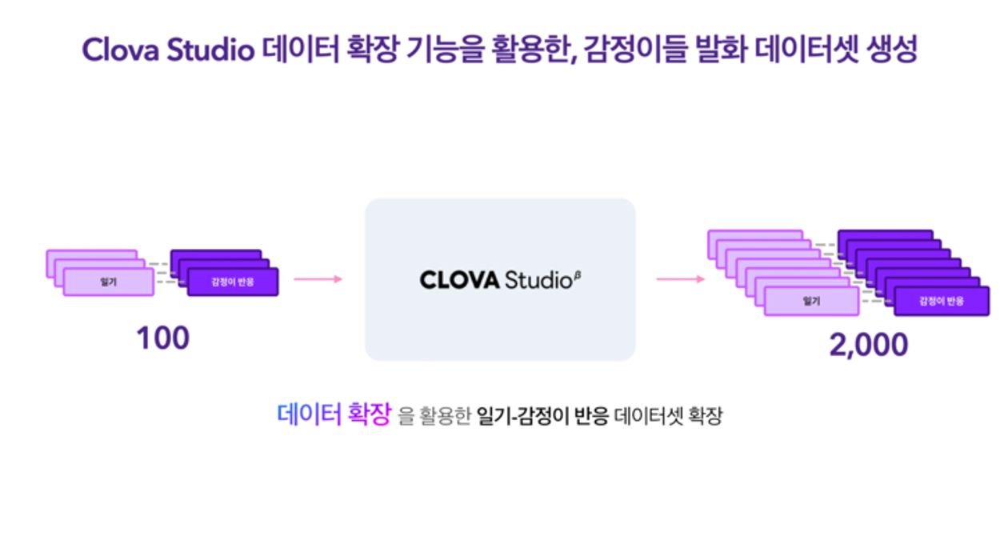
 

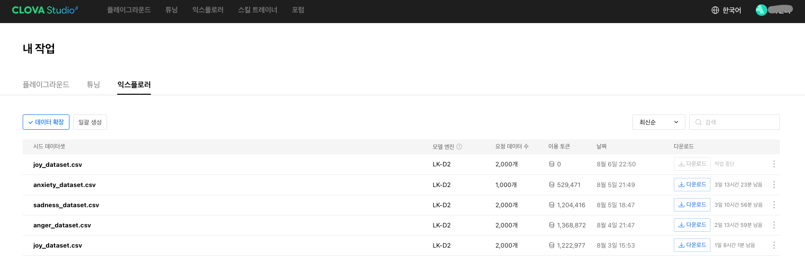
 

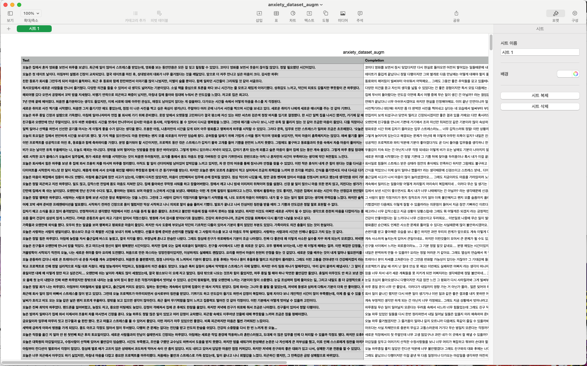
 

**3. 텍스트 임베딩을 활용해 과거 유사 일기 추천**
    
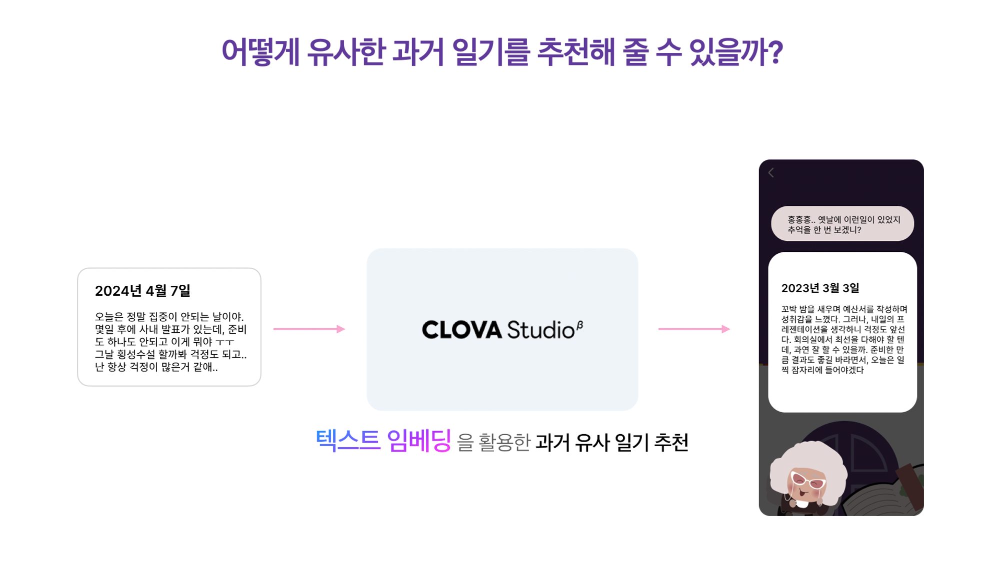
 

이 추억 할머니… 솔직히 매력적이잖아~ 
    
사실 AI 학습 및 개발은 서버 개발을 담당해주신 분이 대부분 캐리했다. 그래도 같이 감정이들을 학습시킬 방법을 논의하고, 데이터 튜닝하는 방법을 고민하면서 프롬프트 엔지니어링에 무릎까지는 담가본 것 같다. 

다른 AI 도구들까지 이렇게 다양하게 써보진 않았지만, 확실히 HyperClova X의 여러 가지 기능들을 활용하여 재미있는 아이디어들을 많이 실현할 수 있어 보인다. (근데 좀 비싸다 ^^) 

## 솔찍헌 마음으로는

---

마지막이니까 내뱉는.

ncloud가 주최인지 비사이드가 주최인지도 모르겠지만… 참가자들의 실력에 비해 주최측이 좀 허접했다.

**1. 너무 많은 정보들을 정리되지 않은 채로 전달했고**
    
  슬랙 채널명만 보고 여기서 무슨 이야기를 나눠야 하는지, 바로 알 수 있어야 하는 거 아닌가? 
  
  개발에 집중해야 하는데, 해커톤 자체에 대한 러닝 커브가 너무 높았다. 
  
**2. 참여 기간 내내 체크인을 강요하여(…) 나는 쫓겨날 뻔 했으며** 
    
  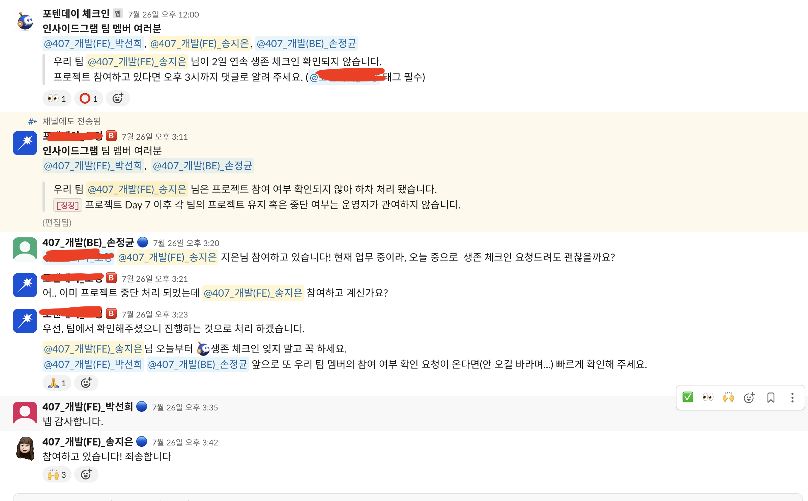
   
    
  룰이 너무 많아. 러닝 커브가 높다고! 열흘 할건데 뭘 이리 복잡하게 혀~ 
  
  (열흘 ‘안’에 만들라는 게 아니라, 열흘 ‘내내’ 만들라는 목적이었던 듯)
    
3. **특히 모각프 준비가 넘 허접했다.** 
    
  건물은 삐까뻔쩍한(?) 곳 빌려놓고. 스텝들의 엉성한 진행, 책상도 모자라, 배치도 잘못해놔… 
  
  참가자들한테 5만원씩 걷어가서 뭐 한 건지? ㅠㅠ  
  
 

그런 와중에도 참가자들 실력은 넘사벽이었던 것. 나름 없는 시간 쪼개서 퇴근 후에 잠깐, 주말엔 오후를 쏟아부으며 열흘 간 개발하여 최종 결과물을 제출했던 우리가 약간 민망ㅎ 할 정도로 고퀄의 프로덕트들을 만들어냈다. 

다 거짓이야… 열흘 만에 만들지 않았을 거야… 그리고 다 학생이나 취준생일 것이야… 

 

기죽지 않았어. 직장인들끼리 이렇게 싸우지 않고 열흘 만에 뭘 만들어서 낸 것만 해도 기적이야. 

## 우당탕탕 최종 결과물

---

🔮 **나의 감정들은 어떤 모습일까? “인사이드그램”** 🔮

- 프로젝트 링크: https://insidegram.vercel.app/
- 서비스 소개서: [https://sunnyhada.notion.site/e39748e978f64cb5b3b2bd8f0610f932?pvs=4](https://www.notion.so/e39748e978f64cb5b3b2bd8f0610f932?pvs=21)

이런 결과물들을… 어떻게든 만들어내버렸다고 한다.

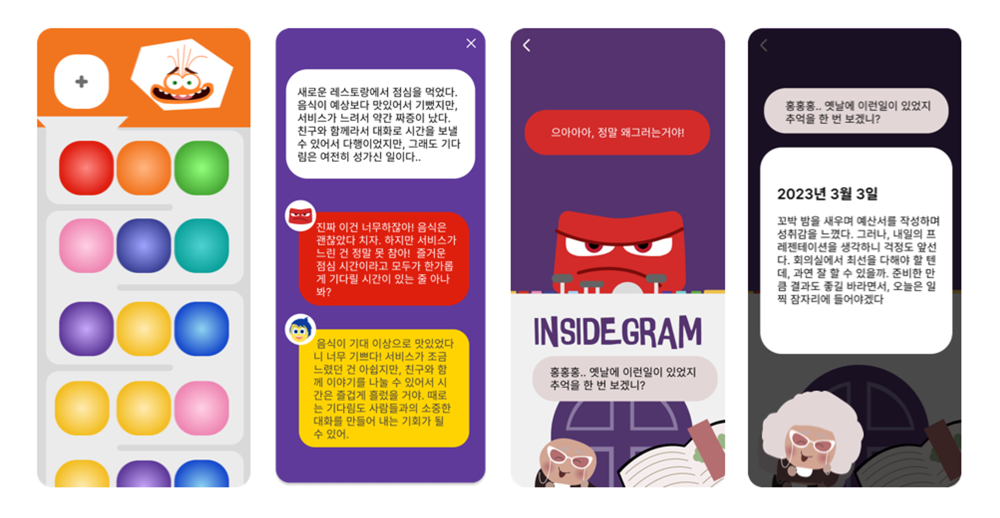
 

주요 기능은 다음 네 가지. 

**1. 일기 작성 및 저장**

**2. 감정 분석을 통한, 감정이들의 댓글 (피드백)** 

**3. 나의 감정 관제소**

**4. 추억 할머니가 꺼내주는 추억 일기**

전부 아이디어가 기가 맥혔지. 그리고 어떻게든 구현은 다 해냈으니까 되었다 ^0^ 

## 마지막 소회

---

이 얼마만의 해커톤이었는지. (사실 1년밖에 안됨) 

(언제나 그렇듯이) 갑작스럽게 참여하게 되었고, 처음으로 React가 아닌 Flutter로 다짜고짜 개발을 시작했고, 다른 팀들에 비하면 한참 못 미치지만, 우리 나름대로 재밌게 개발하고 몰입할 수 있던 시간이었다. 

사실 지식적으로 많이 배웠다고는 하기가 애매하다. 짧은 시간이었고, 정해진 규칙 안에서 우리끼리 알아서 개발하는 것이었기에 새로운 지평이 열렸다거나 하는 거창한 결과는 없다. 하지만 이거 하나는 분명하다. 정말 오랜만에 ‘몰입’했다는 것. 개발자 3년 차, 슬슬 지루해져 가는 참에 정말 자극이 되는 프로젝트였다는 것. 숨도 안 쉬고 몇 시간 동안 내가 하고자 하는 개발에만 집중하고, 팀원들과 생산적인 이야기들을 나누며 엄청 뿌듯했다는 것.

해커톤 주최측의 진행 방향이나 참여자들의 상황이 우리가 생각했던 것과는 조금 달랐기에 어려움이 있었지만, (그래서 다음에는 참가하지 않을 것 같지만 ㅎㅎ) 내가 의견을 잘 낼 줄 아는 사람이라는 것을 배웠고, 몰아치는 시간 속에 그래도 flutter 개발을 어찌저찌 해내서 다행이라고 생각한다. 

함께 해준 팀원들에게는 내가 자꾸 슬랙 체크인하지 않아서 맘졸이게 해서 미안한 마음과, 조금 부족했던 flutter 개발을 기다려줘서 고맙다고 전해주고 싶다 ☺️

갑자기 훈훈하게 끝내는 중.

 

그럼 여기서 끝!