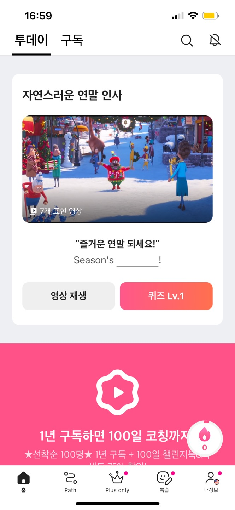

생각보다 가득 채웠던 한 해

<!-- more -->

---

## 우아한형제들, 짬이 차고 싶은...

설렌 마음 가득 입사 뽕에 차있었던 작년을 지나보내고, 어느덧 우형에서 만 2년차 개발자가 되어버렸다. 이제는! 더 이상! 물러날 곳이! 없다!

 

게다가 잦았던 인원 변동으로 갑자기 내가 우리 파트 최고 짬이 되어버렸다! 아무도 최고 짬이라는 부담을 주시진 않았는데, 혼자 괜히 긴장해서 더욱 더 정신을 차리고 일하게 된 한 해였다.

### 업무가 내 맘을 들었다 놨다

올해는 유난히 업무 운이 없었던 것 같다. 올해라고 하기엔 이제 2년차지만...
내가 맡은 프로젝트들만 자꾸 홀딩되는 것 같고, 기획도 엎어지고, 디자인도 계속 바뀌고...

처음엔 "그럴 수도 있지" 싶던 게 몇 달이 지속되니까 사실 스트레스를 받을 수밖에 없었다. '홀딩 전문 송지은'이라고 자학하며 웃어넘겼지만 사실 맘이 쓰라렸다 🥲

그럼에도 알뜰배달, 다이얼로그 어드민, 스토어 묶음형, 챗봇, 배민1플러스 등의 큰 작업들을 순탄하게(?) 마무리했다. 역시나 항상 적극적이고 배려심 많은 우리 팀원들이 도와줬기에 끝마칠 수 있었던 것 같다. 모두 감사하고 사...사랑합니다 ❤️

### 개발개선건

다행인지 불행인지 업무들이 다 엎어져서 (-\_-) 그동안 부족했던 개발개선건들을 여러 개 진행할 수 있었다.

- 장사도우미 지면 애니메이션을 mp4로 교체하여 성능 개선
- 셀프서비스 테스트 속도 개선
- 불필요한 babel 설정 삭제로 빌드 속도 개선
- lodash tree-shaking으로 번들 사이즈 개선
- 셀프서비스 로그 개발 생산성 개선
- 셀프서비스 광고신청 로직 개선

등등... 갑자기 다시 한 번 뿌듯해하고 싶어서 vpn 켜서 평가시스템에서 가져왔다. ㅋㅋㅋ

프로젝트 다 엎어졌다고 혼자 울적해하지 않고 그 와중에 또작또작 해봐서 다행인 것 같다. 이걸 '위기를 기회로!'라고 하는 건가. (아닌 것 같음)

### TIL 1등 👑

원래 '매일매일'이라는 건 너무 변수가 많아져서, 그리고 매일 꼭 뭘 배우는 건 아니라고 생각해서 TIL은 쓰지 않았다.

그런데 올해 갑자기 무슨 바람이 들었을까. 전사 슬랙 채널인 #fe-today-i-learned 채널에 매일 꾸준히 TIL을 올려 자랑스럽게 1등을 차지했다 ✌️

(사실 컨셉질한다고 양식을 맞춰 올리지 않아 순위권에 들지도 못했다. ㅋㅋㅋ 하지만 모두가 인정해준 진짜 1등이라고 생각함 😎)

<figure style="text-align: center;">
  
  <figcaption>올해 TIL 첫 글</figcaption>
</figure>

365일은 아니고, 주말과 공휴일, 내 휴가일에는 쉬었다. 또 쉬는 날을 마련해야 제대로 오래 간다는 이상한 철칙을 세워가며. 내 기억으로 근무일에는 전부 썼다. 사실 정말 새로 배운 거 없이 과제만 하는 날도 많았지만, 그런 날은 하루가 다 가기 전에 아티클이라도 하나 읽어가며 적었다. 참으로 팍팍한 완벽주의자의 인생 😬

그래도 1년 간 쉬지 않고 역시 해낼 줄 알았어...(ESTJ는 자뻑이 심하다.)

그리고 내년엔 안 할 거다. ㅋ

### 7월, 부산 워케이션

올해(가 끝이 될지 몰랐던...) '근무지 자율선택제'로 참 많은 구성원들이 개인으로, 그리고 팀으로 워케이션을 다녀왔다. 우리 팀도 놀기 대장 나의 주최로 부산에 일주일 슈슝 다녀왔다!

부산 워케이션 주최측과는 여러 번 문제가 있었지만(솔직히 별로였음 ^^)

저렴한 가격에 뷰가 멋진 곳에서 근무도 하고, 1인 1실 호텔에서 꿀잠자고, 매일 맛있는 거(술) 먹고, 휴가 쓰고 놀러다니고, 놀고, 마시고, 놀고... (^^...) 재택근무가 길어지며 팀원들과 진솔한 이야기들을 나눌 시간이 많이 없었는데, 하루종일 붙어 있으면서, 바닷바람 맞으며 밤바다 산책하면서, 시시콜콜한 이야기들 많이 나누면서 더욱 끈끈해진 것 같아 훈훈한 마음 담뿍 ☺️

 

송지은 놀아주기에 9명이나 함께 해준 우리 팀원들, 그리고 긴 일정인데도 함께 와서 케어해주신 팀장님께도 정말 감사드린다.

### 신규입사자 돌보미

내가 돌봄을 받은지도 얼마 안 된 것 같은데, 1년하고도 9개월이 지난 시점 이제는 내가 신규입사자 돌보미를 맡게 되었다. 사실 처음 본 사람들이랑 금방 친해지고 잘 떠드는 성격인데, 괜히 긴장했던 이유는 내 담당 신규입사자만 경력직이어서..!! 😬

그래도 우리팀 신규입사자 분 기죽지 않게 또 또작또작 환영 포스터도 만들어 붙이고, 줌 배경화면도 만들고, 이런저런 티타임과 런치타임을 잡아 팀원들과의 시간도 마련했다. 하지만 분명 나도 돌보미가 처음이어서 어설펐던 점도 있었을 거고, 하필 그 시즌에 일이 쏟아져서 정신없이 온보딩 일정을 진행해서 죄송한 마음도 있었다. 그런 와중에도 항상 너무 고맙다고 말씀해주시고, 경력직으로서 오히려 내 고민상담만 잔뜩 해주셨던 ㅋㅋㅋ 너무나도 감사한 마음이다.

 

첫 1주 간 매일 출근이 조금 빡세긴 했지만, 입사하신 10월이 날씨가 너무 좋은 주간이어서 오히려 신나게 회사 다니며 하루종일 쫑알쫑알했다. 예쁜 가을 하늘과 함께 찾아오신 우리 신규입사자 분 다시 한번 환영해요 🥳

---

## 우아한 건 전부 다

### 우아톤

때는 올해 6월... 실 채널에 우아톤 팀을 꾸리는데 프론트엔드 개발자를 한 명 구한다는 글이 올라왔었다. 밤샘 해커톤 같은 거 진짜 내 스타일 아니라 공지 올라왔을 때도 관심 없었는데, 왜 그 글이 마치 엄청난 기회처럼 보였을까? 댓글로 호다닥 합류 의사를 밝히고 한 달 후인 7월, 그렇게 회사에서 밤을 꼴딱 새며 개발을 했다.

주제는 <가게 콘텐츠보드 모니터링 자동화>. '생성형 AI'를 주제로 하는 만큼 사실 프론트엔드 개발자가 크게 할 일은 없었지만, 이런저런 아이디어를 제공하며 사용성을 조금 더 높여 프로젝트를 완성할 수 있었다. 잠 1시간도 못자고 고생한 우리 팀원들 감쟈합니다... ㅎㅎㅎ

 

(참고로 사진은 기사에서 가져왔다 ㅋㅋㅋ   출처: https://www.thefairnews.co.kr/news/articleView.html?idxno=11905)

cf-1) 회사 휴게실에서 처음 씻고 자봤는데, 되게 좋았다. ~~회사에서 살고 싶었다나~~
cf-2) 엄청나게 장맛비가 쏟아지던 1박 2일, 비가 오는 줄도 모르고 갇혀서 개발만 했던 해커톤이었다

비록 수상은 하지 못했지만 ㅋㅋㅋ 오랜만에 해커톤에도 참여해보고, 다른 사람들의 기가 막히는 여러 아이디어들과 결과물을 보며 신선한 자극 얻을 수 있는 시간이었다. 타이밍 맞게 팀원으로 참여할 수 있었어서 기뻤던 경험.

### 우아한타입스크립트 출간

나 이제 작가라고~!! 그것도 개발 도서 작가 ✌️ (라고 하기엔 16명 공동 저자지만 ㅋㅋㅋ)

작년 입사했을 때부터 집필을 시작해왔던 <우아한타입스크립트>가 드디어 출간되었다.

사실 정말 출간할 수 있을지 몰랐지... 길고 지리-했던 과정 속에서 절반 정도 되는 인원이 포기를 선언하고, 그 이후에도 이게 진행되고 있는 게 맞나... 했지만, 운영진 분들과 DR팀의 적극적인 리딩 속에 마침내 눈물의 출간 🥹

 

수 차례의 검수를 거치고, 표지와 내지까지 반영된 진짜 책을 보니 감회가 색다르긴 하다.

한참 전 쓴 작가소개가 이렇게 나간 게 부끄럽긴 하지만...

> 파워 드러머이지만 의외로 낭만을 추구하는 개발자. 멋쟁이사자처럼, 스타트업, 우아한테크코스를 거쳐 우아한형제들에서 배민셀프서비스 프론트엔드를 개발하고 있다. 프로덕트 UX에 관심이 많으며 개발보다 코드 리뷰를 좋아한다는 소문이 있다.

쇼를 해라

> - [도서 링크](https://www.yes24.com/Product/Goods/123049083)
> - [저자 페이지](https://www.yes24.com/24/AuthorFile/Author/440178)

### 우아한테크세미나 발표

바로 앞에서 언급한 우아한타입스크립트 출간을 주제로 10월 우아한테크세미나에도 참여하게 되었다.

<figure style="text-align: center;">
  
  <figcaption>긴장했다고 한다. ㅋㅋㅋ</figcaption>
</figure>

참여 계기, 책을 쓰는 과정 속 에피소드, 책 리뷰 과정, 가장 인상 깊은 장 소개 등으로 발표 내용을 구성했다.

준비 기간도 짧았고, 라이브로 진행돼서 긴장했었는데 같이 발표하던 두 분이 더 긴장하셔서 나는 그냥 긴장 안 하기로 했다. 다행히 발표도 수월히 진행했고, 반응도 좋았고, 실수도 하지 않았던 것 같다.

Q&A에서 댓글 읽는 게 맘처럼 안 되긴 했다. 처음이니까 ㅎㅎ 방송하시는 분들 대단하다.

> [10월 우아한테크세미나 - 글 쓰는 우아한 개발자](https://www.youtube.com/watch?v=nQgwlyBrxDs&t=2785s)

### 우아콘 2023 발표

마침내침내... 올해의 가장 큰 이벤트 중 하나였던 우아콘 2023까지 오게 됐다.

작년 5월에 발족하여 올해 5월에 ver.1을 공개한 웹프론트테크트리의 '우아한스펙트럼' 서비스, 원래 나 혼자 발표할 생각은 조금도 없었는데 어떻게 다들 타이밍이 안 맞아 단독 발표로 진행하게 됐다 😬 게다가 코로나 시국이 지난 후 오프라인 발표라니!!

내용 준비부터 각종 발표자료 준비 및 검증, 마지막에 마지막을 거듭한 검토와 수 차례의 발표 연습까지... 바쁠 거라고 예상은 했는데 눈물났다. (안 움. 이때부터 MBTI T가 된 것 같다.)

특히 나는 나름 발표 체질이라고 생각했었는데, 발표 연습과 촬영본을 보며 내게 어떤 작은 습관들이 있는지 발견하고 고쳐갔던 과정들은 앞으로의 인생에서도 좋은 경험이 됐을 것 같다. 또 나름 발표 내용을 열심히 구성했다고 했는데도, 피드백을 들으며 청중들이 이해할 수 있는 플로우, 청중이 궁금해하는 내용들로 발표를 구성하는 연습을 많이 할 수 있었던 것 같다.

발표를 보러와준 모든 사람들께 감사하고, 특히 많이 도와주고 응원해준 우리 테크트리 팀원들, 셀러웹 팀원들, 그리고 내 짝꿍 정말 고맙다 ☺️

 

10월 내내 넘 고생스러웠지만 발표 한번 하고 나니 별 건 아니고 ~~다신 안 하고 싶다 ㅋ~~

> - [2023 우아콘 사이트 - 세션 소개](https://woowacon.com/presentations?presentationId=610)
> - [2023 우아콘 유튜브 - 발표 영상](https://www.youtube.com/watch?v=-O-z3W4S6xc)

---

## 개발 공부는 안 하고

🙎‍♂️: 너 외고생이냐?
🙆‍♀️: ㅇㅇ
🤦‍♂️: ...

### 영어, 프랑스어 공부

올해 1월 실수로(ㅋㅋㅋ) 영어공부 애플리케이션 케이크 앱을 1년치를 88,000원에 구독해버리고... 놀라서 당장 구취하려고 했지만 이렇게 된 김에 그냥 공부해보자 해서, 매일 10분 간 강제로 영어공부를 했다. 호주에 있었던 3-4월, 미국에 있었던 9월은 어차피 세상이 영어 천지라는 핑계로 안 하긴 했지만 그 외에는 5일 정도를 제외하곤 매일 공부했던 것 같다.

  

 

사실 케이크 앱 자체는 그렇게 내 스타일은 아니었지만, 영어 기초나 문법이 아닌 실제 회화 위주의 자연스러운 대화들과 억양들을 배우고 따라할 수 있어서 나름의 표현들을 많이 익힐 수 있어서 좋았다. 내년에 구독을 이어갈진... 모르겠다.

그리고 갑자기 프랑스어 공부는 왜 또 시작했는지 모르겠다. 그렇게 개발 언어 공부를 하기가 싫었나? 프랑스어도 고등학생 때 전공했던 짬을 믿고 듀오링고로 슬슬 해봤는데, 재밌더라! 역시 나 외고생이었어... 남들 못하는 언어 혼자 멋진 척 하는 거 좋아하네...

 

24년도에도 무리하지 않는 선에서 계속 공부해서 25년에 유럽 여행 가야지 😎

### 일본어 공부

그리고 뜬금없이 시작한 일본어 공부 🤨

의 계기는 나의 아이묭 때문이지...

 

한동안 틱톡에서 유행했던 '아이묭 - 사랑을 전하고 싶다든가'는 사실 별 관심 없었는데, 어쩌다 듣게 된 '마리골드' 때문에 일본어를 배우고 싶어졌다지... 아무리 번역을 잘 해놨어도 언어에는, 특히 노래 가사에는 그 나라 언어를 직접 해야만 느낄 수 있는 그 감정이 있거든.

10월에 미국 다녀오자마자 어차피 잠시 그만 뒀던(ㅋㅋㅋ) 영어공부 홀딩하고 일본어 책을 사와버렸다.

근데 짝꿍이 분명히 일본어는 쉽댔는데... 거짓말... 나 한자 3급이라고 잘할 거라 생각했는데... 내가 아는 한자가 아니잔아... 🤯

아무래도 프랑스어는 어차피 영어 변형이라서(?) 알파벳을 새로 배울 필요는 없었는데, 일본어는 히라가나, 가타가나에 한자까지 알아야 해서 쓰기가 너무 어려웠다. 😭

그래도 매주 꾸준히 공부해서 벌써 한 권 다 뗐다고 한다.

 

그래서 내년 목표는? 당연히 JLPT 따기 ㅎ

그리고 아이묭 뿐만 아니라 일본 노래 다 내 스타일이잖아... 벅차오르고, 사랑 노래 없고, 전혀 똑같지 않은 각자의 색을 갖춘 노랫말과 멜로디. 그리고 나 밴드하쟈나... J-POP 근본이었는데 나만 모르고 있었잖아...

엄마 나 오타쿠인가 봐

오리진 오타쿠였던, 나한테 일본 노래 자꾸 알려주던 내 짝꿍은 지금 더 심한 오타쿠가 되어버린 날 보고 아직까지 어리둥절해하는 중 🤷‍♀️

---

## 그래도 개발자라면

진짜 올해는 개발 공부 그닥 안한 줄 알았는데, 그 와중에 본분은 잊지 않았더라.

### 크롬 익스텐션 개발

개발한 지 한참 지나서 익스텐션 이름도 까먹어서 다시 검색해서 들고 왔다. ㅋㅋㅋ
 

1. 크롬 익스텐션을 만들어 보고 싶은데
2. 내가 써야 한다.

라는 두 가지 단순한 동기로...

타임라인 댓글을 클릭하면 영상의 해당 타임라인으로 가긴 하는데, 스크롤이 올라가버려서 방금 누른 댓글을 까먹어버린다는!!
아주 심각하고도 소수의 사람들만 불편했을 것 같은(ㅎ) 문제를 해결해보고 싶었다.
(내새끼들 영상 초단위로 끊어본 적 있는 덕후들은 공감해주라...)

 

구현 결과는 아주 단순하다. 타임라인 댓글을 누르면 영상으로 스크롤이 올라갈 떄 해당 댓글이 같이 딸려올라가서 영상과 함께 볼 수 있게 되고, 댓글을 다시 클릭하면 원래 댓글이 있던 자리로 돌아간다.

쉽고 간단하게 개발할 줄 알았는데, 익스텐션 개발 자체보다는 유튜브의 영상 및 댓글 렌더링 로직 파악이 넘 빡세서 두 달 가까이 걸렸던 것 같다. 진짜 포기 안하고 만들어 낸 나 칭찬해

사실 홍보도 안 하고 몇몇 사람만 알고, 나만 아주 잘 쓰는 중이다 ㅎ

> [Hook Timeline](https://chromewebstore.google.com/detail/hook-timeline/mbgbohedkcdiindhimkfhepedafcnnaf?hl=ko)

### 테스팅 스터디

올해 여름까지었나? 팀원들과 함께 <이펙티브 소프트웨어 테스팅> 책으로 스터디를 진행했다.

 

명세 테스트/ 구조적 테스트/ 속성 기반 테스트, 테스트의 경계, 코드 커버리지의 기준과 테스트할 수 있는 코드에 대해서 배우고 팀원들과 경험을 나누었다.

여전히 프론트엔드에서 테스트 잘 하는 방법은 확실하지 않지만, 테스트에 대한 이해나 접근 방법에 대해서는 많은 고민을 해볼 수 있었다.

그래서 자신만만하게 셀프서비스 테스트 코드 개선에 착수한다고 하였으나... 하고 있다. ^^!

### 자바스크립트 SICP 스터디

악명 높은 책이었던 <자바스크립트 SICP>. 능력 있고 의리 있는 회사 분들과 함께라면 이겨낼 수 있을 거라 생각했지...

 

이건 거의 수학 아닌가. 저 문과생인데 왜 그러시는데요;; 왜 이 지경까지 알아야 하는지 모르는 순간들이 많았지만, 그래도 조금씩 앞 단원의 내용을 바탕으로 어떻게든 문제를 풀어내려는 내 자신을 발견할 수 있었더라나. 사실 내 자신보다는 스터디 팀원들이 넘 멋있었다. 어떻게 이런 문제들을 이런저런 논리력 총집합하여 풀어내는지! 그렇게 함께 정복해나가고 있던 책.

난 분명 이겨내고 있었는데... 이제 SCIP인지 SICP인지 헷갈리지 않고 말할 수 있게 된 시점에 스터디가 끝나버렸다. 🥲 다음에 다시 만나요 ✋

### 알고리즘 문제풀이

이직 준비합니다.

는 물론 아직 아니고 아무튼 작년 11월부터 매주 알고리즘 문제풀이를 하기 시작했다. 사실 사내 스터디로 시작했는데, 점차 인증하는 사람들이 없어지길래 재미없어서(ㅋㅋㅋ) 몰래 나온 뒤 나 혼자 그냥 함...

외국에 나가있거나, 진짜 미친듯이 바빴던(우아콘 + 이사 주간^^) 날들을 제외하곤 매주 3문제씩 풀었다. leetcode에서 난이도 Easy로 개꿀 빨다가 지난 달 문풀 1년 된 기념으로 난이도 Medium으로 올린 후엔 폭망하고 있는 중 ㅎ

<figure style="text-align: center;">
  
  <figcaption>매주 기록한답시고 혼잣말과 하소연만 가득한 알고리즘 문풀 노션</figcaption>
</figure>

그리고 문제는 파이썬으로 풀고 있는데, 파이썬 진짜 좋은 것 같고 내 친구 자바스크립트^^ 할많하않

---

## 인생 첫 자취 시작

올 한 해 가장 큰 🎉🎁🍾빅이벤트🍾🎁🎉

고대하고 고대하던 자취!!!를 시작해버렸다.

미국 다녀오자마자부터 부랴부랴 집 보러 다닌다고 설치며, 수많은 부동산을 끼고 20여 군데를 돌아다닌 끝에... 마침내 내 로망에 가까운 집을 찾아서 바로 계약해버렸다지 (예산은 내 로망이 전혀 아니었지만 ㅎ)

이사는 반포장으로 했다가 죽을뻔 했다 ㅎ 4인 가정집에서 고작 여자애 방 하나 나가는데 짐이 뭐 그렇게 많은지... 본가 짐의 50%는 사라진 것 같다. 그리고 지금, 약 한 달 반 동안 수많은 가구들과 짐들을 샀는데 이제 못 나간다 ㅎㅎㅎ 이사 두번은 모대...

오늘의집과 이케아에서 수 백 만원을 쓰고서도 아직 한이 안 풀린 것 같은 자취광인... "먹고 싶을 때에 먹고 싶은 걸 먹자"는 모토로 배달음식 한번 안 시켜 먹고 맨날 마트에서 장 봐다가 밥 해먹는다. 물론 배달음식보다 더 비쌀 때가 많다^^

친구들, 가족들, 짝꿍도 불러다가 배 터지도록 밥해주는 것이 이렇게 재밌고 ~~힘들어 죽는~~ 일인 줄 몰랐다.

 

나 인스타 감성 싫어하는데, 그리고 아주 조금만 오늘의집 감성 담았는데, 친구들이 이렇게 예쁘게 해놓고 갔다.

<figure style="text-align: center;">
  

  
  <figcaption>근데 꽤나 맘에 들어서 한 달 째 이렇게 해놓고 있다 ㅎ</figcaption>
  

</figure>

이미 작은 사고도 두어 번 치고, 세상 물가가 이렇게 혹독한 것임을 깨달아가고 있다. 그치만 혼자 있을 때 무섭거나 외로울 줄 알았는데 전혀 그렇지 않다. 아늑하고 포근한 우리집에서 나 혼자 맘대로 입고 혼잣말하면서 행복하게 사는 중. 집안의 모든 것을 내 손으로 꾸며놓고 보니 아주 뿌듯하고, 조금의 티라도 묻지 않기 위해 매일 박박 닦게 된다.

부모님과의 사이도, 집 계약하는 순간부터 완전 좋아졌다. 👨‍👩‍👧‍👦 내일 또 엄마 놀러와서 밥 해주기로 함

자취 짱 추천

~~내년부터 월세 내려면 알바해야겠다.~~

---

## 워케이션, 그리고 여행

올해는 참 멀리멀리도 다녔던 한 해

### 봄, 호주 여행

3월 8일부터 4월 16일까지, 딱 40일 동안 호주에 다녀왔다.

올 한 해 우리 회사 복지(?)였던 근무지 자율선택제를 이용해서 동기 친구와 함께 계획했다.

호주를 택한 이유는 3가지

- 영어권일 것
- 시차가 작을 것
- 수영을 할 수 있을 것

이 조건들에 완벽히 부합하는 나라!

사실 호주는 3년 전에도 한 번 가봤었는데, 자유여행으로 다녀오니 훨씬 재밌고 값진 경험이었다.

 

여러가지 일들도 많았고, 당연히 근무 환경이 제대로 갖춰지진 않아서 오래 일하긴 어려웠지만 너무나 좋은 시기에 소중한 추억들 많이 만들고 온 것 같다. 영어에도 자신감이 생겼고, 누군가와 함께 지내는 법을 배웠고, 동물 그리고 천혜의 자연환경만 바라보고 있어도 좋다는 생각을 하게 됐다.

아침마다 브리즈번 강을 따라 조깅하던 그 덥고도 따뜻한 호주가 때론 그립기도 하다. (누가 보면 유학하고 온 줄 알겠다.) 근데 엄청 비쌌어서 다음에 떼돈 벌면 가서 살고 싶다 ^^...

### 여름, 전주-담양 여행

호주로 떠나버린 나를 한 달 넘게 기다렸던 내 짝꿍씨...

아직 다 가버리지 않은 봄기운이 더 짙었던 여름의 초입에는, 그때 살짝 위기였던 짝꿍과 2주년 맞이 여행을 다녀왔다.

우리 팀원 분이 추천해주신 전주 아원고택, 그 전날부터 비가 억수로 쏟아져 출발하기 전날까지 고민했었는데, 결론적으로 더 아름다운 여행이 됐다.

빗방울을 맞아 녹음 냄새가 더 짙어진 담양 소쇄원, 조금은 끈적거렸지만 그 핑계로 더 헐벗고 다닐 수 있었던(ㅋㅋ) 날씨, 그리고 비 내린 후 물안개가 두터워져 1년에 몇 번 볼 수 없다던, 믿을 수 없는 장관을 보여준 아원고택까지...

 

초여름에 걸맞는, 초록초록한 여행이었다. 때로는 좀 힘을 줘서라도 차 끌고 이런 산골짜기에 들어가는 것도 훌륭한 힐링이 될 수 있을 것 같다. 🌿

### 가을, 미국 여행

올해 8월 짝꿍의 졸업여행으로 계획했던 미국이었는데, 졸업에 실패해서 그냥 여행이 되어버린 ㅋㅋㅋ

추석을 끼고 같이 와랄라 휴가를 내, 열흘 간의 넉넉-한 대장정을 했더랬지. 미 서부 대표 도시 3개: 샌프란시스코, 라스베가스, LA를 다 돌고 왔다.

미국 역시 가기 직전까지 마약과 홈리스의 대콤보로 이를 어찌해야 하나... 망설이다 그냥 갔는데, 정말로 마약과 홈리스는 날 것 그대로였다^^ 첫째날 밤 편의점에 가려고 나왔다가 골목길에서 마주친 무서운 홈리스 때문에 그 다음날부터는 관광을 끝낸 후 아주 안전하게 집에만 있었다고 한다.

 

줌 배경화면으로만 보던 샌프란시스코의 금문교, 라스베가스의 꺼지지 않는 도시 불빛과 카지노, 그랜드캐년이 선사하는 보고도 믿지 못할 대자연, 자본주의의 끝판왕 시간 가는 줄 모르고 놀았던 디즈니랜드, LA의 상징 할리우드 사인까지 알차게 돌고 즐기고 많이도 먹었다. 미국은 뭐든 스케일이 다르구나, 뭐든 끝장을 보여주는구나 싶으면서도, 국내 그 어느 도시보다도 삭막하고 음산한 기운까지 돌았던 도시들에서 살기는 어렵겠다는 마음이 들었다.

미국에 두 번 다시 갈 수 있을까... 일단 마음이 들 때면 잔고를 확인해보자. 환율 + 인플레이션의 대환장 콤보로 호주 40일 숙박 + 생활비에 맞먹는 돈을 열흘치 숙박 + 생활비에 한 번에 다 털었던 아찔한 미국 여행이었다.

### 겨울, 평창 여행

겨울은 이제 시작! 이 글이 올라갈 때쯤 평창 여행 겸 스노보드를 타러 갈 예정 🏂

과연 나는 다치지 않고 돌아올 수 있을까?

 

평창에 다녀와서 글을 이어가는 중.

스노보드는 너무 재밌었고 스스로의 간지에 취했지만 엉덩이&어깨&무릎 다 나갔다. 스키장에 광고 띄워놓은 제휴 업체 정형외과 뭔데? ㅋㅋㅋ 나를 위한 건가

다행히 정형외과는 됐고 한의원이나 가야할듯 하다... 15년 만에 다녀온 스키장, 처음 배워보는 보드. 한 살이라도 어릴 때 이것저것 많이 즐겨봐야겠다는 다짐을 하게 된 여행

드넓은 공간에서 즐겼던 미디어아트 전시관도 멋졌고, 삼양라면의 그 삼양목장에서 겨울 아주 제대로 즐겼다. 설경이 아니라 빙(氷)경이었지만. 풍차도 가까이서 처음 보고 아주 대단하고 추웠던 여행이었어!

---

## 밴드는 계속된다

드.광.(드럼광인) 송지은의 드럼 외길인생은 계속된다...

작년에 함께했던 멤버들과 올해도 사내 동아리를 만들고, 한 해 동안 지은팀 팀장을 하며 밴드 활동을 이어왔다. 드럼 학원도 다시 등록해 지금까지도 다니는 중이다. 드럼 학원 근처로 이사왔다고 하면 다들 어이없어 하던데 진짜다^^

 

올 해 공연을 많이 한 줄 알았는데 2번 밖에 안 했네. 올 한 해도 새로운 사람들과도 즐거운 시간들 보내고, 원래부터 함께 하던 사람들과도 더 많은 추억들을 쌓아가며 언제나 신나는 밴드 활동이었다.

그 어떤 활동보다도 팀의 화합과 조율이 필요한 활동인 만큼, 서로의 템포에 맞춰가는 과정에서 음악적으로뿐만 아니라 인생을 배울 수 있는 값진 경험이라고 생각한다! 🥁 (오글거리지만 정말로!)

---

## my \_\_\_ year, 2024

올 해 회고글은 뭐 그렇게 할 말이 많았는지, 지난 회고 글들보다 양이 2배는 많아졌다. 상당히 수다스러웠고 유쾌했고 young했던 한 해였을까? 작년 회고 글을 다시 읽어보니 올해의 목표를 거의 다 이룬 것 같다. 인간미 있게 '사이드 프로젝트 하기'는 24년 목표로 미뤄보고자 한다 ㅎㅎ

그리고 작년과 크게 달라진 점. 올 한 해 의료비가 정말 들지 않았다. (작년에 과하게 많이 들긴 했다^^) 여전히 몸은 비리비리~하지만 운동도 하고, 내 몸이 뭐가 문제인지 검진을 통해 진단도 받고, 조금이라도 아프면 바로바로 조치를 취해서 조금씩 건강을 되찾아가고 있는 것 같다. 앞으로 이것만 유지해도 성공이다 지으나.

최근 MBTI 정식 검사 결과 ESFJ가 아닌 ESTJ가 나왔다. F로 살고 싶었던 나는 너무나도 서운했으나... 이내 F를 모방하고 싶은 T라는 것을 인정하게 되었다. 우리 사회에서 T는 무슨 싸이코패스처럼 그려졌던 게 내 T에 대한 적대심에 한 몫했던 것 같다ㅠ T 중에도 따뜻한 T, 사회화가 많이 된 T, 정내미 많은 T들이 있음을 인정하고 나는 나대로 지금처럼 내 주변 사람들을 챙기며 살아가야겠다.

<figure style="text-align: center;">
  

  
  <figcaption>올 해 팀방에 제일 많이 한 말</figcaption>
  

</figure>

그래서 올해의 진짜 목표는?

 

얼마 전 친구들과의 송년회에서 술집 트리에 붙여두고 온 새해 소망. 비록 우물 안 개구리가 될지라도, 내 주변에 있는 것, 내가 행복을 느끼는 것들에서 나만의 행복들을 쌓아나가고 싶다. 그리고 여전히 낭만적인 사람이 되고 싶은 거야. ESTJ는 맞지만 '극한의 효율', '폭발적인 성장' 이런 건 나랑 안 맞는다. 내면의 작은 성장들, 그리고 때로는 비효율적인 순간들을 만들며 무엇이 내 인생에 중요한지 생각해 보고 싶다.

어차피 아무 생각없이 살아도 누구보다 값진 인생을 살아갈 나라는 걸 알기 때문에, 아직도 하고 싶은 게 많고 또 그러면 다 해낼 수 있는 나라는 걸 알기 때문에 24년도 그저 나와 내가 사랑하는 사람들을 돌보며 차근차근 걸어가야겠다.🏃‍♀️

올 한 해 정말 멋졌어, 내년에도 행복하자 나 자신!
