## 회사 이야기

---

### 셀러셀프서비스팀

올해 8월, 기능조직이었던 셀러웹프론트개발팀에서 다시 목적조직인 셀러셀프서비스팀으로 팀을 이동했다. 웹프론트개발 팀원들과 헤어지는 왠지 애틋한 순간… 

  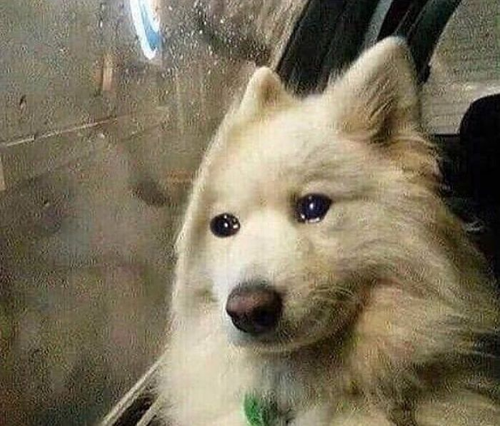

 

약 2년 만에 본래의 목적조직으로 돌아가는 올 여름, 기존 셀프팀원들과 한 번이라도 같은 팀이었던 프론트 팀원은 나뿐이었다. 진짜 고인물 실화냐 🫠

그렇게 약간 서먹하지만 어떻게 또 조심조심 서로를 알아가는 시간들을 거치며… pm, 그리고 서버 팀원 분들과도 다시 어느새 꽤 가까워진 것 같다 🤗 (나만 그렇게 생각할 수도) 

1년 간 배민1플러스, 쿠폰내역 개편, 배민오더, 대시보드 개편 등 회사의 크고 작은 프로젝트들을 전담해서 진행했고, 디자인-하이라이터, 테스트 코드 이관, react-query 도입 등 개발 생산성 개선을 위한 작업도 열심히 병행했다. 사실 회사 프로젝트는 그냥저냥 시키는 대로 했고 개인적으로 도전해보고 싶었던 것들 위주로 에너지를 쓰며 개발했던 것 같다^0^ (팀원들이 보지 않았으면 좋겠다.) 

특히, 개발-디자인 생산성 도구인 ‘디자인 하이라이터’! 혼자 또 붕 뜨는 시간에 이것저것 뒤적이며 webpack custom loader로 만들어 봤는데, 고민의 시간은 길었지만 실제 구현은 간단했고 디자이너 분들과 개발자 모두 잘 써주셔서 감사할 따름이었다. 만들었는데 아무도 안 써주면 슬플 뻔 했쟈나… 🥺 

이제 진짜 빼도박도 못하는 3년 차, 고인물이라곤 하지만 아직도 회사와 프로덕트에 대해 모르는 것 투성이인 나. 때로 참 멋 없다고 생각하지만 나름 열심히 발버둥치고 있는 애매한 3년 차! 아직까지도 발버둥치고 있으면 좀 문제인 것 같긴 하지만! 

그리고 지지부진했던 업무들의 연속으로 여름 쯤 슬럼프도 왔었지만, 선배들과의 면담으로 잘 이겨냈다. 근데 연말에 일이 또 몰려서 정신 나갈 뻔 한 건... 😇

### 우아한스펙트럼

애증 그 자체였던 우아한스펙트럼은 작년 우아콘 발표 이후 워킹그룹 재정비 시간을 지나 우아한웤플로 워킹그룹에 편입되었다. 드디어 그룹장 직을 내려놓았어! ~~다신 리더 안 해~~ 

역시 리더를 안 하고 실무만 하는 게 재밌다! ^^ 모든 리더직 분들 실무하세요.

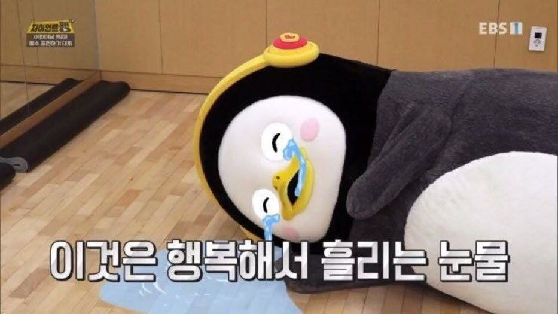
 

믿고 의지하는 선배의 매니징 따라 2분기부터 빡빡하게 우아한스펙트럼 이관 작업을 시작했고… 

3분기부터는 댓글 기능/ 라이브러리 비교 기능/ 모노레포 레포지토리 표기/ 배치 개선/ 사내 라이브러리 한눈에 보기/ 업데이트 권장 버전 경고 등의 굵직한 피처들을 모두 만들어냈다. 이게 되네!! 

물론, 혼자는 아니었고 중간에 합류한 역시 또 믿음직한 동기 개발자(내가 끌고 옴)와 함께 한 덕에 끝까지 무너지지 않고 초기에 계획한 기능들을 완성하여 phase2를 무사히 배포할 수 있었다. 

본업인 셀프서비스와는 다르게 또 기획부터 디자인, 서버와 프론트 개발까지 혼자 다 맡아서 하는 것이 책임감 퐁퐁 샘솟고 이제 완성 못 하면 다 내 탓인 거고 그래서 끝까지 해내게 된다. 본격 한국식 업무 떠맡기. 

### 팀원들과의 추억

상반기와 하반기 서로 다른 팀이었지만 각각 계절 제대로 즐겼던 팀 워크샵(을 가장한 잡담도 경쟁력이고 어쩌구) 

아, 계절을 제대로 즐겼다는 건 봄-가을 밖에 없다는 뜻이다. 한국 여름/겨울 그거 어떻게 버티는 건데? 

3월에는 올림픽공원 나들이를 다녀왔다. 

  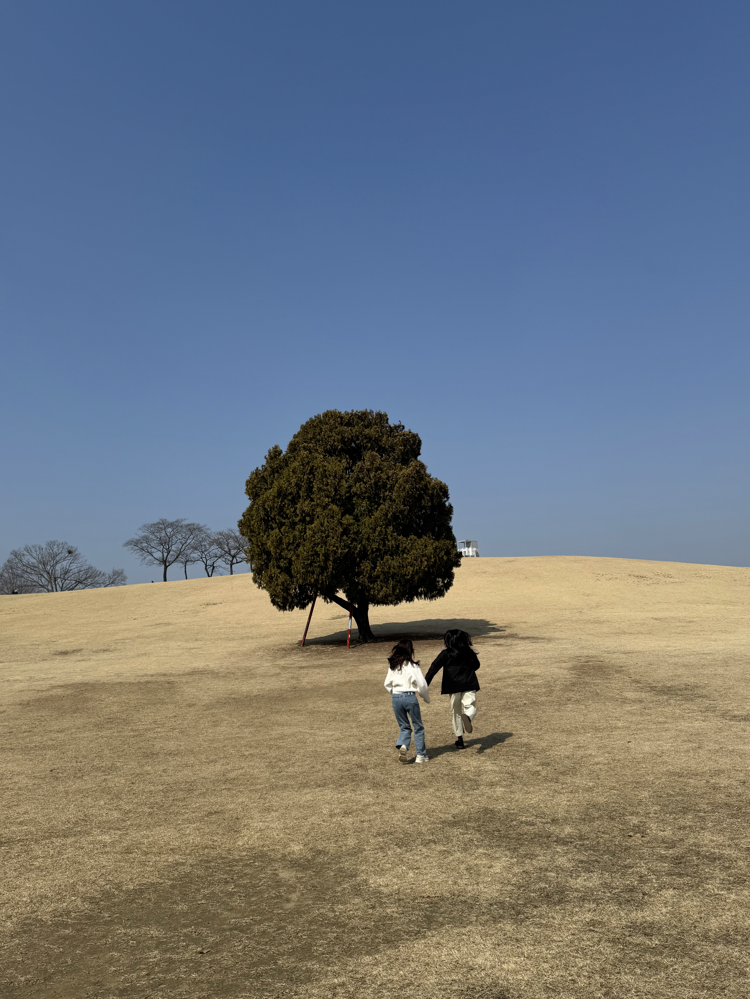

 

평일 낮에 올공 나홀로나무 가면 사람 아무도 없고 을매나 좋게요~ 

같이 뛰고 있는 팀원이 색감 보정해준 사진도 있는데 나는 워낙 역동적이고 인간미 넘치는 사진을 좋아하기에. 

4월에는 역시 벚꽃놀이! 

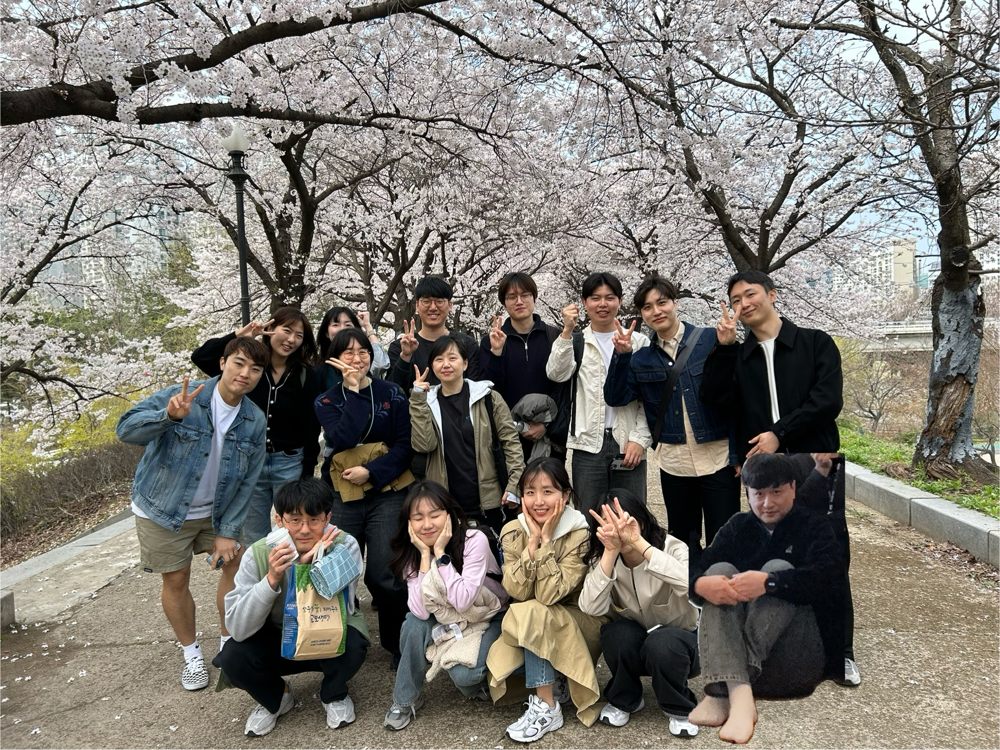
 

역시 평일 올림픽공원. 회사가 참 터는 좋단 말야.

팀원 떼거지로 나와서 샌드위치 먹고 벚꽃 사진 찍는 회사가 있다?! 

11월에는 단풍 보러 인왕산 등산에 나섰다. ㅋㅋㅋ

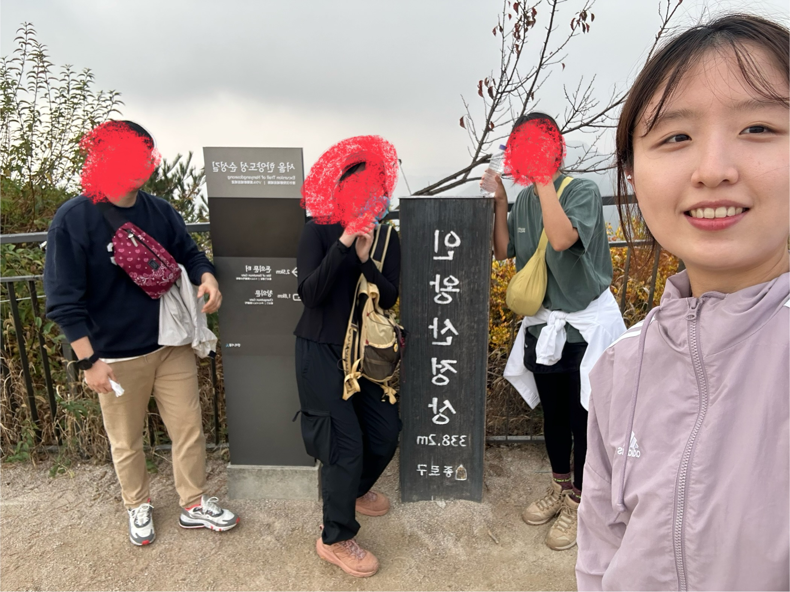
 

사진 찍은 게 이따구밖에 없어서 모두 모자이크함. 나도 모자이크 하려다 걍 말았다 ^.^

11월인데 단풍도 절반 밖에 물 안들고 날은 더워 죽고 한국의 기상이변 맛 제대로 보고 온 날

그래도 우리 팀 등산 고수에게 꽤 등반 잘 한다고 칭찬 받아서 즐거웠다 

런닝화 신고 갔는데

그리고 가장 최근, 모든 게 완벽했던 글램핑 워크샵 🍁 

어쩌다보니 또 내가 워크샵 TF에 들어가 있더라… 또 노는 건 못 참지

날은 조금 흐렸지만 팀원 분들이 데리고 온 댕댕이들이 다 했던 남양주 글램핑장

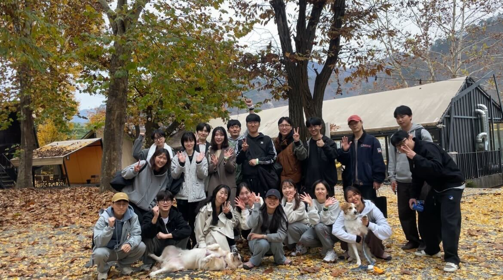
 

가운데 대자로 누운 강쥐 ㅠ (이름은 시루) 정말 졸귀탱

단체로 요가매트 가지고 와서 요가강사 자격증 있는 팀원한테 요가 클래스 듣는 팀 또 어디 있는데

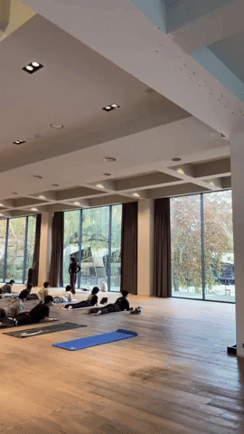
 

다시 봐도 참 대단해 

## 개발자의 자기개발 👩‍💻

---

대체 누가 만들어 낸 말인지 개발자는 평생 공부해야 한다고 

~~그만하고 싶어요~~

아무튼 ~~3년차 개발자로서 뭐라도 끄적여봐야 할 것 같아서~~ 셀러셀프서비스팀과 우아한형제들 테크부문의 부흥을 위해 3월에는 우아한 기술블로그에 글을 작성해봤다. 함께 대-챗봇 프로젝트를 진행한 서버 개발자와 함께. 

👉 https://techblog.woowahan.com/16021/

2달 동안 꽤나 공들여 썼지만 읽는 건 휘리릭 한 순간

그리고 9월, 추석이 지나고 다시 코테 공부를 시작했다. ~~이직 준비하는 거냐? 🤫~~ 

작년 11월 시작해 놓고 웬일로 때려친 <Do it! 알고리즘 코딩 테스트> 책 주워다가 다시 처음부터 보는 중. 자바스크립트에 매몰되지 않기 위해 파이썬으로 하고 있다. ~~근데 그냥 자바스크립트로 할 걸. 이도저도 아닌 사람 됨~~ 

  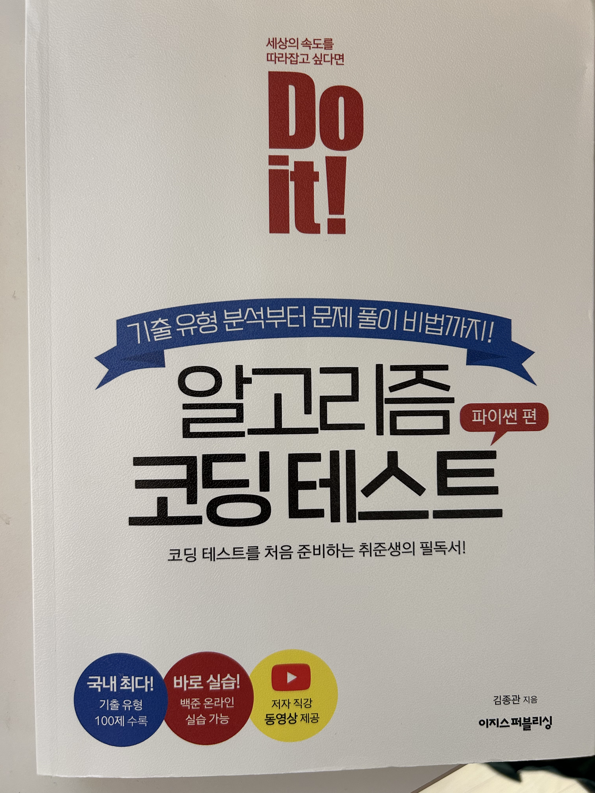

 

근데 정말 알고리즘은 나랑 스타일 안 맞는 것 같다. 정말 드물게도 내가 꾸역꾸역 하는 일 중 하나. 하지만 공부는 원래 고통스럽다는 명언을 스스로 남기며… 

3월부터 9월까지는 뭐 했냐고? 

모르겠다. 더위 먹고 있었던 것 같다 ^^! 🥵

## 2번의 제주도 여행 🍊

---

일&공부 코딱지만큼 하고 갑자기 노는 얘기~ 🤪 

올해는 제주도 여행을 2번이나 갔다. 두 번 다 해외여행 가려다가 돈 없고 시간 안 맞아서 제주도 간 거 맞다! 하하! 어쩔 건데 

3월에는 내 단짝 친구들 지우, 수정이와 다녀왔다. 그냥 화끈하게 실명 거론 해버리기~

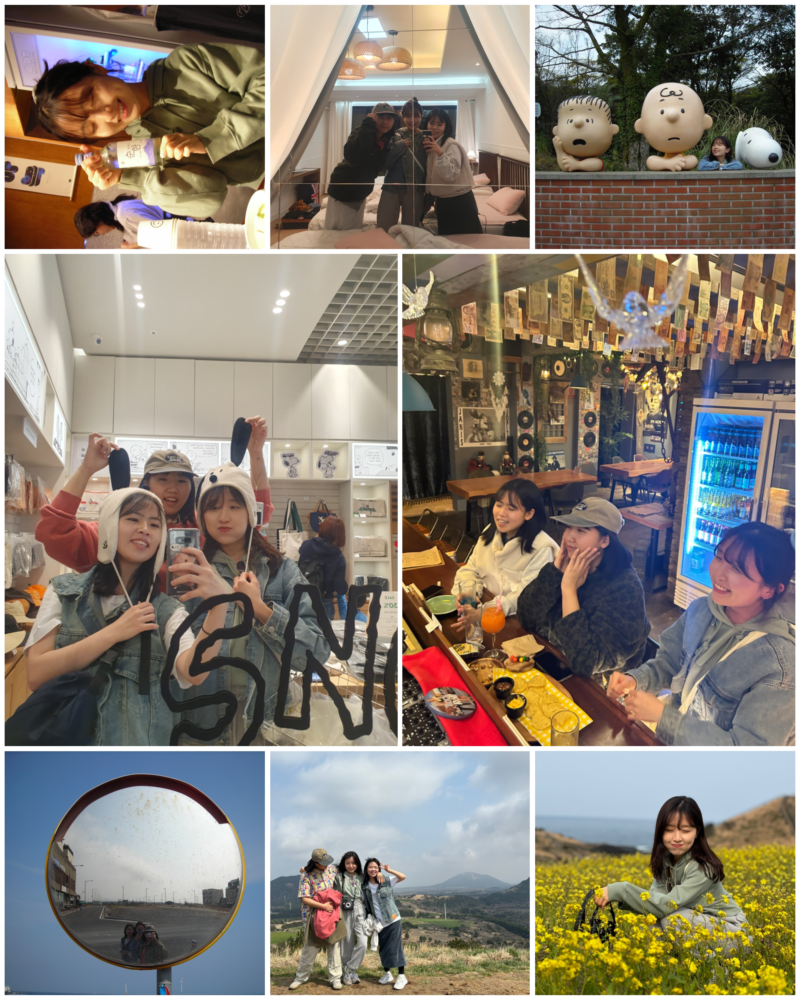
 

3일 간 친구들 데리고 운전하면서 칭찬 많이 들었다. 경차에 여자 셋이 낑겨 타면 아주 사이 돈독해지고 좋다. 난 열심히 운전하고 친구 둘이 번갈아가면서 주크박스 & 다음 코스 찾기 역할 착실히 수행해줬다. 덕분에 반(half)계획 여행이었지만 빠짐없이 맛있게 먹고 즐겁게 놀았던 여행

수정이 배꼽을 빠지게 만들었던 정신 나간 첫만남 챌린지까지 

  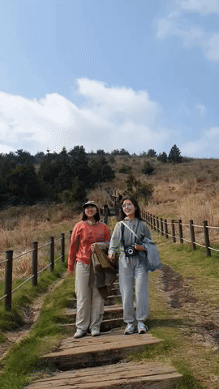

 

지금 봐도 세상에서 제일 웃기다 

8월에는, 정말 오랜만이었던 가족 여행으로 갔다. 

가족 여행으로는 처음 간 제주도! 

엄마아빠 끌고 여름 바다에도 풍덩 들어가고 ㅋㅋㅋ 모두 엄마 놀아주느라 웃겨 죽었다.

무릎까지 오는 수심에서도 잔뜩 겁 먹고 오두방정 떠는 울 엄마. 

엄마가 어디 또 개노잼 호텔 예약할까봐 내가 서둘러 예약한 MZ감성 예쁜 3층짜리 숙소에서 내내 엄마 소원대로 쏘주 맥주 마시며 으른 가족 답게 제대로 놀고 왔다. 

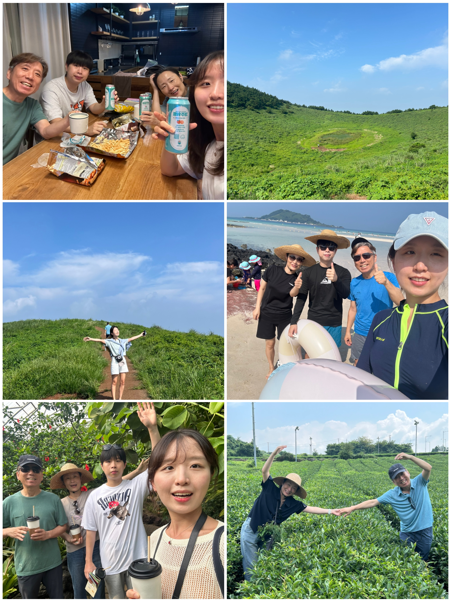
 

아 그리고 한림공원 동물원에 타조 진짜 개 웃기다 ㅠ 왜 올해의 웃음벨은 다 제주도가 가져가는지? 

  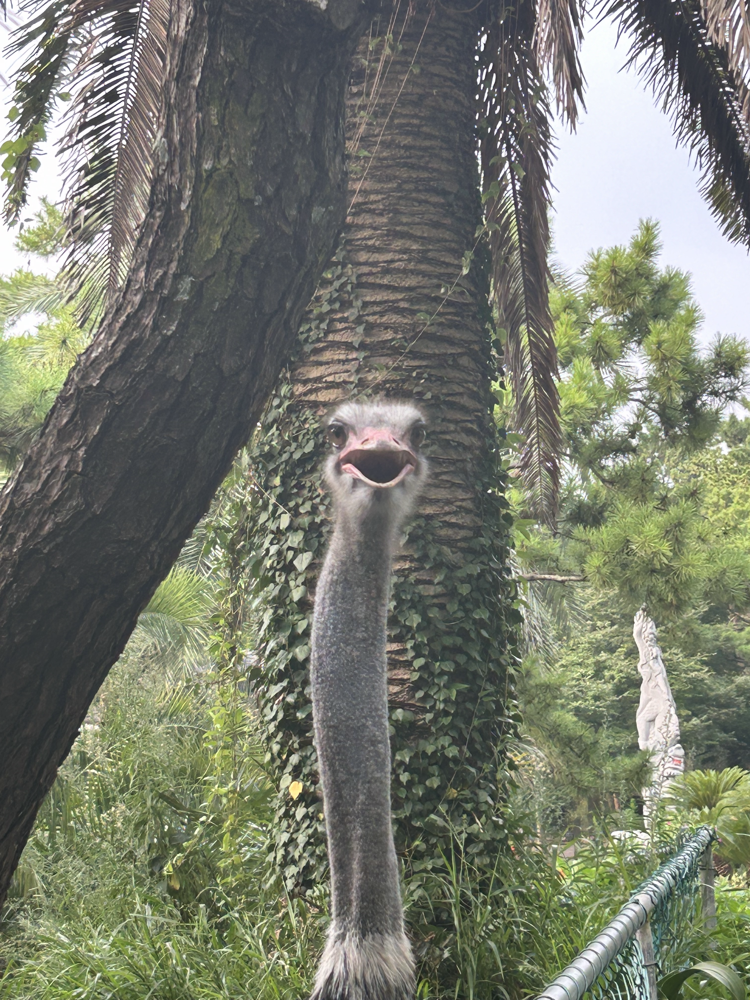

 

동생은 운전하고 난 맛집&액티비티 다 예약하고, 돈은 아빠가 다 내고 (ㅋㅋㅋ)

엄마 부럽다. 

## 우테코 6기 코드리뷰

---

2~6월에는 우테코 6기 코드리뷰어로 참가했다. 내가 3긴데, 벌써 6기라니 세월이 어쩌꾸 

목적은 오직 하나. ~~돈 벌기~~

결론은 오직 하나. 한 번쯤은 할 수 있다. (한 번만 할 수 있다.) 

조금 (많이) 스트레스도 받았지만 ^^ 알찬 경험이었다고 애써 말해본다. 이렇게 멘탈이 약하구나, 했던 친구부터 이렇게 아무 생각이 없구나, 싶은 친구까지… 

그렇지만 불과 3년 전까지 나도 이렇게 코드를 멋대로 ^^ 짜던 시절이 있었음을 반추하면서 마음을 다스렸다. 

때로는 최신식(?) 자바스크립트 문법을 많이 사용하는 크루들의 코드를 보면서 뒤처진 이 늙은 주니어 개발자가 배워갈 것들도 간간히 있었지만… 이유도 모르고 이것저것 가져다 쓰는 크루들에게 괜히 아는척 일침 놓기도 함. 

가끔은 개인 DM까지 보내며 고민 상담을 요청하는 크루들을 보면 내 옛날 모습을 보는 것 같아 짠하기도 했고, 나는 별 것도 안했는데 리뷰에 감동 받아서 메시지를 보내는 크루들에게는 오히려 내가 고맙기도 했다. 

그중에 내가 꽤나 자기 스타일이었는지(???) 날 당돌하게 꼬셔내 결국 커피챗(을 가장한 저녁 파티)까지 이끌어 낸 시끌벅적 신기했던 크루… 잊지 모대 

그리고 24시간 내 리뷰 원칙을 지키기 위해 팀 회식자리에서 코드리뷰 하던 나… 

  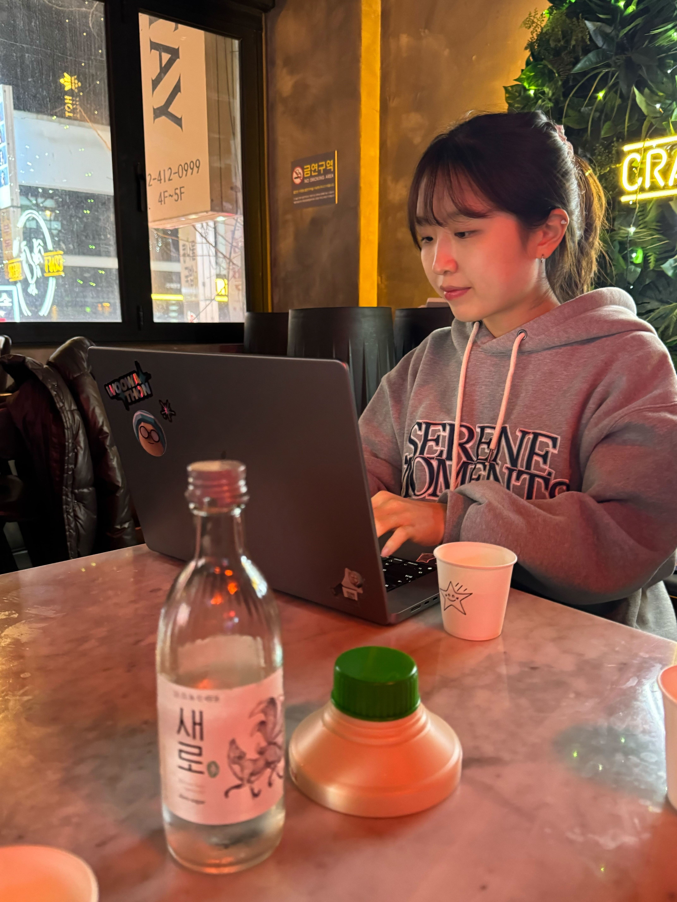

 

(술자리에서 노트북 하는 거 젤 싫어하는데 ㅠ) 

리뷰어만 24시간 원칙 하지 말고 리뷰어도 24시간 내에 코드 반영 하게 해달라고요 ㅠ 

(우린 본업도 있는 직장인인데! ㅠ0ㅠ) 

## N번의 밴드 은퇴 선언과 N번의 복귀

---

올해도 역시 참 많은 공연을 했고, 공연 끝마다 참 많은 은퇴 선언(ㅋㅋㅋ)을 했다. 습관성 은퇴쟁이 송지은. 

3월엔 IT연합에서 팀 **경쟁대응**으로 공연을 했다. 합주 후 감자탕집에서 아무렇게나 내뱉은 이름이 이렇게 큰 파장으로 이어질 줄이야… 요즘 잘 나가는 다른 유명한 밴드들도 이런 에피소드들이 있으려나? 

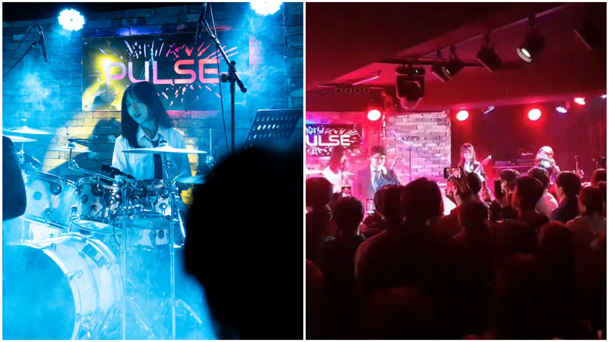
 

8월에는 팀 **ASDF**로 IT연합 공연 및 판교에서 게임 페스타(?) 무대의 야외 공연을 했다! 인생 가장 인상 깊었던 공연인데, 처음으로 여성 멤버로만 구성된 걸밴드로 공연 날 내돈내산 헤메도 받고, 의상도 맞춰입고, 스티커 등 각종 굿즈들까지 ㅋㅋㅋ 참으로 여러가지 했다. 모두 다 은근한 관종에 음악 추구미도 꾸미는 취향도 통일되어서 정말 통통 튀는 느낌으로 잘 준비했던 것 같다. 공연이 끝나고 레코딩도 했다. (근데 왜 아직까지 편집본 못 받은? ㅋㅋㅋ) 내년 공연을 벌써 기획중이라니 ^0^… 내년도 은퇴는 글렀음

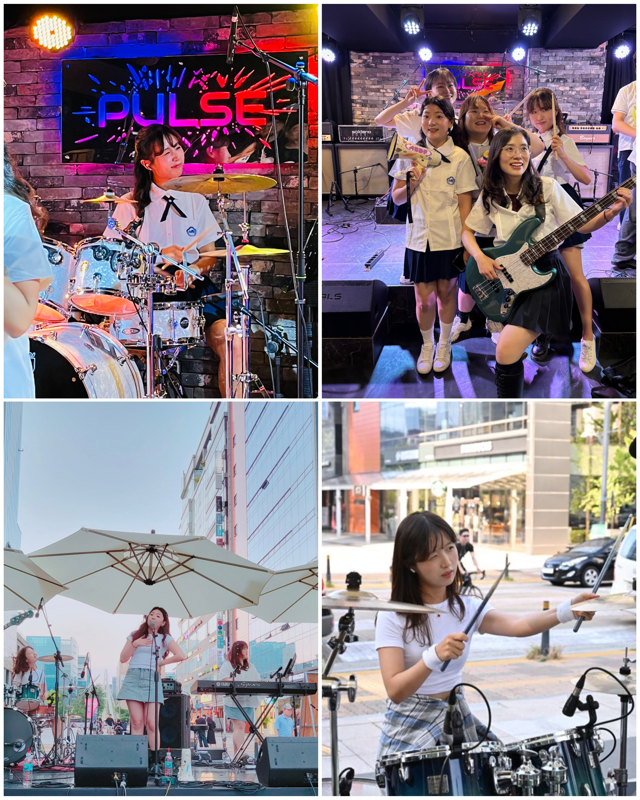
 

올해는 사내 밴드 활동은 중단했었는데, 한 팀의 드러머 자리가 비어 내가 자연스레 또 끼게 되었다. 올해는 특히 대장의 고생 끝에 8월 천안까지 MT도 다녀왔는데, 왜 천안까지 갔냐고? 펜션에 합주용 악기가 구비되어 있단다 🤦‍♀️ 절대 대중교통으로는 갈 수 없는 그곳. 한 번 마시면 끝까지 놀다와야 하는 곳… 죽을 뻔 해따. 

  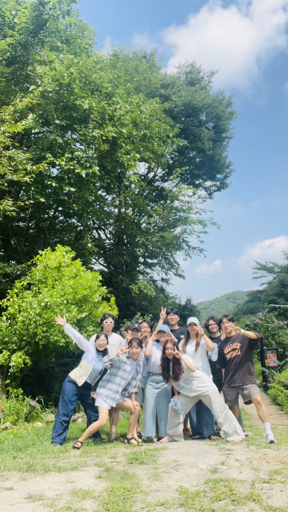

 

그렇게 MT 잘 다녀오고~ 공연 준비 잘 해서 12월에는 팀 **초과근무**로 밴드동동동 공연까지! 요번엔 노래도 한 소절 불렀는데 ^^ 쪽팔려서 또 은퇴선언 함 

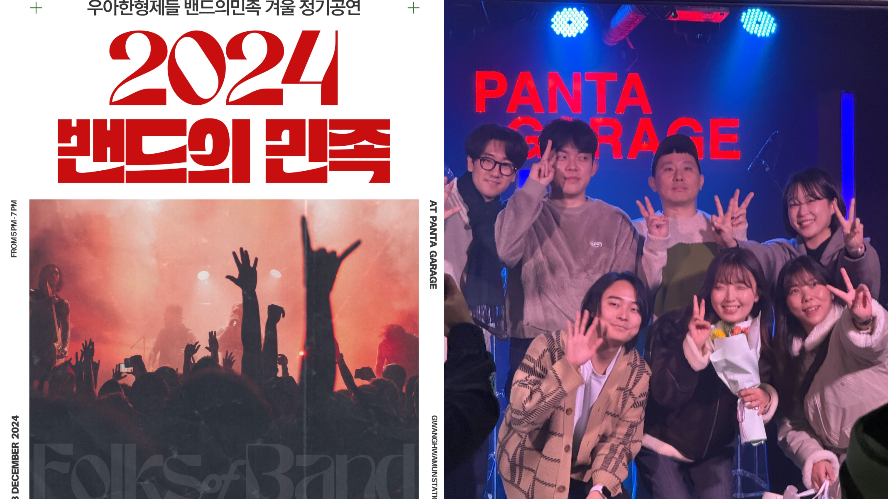
 

기존 멤버들이 몇 나가는 만큼 새로운 멤버들과도 친해지고, 회사 밖 IT연합 사람들과도 친분을 쌓고, 난생 처음 야외 무대까지 섭렵해버린 드러머 송! 

이제 이사 해서 드럼 학원 새로 찾아야 하는데, 이제 그녀의 미래는…? 

## 2후 3초들의 모임

---

만나면 맨날 결혼 얘기만 하게 된 모임이 생겼다. 동반 결혼 준비 모임이라고 해도 과언이 아닌.

한 해에 연달아 결혼을 앞둔 사람덜끼리 올 한 해도 여기저기 쏘다녔다. 

3월엔 가평으로 글램핑을 다녀왔다. 이전에 회 못 먹어서 아쉽다며 가평까지 회 싸온 사람들 ㅋㅋㅋ 난 글램핑은 처음이었는데, 따뜻한 침대가 있는 숙소와 바베큐 그릴 및 식기류, 나름 깨끗하고 편리한 샤워시설까지 잘 갖춰진 곳이라 재밌게 놀고 왔다. 고기도 꿔먹고, 회도 먹고, 마시멜로와 고구마까지 ㅎㅎ 새벽까지 텐트에서 술 마시다 다음날 눈 팅팅 부어 아무 말 없이 라면 끓여 먹는 것도 국룰 

다음날 갔다온 가평 아침고요 동물원도 짱 좋았다. 공작 날개 펴는거 다들 처음 봐서 개 신남 

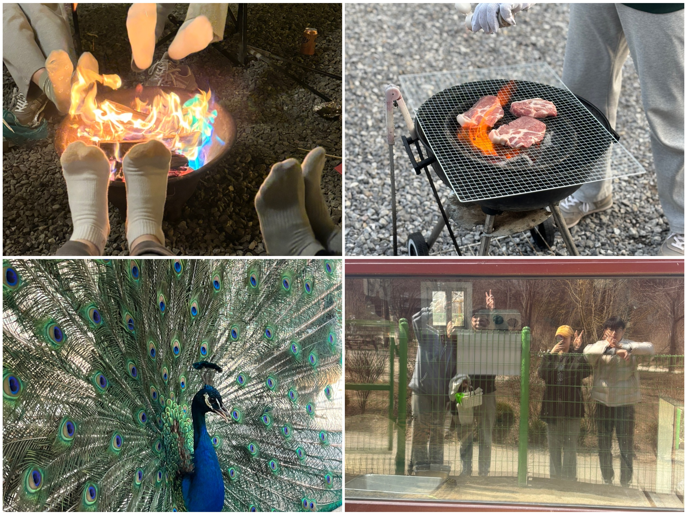
 

4월엔 같이 마라톤 뛰고 왔다. 웃긴 건 같이 신청한 지도 몰랐음. 우리는 러닝화에 각종 장비에 대회 두세 달 전부터 준비했는데, 준비도 없이 어글리슈즈 신고 온 진짜 인자강 그녀… 산책왔냐며? 

  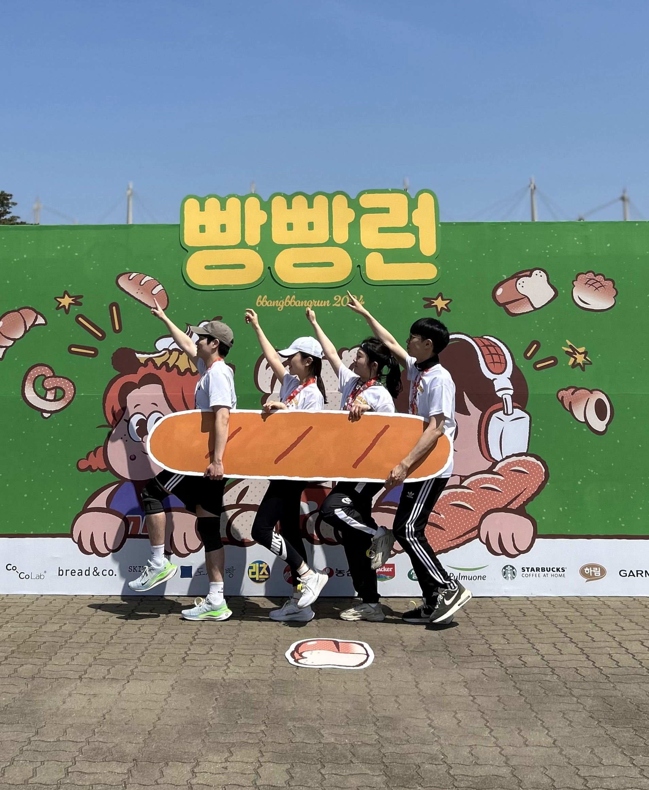

 

9월엔 구리 임장을 다녀 왔다. 9월인데 미친 코리아 기상이변으로 더워 쪄죽을 뻔 함. 그래도 넷이 함께라 더 정보가 쏙쏙 알찬 임장. 구리 아파트 단지에서 열띤 논의 중인 세 사람 도촬한 사진 

  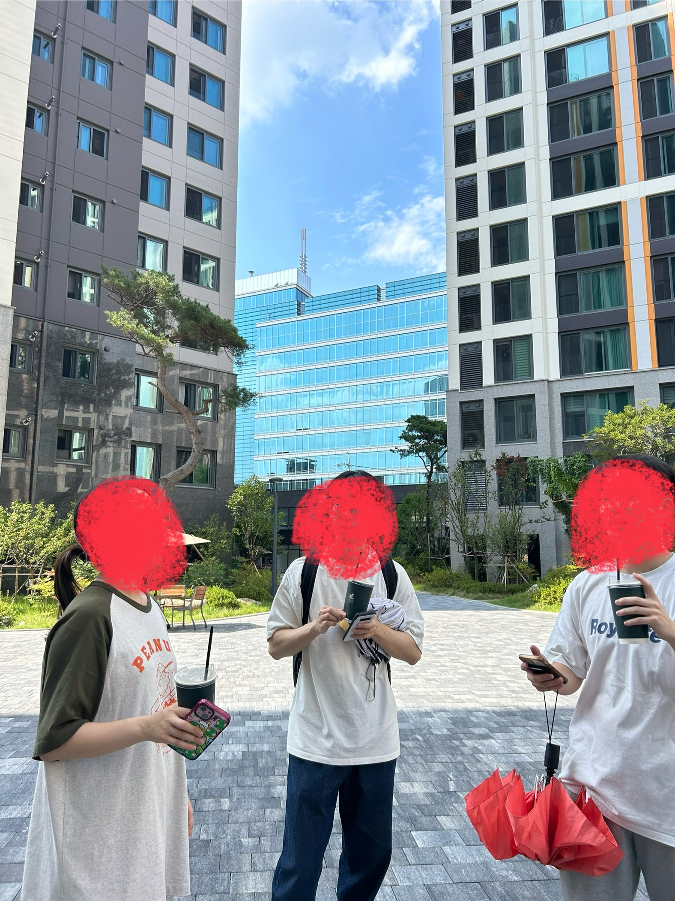

 

마지막으로 11월엔 방어 모임도! 다들 술도 안 먹고 두툼한 방어만 줍줍 참으로 건강한 모임.

이밖에도 자잘한 그냥 모임들까지. 봄 여름 가을 겨울 아주 알차게 즐겨버렸다. 인생의 가장 큰 이벤트를 같이 준비하고 이 양아치 같은 웨딩 업계를 같이 신랄하게 비판할 친구들이 생겨서 좋다.

근데 요즘은 매 환율 얘기 정치 얘기만 하는 중 

## 수영은 너무너무 재밌어 🏊‍♀️

---

올해 5월~10월까지 반 년 간 수영을 했다. 다른 센터도 마찬가지겠지만 관악구민체육센터 수영 수강신청 경쟁률 실화? 사실 그전에 한 번 수강신청 실패하고 이번에 새벽 5시반에 나가서 신청했다. 자기들끼리 말도 안 되는 카르텔 형성한 할머니들 내가 다 고발하고 겨우 줍줍한 중급반.

근데 초급반으로 배정됐다 ^0^ 

나 그래도 초딩 때 수영 5년 턴까지 배웠는데… 그 이후 15년이 지나버린 몸뚱아리… 바로 초급반으로 좌천됨. 

그래도 강사님의 호된 티칭으로 열심히 어푸어푸해서 중간엔 중급반으로 올라갔다. 

아침 7시 수영은 끝까지 진짜 적응 못 했다. 아침에 눈 뜨면서부터 후회하고, 물에 들어가는 순간까지 너무 졸려 미치긴 한다. 근데 이제 살기 위해 헤엄쳐야 한다! 생각이 많은 내가 처음으로 아무 생각 안하고 할 수 있는 운동. 그래도 다음부터는 7시 수영 안 해야지. 

그래도 상쾌하게 수영하고 나오면 보이는 봄-여름날의 푸릇푸릇한 낙성대공원의 아침이 예뻐 매일 사진 찍어놨다. (오운완 같은 거 아니다.) 

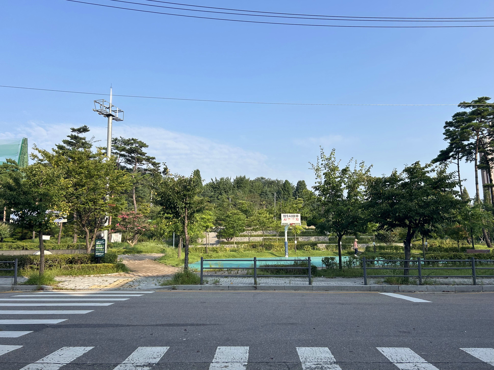
 

고작 6개월 했지만 모든 수영인이 그렇듯 배 고파서 더 많이 먹고 살은 안 빠지고 근육만 늘었다 ^0^ 

그렇게 어느새 수영 덕후가 되어 친구에게 생일선물로 이쁜 수영복도 받고 🫶 

  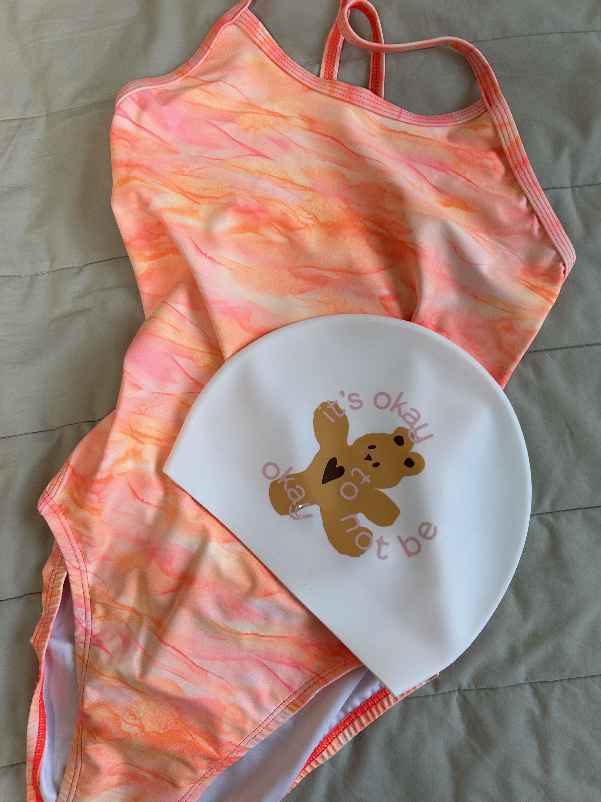

 

이사 온 동네에도 곧 수영장이 개관한다는데, 빨리 가서 수강신청 또 해야지. 따흑 수영은 수강신청이 젤 빡쎄 

## 내가 마라톤을? 🏃‍♀️

---

올해 목표중 하나! 마라톤 나가기. 사실 5km 나가려 했는데 연습하다 보니 왠지 쪽팔려서 10km 신청해놓고 마지막까지 좀 후회함. 난 무릎도 발목도 안 좋고, 달리기도 정말 못한다! 

그치만 런닝화 + 발목 지지 양말 + 무릎 보호대까지 완비하고 3개월 간 정말 매주 3번씩 빠짐없이 달렸다. 제주도 여행 가는 날 아침에도 달리고 갔다. 징한 나 칭찬해 ^^ 

그리고 대회 전 날, 잘못 마신 커피로 잠을 단 한 숨도 자지 못하고 이건 포기각이다… 내 지난 모든 노력들이 주마등처럼 스쳐 ~~지나가진 않음~~ 아무튼 그냥 되는 대로 해보자. 대회 장소까지 꾸역꾸역 가서 일단 뛰어 보았다. 

사람들이 물소떼처럼 함께 달리는 사이에 모래먼지 잔뜩 마셔주긴 했지만 또 어떻게든 뛸 용기가 나더라. 곳곳에 마라톤 고인물들이 요상한 복장들 하고 와서 나 같은 뉴비들 응원해주고 넘어진 뉴비들 케어해주고 정말 감동적인(!) 풍경이었다. 

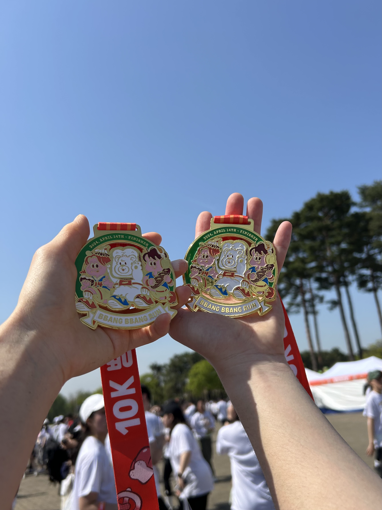
 

강아지 데리고 뛰는 사람, 친구들과 함께 뛰는 사람, 유모차를 끌고 나선 강한 어머니까지 ㄷㄷ 꼴랑 내 몸 하나 끌고 온 내가 뛰지 않을 수 없었다. 게다가 짝꿍도 날 버리고 앞서 뜀. 목표 달성을 위한 개인주의 칭찬해 

아무튼 결과는 10km 1시간 20분으로 골인, 완주한 것만으로도 만족해!

 

풀코스 마라톤 10번 뛴 초고인물 우리 아빠한테 칭찬 받았다. 

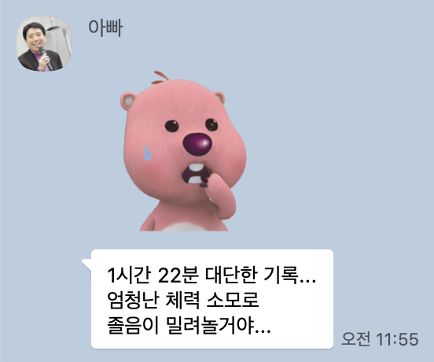
 

짧은 회고: 런닝은 아무튼 반은 나와 맞고 반은 나와 맞지 않다. 

무릎, 발목이 안 좋아 각종 장비들 착용하고 달리긴 하지만 지쳐 쓰러질 것 같은 순간에도 어떻게든, 내 페이스를 유지하면서 끝까지 해내는 게 좀 간지나긴 한다. 

런닝 연습할 때 늘 함께였던 런데이 앱에서 하는 멘트 중 하나. 

“바람을 가르며 달려보세요!” 

좀 씹더쿠 같긴 한데, 이 멘트가 가장 내게 힘을 줬다고 한다 ^^ 💨

근데 앞으로 수영 할 거다. 

## 나, 락타쿠였네… 🎸 

---

콘서트&페스티벌도 참 많이 다녔던 올해. 

밴드를 오래 하긴 했지만, 이렇게 페스티벌을 다니며 롹커들의 소울🤘을 즐기는 자는 아니었는데

밴드 사람들한테 물든 건지, 오타쿠 짝꿍한테 물든 건지, 나도 슬 오타쿠가 되어가고 있다. 아니 그런 오타쿠는 아니고, 일종의 락타쿠? 

5월에는 뷰티풀민트라이프에 다녀왔다. 사실 또 티켓팅 놓쳤는데 어떻게 며칠 전에 취소표 구함 ㄷㄷ 

유다빈밴드, 터치드를 목표로 갔었고 역시 끝내줬다 ㅠ 

유밴은 노랑노랑 넘 귀엽구 신나구, 터치드는 걍 미쳤어… 터치드 단콘 예매할 뻔 함. 솔직히 중간에 진짜 눈물 흘렸다. 우리나라에도 이런 락이 이제 되는구나. 같이 간 짝꿍도 터치드에 입문시킨 페스티벌이었다.

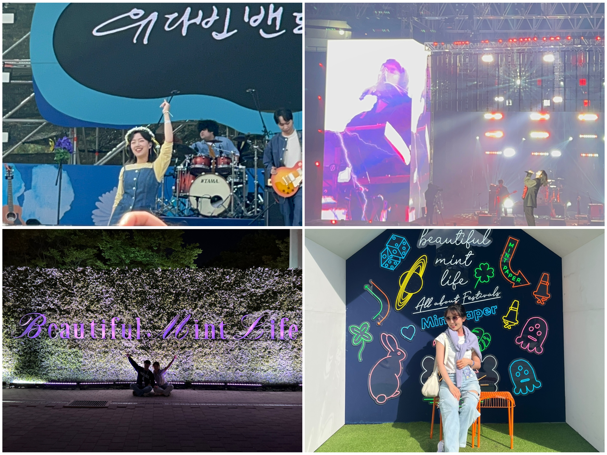
 

9월에는 아이유 상암 앵콜콘서트 다녀왔다. 짝꿍을 위해 5월부터 팬클럽 둘 다 가입하고 두 개 아이디로 각각 콘서트 맨 앞자리 연석으로 티켓팅 성공한 나 진짜 올해 최대 업적 제발 널리 퍼뜨려지길 

하지만 엄청난 규모의 상암답게 면봉 같았던 아이유… 왠지 슬펐다 ^^ 그래도 짝꿍 소원 들어줬으니 만족. 그리고 “비온다” 명언과 함께 Bye My Summer라는, 아직도 미발매된 곡을 라이브로 듣고 온 건 넘 잘한 일이쟈나

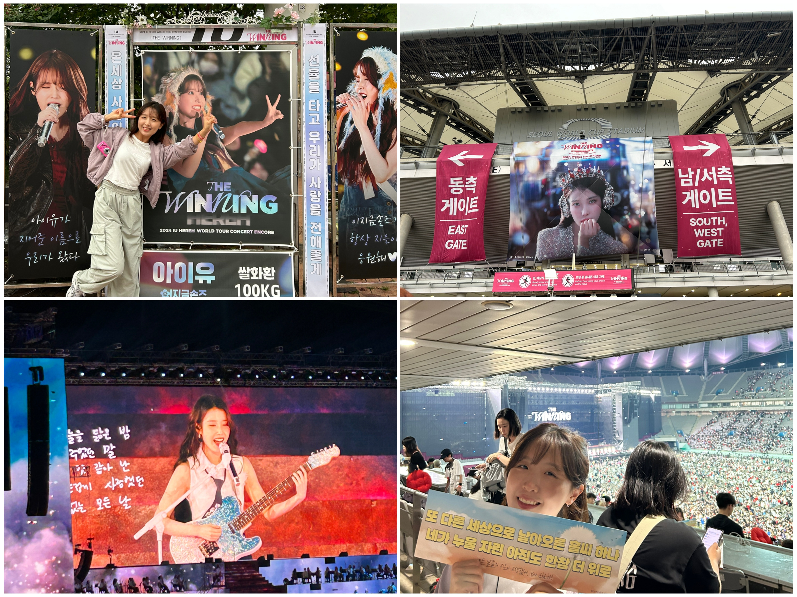
 

10월에는, 부산 락페스티벌에 다녀왔다. 락페를 보러 부산까지 가는 (락에)미친 여자가 된 거야… 우리 밴드 부원이 스파이에어 알려주지만 않았어도… 짝꿍의 남바완 스파이에어와 내 남바완 터치드가 같은 날에 오지만 않았어도… 

부산 내려 가는 길 짝꿍과 셀프 스파이에어 특훈 받으며 마음 속으로 열심히 외친 헤이! 헤이! 사무라이 핫! 

터치드도, 스파이에어도 기다려서 스탠딩에서 가까이 봤다 ㅎㅎㅎ 날씨도 시원하니 끝내줬고 이케 아닌 요스케도 또라이 MZ처럼 무대를 휘저어놔서 정말 귀엽고 뛸 맛 났다. 

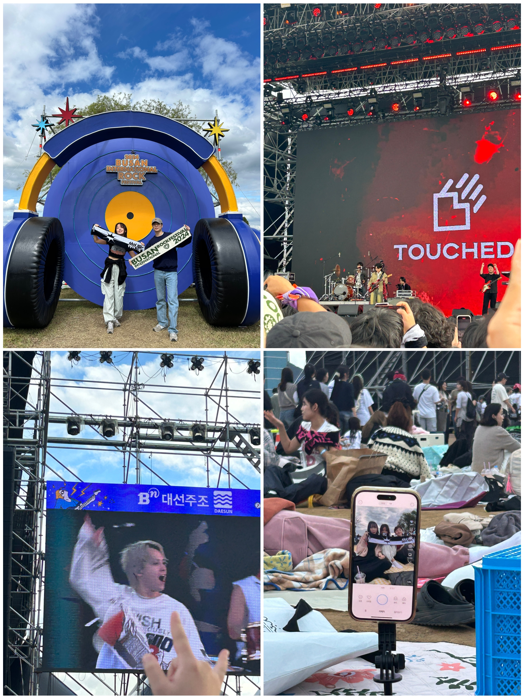
 

아니 근데 이 넓은 페스티벌장에서 밴드 사람들 만난 거 실화? ㅋㅋㅋ 넘 반가워서 같이 사진 찍구… 역시 오타쿠들은 한데 모인다 

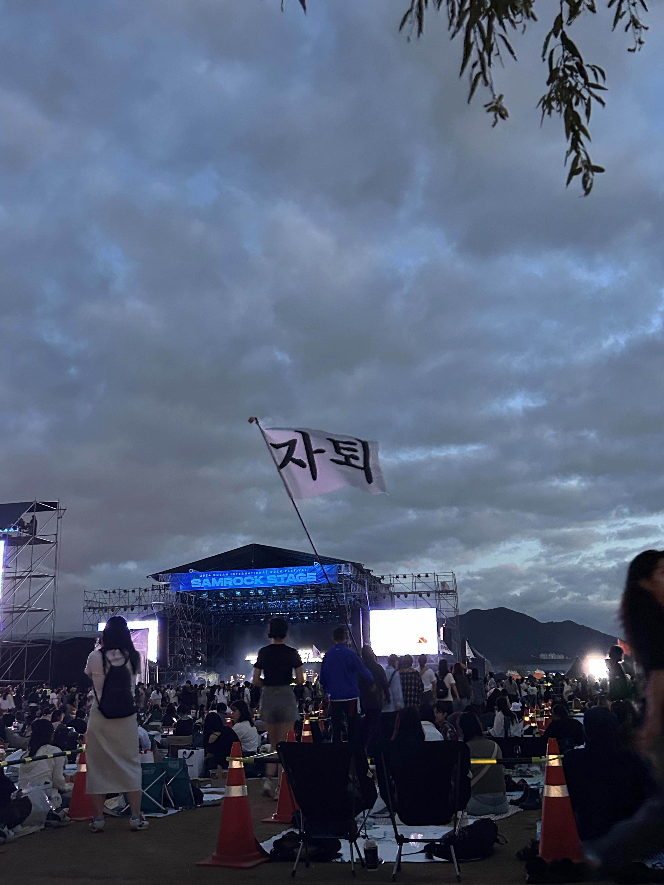
 

응 자퇴 축하드리고요… (근데 이 깃발 윤석열 탄핵 집회 영상에서도 본 것 같은 느낌) 

그리고 부산 삼락스테이지 정말 잘 해놨다. 역시 망할 서울만 코딱지만한 땅이라 그런가 ㅠ MD줄도 1시간 기다렸지만 시스템이 잘 갖춰져 있어 원하던 굿즈 구매 성공했고, 혼란할 수밖에 없는 페스티벌장 어디든 질서정연하게 정돈도 잘 되었던 것 같다. 그리고 젤 감동한 화장실… 당연 컨테이너 화장실이지만 시설이 괜찮았고, 여자 화장실은 늘 부족해서 맥주 마시면 다리 동동 굴리기 마련인데 화장실 엄청 많아서 완죠니 쾌적했다. 부산 칭찬해~ 다음에 또 만나~ (엥?) 

그리고 12월, 데이식스 고척돔 콘서트 가고 싶었는데 ㅠ0ㅠ 😭🥺😭🥺😭🥺

팬클럽 가입 왜 안해놨는데. 오열하는중 오열하는중 

내년에 갈거야 

## 외국어 마스터 중 

---

위에서 말했듯, 10덕후가 된 지그송… 영어/프랑스어에 이어 갑자기 동양 언어를 배워봄. 당연히 일본어

작년 연말부터 아이묭을 시작으로 찔끔찔끔 공부하여 결국 7월에 JLPT를 따고 말았다. N5지만 ㅋㅋㅋ 

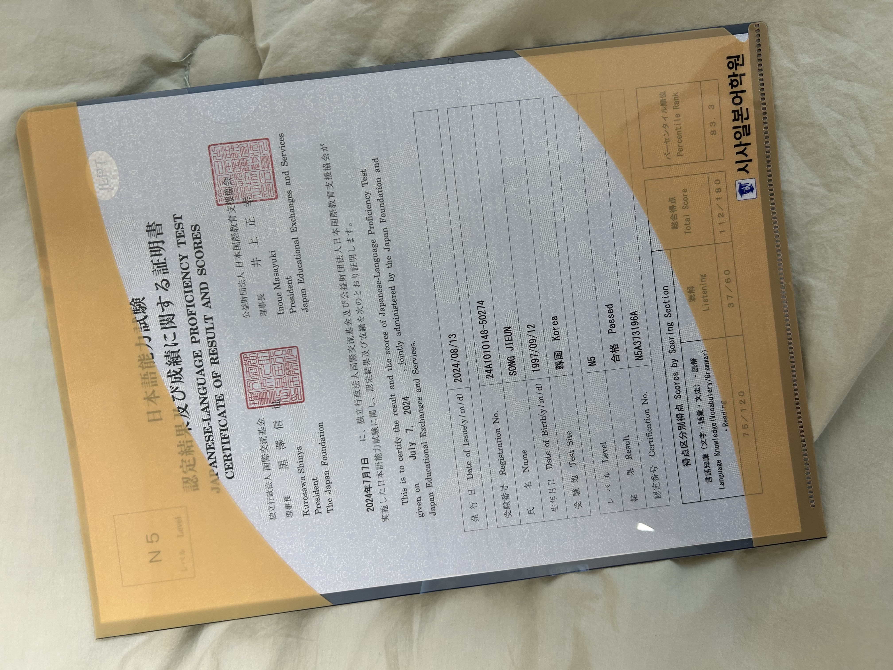
 

(시사일본어학원 안 다녔다. JLPT 합격 증서를 저기다 담아서 보내줌) 

그리고 시험 보고 나서 다 까먹었다. ^^ 이자카야 가서 지무-비무-하이보루- 정도 읽을 줄 안다. 

그렇다고 영어/프랑스어 공부를 놓진 않았어… 사실 올해 목표 중 ‘연말에 OPIC 다시보기’도 있었는데 연말에 진짜 죽을 것 같아서 바로 포기했다 ^.^ 

그래도 2024년 12월 30일 기준, 358일 연속 달성! 올해 1월 첫 주는 무료체험으로 했더니 일주일 치 기록은 날라갔다 ㅠ 근데 어쩔 아마 스픽 이용자 중에서 내가 연속 달성일 제일 길 듯. 경품 저 주세요.

  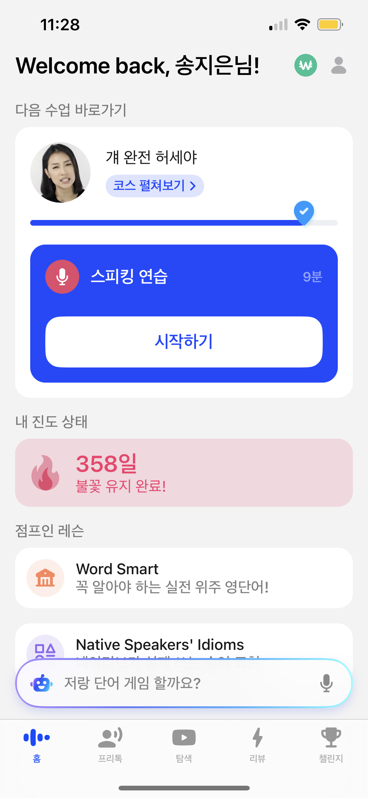

 

아무튼 스픽 정말 쓸만하다! 특히 AI 프리토킹 수정해주는거 쫌 많이 신기하고, 아무 말이나 내뱉어도 받아주고 교정해주니까 영어에 자신감이 생기는 것 같다. 다만 완전 영어 초보가 하기는 살짝 무리일 수도? 한국식 영어 교육이랑은 느낌이 많이 다르다. 

프랑스어는 듀오링고로 계속 학습했다. 무료로 해서 그른가 진도가 좀 느린 것 같긴 하다. 그래도 얘도 매일 스픽이랑 같이 붙여서 해서 하루도 빠짐없이 진행했다. 나… 다음 달에 프랑스 가는데 불어 쓸 수 있을까? ㅎ (당연히 안됨) 

  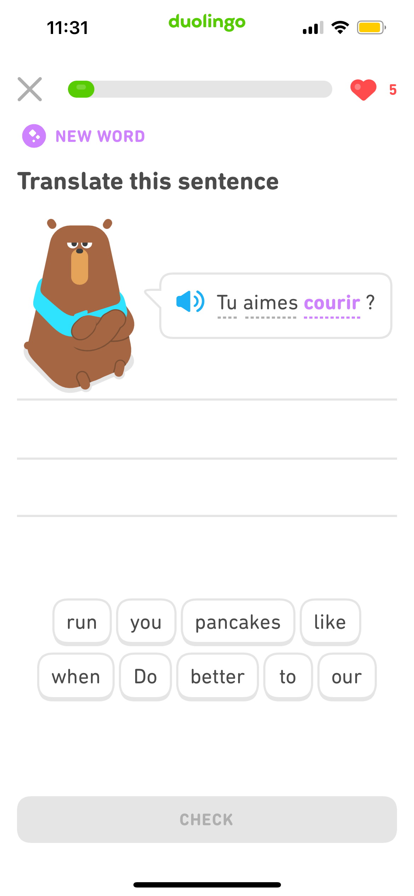

 

## 인사이드그램

---

올해는 개발자가 되고 처음으로 사이드 프로젝트도 시작했다.

그 첫 번째 완성물은 <인사이드그램>!  

6월, <프롬프트 참 잘하는집> 스터디에서 만난 팀원들과 만들었다. 

자세한 내용은 지난번에 써뒀다.

👉 https://zigsong.github.io/retrospective/insidegram-retrospective/

회고가 생각보다 길어져 귀찮아서 링크 첨부하는 것 맞다! 

## Let’s JAM! 🎶

---

그리고 두 번째 사이드 프로젝트 Let’s JAM!, 아직 진행중 

사실 시작은 인사이드그램보다 먼저 했다. 

5월부터 시작한 Flutter 사이드 프로젝트로, 밴드에서 출발해서 밴드로 끝나는 프로젝트.

회사 일에 질린 (~~정말이지 우리 팀원들이 안 봤으면 좋겠다. 봐도 모른척 부탁드립니다…~~) 내가 내 개발 하고 싶어서 무고한 디자이너, pm을 유혹했다. 그리고 셋 다 같은 밴드 출신이다 ^^!

밴드/멤버 구인구직, 공연/합주실 홍보 등 밴드 고인물들에게 필요해 보이는, 그니까 우리한테 필요한 기능을 기본으로 시작하여 쪼물쪼물 만들어 가고 있다. 원래 모든 최고의 창업 아이템은 지가 필요해서 만드는 거라며? 

많은 사이드 프로젝트들이 이런 목표 하나 달랑 가지고서 유지되기가 힘든데, JAM은 벌써 시작한지 7개월, 이제 나름 구색도 갖춰지고 있다. 사이드 프로젝트가 이렇게 잘 유지되는 비결은 아마 PM, 개발자, 디자이너가 각자의 꿈을 펼치며 이 프로젝트로 자기 포트폴리오를 만들고 있기 때문인 것 같다. 개인의 욕망 + 함께의 욕망이 합쳐지면 못할 것이 읎다… 

그리고 나, 의견 내는 거 좋아하는 사람이었다! 개발자로 처음 취업하고 나서는 요구사항 그냥 정리해서 내려주고 시키는 일 개발만 하는 게 내 적성인 줄 알았는데, 나도 의견이 이렇게 많은 사람인지 첨 알았다. 제시하는 아이디어나 우려되는 사항들을 보면 나도 모르게 내 지난 경험들에 비추어 말하게 되고, 근거를 갖추어 말하게 된다. 

또 아무도 시키는 사람 없이 우리 셋이 좌충우돌 의견 부딪쳐가면서 만드는 과정에서 디자이너는 이런 관점에서 생각할 수밖에 없구나, PM은 이런 것도 해야 하는구나, 정말로 많이 배워 간다. 개발 그 자체가 아닌, 앱을 만드는 데 꼭 필요한 세 직군의 이야기들을 날것으로 들으며 혼자 또 다 같이 매 미팅마다 성장해 가는 중! 

내년 상반기 출시 목표 coming soon… 

우리의 치열한 흔적들! 

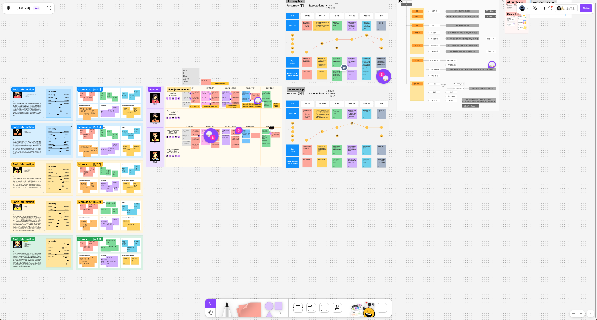
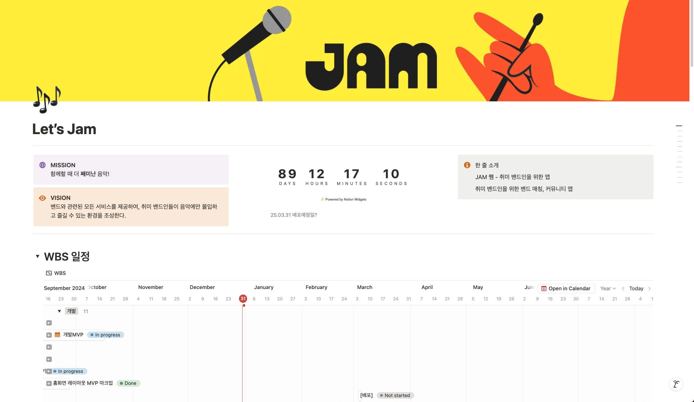
 

## 짝꿍과의 추억들

---

2024년 역시 평범했던 순간들, 다이나믹했던 순간들 언제나 곁에 있어줬던 짝꿍과의 추억들 

2월에는 짝꿍의 졸업식이 있었다. 나, 대학생이랑 사귀고 있었던 거야… 

사진 관심 없던 짝꿍 데리고 교정 여기저기 다니며 이쁜 사진 많이 남겨줬다 📷

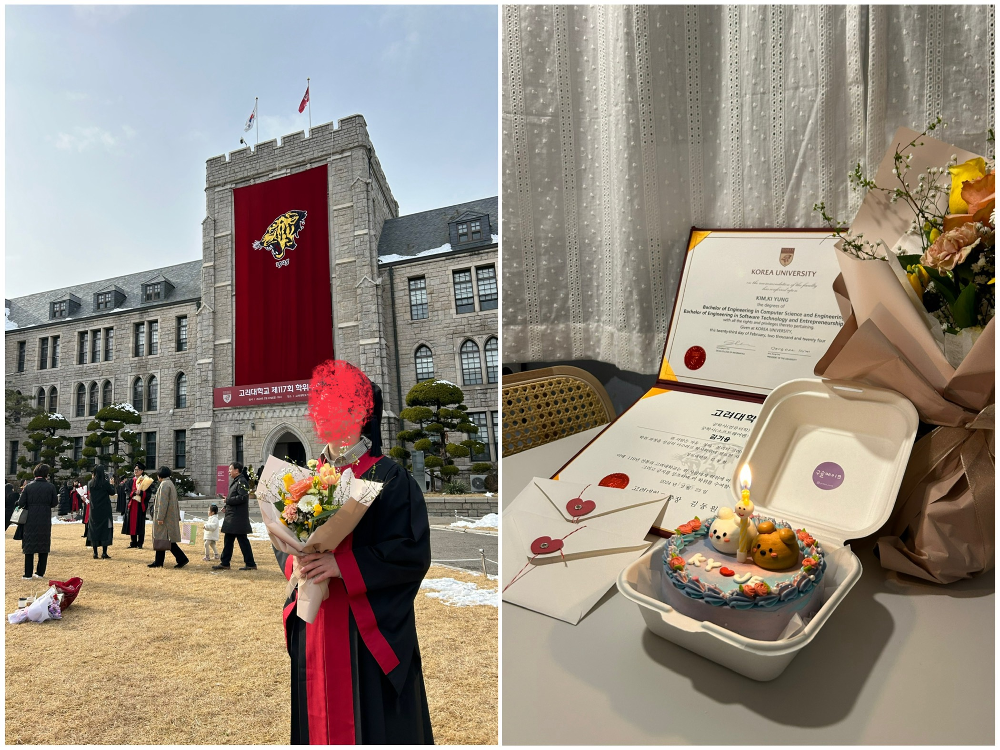
 

졸업 사진 찍던 날이 마침 짝꿍과 천 일이라 여러가지 기념 첨으로 같이 오마카세도 먹어주구 

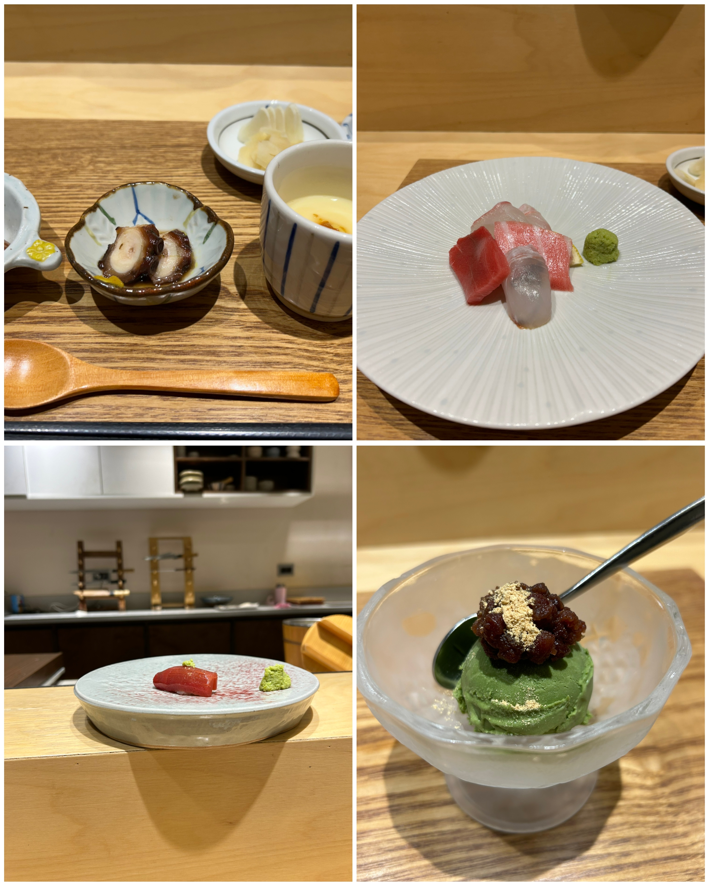
 

6월에는 발리 여행을 떠났다. 🏄‍♀️

회사 사람들이 자주 가길래 역시 동남아라 싼가 했지만 완전 럭셔리 휴양지인 발리는 결코 싸지 않았고 ^^

탕진하고 온 소비금액과 별도로 둘이 매일같이 무자게 싸우고 와서 가슴 시린 여행이 되어버림

그래도 같이 즐길 거 다 즐기고 마지막엔 화해했으니 다행이다. 

다음엔 안 싸우고 예쁘게 또 다녀오는 걸로~ (돈 많이 벌어둬야겠다.) 

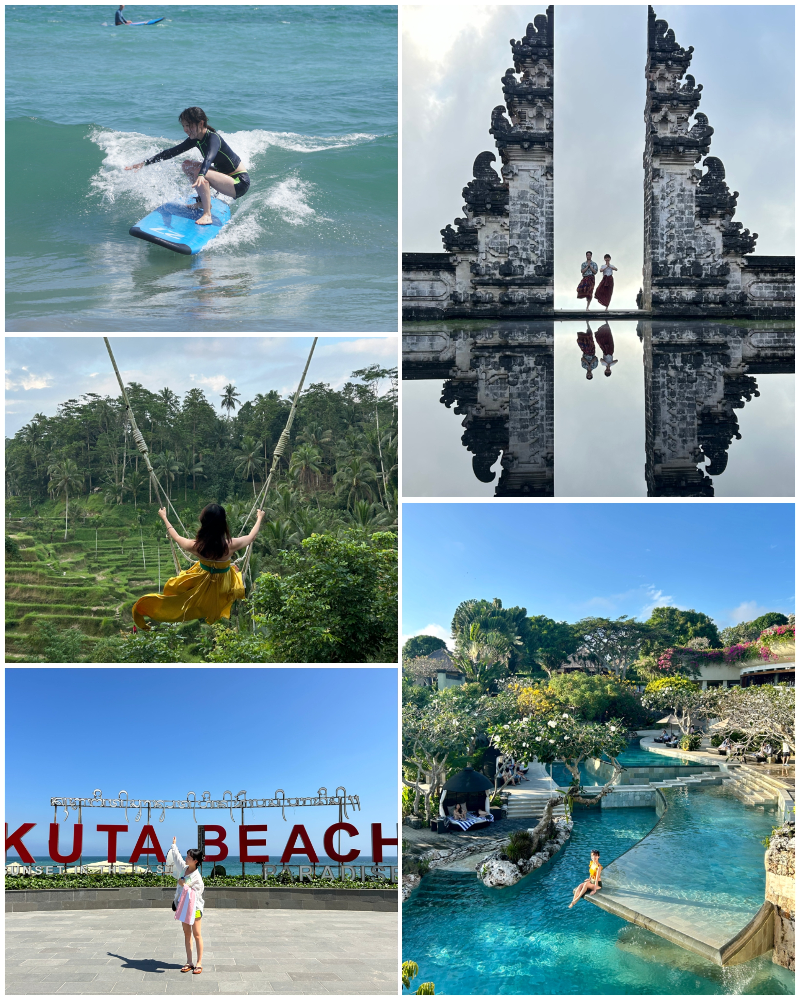
 

8월엔 퍼컬 진단을 받았다. ㅋㅋㅋ 놀랍게도 내가 끌고 간 거 아니고 짝꿍이 원해서 간 거다. 근데 아이유 콘서트고 퍼컬이고 짝꿍이 하고 싶은 거 내가 다 찾아서 해준다. 엥? 

짝꿍은 내가 예측한 대로 겨울쿨톤이었고, 나도 내가 예측한 대로 가을웜톤이었다. 구체적으로는 가을 웜 뮤트.

나 보는 눈이 있나보다. 퍼컬 선생님의 퍼컬도 맞췄다. 그 이후로 주변 사람들 퍼컬 다 예측하고 다닌다. 

다행히 가을뮤트도 내 추구미와 맞아서 그 후에 염색도 하고 올영에서 가을뮤트템만 찾아다니고… 옷과 신발부터 시작해서 키보드까지 가을뮤트 아이템만 보면 환장하게 됐다. 이게 뭐하는? 

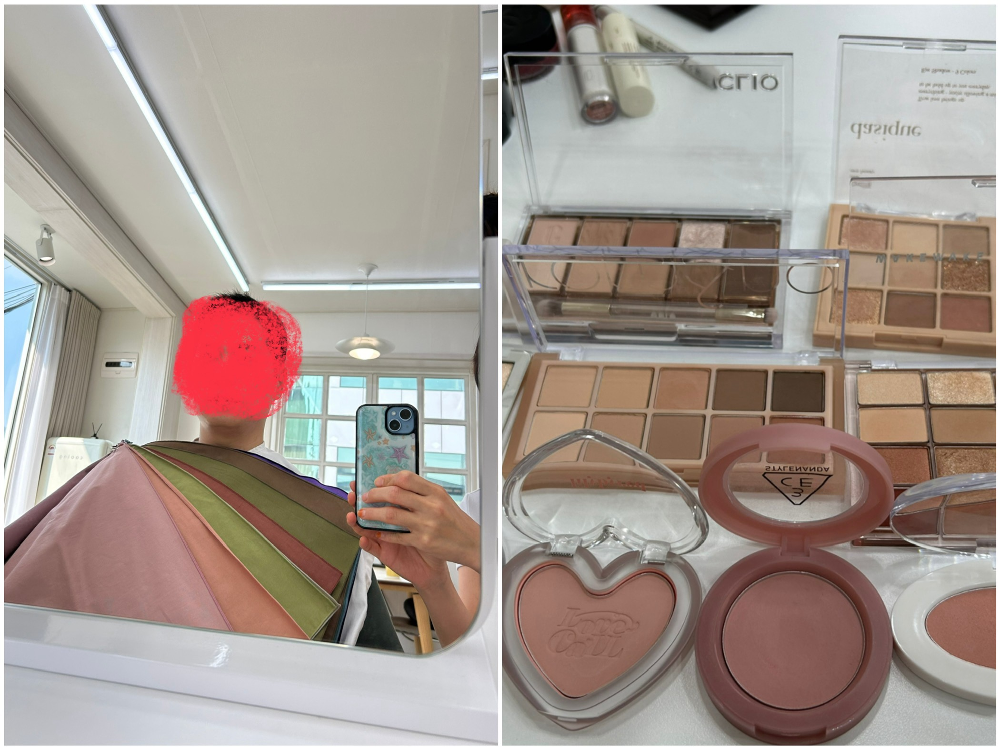
 

10월에는, 가볍게 부산 여행!

락페 가려고 앞뒤로 껴서 떠난 여행. 부산은 정말 오랜만이었다. 

둘이 무슨 먹부림 대결하듯이 소화제까지 먹으면서 ㅋㅋㅋ 하루에 다섯 끼씩 먹고온 식도락 여행 😋

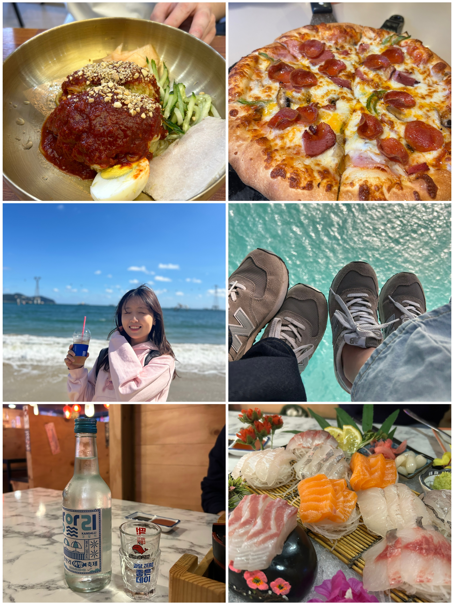
 

위에서 언급한 2번의 락페와 1번의 콘서트도 모두 짝꿍과 다녀왔네.

올 한 해도 나랑 놀아주느라 고생 많았다! ~~내년엔 더 고생해라!~~ 

## 1년 만의 이사, 1년 간의 자취생활 종결

---

작년 11월에 처음으로 본가를 나와 자취를 시작했었는데, 각종 문제들과 개인적인 사정들로 1년 만에 낙성대 자취생활을 종결하고, 위례로 이사를 왔다! 하 이사 두 번 다신 못해. 

이제 경기도민이라니… (이라고 말하면 그게 무슨 경기도냐고 욕 먹는 중) 

물리적으로, 심리적으로 꽤나 멀어졌지만 위례 한 달 차, 이 동네가 아직까진 아주 마음에 든다! 성남시의 각종 혜택(?)들도 맘에 들고. 

2N년 서울 뺀질이 지긋지긋하게 사람 많고 시끄러운 도시를 떠나 조금 더 깔끔하고 조용한 동네로 와서 심신이 편안한다. 

그리고 집이 깨끗하고 넓어져서 좋아 ㅎㅎ 거실이 생기다니! 

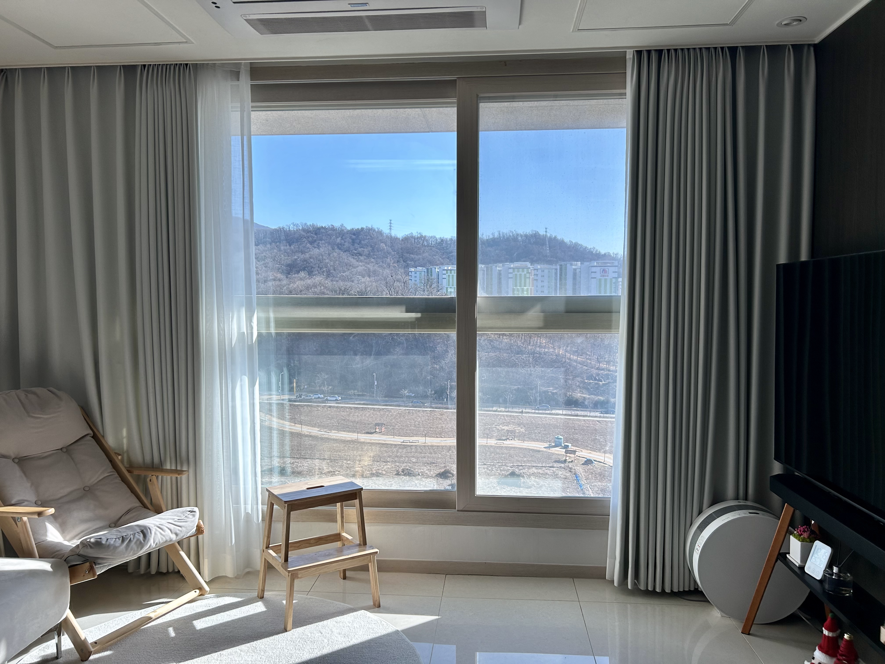
 

볕 잘 드는 새 집. 북향 집 벌레 나오고 춥고 쫌 서러웠어 🥲

## 그리고, 인생 가장 큰 결심(?)

---

분명 인생에서 가장 큰 결심인 것 맞지만, 생각보다 그렇게 결심이 어렵진 않았다. 

수 개월 간 함께 임장을 다니고, 6군데나 웨딩홀 투어를 다니고, 식장을 예약하고, 사진 촬영일도 잡았다. 이제 다이어트 하라고. 응? 

 

비싼데 이쁘긴 혀~ gif로 뽑으니까 색감 다 죽어서 슬프다. 근데 다시 만들긴 귀찮음. 

양가 부모님도 만나뵙고, 작은 상견례(?)까지 호다닥 해버렸네

이사를 온 이곳 위례 투룸은 신혼집이 될 거고, 같이 살게 된 내 짝꿍은 이제 영원히 함께 할 사람이 될 테고. 

나는 이전보다 더욱 성숙해진 사람이 되어야 할 테고, 그런 모든 책임들이 살짝은 무겁기도 하지만 함께라서 더 잘 해낼 수 있는 서로의 짝꿍이 되길!

## 아직 말하지 못하는 이야기

---

추석이 지난 즈음부터 준비하던 것이 있었고, 내년 상반기가 되어야 공개할 수 있을 것 같다.

~~그럴 거면 쓰질 말던가!~~

아잉 비밀로 해줘

  

 

이사, 결혼과 더불어 인생에 큰 터닝포인트가 될 빅 이벤트를 나홀로 준비하느라 몸도 마음도 지쳐 병원에 또 실려갔었지만 🏥 그래도 어떻게 잘 되어가고 있다.

조금은 빠를 수도 있는 내 결정들에 나도 100% 확신을 가진다고 말할 순 없지만, 내가 결정했으니 내가 책임져야지 어쩌겠어. 🤷‍♀️ 그냥 되는대로 책임만 지면 다 되는 줄 아는 맛탱이 간 어른 나야 나 

## 지금처럼만, 2025년도

---

2024년은 생각보다 무난히 흘러가는 듯 싶었지만 연말에 갑자기 안 좋은 일들이 겹겹으로 터진 해였다. 나 개인이 아닌, 모든 사람들에게.

얼마 전 알게 된 사실, 2025년의 육십갑자 명칭은 을사년이라고 한다. 을사조약이 생각나버리는 건 나 뿐이 아니겠지… 😱 왠지 어감도 스산한 느낌. 그럼에도 불구하고 여느 해와 다름 없이 지나가길 바랄 뿐이다. 

언젠가부터 새해 목표를 크나크게 세우지 않게 되었다. 1월 1일부터 시작할 것 같으면 그냥 지금 당장 시작해버리는 나였고, 당연한듯 힘 들이지 않아도 끝까지 달려내는 나였으니까. 

장소도 함께 하는 사람도 완전히 달라져 버린, 그리고 달라져 버리게 될 2025년. 누가 내 2025년을 엿보면 너무나 당연한 목표가 보일 법 하겠지만, 그걸 딱히 목표라고 부르진 않기로 했다. 목표라 부르지 않아도 숨쉬듯 그냥 할 것이고, 2025년도 똑같이 이렇게 숨쉬듯 지나갈 테니. 

그리고 최악이나, 최고의 순간이라고 믿는 것들을 믿지 않기로 했다. 돌이켜 보면 분명히 그 촘촘한 시간들 사이 최악인 것만 같았던 순간들도, 최고인 것만 같았던 순간들도 다 지나가고 흐려지기 때문에. 내일이면 뜨게 될 2025년의 첫 해도 큰 의미를 두는 대신, 매일 떠오르는 해와 같이 매일매일을 조금 더 나답게 살아보내기로. 

그래서 2025년 새해 일출은 안 보기로 했다. (응?)

마지막은 올해 내 인생의 하이라이트들 ✨

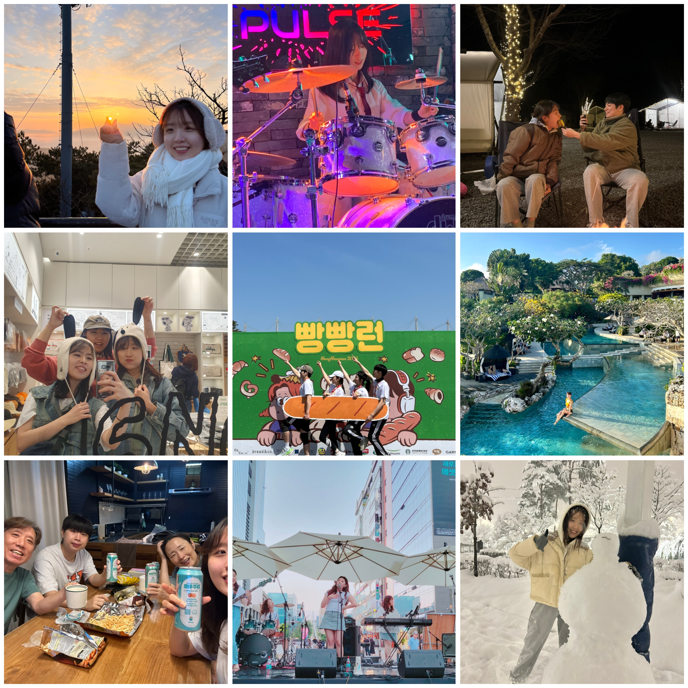
 

근데 다 쓰고 보니 올해는 잘 먹고 잘 놀았던 얘기밖에 없네. 
개발 블로그가 맞나? 

그래도 25년아 좀 살살 해줘라. 다들 힘들자너~