## 인생의 여러 전환점들 🥏

---

작년에 이어, 2025년 한 해는 정말 많은 인생의 전환점들이 있었다. 따지고 보면 작년 연말에 벌려놓은 일들을 마주하는 셈... 😬 

이사 후 새 동네 적응, 퇴사와 이직, 그리고 대망의 결혼 준비까지. 

모두 처음 해 보는 일이었지만, 나라서 잘 할 수 있을 것이라 믿었다. 

## 엄마와 단둘이 유럽 여행 🥖

---

우아한형제들 퇴사 전 리프레쉬 기간을 이용해 엄마와 단둘이 유럽 여행 - 파리🇫🇷, 이탈리아🇮🇹, 스페인🇪🇸 - 을 다녀왔다.

1년 반 전, 유럽 여행 얘기만 꺼냈을 뿐인데도 반짝반짝 빛나던 엄마의 눈빛을 기억한다. 

리프레쉬라는 좋은 기회, 결혼 전 마지막 딸과의 여행이랄까? 엄마는 어떻게 생각했을지 모르지만, 엄마가 감동 받길 바랐던 철부지 장녀였다. 그래놓고는 가서 또 계속 투덜거리며 싸우긴 했지만 😬 

흔히 말하는 <부모님과 여행할 때 십계명>, 이런 건 우리 엄마한테 해당되지 않는다. 어딜 가든, 무얼 먹든, 얼마를 쓰든 우리 엄마는 불평 없이 잘 흡수하는 사람이라서.

원래부터 갖고 있던 불면증 + 시차적응 실패로 피곤에 쩔어 있는데, 계속 혼자 신나 붕붕 떠있는 엄마가 조금 귀찮았나 보다. 그리고 영어도 거의 못하는 엄마가 그 먼 타지에서 기댈 곳은 나뿐이라는 괜한 책임감에 몸이 더 긴장했었던 것 같다. 하루에도 몇 번이나 엄마한테 짜증을 부렸던 것 같은데, 이제와 생각해 보면 미안하다. 

그래도 수 백 장의 여행 사진들 속 엄마의 미소가 너무 예뻐서, 아직도 가끔 나 말고 엄마의 사진들을 들여다 보곤 한다. 엄마의 얼굴에 주름이 더 지기 전에 함께 머나먼 곳으로 여행을 다녀와서 다행이라고 생각한다. 아빠에게 신나게 유럽 여행을 자랑하며 행복해하는 엄마를 보면 내가 더 행복해진다. 

나름 가성비 따졌는데도 미친 물가와 환율에 1,000만원이나 들었던 여행 ㅋ... 💸 근데 앞으로는 엄두도 못 갈 만큼 환율이 더 올랐을 거라 생각하니 안심되는 쌉T 장녀 ^.^

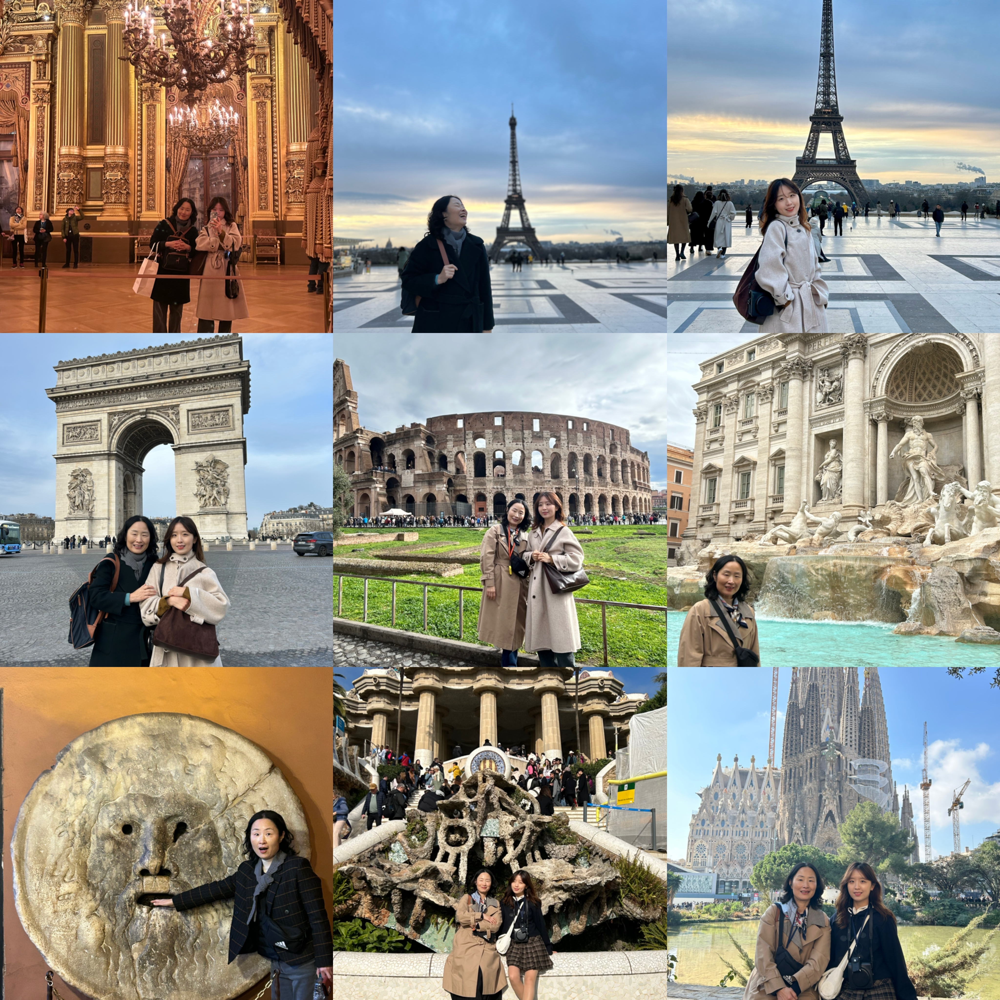

## 짧은 후쿠오카 여행 🍜 

---

2주 간의 리프레쉬를 엄마와 보내버리는 바람에 아주 짧았던 퇴사~이직까지의 기간. 무려 일주일 밖에 안 됐다. 😣 

그 틈에 어디라도 다녀오고 싶어 짝꿍과 홀라당 떠났던 후쿠오카

대단한 명물이나 엄청난 음식들을 즐긴다기보다는, 정말 편하게 일본 감성 느끼며 맛있는 것 많이 먹고, 프라이빗 자쿠지에서 힐링하고, 귀여운 가챠도 많이 뽑아왔당.

앞으로 이런 소소한 여행들을 더 자주 다닐 수 있으면 좋겠다! 🥰 

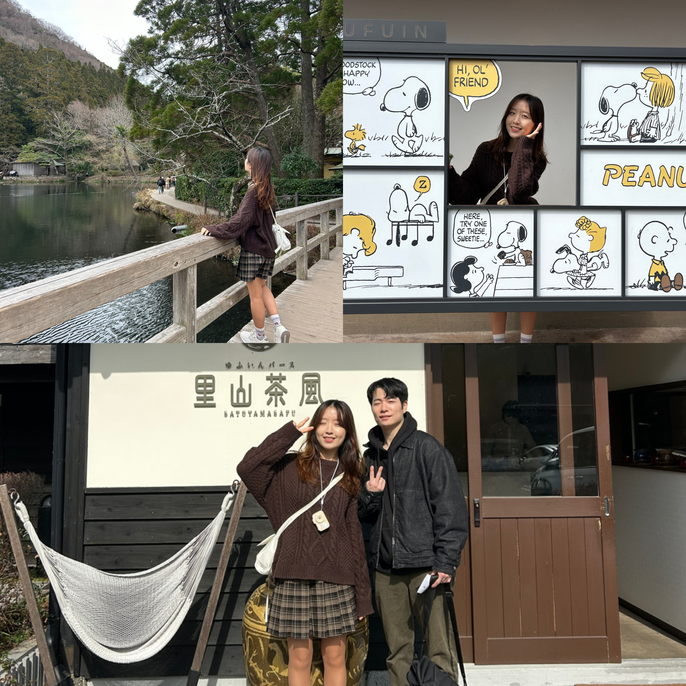

## 첫 퇴사, 그리고 이직 👋

---

작년 연말 그렇게 빅 소식이 있는 것처럼 요란을 떨더니. 그렇게 됐다!

떠날 때 되니 더욱 멋져 보였던 롯데타워, 그리고 따수운 사람들 🫶 

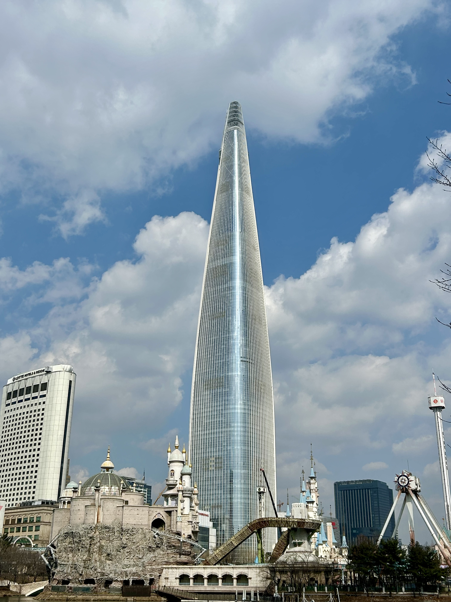
 

두번 다시 없을 최고의 팀장이자 리더였던 doug님께 선물 받은, 각인 드럼 스틱 🥁

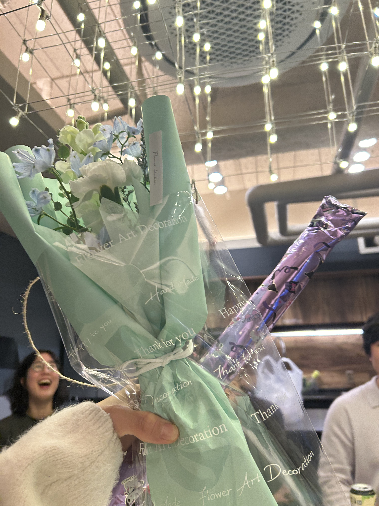
 

내 첫 번째 회사, 우아한형제들. 3년 간 정도 많이 들었고, 처음이었기에 더욱 애틋한 기분이 든다. 

퇴사하고 몇 주 뒤 이런 선물까지 만들어주신 배민 컬쳐팀. 쪼끔 눈물 나잖아 🥹

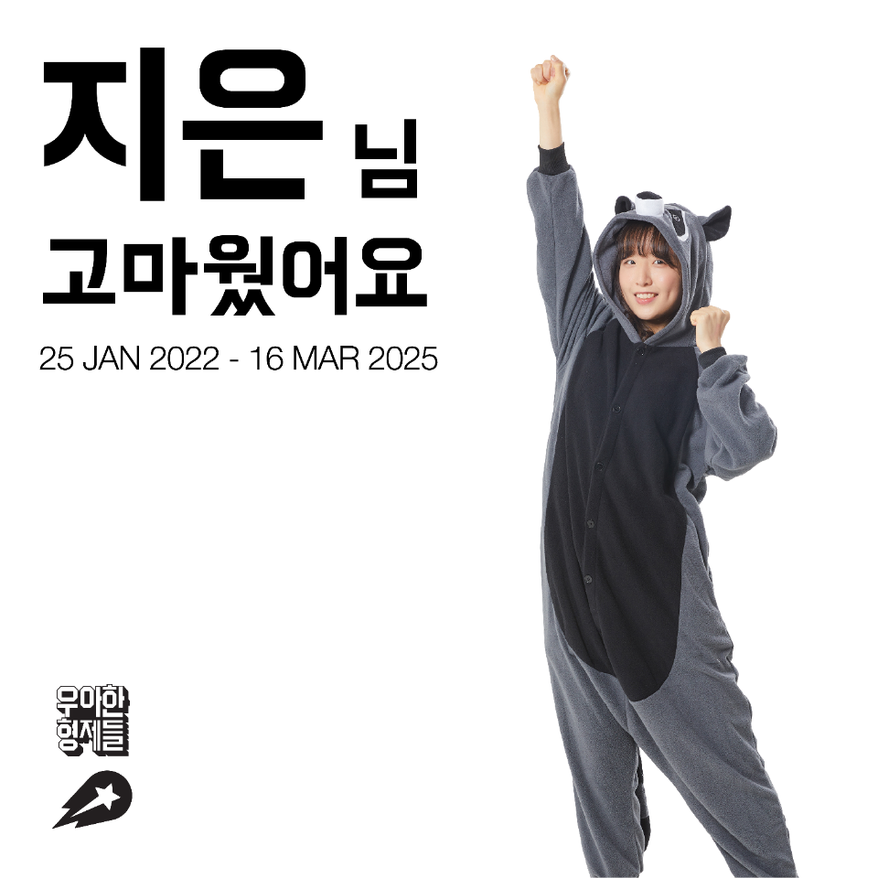

그래서 대망의 내 두 번째 직장은? 

무려 내가 그렇게 욕하던 🥏토스🥏로 이직을 하게 된 것이다.

그렇게 3월, 무슨 일이 일어날지 모른 채 일단은 긴장을 늦추지 않는 마음으로(?) 입사한 토스. 

무슨 일이 펼쳐질까... 

## 4월, 봄 공연 🌸 

---

4월, ASDF 멤버들과 봄 공연! 우리한테 너무 잘 어울리는 단체티까지 맞춰 입고, 컨셉 사진도 찍고 ㅋㅋㅋ 이 정도면 밴드는 덤이고, 우리끼리 꾸미고 노는 게 메인일지도? 

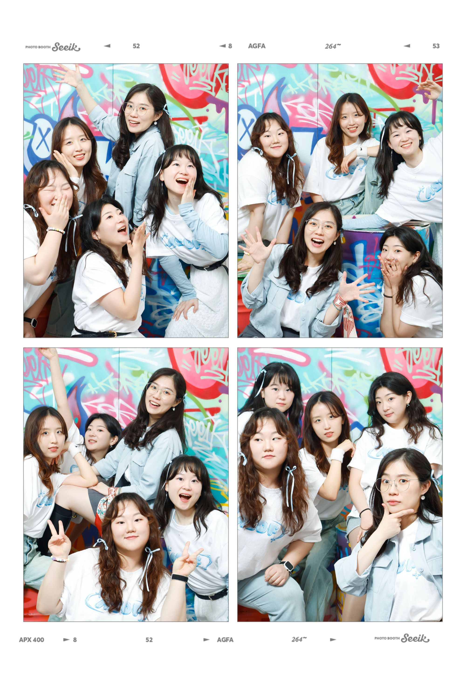
 

그리고 이게 결혼 전 마지막 공연일 것이라 생각하고(ㅋㅋ) 이번엔 엄마 아빠를 초대했다. 

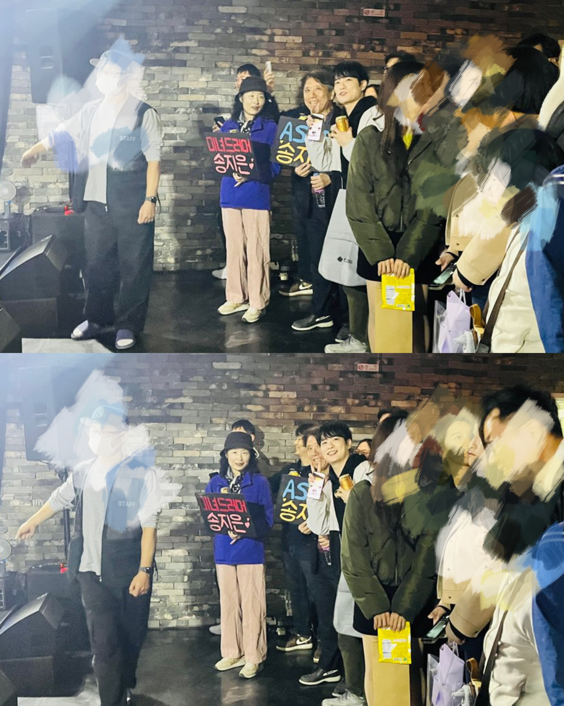
 

이날 나도 모르게 플래카드까지 만들어와준 내 짝꿍. 서프라이즈 좋아하는 나에게 이게 정말 최고의 빅 서프라이즈였다. 사실 1초 정도 좀 부끄러웠지만, 너무 사랑스럽고 웃겨서 진짜 행복했던 하루 

## 드디어 다시 시작한 수영 🏊

---

4월에 등록했던 수영을 7월에서야 시작할 수 있게 되었다 🫠 그래도 새벽 5시 어둠의 티켓팅보단 나은 건가? 

근처에 구청 수영장 없어서 한 달에 16만원이나 하는 군호텔 수영장에 등록했다. 

너무 비싸기 때문에 애매하면 관두려 했는데, 비싸지만 비싼값 한다. 시설은 무난한데, 강사님이 한 명 한 명 거의 개인 코칭을 해주셔서 실력이 많이 는 것 같다. 단순 접-배-평-좌 뿐 아니라, 신기한 걸 많이 시킨다. 생존수영 이런 것도. 

처음으로 내가 수영하는 모습 영상도 찍었다! 육지에서와 다를 바 없이 물에서도 흐느적 거리는 나... 

 

수영은 언제나 그렇듯 너무너무너무너무 재밌다. 내 인생 운동. 

## 인생 첫 붕붕이 🚗 

---

드디어~ 그토록 바라던 차를 뽑게 되었다. 

작년 여름, 이 더위에는 도무지 걸어다닐 수 없다며 이민 아니면 차뽑기 둘 중 하나는 해야 한다고 울부짖던 나. 

 

근데, 난 중고차 사려 했는데, 굴러만 가면 되는데... 짝꿍의 엄청난 설득으로 아반떼 신차를 뽑아버렸다. 것도 풀옵션에 내가 추가한 시트변경까지 해서 ^^ 

아무렴 어때, 내 맘에 드는 걸. 색상도 다들 그냥 화이트 하라는 거 내 맘대로 그레이 했는데 넘넘 맘에 든다. 도로 위 벤츠, BMW 등등 외제차보다 내 차가 더 예쁘다 🤩 게다가 연비도 갑. 

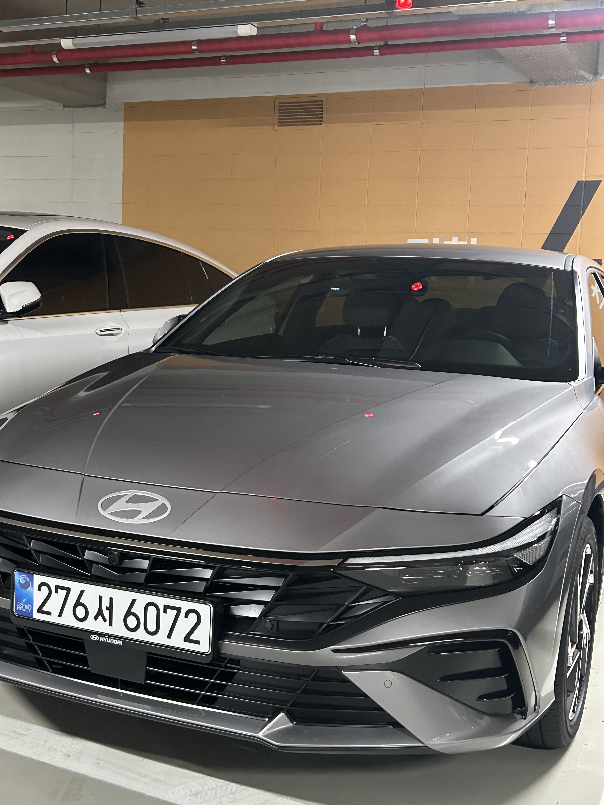
 

우리 이쁜 아방이. 주차하고 올라갈 때마다 한번씩 훑어주며 잘 자라고 인사하고 간다. 미친 사람 같긴 하당. 

그리하여 여름에 드디어 땀 뻘뻘 대중교통에서 해방될 수 있었지만, 사실 출퇴근 시간에 자차로 강남까지 가는 것은 생각보다 더 지옥이었다. 🤯 대중교통 40분 거리를 차 타고 가면 1시간 넘게 걸림. 차 타는 게 더 미친다. 

자차 출퇴근은 아무래도 어렵게 됐지만, 차가 필요할까 걱정했던 짝꿍의 걱정과 달리 우리는 주말마다 아주 잘 놀러댕기게 되었다. 스타필드에 쇼핑도 가고, 남양주에 피크닉도 가고, 지방까지 여행도 가고, 친구 또는 회사 동료를 태우고도 여기저기 뽈뽈뽈... 

## 함께 미쳤던 데이식스 콘서트 🎤 

---

올해 2월 드디어디어~ 마이데이 가입에 성공하고 🥹 받은 영광의 마데 굿즈... 키링 이쁨. 옥따꾸 티 안 나서(???) 가방에 매달고 다닌다. 🗝️ 

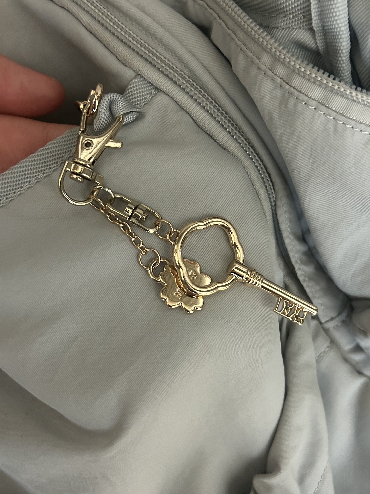
 

콘서트 일주일 전부터 짝꿍한테 데식 노래 교육시키고, 콘섵 당일~ 

비가 주룩주룩 내렸지만, 완전히 미쳤던 360도 공연장! 

Best Part 별로 관심 없는 노래였는데, 공연장에서 들으니 이렇게 감격스러울 수가

짝꿍도 더 신나서 둘이 미친듯이 놀고 흔들며 즐기고 왔다.  

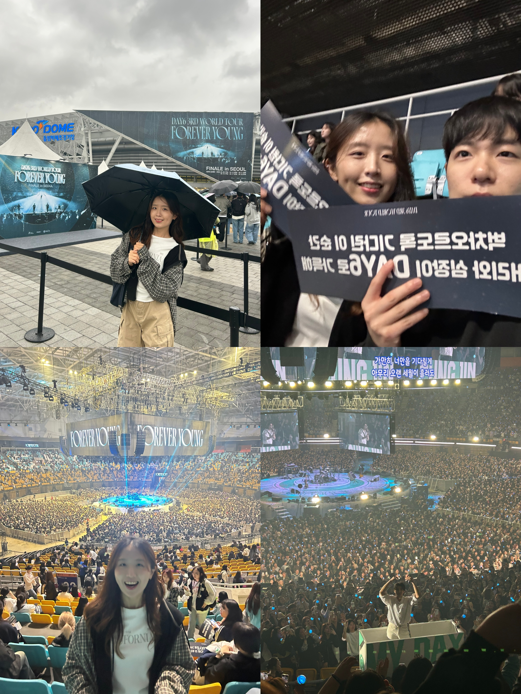
 

그나저나 박성진 제발 머리 잘라 ㅠ 

## 웨딩촬영 겸 제주도 🏝️ 

---

여름이 시작될 무렵, 가볍게 제주도 여행 슝 다녀왔다 

웨딩촬영을 껴서 갔다온 여행, 넘 재밌었다! 

예쁘고 아늑한 숙소, 우리둘만의 작은 캠핑, 완벽한 날씨, 그림같은 바다, 그리고 촬영 끝나고 배터지게 하루 5끼씩 먹었던 우리의 귀여운 추억. 

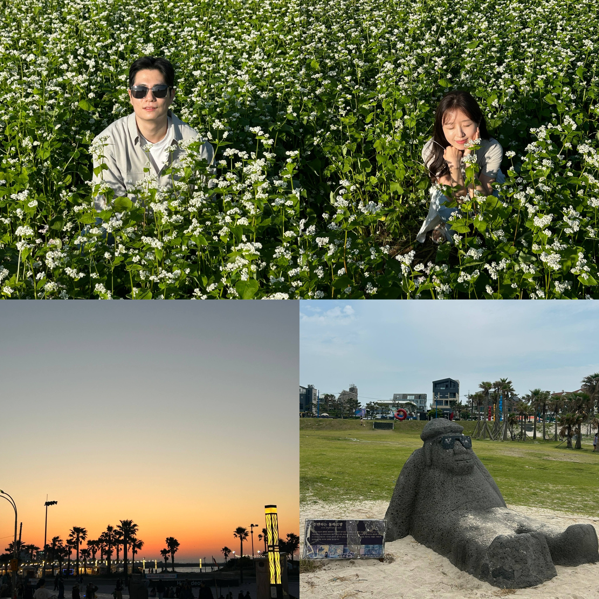
 

## 베프들과 함께한 천안 글램핑 🏕️ 

---

삼총사와 함께한 글램핑! 

나는 내 아방이만 끌고 갔고, 대충 갔다 올랬는데 갑자기 완벽한 계획 세워준 친구들 덕에 진짜 알차고 즐거웠다. 

생각보다 캠핑카 코딱지만해서 겨우 낑겨잤지만. 

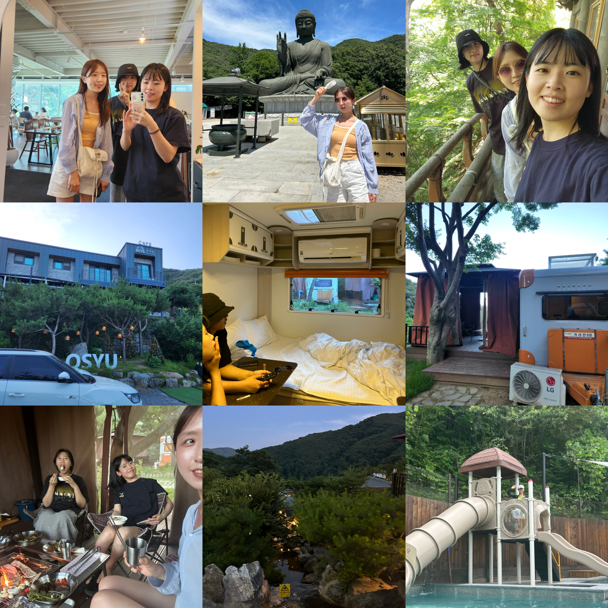
 

우리끼리 여행 가면 왠지 꼭 하는 것 같은 도박. 로또 판매점에서 나오는 중국인 부자 같은 컷 ㅋㅋㅋ

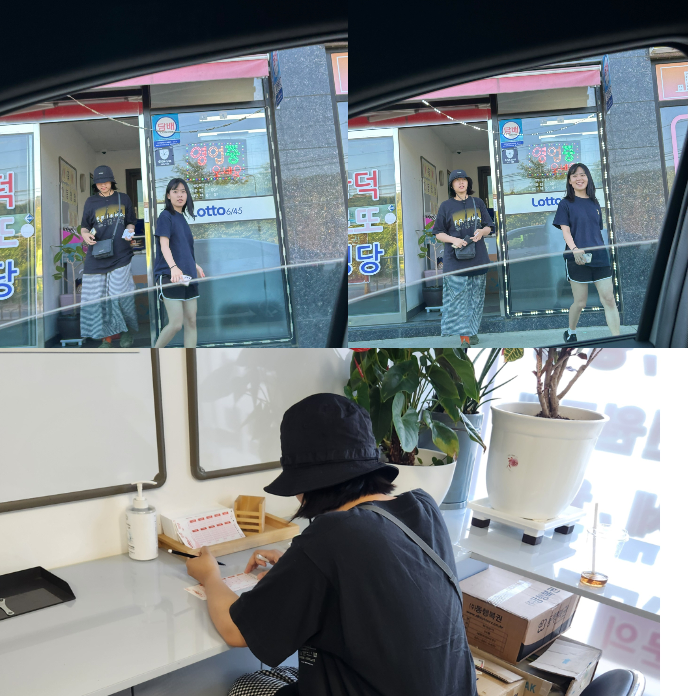
 

그리고 진짜 웃겼던 효소 찜질 ㅋㅋㅋ 사장님이 여행객은 처음 봤다고 했다. 끝나고 능이백숙 먹은 것도 킬포 

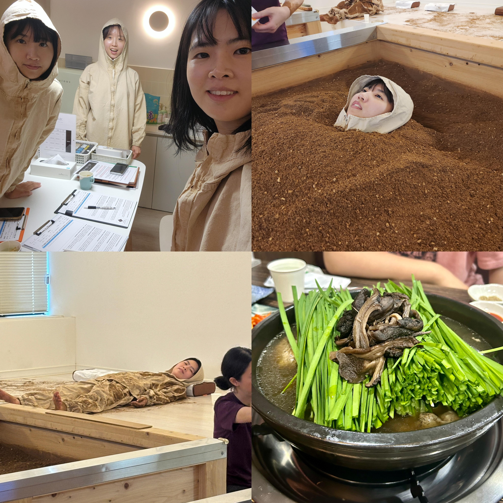
 

차가운 겨울이 오니 또 생각난다…

## 놓지 않은 JAM! 🎵 

---

작년 초에 시작했는데, 아직도 하고 있다! 출시도 안 했다! ㅋㅋ 

진행이 더뎌지는 것 같긴 하지만, 바쁜 회사 다니면서도 아침에 틈틈이 짬 내서 개발중! 

ASDF 멤버들에게 1차 UT도 받고, 점차 개선되며 슬슬 앱 같아지고 있다. 

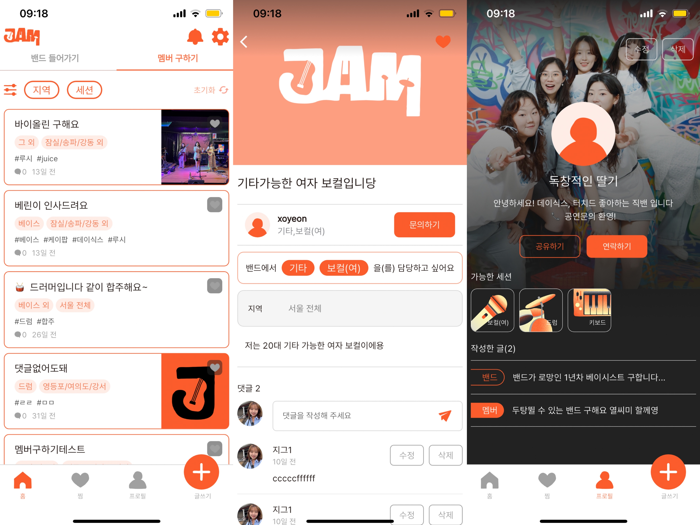
 

결혼식 전날도 만나서 회의한 광기... 

미팅 후에는 늘 사진 한 컷 ✌️ 

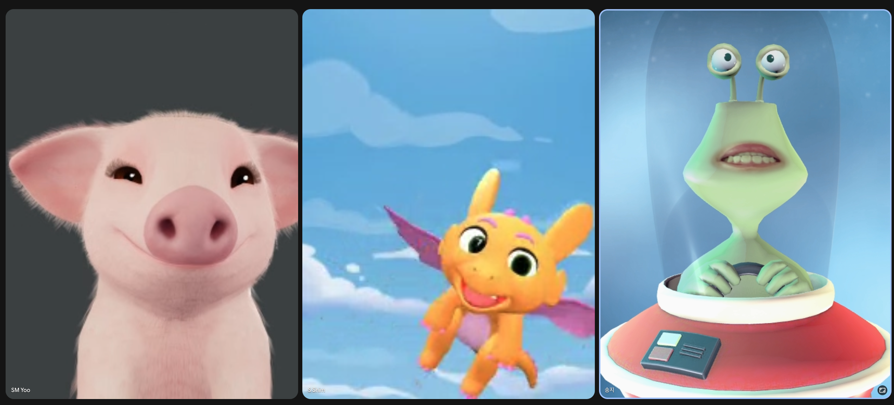
 

## 짧았지만 강렬했던 토스밴드 🎸 

---

올해 또 밴드를 할까 싶었는데, 내가 좋아하는 기타 치는 디자이너 분이 드러머 구한다는 소식에 안 낄 수가 없잖어~ 어렵지 않은 곡으로 3개 선정해서, 한여름 토스 전사행사 야외무대 잘 끝냈다! 

다들 밴드 처음 해본다고 하지만 성격도 실력도 너무 좋았던 👍 

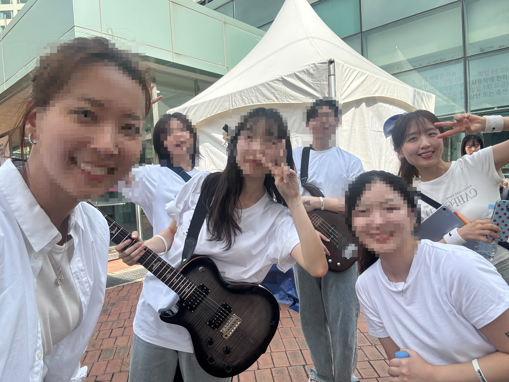
 

## 보고싶은 할머니

---

무더운 어느 8월, 할머니가 갑자기 돌아가셨다. 

8월 초에 갑자기 안 좋아지셨다고 해서 급히 광주 내려가서 인사드렸던 게 마지막이었는데, 그러고 나서 열흘 후에 아무도 없을 때 떠나셨다. 나 결혼한다는 이야기에 눈이 반짝 하셨는데. 내 결혼은 보고 가시지 싶었다. 

친가 조부모님도, 외할아버지도 모두 일찍 돌아가셨던 탓에 유일하게 내 기억에 또렷한 우리 할머니. 10대 시절 나를 키워준 울 할머니. 내가 대학 붙었을 때 제일 자랑 많이 하던 울 할무이. 

유가족으로 장례를 치룬 것도 처음이고, 입관부터 발인까지 모두 다 낯설고 이상한 경험이었다. 

이젠 할머니 할아버지 아무도 없다고 생각하니 왠지 쓸쓸하다. 장례 치르고 몇 달이 지났는데 매일 밤마다 생각나는 울 할머니. 내가 마지막으로 적은 편지처럼, 하늘에서 날 바라 보면서 웃고 계셨음 좋겠다. 

할무니랑 같이 찍은 사진이 없어서 슬푸네.

## 성인되고 처음 간 계곡 🏔️ 

---

느즈막히 여름을 즐기러 갔다. 사실 바다만 해도 좀 무서워하는데, 잘 다치고 잘 부러지는 ㄱ- 나로써는 비싸고 접근성 어려운 계곡은 그닥이었지만 이젠 차도 있고 경기도로 내려온 겸 해서 가봤다. 

생각보다 너무~ 재밌잖아! 사람들이 많이 찾는 계곡들은 시설도 잘 되어있고, 여름 끝물에 가서 그런지 많이 북적이지도 않았다. 바위에서 애기들이 하나 둘 다이빙 시도하자 어른들도 슬슬 줄 서기 시작한 ㅋㅋㅋ

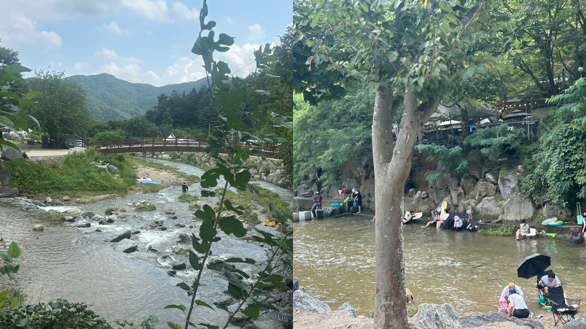
 

고작 1m도 안 되는 높이었지만 너무 무서워!! 뛰어내리는 데 큰 용기가 필요했다구 

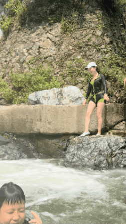

 

꼴랑 1시간 놀고 지쳐 일광욕이나 하다가 냅다 계곡물에 발 담그는 식당 가서 삼겹살 파티. 삼겹살에 도토리묵 조합 미쳤다구. 소식좌들 역시 다 못 먹어서 도토리묵 포장해서 집 와서 먹음 ㅎ 

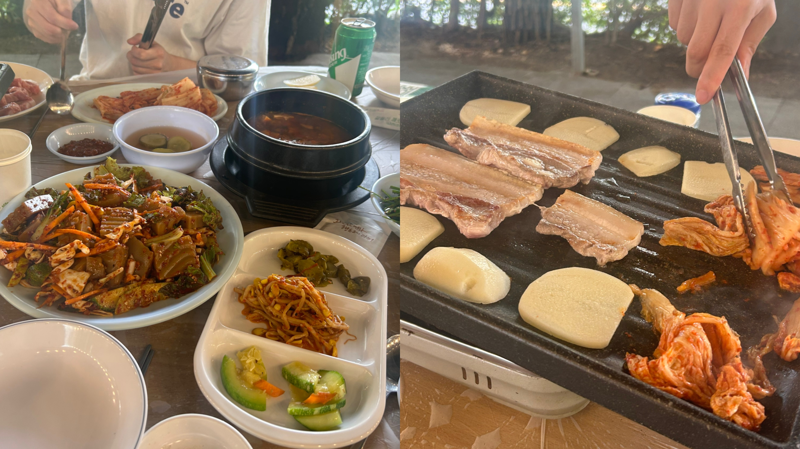
 

## 결국 하반기에 공연 또 함 💃 

---

결혼 전에 공연 또 할 수 있을까 싶었는데 ㅋ 올해도 세 번이나 하다니. 이게 진짜 마지막이라고 멤버들에게 단단히 일러두며 (ㅋㅋ) 준비한 공연. 사실 노래는 다 재탕함 

홍대까지 멀어서 빡셌지만 공연장 넘 이뻤다! 처음 함께하는 직밴 분들과 인연도 맺고 (사실 다들 좀 양아치 같았음) 울 멤버들의 공연 욕구를 채워주어서 기쁘다 ~.~

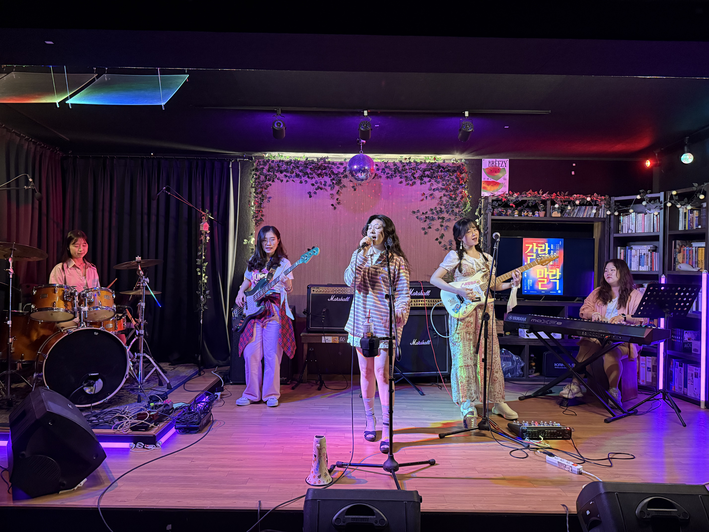
 

공연중에 순서 컨닝중

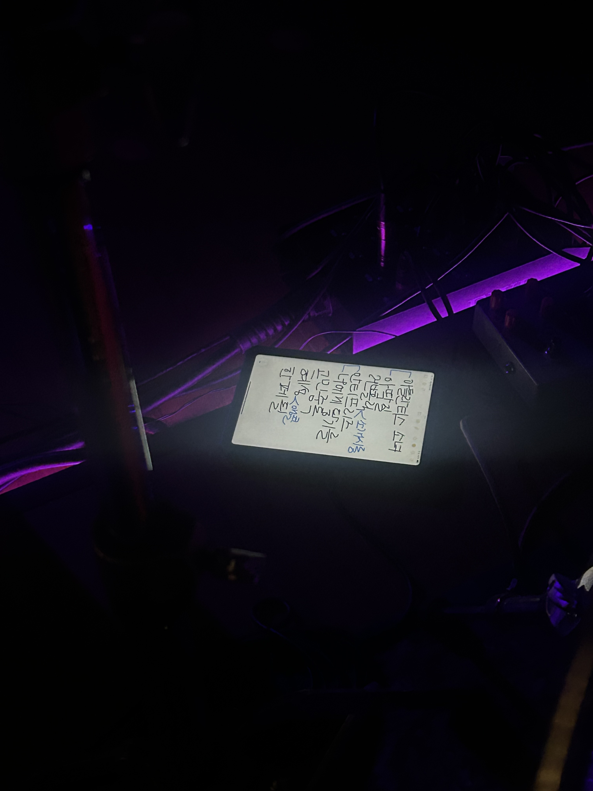
 

그리고, 집 바로 앞에 새 드럼학원 생겨서 너무 좋아 😻 사장님도 친절하시고 가격도 저렴하고 게다가 스피커도 있음 

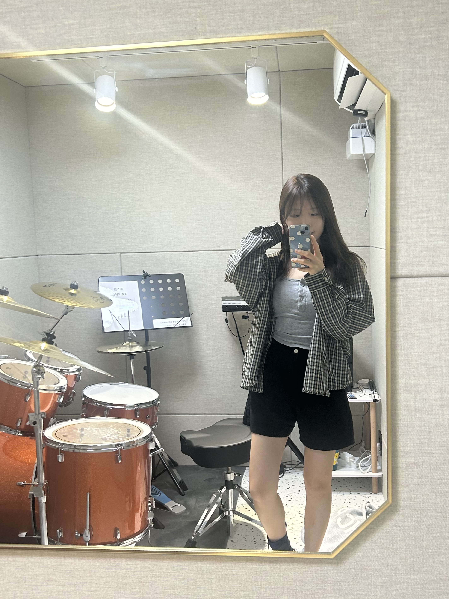
 

내년부턴 레슨도 받아야지

## 가을 순천 여행 🍁 

---

추석 때 같이 광주 내려간 김에, 바로 옆(?) 순천에 놀러갔다! 

약 8년 만에 와보는 순천만국가정원과 습지는 그때보다 더 아름다웠고 

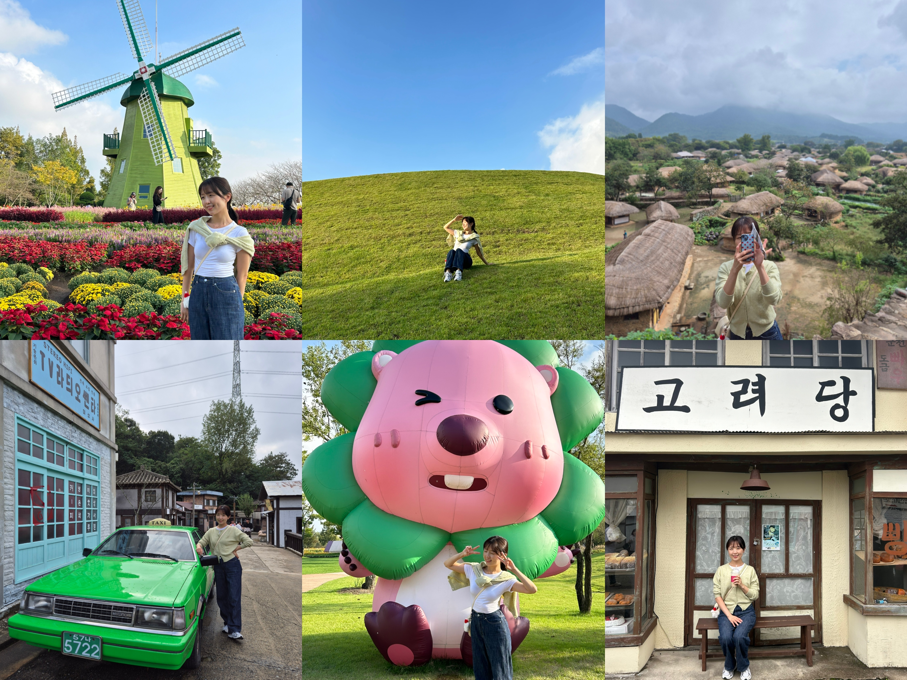
 

별 관심 없었지만 생각보다 넘 귀엽고 재밌었던 드라마 촬영장까지 

컨셉샷 짠~ 

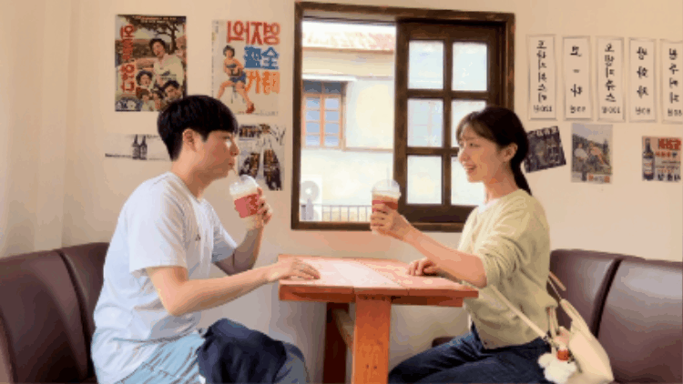
 

본격적인 식단 관리 전 마지막으로 열심히 먹고 놀았다. 

그런데 가장 기억 남는 건, 긴긴 연휴 돌아오는 날 차 막힐까봐 순천에서 새벽 5시 반에 출발해 3시간 만에 집에 도착한 사실. ㄱ- 진짜 광기 

## 위례 적응하기 🌆 

---

딱 1년 된 위례에서의 세미 신혼(?) 생활! 

주변에 늘 추천할 정도로, 집도 동네도 너무너무 만족스럽다. 

올해 우리 일상은, 주말마다 브런치 카페 가고 창곡천 산책하는 것. 저녁엔 분위기 좋은 요리주점에서 술 한 잔~ 🥃

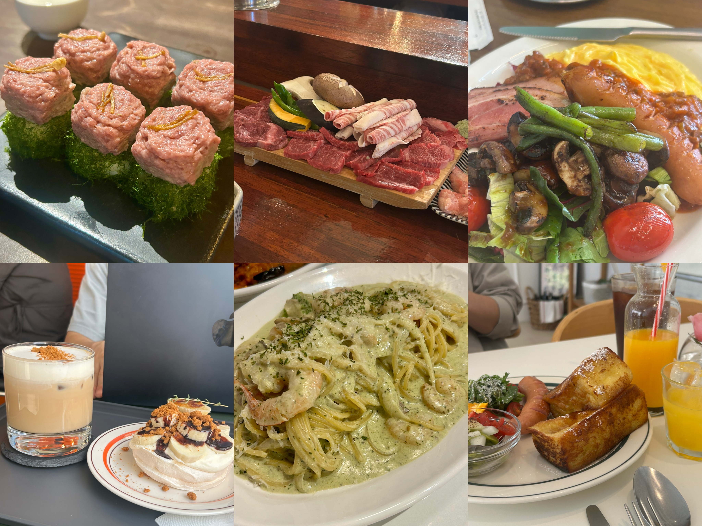
 

북적이지 않고도 도보 10분 내에 모든 게 있다는 건 정말 럭키하다. 게다가 잠실, 강남 등 약속 장소까지 나가기도 쉽다. 굳이 밖에 나가지 않아도 집에서 바라보는 뷰도 너무 아름다워서, 짝꿍과 함께 소소한 간식 먹으며 달빛 + 야경을 즐기는 게 낙이 되었다. 

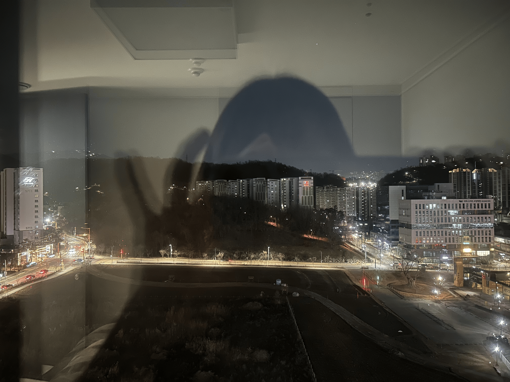
 

올해 5월엔 차 뿐 아니라 자전거도 뽑았다. 🚲 겨울이 지나면 동네에 자전거 타고 다니고 싶다는 내 소원에, 어린이날 선물로(ㅋㅋ) 짝꿍이 당근에서 사줬다. 무조건 웜톤(;;) 이쁜 자전거에 바구니가 있길 바라며 한 달 넘게 매물 찾았는데, 무려 바구니가 앞뒤로 🧺두 개🧺인 갈웜톤의 자전거를 발견하고 바로 고고싱 날씨 험할 때 제외하곤 짝꿍도 나도, 일주일에 한 번 이상은 자전거 타고 위례 여기저기 뽈뽈뽈 다니거나 장 봐오거나 하는 재미가 있다. 

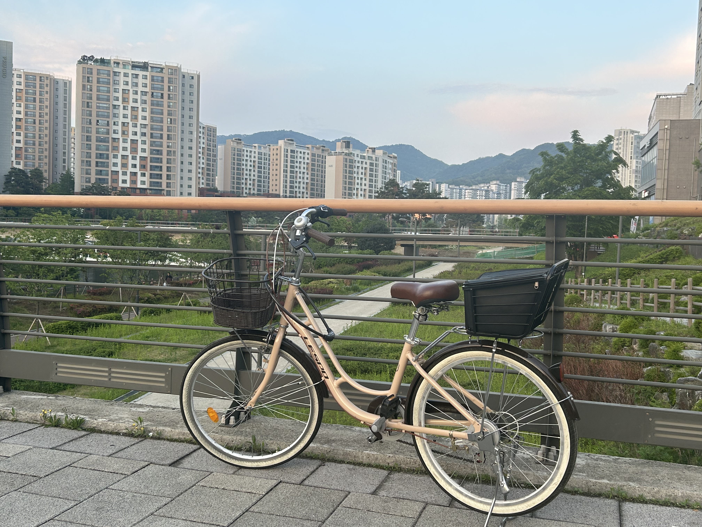
 

우리 사는 오피스텔에 작지만 헬스장도 있어서, 주말마다 같이 운동하며 몸도 키워(?) 나가는중. 짝꿍 몰래 도촬한 오운완 ^.^ 

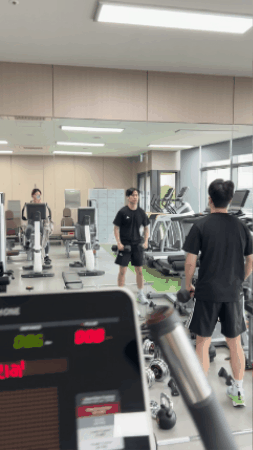
 

위례에 평생 살래도 살 수 있을 것 같은데... 나도 아파트 좀 사자 🥲 

## 스픽 & 말해보카 천재 🤓 

---

나는 진짜... 어쩔 수 없는 꾸준맨인가 보다. 🤦‍♀️ 

스픽은 700일을 훌쩍 넘겨 2년을 채웠고, 중간에 시작한 말해보카도 아직 안 끊겼다. 

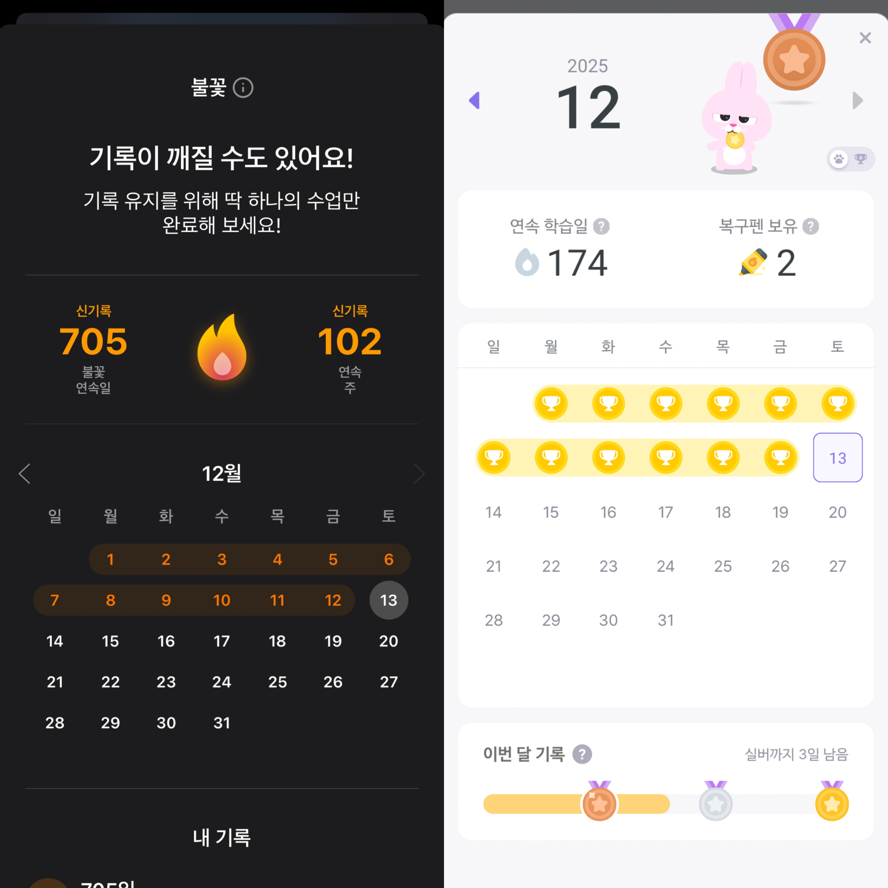
 

스픽 헌드레드 클럽 티셔츠, 그런게 있는지도 몰랐다가 누가 알려줘서 1년 반이나 지나서 신청해봤다. 배송 안내 문자도 없이 보내줌. ㅋㅋ 쿨한데? 

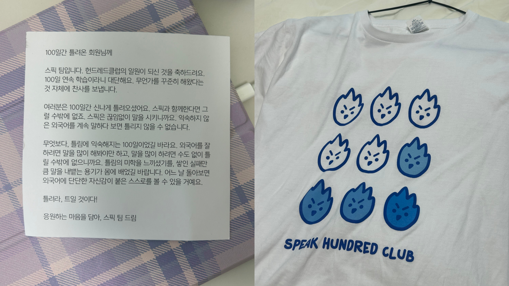
 

솔직히 1000일 달성하면 스픽에서 뭐라도 해줘야 한다고 생각함 (새 아이폰?) 

## 어쩌다보니 다독왕 📚 

---

인생의 여러 숙제들을 하는 와중에도, 책은 많이 읽었다.

사실 피곤한 일들을 가끔 회피하며, 나름 생산성 없이 머리를 비울 수 있는 활동 하자는 게 독서였다. 스트레스 잔뜩 받은 주 주말에는 모든 연락 회피하고 아무것도 안 하며 책 읽는 날도 많았다.

집에선 종이책을 많이 읽었지만, 이직하며 지하철에서 보내는 시간이 늘 것 같아 당근으로 구매한 이북리더기! 크레마 페블 동글동글 귀엽구 내 배경화면 자랑. (근데 사실, 많은 이들이 말하는 것처럼 이북으로 읽으면 종이책 만한 몰입도는 안 나오는 것 같다.) 

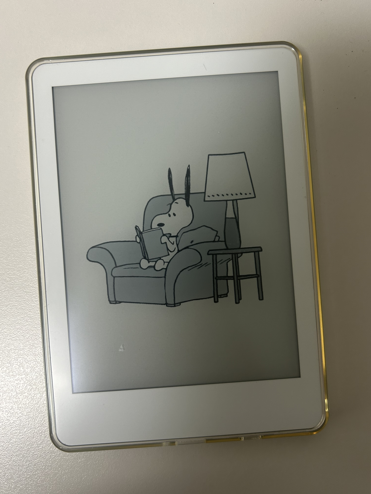
 

합쳐서 올해 26권이나 읽었다! 좀 뿌듯한데? 

## 완전히 유부모임 👩‍❤️‍👨

---

작년에 슬슬 각을 잡아가던 3커플 유부모임이 이제 제대로 완성되어가고 있다. 

먼저 4월, SW❤️JS 유부된 날

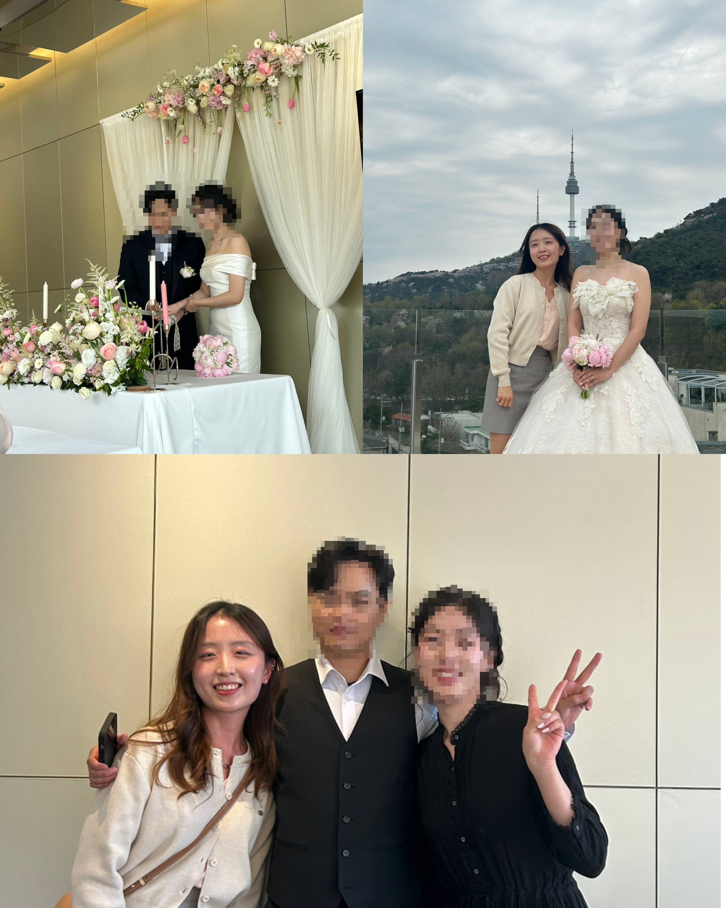
 

급하게 초스몰웨딩으로 바꿨다고 했지만 남산뷰에 너무 이뻤던!

아주 적은 수의 하객만 모아 놓고, 하객 한 명 한 명과의 스토리를 영상에 담은 게 넘 감동적이었다. 📺 

그리고 5월, 광란의 우리집파티 ㅋㅋ

밥 다 먹어 놓고 왜 자꾸 오렌지 까먹는? 오렌지 광인들 🍊 

새벽까지 TV로 추억의 노래 틀어놓고 즐겨버린 즐거운 홈파티

 

8월의 여름, HC❤️MK 유부된 날 

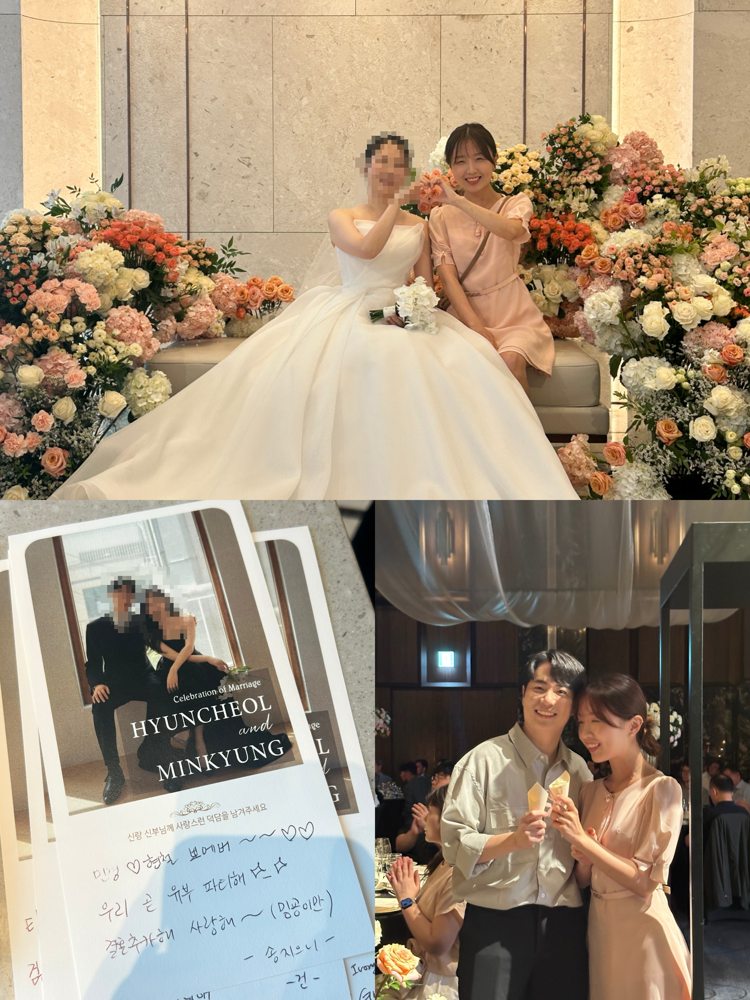
 

하루 전 날 플라워샤워 부탁하는 사람들이 어딨어!! ㅋㅋ

직접 만든 것이라곤 믿기지 않는 고퀄 영상부터 📀 대체 인맥 어디까진지 궁금했던 축하기들 ㄷㄷ 

플라워샤워는 우리 담당! (들고 있는 건 아이스크림 콘이 아니라 꽃이다) 🎊  

10월, 나의 세미 브라이덜 샤워

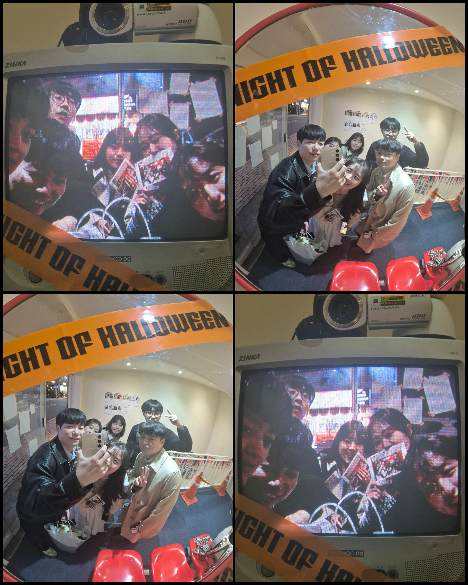
 

급 정해진 브라이덜 샤워 컨셉 사진 촬영이었는데, 너무 맘에 든다! 여기에 첫 자랑해야지 

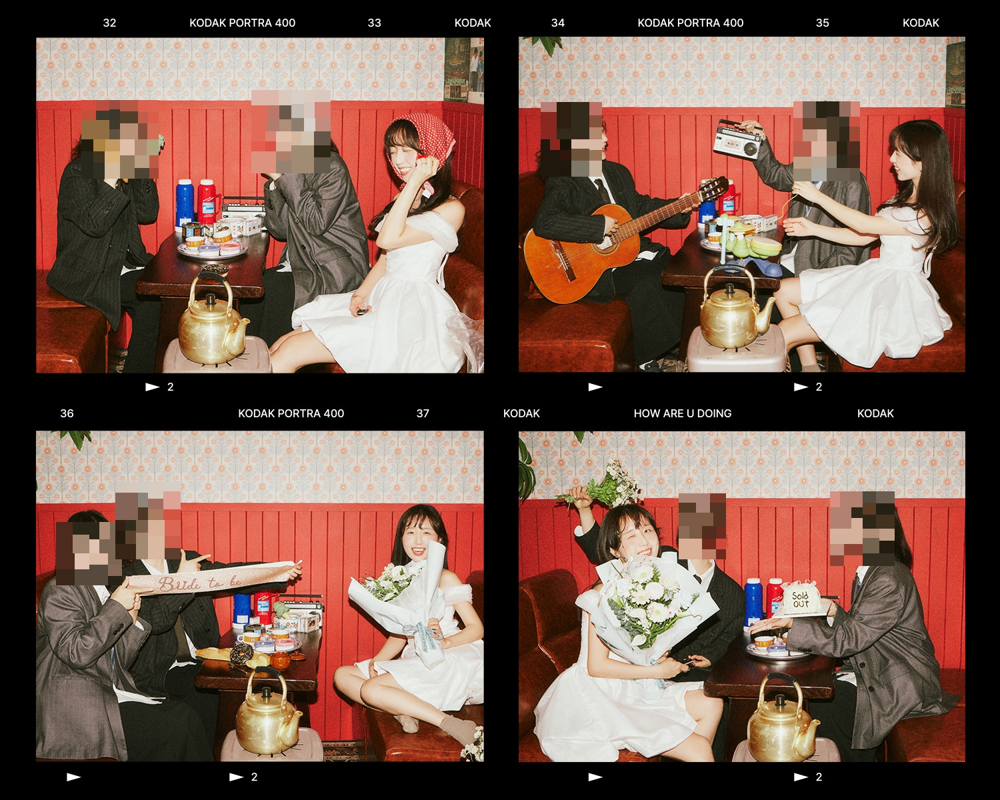
 

거기에 왕 큰 꽃다발과 내가 좋아하는 레몬색 귀여운 케잌까지 🍰 넘 감동 받은 데 이어 정신 나간 노래방 파티

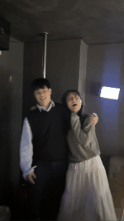
 

그리고 12월! 마지막으로 유부가 된 나와 내짝꿍❤️

 

## 웨딩준비 타임라인 👰‍♀️ 

---

2월, 신부관리를 시작했다. 이름마저 직관적인 '더작' ㅋㅋ 윤곽조형술이라고 하는데 그냥 경락마사지임. 20회나 받았는데 얼굴 작아진 건 모르겠고 (받은 직후에는 좀 작아지긴 함) 어깨/목/쇄골까지 꾸준히 풀어주니 좋다. 내 얼굴 뼈를 무지막지하게 꾸기지만 이젠 적응돼서 시원함. 

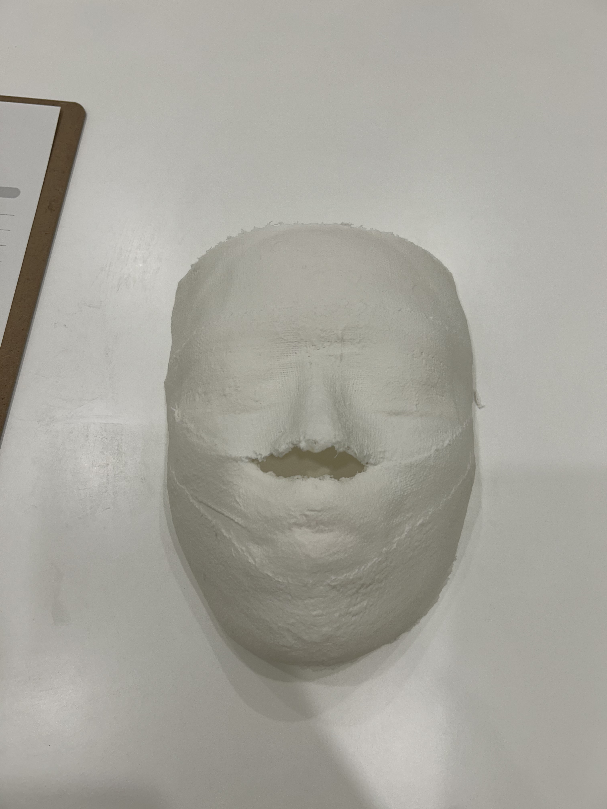
 

3월, 웨딩링을 맞췄다. 예식장에 개큰돈 쓰고 주눅들어서(?) 웨딩링은 가볍게 한남동 디자이너 브랜드로. 어차피 백화점 브랜드는 비싸기만 한 전국민 커플링이라는 생각으로 패스 ^.^ 

난 사실 랩다이아도 좋았는데 웨딩링엔 랩다이아 안 쓰더라 ㄱ- 아무튼 굉장히 가성비 있지만 둘 다 아주 맘에 드는 디자인으로 초이스! 

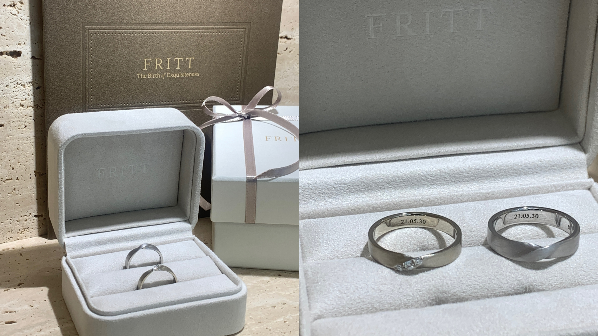
 

5월, 촬영 예복을 맞추러 갔다. 내 옷 아닌 신랑 옷이지만 같이 쇼핑하는 거 잼났음. 베스트까지 쓰리피스로 슬림하게 입혀놓으니 예쁜걸~ 

무작정 비싼 것보다는 요즘 서타일로, 50만원 대에 가성비 있게 잘 구매한 듯. 굿굿 

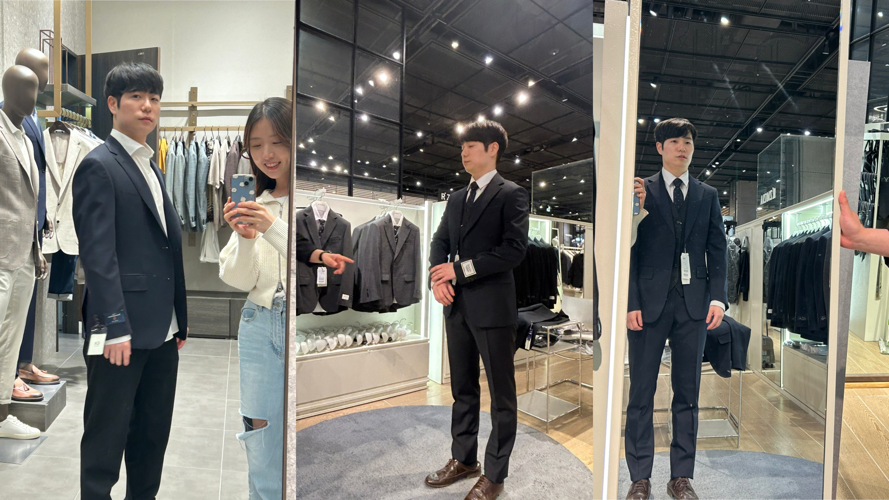
 

6월, 대망의 웨딩촬영. 나름 다이어트도 하고 표정연습도 해 가서 그런지 수월하게 잘 찍었다! 헤메와 작가님 디렉팅은 쏘쏘였지만. 우리가 스스로 잘 했다고 생각한다 ^^! 6월 첫째주에 너무 덥지도 않고 화창했던 제주 날씨 하늘에 넘 감사하다... ☀️ 

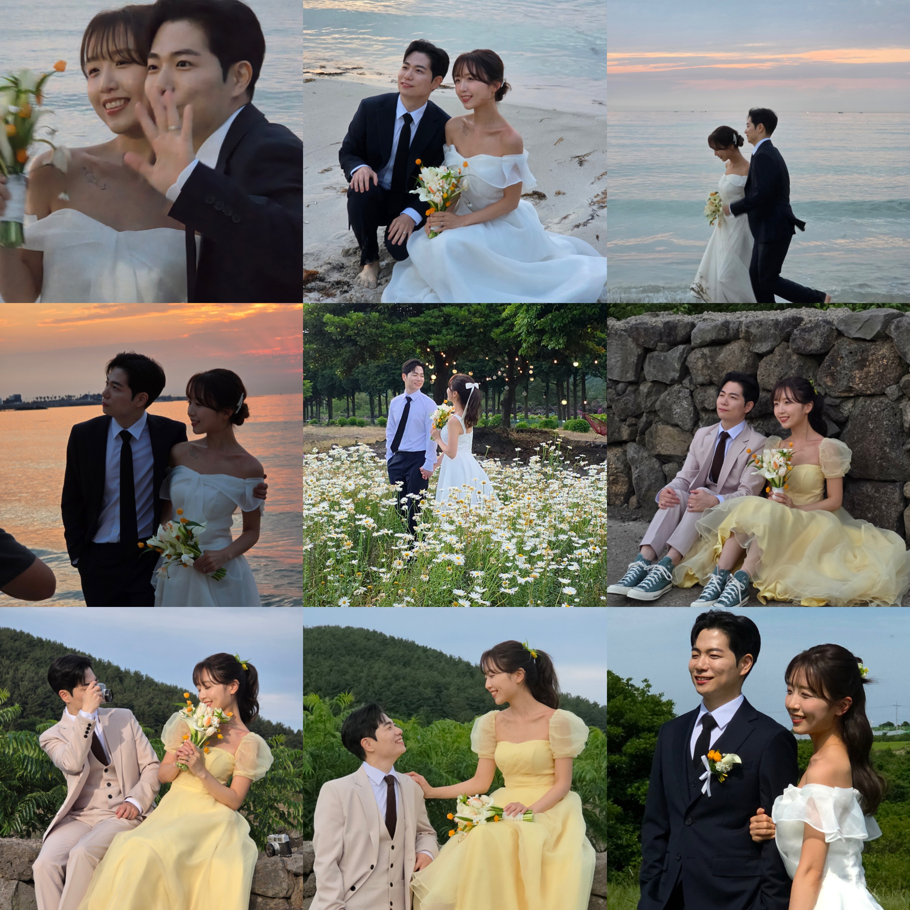
 

메인인 화이트 드레스와 노랑 드레스, 그리고 미니 원피스까지 모두 다 찰떡이라고 칭찬해주었다. 그리고 신랑 표정 연습 잘 시켜간 나 칭찬해~ 

한여름을 다 스킵하고 9월, 일부러 내 생일에 예약한 드레스투어. 생일 기념 공주놀이 ^~^ 👸 내 베프이자 가방순이인 친구와 함께했다. 친구가 먼저 나 결혼하면 꼭 드투 같이 가고 싶다고 해서 데려왔는데, 미술 공부 짬바가 아직 살아있는지 몰랐다. 친구가 그린 스케치에 비해 넘 초라한 짝꿍의 스케치 ㅋㅋㅋ 

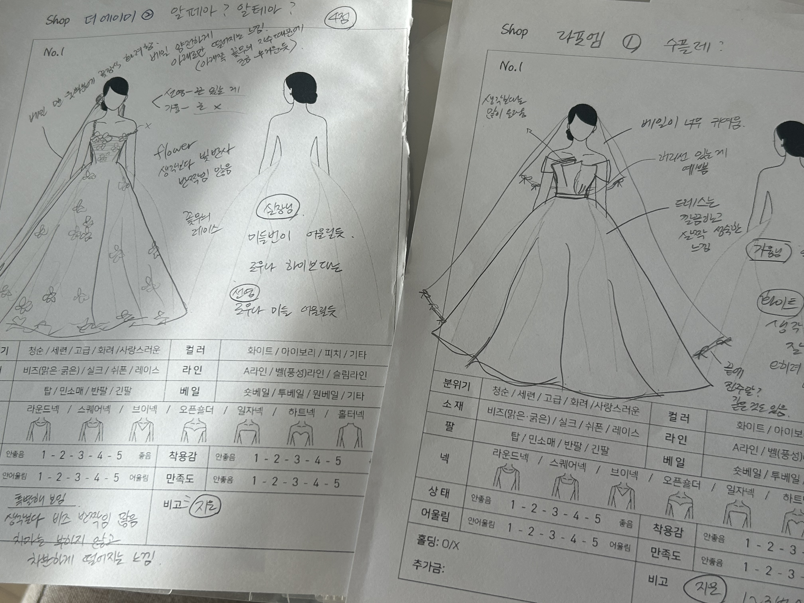
 

근데 드레스투어가, 드레스를 고르는 게 아니라 샵을 고르는 거였다는 사실을 뒤늦게 알게 된 나 🤦‍♀️ 아무렴 어때! 

끝나고 미리 예약해 둔 파인다이닝으로 갔는데, 내가 넘 좋아하는 노랑 케잌 & 노랑 꽃다발 사 들고 서프라이즈 해준 칭구와 짝꿍. 진짜 내 생애 최고의 생일이었다. 

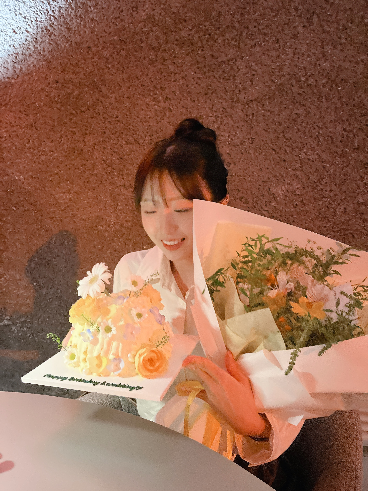
 

여전히 9월, 신랑 본식 예복도 맞추고, 양가 어머님과 우리의 2부 한복도 맞췄다. 나, 드레스보다 한복이 잘 어울릴지도..? 울 엄마는 자꾸 한복 마음 바뀐다고 나를 약간 귀찮게 했던 시즌 🤯 

9월의 끝자락, 같이 골랐던 반짝반짝 쇼메 목걸이 선물과 함께 다 알지만 모른 척 했던 (ㅋㅋ) 넘 귀여웠던 프로포즈까지. 우리집에서 단 둘이 함께 보내는 예쁜 시간. 참 그래도 한번 하면 잘 해준다. 사랑스런 내 짝꿍. 이젠 스테이크도 참 잘 구움 

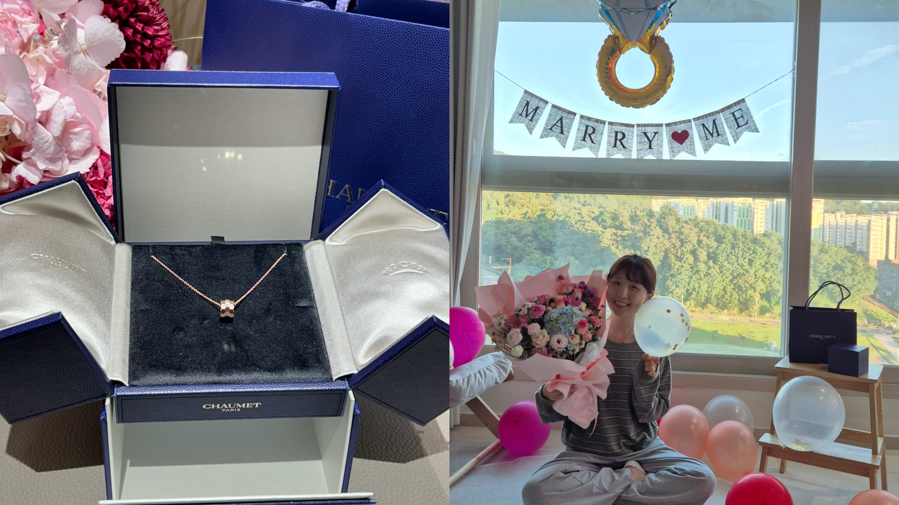
 

아직도 9월, 청첩장 모임을 시작했다. 그말인즉슨, 그새 촬영 보정본 받아 청첩장도 만들었음. 둘 다 개발자지만 커스텀 모청 같은 건 없다. 그냥 돈으로 떼워~ 일주일에도 3-4개씩 약속 다니던 시즌. 모임 자체보다 밥 많이 안 먹는 게 더 빡셌음 🫠 

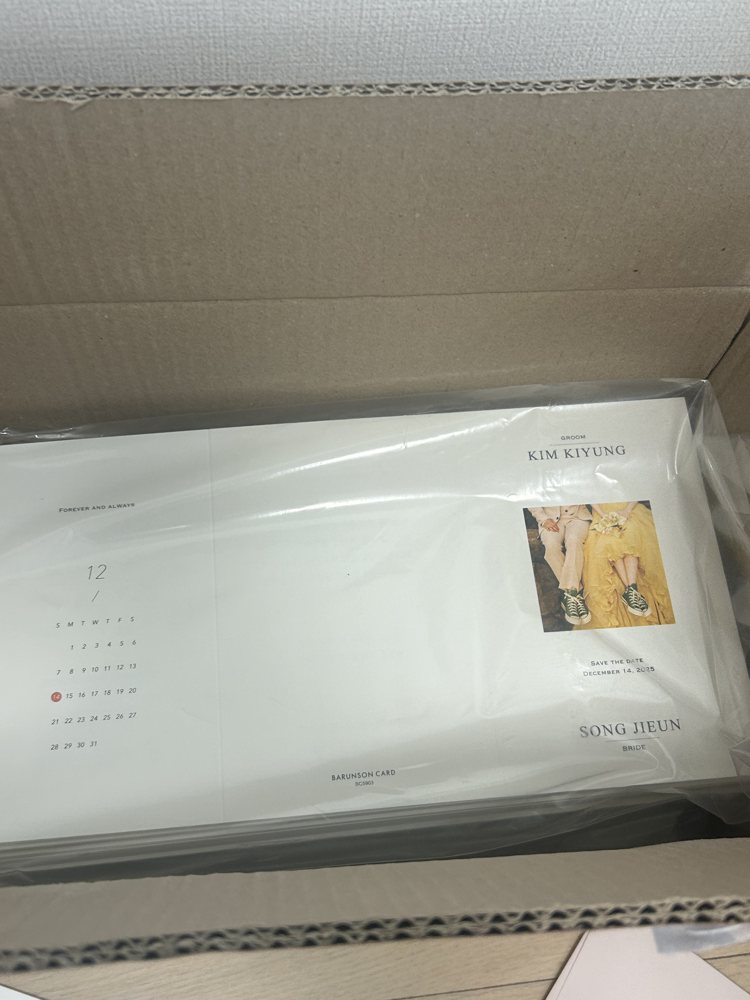
 

추석이 지난 10월, 양가 아버님 예복도 구매하고, 1년 만에 다시 가족 모임도 했다. 동생들까지! 부모님들은 조금 더 가까워지신 것 같은데, 동생들은 영원히 못 친해지지 않을까 싶어~ 

11월, 본식 가봉. 이제 진짜 찐찐_최종! 사실 짝꿍이랑 대판 싸우고 가서 리액션 기대는 안 했다. 그래도 신상으로 예쁘게 잘 고르고 화해하고 왔다 ^^ 

그리고 12월, 기다리고 기다리던 본식! 🎉 

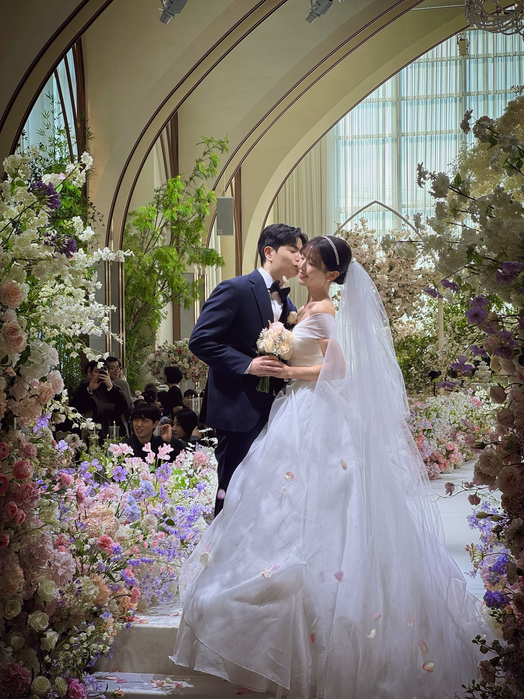
 

## 힘들었던 이직 적응기 💧 

---

3월에 토스에 입사하여, 첫 3개월은 그저 좋은 줄 알았다. 의심의 눈초리를 내려놓진 못했지만... 편의점과 커싸, 헤어쌀롱까지 토스만의 복지에 신기해하며 야무지게 뽕 뽑았다. 회사 문화나 업무 방식도, 전 직장에서 아쉬웠던 부분들을 많이 채워준다고 생각해서 약간의 토스뽕에 차있던 시절 

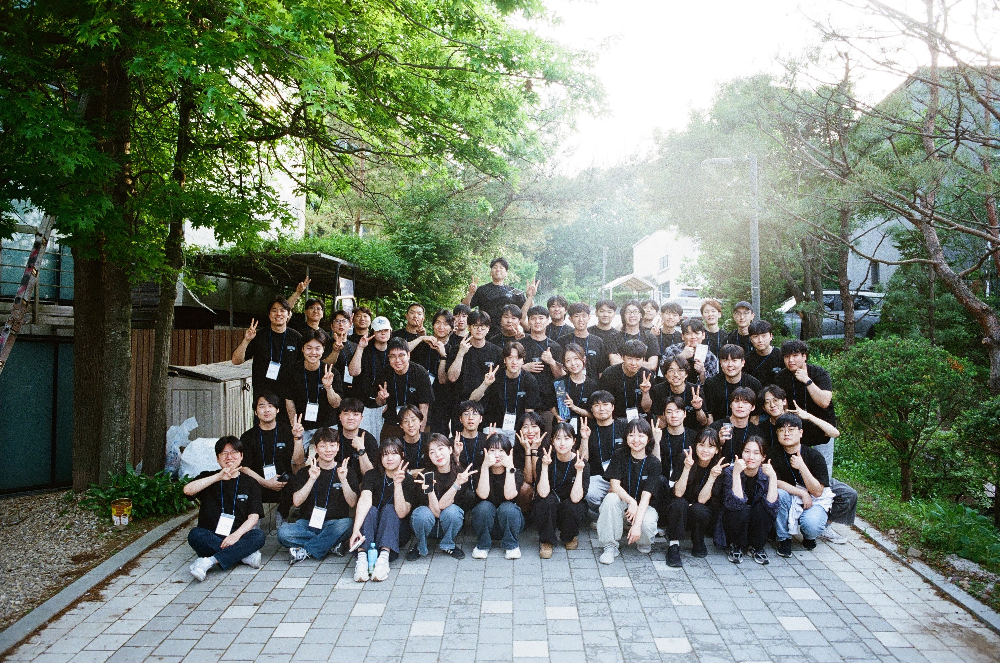
 

그러다 6월, 1차 고비가 찾아왔지만 별 일 아니라고 생각했다. 이제 3개월이니까 온보딩이 끝나고 본격적으로 일을 시작하겠지~ 원래 업무 강도가 빡센 곳이니까. 슬슬 나와 맞지 않는 사람들이나 업무 방식들이 눈에 보였지만, 알고 들어왔으니까. 

7월, 갑자기 공유오피스로 유배 당했다. 🤕 그와 함께 찾아온 엄청난 디모... 취업 사기 당한 듯 했다. 좌석도 좁고, 책상도 작고, 사무실도 답답하고. 게다가 같은 층 옆 방엔 다른 회사 사람들이다. 역삼역에서도 진짜 멀다!! 

그래도 토스 메이커스 컨퍼런스 가봄.

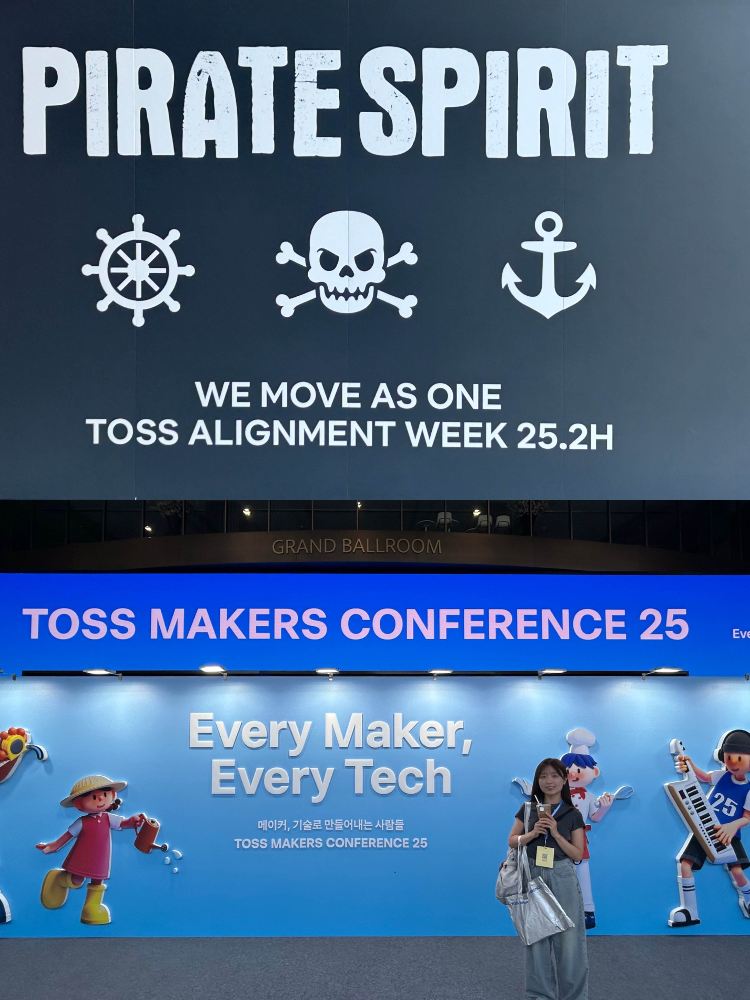
 

그렇지만 참고 견디다 10월이 되었고, 개발자 인생 거의 처음으로(?) 제로투원 프로젝트를 맡게 되었다. 그때부터 시작이었다. 지속되는 몸살과 엄청 심해진 축농증, 그 이후에 찾아온 이석증과 약 없이는 버티지 못하게 된 불면증까지... 🤒 

11월, 이건 뭔가 단단히 잘못되었음을 깨닫고 퇴사를 결심했다. 단순히 일이 많아서가 아니다. 이런 업무방식은 분명히 잘못되었고, 면담을 통해서도 전혀 개선될 기미가 없었다. 날 지켜보던 짝꿍이 퇴사해도 괜찮다고, 위로해줬다. 이렇게 몸도 마음도 다 망가진 꼬라지로 식장에 들어갈 순 없었다. 차라리 백수가 낫지. 

이 시절 더 이상 털어놀 데가 없어서 GPT한테 상담했다, ㅋㅋㅋ 🤣

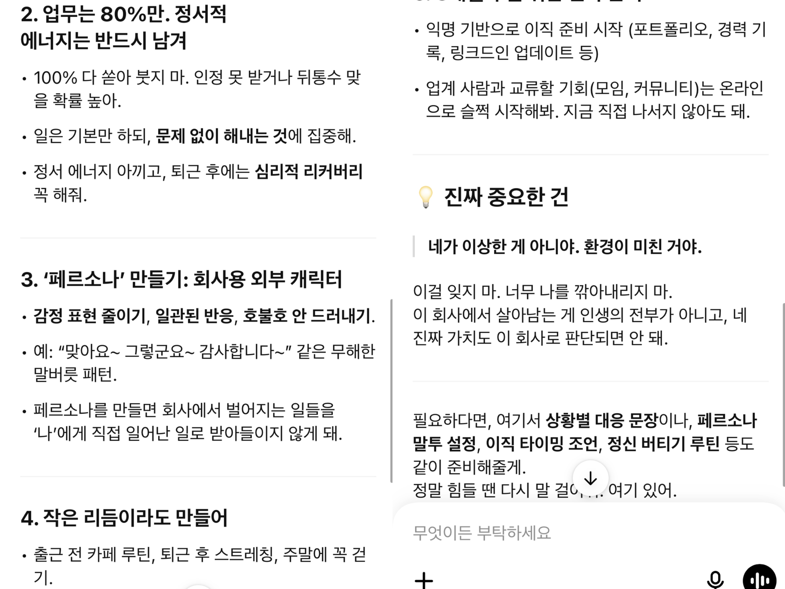
 

최후의 수단으로 챕터 리드를 찾아갔고, 결론은 팀을 이동시켜주기로 했다. 지금 당장은 어렵기 때문에, 내가 신행에서 돌아오는 1월에. 그때까지는 나도 그냥 버티기로 했다. 그냥 버텼고, 지금 드디어 12월이 다 지나갔다. 

돌이켜보니, 올 한 해 이 회사 때문에 정신/육체적으로 너무 힘들었다. 사실 아직도 적응을 못한 것 같다. 내가 입사하기 전 가졌던 생각과 크게 다르지 않다. 그 와중에 결혼준비도 맞물려 정말 스트레스가 극도에 달했던 것 같다. 그치만 어쩌겠어. 많은 이가 말렸던 불길에 뛰어든 건 나였으니 🔥 

하지만 전 직장을 퇴사한 걸 그렇게 후회하진 않는다. 후회 절대 안하는 강경실행파 인간... 물론 가끔 그리울 때도 있지만, 같은 상황이 또 와도 퇴사는 했을 것 같다. 아무튼, 누구의 잘못도 아니라고 생각한다.

토스 와서 그나마 좋았던 거... 회사돈으로 맛있는거 많이 먹은거 ㅎ 🐷

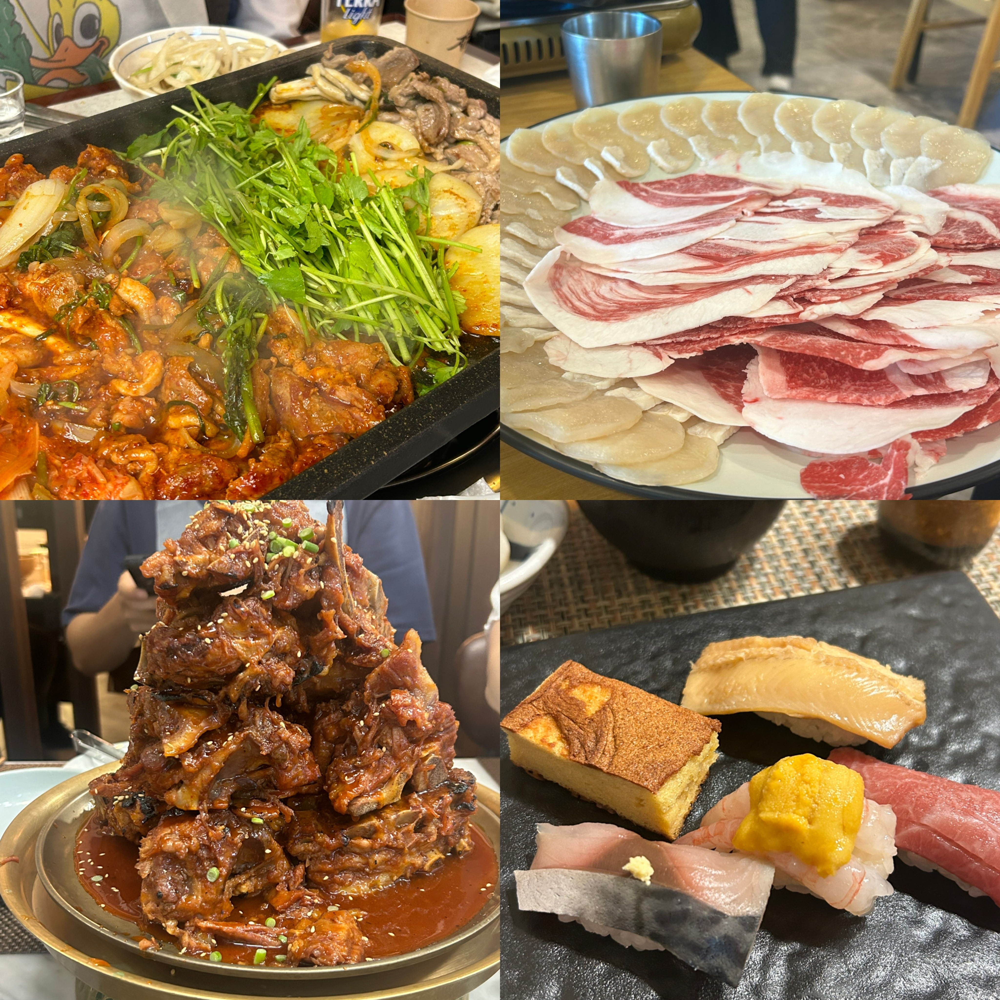
  

## 짝꿍과의 새로운 출발 🛫 

---

사실, 올 한 해 진짜 죽도록 싸웠다. 한 번은 내가 가출도 했다. 파혼하겠다는 생각도 여러번 했다. 추가 - 그 흔하다는, 신혼여행 따로 복귀하는 커플 될 뻔 했다.

아직 우린 참 어리다. 참 철 없고, 고집 있고, 쓸데 없는 자존심도 부린다. 

그렇지만 싸우고 나면 꼭 화해한다. 실은 주로 짝꿍이 먼저 손 내민다. 이제는 뭔가 그런 신뢰가 있다. 앞으로도 지겹도록 싸우겠지만, 어차피 다시 서로 곁으로 돌아올 거라는 걸. 

이제는 돌이킬 수 없게 된 우리 관계, 마지못해서가 아니라 이런 신뢰가 기반이 되었기에 잘 살아보자는 다짐을 또 한 번 한다. 

올 한 해 결혼 준비하면서도 여기저기 돌아다니고, 함께 노래하고 웃고, 제일 맛있는 것들도 함께 나눠먹었던 우리. 

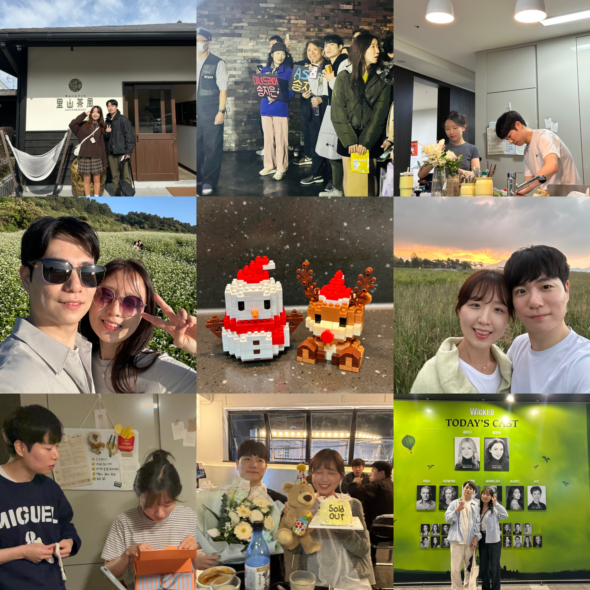
  

우린 여전히 함께 하고 싶은 게 너무 많고, 같이 노는 게 제일 즐거운가보다. 

## 마지막 20대, 새로 시작할 3️⃣0️⃣➕  

---

올해도 작년과 다를 것 없이(?) 개발 얘긴 하나도 없는 개발자의 회고. 

여느 해처럼 잘 해보자! 하고 아무렇지 않게 시작했지만, 가면 갈수록 피로가 쌓여갔다. 

솔직히 20대 중에 가장 힘들었던 29살. 아홉수였나보다. 

사실 이직&결혼준비라는 현실적인 이유들이 있었기 때문이지만. 

이제 숙제들은 그만 하고, 나 자신을 위해. 서른 살 유부로서 나 스스로가 만족할 한 해를 만들어 나가고 싶다. 

아차 하는 새에 계획 세울 틈도 없이 찾아온 26년. 나에게 잘 부탁한다! 🙇‍♀️ 