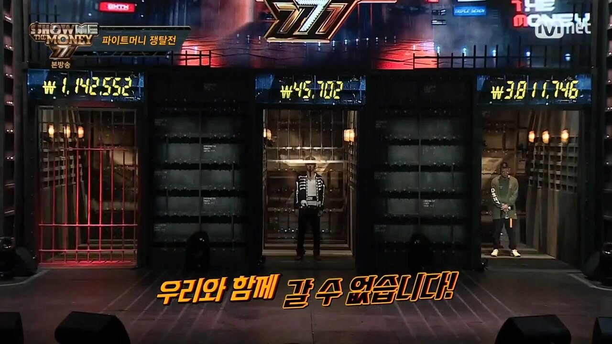
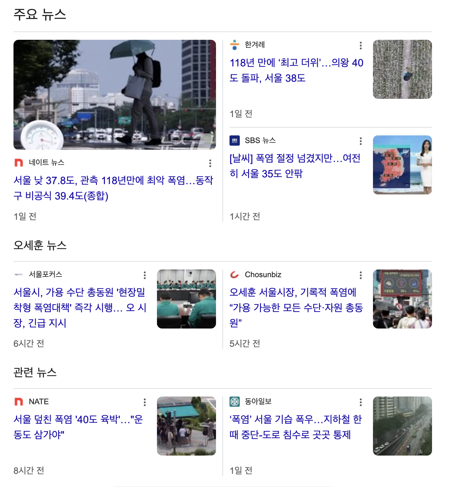

토스에서의 3개월이 흘렀다. 과거 어느 시점까진 스트라이크 제도라 불리던 그것… 그러니까, 입사 3개월 동안 일종의 수습 기간을 두고 3개월이 되는 시점에 사람을 내보낼 수도(?) 있었던, 안 그래도 악명 높은 토스의 악명을 드높여줬던 (ㅋㅋㅋ) 무시무시한 제도.

 

물론 이젠 그런 시절은 지났다. 회사가 신규입사자를 일방적으로 평가하고 함께할지 말지 결정한다기보단, 토스에서 보낸 3개월의 시간 동안 신규입사자는 회사에서 어떤 롤들을 맡게 되었는지, 어떤 것들을 배웠고 또 혹시 말 못한 고민들은 없는지 담당 HR 매니저와 함께 이야기하는 시간이 되었다. 그럼에도 여전히 신경 쓰이고, 3mr 기간까지는 별 소리 못 내고 다니게 되는 것이 국룰이지만...

은 개뿔. 첫 한 달은 빡세긴 했지만 생각보다 버틸만 한 맘으로 다니던 나는 2개월이 지나며 정신없는 업무에 치여 죽어가고 있었고 3mr이 도래하기도 전에 메이트, 도메인 리드, 팀 리드, 담당 HRBP, 그냥 친한 회사 동료들에게까지 이게 맞냐고, 난 조만간 버티지 못할 것이라고 어쩌고 저쩌고 쫑알쫑알... 다 털어놓는 성격은 3개월 만에 드러나 버렸다.

그토록 정신이 나갈 뻔한 이유는, 우리 팀이 단기간(?) 격동기를 거쳤기 때문이었다. 오래되고 안정적인 수입원이 되는, 레거시 가득한 도메인이 갑자기 뉴비들로 가득 채워지면서 팀원들 간의 이해도와 속도 차이가 벌어지기 시작했다. 그 와중에 매출은 어려운데 끝이 없을 것 시도와 실험 실패, 새 정부의 대출 규제로 가뜩이나 분위기도 안 좋은 상황에서 죽어나는 나날들이 반복됐었다. 

이런 분위기도 영향이 없진 않았겠지만, 다들 예민한 상태로 말을 세게 하기 시작한다고 느꼈다. 나도 이런 식으로 토며들면 말 거칠게 할 것 같다는 걱정도 들고. 물론 모든 사람이 그런 것은 아니다. 쏟아지는 업무와 커뮤니케이션 속에서도 둥글둥글 늘 웃으며 좋은 말들만 건네는 사람들도 분명 많다. 그리고 사실 그들이 기존쎄라고 생각한다. 내 추구미기도 하고 ^^ 

 

암튼 팀이 그렇게 격동의 시기를 거치는 동안 팀의 유일한 프론트 개발자였던 나는 끊임없이 똥코드를 쌌고... 한창 밤늦게까지 일하며 울분을 토할 땐 나 자신을 ‘코드싸개’같다는 저급한 표현으로 칭하며 🥲 점차 정신이 나가고 있었다. 그 와중에 꼭 퇴근할라 치거나, 퇴근하고 있거나, 퇴근하고 씻고 잠에 들랑말랑할 때쯤이면 다시 모니터 앞에 앉아야 할 일이 생기고 만다.

그리고 이 회사의 DRI문화는 아직도 어렵다. 이번에 처음 검색해봤는데, 'Directly Responsible Individual'이란 뜻으로, 스티브 잡스가 처음 도입했다고 한다. 그니까 다 내 책임인거지 뭐야! 나 스스로 판단하고, 결정하고, 시도하고, 책임져야 하는 것인데. 원래 그러던 성격이 아닌 나로써, 게다가 뭣도 모르는 신규입사자에게 이런 권리가 주어져 버려서 아직까지도 적응중이다. 🤷‍♀️

 

그래도 여차저차 3mr이 끝났고, 팀원들의 리뷰를 받게 됐다. 사실 쬐금 긴장했는데 팀원들이 잘 봐줘서 다행이다. 물론 누가 그렇게 얼굴 보곤 싱긋 웃으면서 서면으론 험한 말을 하겠냐마는. 암튼 좋은 평가들이 많아서 다행이다. 하하... 🫥 살아남은 나에게 애써 고생했다는 메시지들인 것 같아 감사하다. 

그리고 찾아온 생각주간. 그간 미친듯이 달렸던 팀이 내린 결정이자 마침 첫 학기가 끝났기에 회사 전체에서도 권장하는(?) 시간인 것 같다. 프론트는 나 혼자기에 이 시간 동안 무얼 해야 하는지도 나 혼자 고민하고 정해야 하지만, 아무튼 잠시 쉬어가며 생각 정리를 할 수 있어서 참 좋다. 

최근 전직장 동료들도 몇 번 만날 기회가 있었다. 같은 팀이었던 프론트엔드 동료들, 그리고 사실 아직도 종종 만나는 밴드 멤버들. 그러길 바란 건 아닌데, 내 전 직장도 점점 이상한 방향으로 흘러가는 것 같다... 괜히 듣고보니 또 좋은 타이밍에 잘 나왔나 싶기도 하고. 여전히 누군가에겐 좋은 회사겠지만, 목마른 나에겐 서로 더 안 좋아지기만 했을 것이 분명하다. 

 

사실 개발자를 언제까지 할 지는 모르겠다. 점점 그런 마음이 커져간다. 그러긴 내 짝꿍도 마찬가지... 우리 아직 20대인데? 큰일났다. 하루가 다르게 들려오는 AI 시장의 소식이 이젠 새롭지도 않다. 이 폭풍 속에서 나는 왜 탐구하지 않을까. 왜 탐구하고 싶지 않을까. 권태기가 왔나? 올해 첫 개발서적 스터디를 시작하며 생각해보니, 반 년이 지나도록 읽은 책은 많은데 모두 비개발 서적이었다. 급 현타 🤦‍♀️ 

 

악! 이건 다 역시 더위 때문이야. 몸도 안 좋고. 아무렇게나 끝내야겠다. 

그래도 다음 하반기 동안에는, 내가 next step으로 뭘 하고 싶은건지 슬슬 밑밥부터 다시 깔아봐야겠다. 일단 아무것도 안 하기엔 좀 쪽팔리니까.

인생의 작은 전환기를 이루었고, 더 큰 전환기를 앞두었다. 이제 와서 방황하고 있는 게 좀 부끄럽기도 하지만, 언제나 방황하는 시기가 정해져 있는 건 아니었기 때문에 괜찮을 거다. 방황하는 걸 인정하고 그냥 꿋꿋하게 살다보면 또 답이 나오겠지. 그리고 생각보다 별 일 없을 거란 걸 🙃 