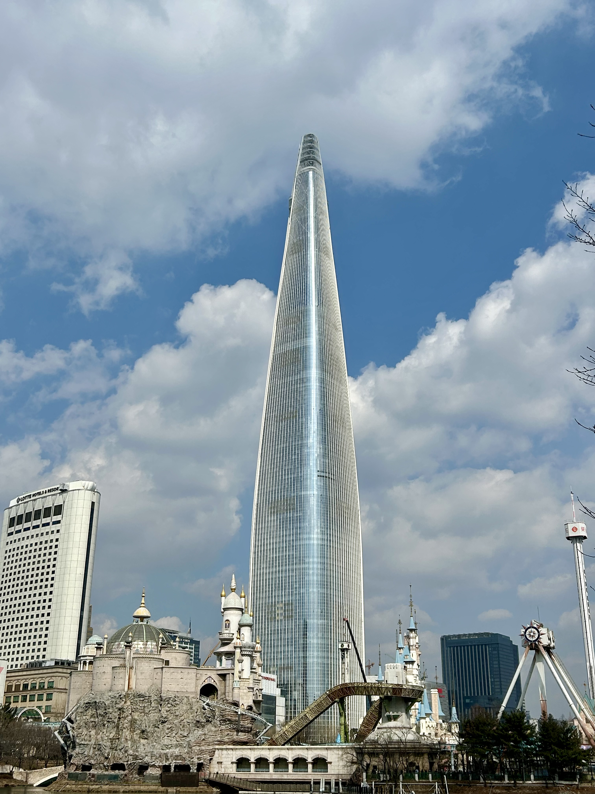
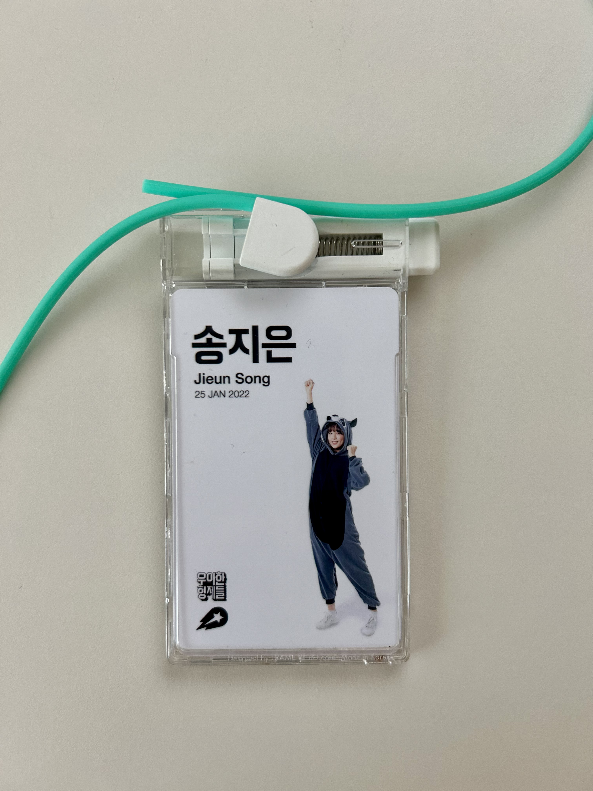
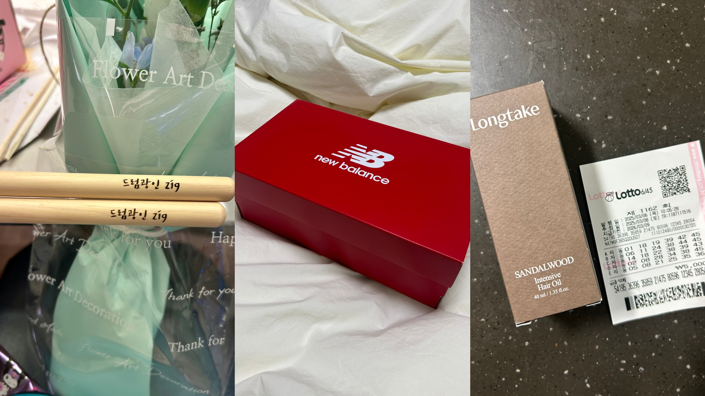

우아한형제들, 셀러셀프서비스팀에서 3년을 보냈고

이제 작별하는 중 👋

<figure style="text-align: center;">
  
  <figcaption>퇴사 전 팀원들과 마지막 산책, 보기 드문 맑은 하늘의 더큰집</figcaption>
</figure>

## 💭 왜 떠나는지

---

개발자 3년차 정도가 되면 누구든 흔들리게 되는 건 맞는 것 같다.

2.5년차 정도 되었을 무렵부터 내가 하고 있는 일이 맞는지, 내가 어떤 기여를 더 할 수 있는지,
회사에서 내가 더 얻어갈 수 있는 것은 무엇인지에 대한 의문이 많았고 
팀장님을 비롯하여 많은 선배, 동기 개발자 분들께 고민을 털어놓았었다. 

모두 내 연차 정도가 되면 그런 마음이 들기 마련이라며 공감을 해주었고,
그런 공감 끝에는 '나갈 때가 됐나..' 싶은 눈치들을 주고 받았던 것 같다.

누군가는 사내 전배를 물어봤지만, 내가 흔들리던 타이밍에 팀을 쉽사리 이동할 수 있던 시기도 아니었고,
내가 문제인지 이 회사가 문제인지도 가늠할 줄도 모르는 호기로운 주니어 개발자일 뿐이었다. 

26살 어린 나이에 들어온 첫 회사였기 때문에, 이 회사가 나에게 가장 잘 맞는 회사인지 알 수도 없었다. 

...

인생의 대부분은 '타이밍'이라고 생각한다. 

우아한형제들을 떠나지만, 이 회사가 싫어서는 결코 아니다.

지난 3년 간 우아한형제들은 감사하게도 그 시기의 나에게 적합한 경험이었지만,
이제 새롭게 시작할 25년의 나에게는 결이 맞지 않아졌다. 

내 이직을 말리던(?) 친구들 말마따나 우아한형제들은 여전히 누군가에겐 좋은 회사라고 생각한다. 

하지만 좋은 사람이라고 해서 모든 이와 죽이 맞는 연인이 아닐 수 있듯, 
좋은 회사여도 지금의 나에게 필요한 직장은 아니게 된 것 같다.

<figure style="text-align: center;">
  
  <figcaption>그리고 타이밍 좋게(?) 퇴사 전날 끊어져버린 내 사원증 줄 🥲</figcaption>
</figure>

## 💁‍♀️ 회사에서 배운 것

--- 

정식으로는 인생 첫 회사였다보니 사실 거의 모든 것을 우아한형제들에서 배웠다고 해도 과언이 아니다. 

그중 조금 웃길 수 있지만, '사회생활'을 배웠다. 처음 들어갔을 땐 말 한마디 한마디 조심스럽게 하며 눈치만 잔뜩 보던 내가 
서서히 팀원들 사이에 물들어가며 하루 동안에 적당한 농담과 적당한 진지함 사이 밸런스를 맞출 수 있게 되었다. 또 언제든 도움이 필요하면 요청하면 된다는 것과, 도움을 받았으면 '감사하다'는 표현을 꼭 하는 것, 누군가에겐 나도 큰 도움이 될 수 있다는 것들을 배웠다. 너무나 당연한 것들이지만, 쭈뼛거리던 사회 첫 초년생에겐 좋은 사람들만 가득한 곳에서 큰 이벤트 없이 자연스러운 과정으로 사회의 한 구성원이 되어간 것 같아 다행이라고 생각한다. 

그 과정에서 '내 캐릭터'를 배웠다. 가끔 있는 회고나 퇴사를 앞두고 받은 여러 메시지들에서 알 수 있었다. 팀의 여러 이벤트나 워크샵을 나서서 준비하고, 사내에서 열리는 다양한 행사에 참여하며 많은 사람들의 이야기를 듣고, 사내 밴드에서도 아주 왕성한(?) 활동을 해왔다. 그러면서 내가 어느 곳, 어느 그룹에 있든 내가 가장 잘 할 수 있는 역할을 알게 되었다. 팀의 분위기를 활기 있고 유연하게 만드는 것, 언젠가부터 사람들은 자연스레 그 역할을 나에게 바랐고 나는 그 역할을 할 수 있어서 기뻤다. 사람을 좋아하고 이야기하는 것은 더 좋아했었구나, 나에 대해 더 잘 알게 되었고 앞으로도 어디서든 잘 적응해나갈 것이라는 자신이 조금은 생겼다. 

마지막으로 개발자로서 첫 직장에서 배운 점이 있다면, 나는 생각보다 적극적이며 회사는 생각보다 내 적극성을 다 받아주지는 않는다는 것이다. 취업을 준비할 때는, 일을 시작하게 된다면 그저 개발자로서 시키는 과제들만 정해진 대로 해나갈 수 있길 바랐다. 인턴으로 잠깐 있었던 전 회사에서도 내 의견을 내는 것은 무의미하다고까지 느꼈다. 그러나 시간이 지나며 점점 과제의 기획 의도나 UI/UX에 있어 의문이 드는 점들이 늘어났고, 본래 기획과는 조금 다른 내 의견들을 이야기하기도 했다. 그리고 그 의견들 중 일부는 받아들여져 추후 긍정적인 개선사항으로 평가받기도 했다. 하지만 회사의 여러 복잡한 이해관계가 얽혀 있는 프로덕트를 모두 내 입맛대로 바꿀 순 없었다. 개발적으로 이슈가 있어도, 때론 개발하는 나조차도 이해하기 어려운 flow가 있어도 때로는 개선 의지들이 좌절되기도 했다. 내 적극성은 회사에 도움이 될 때도 있지만, 회사는 내 꿈만을 펼치는 곳이 아니라는 것을 몸으로 배웠다. 

## 🫥 회사에 아쉬운 점

---

사실 내가 개인적으로 느끼는 아쉬운 점을 해결해준다고 한들 이 회사에 계속 남아있을 것은 아니었다. 

3년이라는 길지 않은 시간이었지만 회사가 예전과 다르게 변하는 것을 느꼈고, 귀가 얇은 편이었기에 더욱 흔들렸다. 

회사에서 주어지는 사업 과제들의 내용들이 나로써는 잘 이해가 가지 않았고, 점점 왜 해야하는지 모르겠는 일들을 묵묵히 하게 될 뿐이었다. 회사가 커지면서 자연스레 겪게 되는 일이라고 생각했다. 앞서 말했듯, 나의 29살은 이토록 커버린 회사와 타이밍이 맞지 않는다고 판단했다. 

내가 작업한 과제들이 계속해서 사소한 이슈로 수정되고, 아예 엎어지는 일들을 연달아 겪으면서 마음이 떠나기도 했다. 몇 번은 그럴 수 있다고 생각했지만, 거의 1년을 그렇게 엎어버리고 나니 나도 지쳐갔다. 내가 납득할 수 있는 이유들로 설명하거나 위로해주지도 않아 조금 실망하기도 했던 것 같다. 

추가로 위 이유들과는 결이 다른 지극히 개인적인 의견이지만, 더 많이 출근하길 바랐다. 당연히 배부른 소리라는 것을 안다. IT기업도 점점 재택을 하는 곳이 줄어들고 있으며, 아직 우리 회사의 많은 분들도 재택을 선호한다. 그렇기 때문에 내가 떠나야 한다고 생각한 것도 있다. 3년 간 주로 집에서 혼자 일하면서 외로웠고, 나는 사람들과 직접 부대끼며 배워야 하는 사람이었다. 

## 🏃‍♀️ 앞으로의 계획

---

두 번째 개발자 커리어를 시작하게 될 곳은, 토스(코어)다. 

이직을 고려하긴 했지만 고려 대상에 있던 곳은 아니었다. 
가장 가까운 사람이 3년 넘게 몸 담고 있는 곳이고, 나와는 스타일이 다르다고 생각했다. 

얼떨결에 기회가 주어졌을 때에도 망설였지만, 그냥 한번 해보기로 했다. 
인생의 모든 결정들, 그게 설령 돌이킬 수 없는 중대사일지라도 '한번 해보고 아님 말지 뭐' 해버리는 나이기에.

20대의 끝자락에서 진짜로 내가 원하는 것이 무엇인지, 내가 잘 할 수 있는 것은 무엇인지 몸으로 부딪치며 배워보려고 한다. 
내가 선택한 길이 꽃길이 아닐지라도, 때로 후회할지라도 시작하기도 전에 겁먹는 것 역시 내 스타일은 아니다. 

첫 직장인 우아한형제들에서의 소중한 경험들을 거름으로 삼아 이제 인생의 또 다른 썰들을 만들어보려고 한다. 

<figure style="text-align: center;">
  
  <figcaption>마지막 퇴사파티, 감사한 선물들 🥺</figcaption>
</figure>

(그리고 아마,,, 내 운명과도 같은 밴드도 계속 😇)
