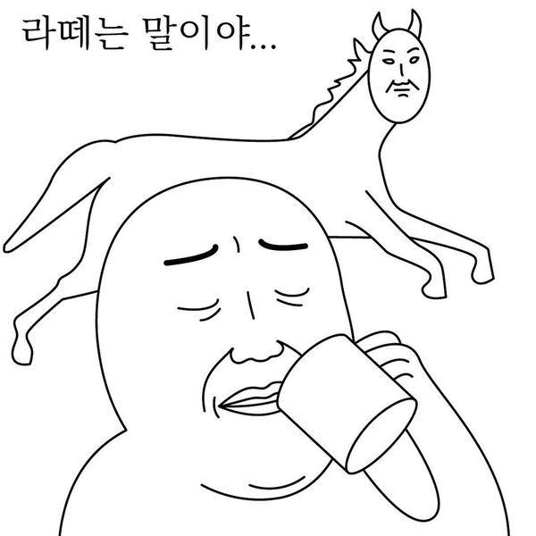
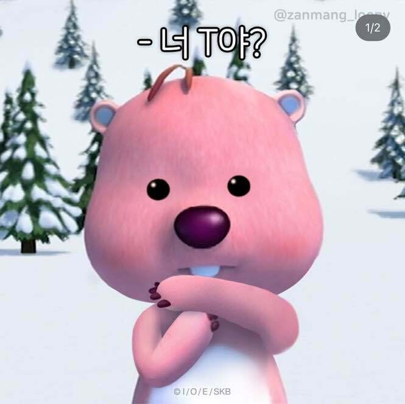
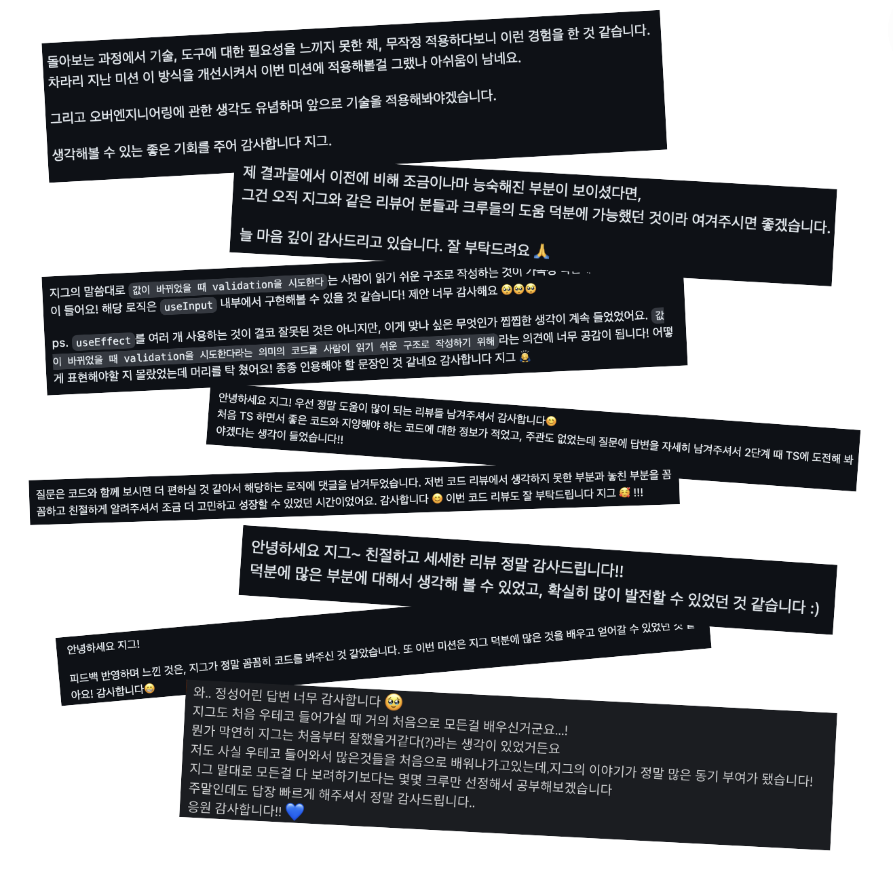
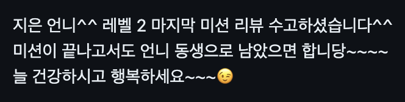
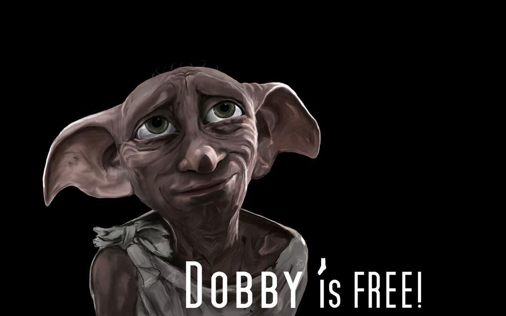

<!-- more -->

---

## 시작하게 되었다 

올해 2월, 내가 3년 전에 졸업한 우테코의 리뷰어 활동을 시작하게 되었다. 

사실 부업(💰)이 하고 싶어서 시작한 것이 크지만,

리뷰어 지원서에 쓴 것처럼 코딩만큼 코드리뷰하는 것을 즐기긴 했다.

## 생각보다 빡셌던 일정

일정 자체가 빡셌다기보다는, 크루의 리뷰요청에 24시간 이내로 응답해야 하는 점이 빡셌다.

~~(나 때는 24시간이 뭐야, 일주일도 기다렸다구..)~~ 

## 코멘트로 드러나는 인성(?)

사실 처음에 코드의 양에 많이 압도 당하고 좀 힘들었나보다. 

한번 더 생각하고 지웠다가 다시 코멘트를 남겨도, 몇몇 크루들에게 상처를 줬던 것 같아 미안하다.

리뷰어 중간 회고 및 다른 동기 리뷰어들과의 이야기를 통해, 내가 상대적으로 넘 까칠했던(ㅎㅎ) 것을 깨닫고 반성했다. 변화하려(=애써 웃느라) 애썼고, 다행히 그렇게 레벨2에서는 크루들이 변화한 내 모습을 알아주는 것 같았다. 

매 미션이 끝나고 크루들과 상호평가를 하면서도, 진짜 커뮤니케이션이 뭔지, 소프트 스킬을 어떻게 갖춰나가야 하는지 나 스스로도 여러 고민들을 할 수 있었다. 

## 크루들에게서 배운다

예상치 못하게도 크루들에게서 가장 많이 배운 것은, '자바스크립트 최신 문법'이었다. 

나... 취업하고 회사에선 쓰는 것만 썼지, 개발자들을 위한 어떤 빌트인 함수가, 어떤 플러그인이 추가되었는지 전혀 따라잡지 못하고 있었잖아 😇

또 학습의 자세를 본받았다. 

때로는 크루 스스로의 학습을 핑계 삼아 키워드만 던져주고 구체적인 설명을 하지 않을 때도 있었는데, 

크루 본인만의 의견을 논리있게 잘 설명하거나, 내가 내민 의견을 진지하게 탐구하고 고민하여 또 다른 방안을 내놓는 모습이 멋지다고 생각했다. 

나태해진 멘토의 정신에 바람을 불어넣어주었던 고마운 크루들.

그리고 이미 취업이 준비된 듯한 크루들도 많이 보였다. 당장 우리팀에 채용시켜도 될 만큼... ㅎㅎ 

## 크루들에게서 (나쁜 것도) 배운다 

이 글을 크루들이 보지 않길 바라지만, (내 블로그는 이미 털린 것 같지만),

크루들의 몇몇 잘못된 모습들을 보고 나도 조심해야겠다, 는 생각들도 했다.

가볍게 정리하자면 다음과 같은 것

1. 내용을 구구절절 쓰지 말자. 간결하게 정리하고 질문하자. 
2. '잘하는 코드'를 작성할 필요는 없지만, 적어도 '돌아가는 버전'의 코드를 올리도록 하자. 
3. 못했으면 못했다고 하자. 징징거리거나, 핑계 대지 말자.

적어놓고 보니 역시 MBTI T가 맞는 것 같다.

## 그래도 역시 뿌듯함

미션 중간중간, 또는 미션이 끝나고 PR 코멘트나 DM을 통해 감사인사를 전해오는 크루들이 꽤 있었다. 

내가 남긴 리뷰가 큰 도움이 되었다고, 앞으로 더 잘할 수 있는 동기를 부여받은 것 같다고. 

나는 사실 좋은 멘토는 아니라고 생각했는데, 그래도 나를 통해 하나라도 얻어갈 수 있었다면 나 역시도 감사한 일인 것 같다.

중간중간 페어 미션에서의 어려움이나, 본인의 성장, 학습 방법 등에 대해 고민을 나누는 크루들도 있었다. 

나 이런 거 정말 상담해주는 스타일 아닌데 ㅠ 또 이렇게 물어보면 정성스레 대답해줄 수밖에 없다. 그리고 나도 3년 전에 많이 배우기도 했고. (이럴 줄 알았으면 나도 그때 용기 내서 더 물어볼걸 그랬다.)

모든 미션이 마무리되고 6명의 크루와 (한꺼번에...) 커피챗을 했었는데, 깃헙 코멘트로만 만나던 크루들을 실제 움직이는 사람(?)으로 만나니 나 역시도 신기했다. 그리고, 3년 전의 내 모습과 크게 다르지 않은 것 같아서. 왠지 모를 애틋함도 쪼끔~ 있었고.

참으로 독특한 크루도 있었다. 나를 기죽이던 그대... 잊지 못할듯.

## 다시 한다면? 

안 할 것 같은데, 그러면 사실 큰 수입원이 사라지는 만큼 아쉽기도 하겠지. 😇 

경험이 나빴어서 다시 안 한다기보다는, 교육에 큰 뜻이 있는 것이 아니라면 여러 번 할 필요는 없다고 생각했다. 

그렇지만 슬슬 일이 루즈해져 가던 3년차 개발자에게 멘토로서의 경험은 분명 알차고 소중한 시간이었고, 

이제 다 끝나서 후련하고 신난다! 

