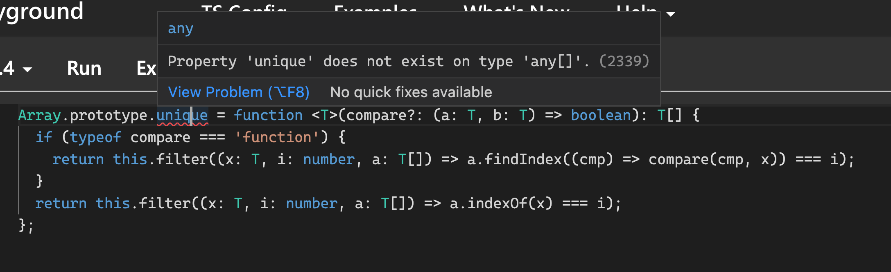

전쟁이라니

<!-- more -->

---

## 배워가기

### SCSS에서 믹스인 사용하기

`@mixin`을 통해 원하는 스타일을 미리 지정하고, `@include`를 통해 해당 스타일을 가져다 쓸 수 있다.

```scss
@mixin reset-list {
  margin: 0;
  padding: 0;
  list-style: none;
}

@mixin horizontal-list {
  @include reset-list;

  li {
    display: inline-block;
    margin: {
      left: -2px;
      right: 2em;
    }
  }
}

nav ul {
  @include horizontal-list;
}
```

**Ref** https://sass-lang.com/documentation/at-rules/mixin

### for loop에서 Promise 함수 호출하기

배열을 순회하며 어떤 동작을 수행할 때 `for~of` 구문을 쓰기도 하지만, 가독성을 위해 `forEach` 함수를 사용하기도 한다.

```jsx
const arr = ["a", "b", "c"];
arr.forEach((elem) => console.log(elem));
```

어떤 배열을 순회하며 배열의 각 요소에 대해 비동기 함수를 실행하고 싶을 때는 어떻게 할까? `setTimeout`으로 `Promise`를 리턴하는 함수를 만들고, `forEach`의 콜백 함수에 `async~await`을 붙여 비동기를 실행해보자.

```jsx
const getPromise = (elem) => {
  return new Promise((resolve) =>
    setTimeout(() => resolve("promise " + elem), 1000)
  );
};

const arr = ["a", "b", "c"];
arr.forEach(async (elem) => {
  const value = await getPromise(elem);
  console.log(value);
});
```

‘promise a’, ‘promise b’, ‘promise c’가 1초(1000ms)마다 순차적으로 나올 것이라고 생각했지만, 실제로는 1초 뒤에 ‘promise a’, ‘promise b’, ‘promise c’가 동시에 출력된다.

`forEach`는 배열의 요소를 순회하면서 콜백을 실행할 뿐, 콜백이 끝날 때까지 기다려주지 않기 때문이다. 즉 `forEach`는 자신이 실행하는 함수가 비동기인지 아닌지 관심이 없다.

원하는 목적을 달성하기 위해서는 `for~of`를 사용할 수 있다.

```jsx
for (const elem of arr) {
  const value = await getPromise(elem);
  console.log(value);
}
```

for문 자체에 `await` 키워드를 걸 수도 있다.

```jsx
for await (const elem of arr) {
  const value = await getPromise(elem);
  console.log(value);
}
```

> 💡 꼭 순서를 기다릴 필요 없이 배열을 순회하며 비동기 함수를 실행하고 싶다면 `Promise.all`을 사용할 수도 있다.

**Ref** https://kyounghwan01.github.io/blog/JS/JSbasic/for-await-of/#for-await-of

### ReactElement의 type 프로퍼티

`ReactElement`에는 `type`이라는 프로퍼티가 있다. `type` 말고도 `props`, `key` 프로퍼티도 있다!

```tsx
interface ReactElement<
  P = any,
  T extends string | JSXElementConstructor<any> =
    | string
    | JSXElementConstructor<any>
> {
  type: T;
  props: P;
  key: Key | null;
}
```

React 컴포넌트의 이름을 구분해주는 역할인 것 같다. 다음과 같이 활용할 수 있다.

```tsx
class SomeClass {
  get children(): JSX.Element[] {
    const { children } = this.props;
    if (!children) return [];
    if (isArrayLike(children)) return children as JSX.Element[];
    return [children];
  }

  hasListItem() {
    return this.children.find((child) => child.type === ListItem);
  }
}
```

### TypeScript 기본 타입 증강

JavaScript에서는 prototype 속성에 새로운 프로퍼티를 정의해서 사용할 수 있다. TypeScript에서도 마찬가지로 prototype을 확장해서 `class`나 `interface` 레벨의 확장이 가능하지만, 그냥 작성할 시 컴파일러가 오류를 내뱉는다.



이때는 ‘선언적 확장(Declaration Merging)’을 사용하면 된다. `declare` 키워드로 TypeScript 컴파일러에게 특정한 타입이 있음을 말해주는 것 과 마찬가지로, 선언적 확장을 사용하면 이미 정의된 타입의 이름과 똑같이 정의한 다른 타입을 merge할 수 있다.

위 예시에서처럼 `Array`나 `String` 같은 내장 타입(전역 타입)을 선언적 확장시켜주고 싶다면, `declare global`에 정의해주면 된다.

```tsx
declare global {
  interface Array<T> {
    unique(compare?: (a: T, b: T) => boolean): T[];
  }
}

Array.prototype.unique = function <T>(compare?: (a: T, b: T) => boolean): T[] {
  // ...
};
```

이제 `Array`에서 `unique` 메서드를 사용할 수 있게 되었다!

```tsx
const arr = ["a", "b", "b", "c", "a"];
arr.unique();
```

**Ref** https://m.blog.naver.com/mym0404/221801643812

### theme color를 정의하는 방법

- theme 명명법에서 `gray_1`보다 `gray_100`처럼 100 단위로 작성하면 추후에 중간값이 생기게 될 경우 처리하기 용이하다.
- 명명법은 통일하는게 좋다. (`gray1`/`gray_1`/`gray_100`/`light_gray` 등)

### React에서 DOM 건드리기를 지양해야하는 이유

element에 `onfocus` 이벤트를 직접 설정해주는 외부 모듈이 있을 때, 해당 자식 컴포넌트를 렌더링하는 부모 컴포넌트에서 `ref`를 prop으로 내려줄 때 부모 컴포넌트가 리렌더링됨에 따라 해당 자식 컴포넌트도 새롭게 만들어지면서 element의 `onfocus`가 소멸되는 문제가 발생했다.

이렇게 `ref`를 사용하는 내부 컴포넌트의 경우, 컴포넌트 내부가 아닌 외부에서 `ref`를 직접 넘겨주는 게 방법이 될 수도 있다.

### html `size` 속성

- `input`과 같은 텍스트 입력일 경우에 폼의 기본 너비를 문자의 수만큼 설정한다.
- `select`와 같은 입력 폼이 경우, 선택할 수 있는 아이템 개수를 초기에 몇 개를 보여줄 지 설정할 수 있다.

### pnpm vs yarn

monorepo의 구현을 위해 `pnpm`과 `yarn` 패키지 매니저로 dependency 목록을 설치했을 때 차이점이 있다.

- `pnpm`의 경우 각 프로젝트가 의존하고있는 패키지들을 프로젝트 루트 폴더의 `node_modules` 아래에 설치한다
- 반면에 `yarn` 패키지 매니저의 경우는 hoist를 통해 monorepo 최상단 `node_modules` 아래에 설치를 한다.

### 폰트의 기준선과 글자별 크기

폰트의 기준선과 글자별 크기는 다음과 같은 특징을 가진다.

- 폰트마다 지정된 위치가 다르다.
- OS마다 표현하는 방식이 다르다.
- 브라우저마다 표현하는 방식이 다르다.
- 따라서 표준화되지 않은 방식으로 한 플랫폼을 기준으로 작업이 이루어지면 다른 플랫폼에서는 원하는대로 결과물이 나오지 않을 수 있다.
- 즉 강제조정을 위해 여백을 조정하는 css 속성을 사용하는 것은 특별한 요청이 없다면 지양해야 한다.

### height: 100%, 100vh

상위 태그 (`html`, `body`)에서 `height`를 `100%`이나 `100vh`로 지정하는 것을 지양해야 한다.

`html`, `body`에 `height: 100% | 100vh`을 지정할 경우, 데스크탑 브라우저 환경에서는 문제가 없이 느껴질 수 있다. 그러나 다른 환경에서는 컨텐츠의 정확한 높이를 브라우저가 알지 못해 스크롤에 문제가 생길 수도 있다.

만약 화면에 비해 컨텐츠가 부족할 때 공백이 필수적으로 필요한 경우에는 `min-height: 100vh`를 사용하는 것을 추천한다.

**Ref** https://greggod.medium.com/css-do-not-put-height-100-on-the-body-html-e36bda3551b3

### `useEffect`에서 DOM 요소 `ref`로 사용하기

DOM 요소의 `refObject`를 `useEffect`에서 접근할 때는 아래와 같은 문제들이 발생할 수 있다.

1. DOM 요소가 mount 되었다는 게 보장되지 않는다.
2. `ref`를 붙인 DOM 요소를 조건부 렌더링하는 경우도 있다
3. `refObject`가 `null`이 아니라는 것이 보장되지 않는다

### TypeScript에서 객체 배열 타입 지정하기

TypeScript에서 A type, B type이 있고 A가 B에 포함되는 관계라 하자. A 또는 B type의 객체 배열을 타이핑해주고 싶을 때, (A|B)[]로 선언할 경우 정확히 A 또는 B 타입의 배열로 잡아주지 못한다. A type 객체에 다른 property가 더 포함된, 즉 A도 B도 아닌 객체의 type에 대해 컴파일 에러를 안 뱉어준다.

이에 대해 `infer` 등의 키워드로 접근해봤으나 실패하고… 아주 맘에 들진 않지만 [tagged union](https://mariusschulz.com/blog/tagged-union-types-in-typescript)의 방법을 찾아보기도 했다.

그러다가 한분께 받은 해법이 아래와 같은데,

```tsx
export type Without<T, U> = { [P in Exclude<keyof T, keyof U>]?: never };

export type XOR<T, U> = T | U extends Record<string, unknown>
  ? (Without<T, U> & U) | (Without<U, T> & T)
  : T | U;
```

100% 이해하지는 못하겠다 😵

### HTTP 요청할 때 호스트를 변경하는 방법

`(sudo) vi /etc/hosts` 파일에 들어가 127.0.0.1에 원하는 호스트를 아무거나 맵핑시켜놓으면 된다.

```
127.0.0.1       gift-local.baeminbaemin.com
```

이렇게 하면 localhost:4000 말고도 gift-local.baeminbaemin.com 으로 로컬 서버에 접속할 수 있다. 대신 요청 호스트는 gift-local.baeminbaemin.com 으로 바뀐다.

### typescript **Record** 키워드

`Record<key, Type>`의 형태로 사용한다.

인덱스 시그니쳐와 역할이 비슷해보이는데, Record는 key에 문자열 리터럴/enum 을 사용할 수 있다. 즉 key를 제한할 수 있다. `keyof` 키워드와 조합해서 사용하면 더 유용하다.

### response와 request에 따라 axios 에러 처리하기

axios의 에러 부분에서 response/request 필드 존재 여부를 통해 다르게 처리할 수 있다.(응답이 있을 때/없을 때/그 외)

```tsx
private axiosErrorHandler(error: AxiosError<ServerErrorData> | Error) {
  if (!axios.isAxiosError(error)) {
    return error.message;
  }

  if (error.response) {
    return this.createRemoteServerError(error.response.data.message, error.response.data.statusCode);
  } else if (error.request) {
    return this.createNoResponseError(NaN);
  }

  return error.message;
}
```

### axios instance option - `validateStatus`

에러 시 재요청 등을 처리해줄 때, 불친절한 error 객체와 구분해서 `AxiosResponse`를 이용해 작업을 수행시킬 수 있다.

default value는 `status in [200, 300)`이다. 이를 `status in [200, 500)`으로 처리해주면 2xx, 3xx, 4xx를 모두 `AxiosResponse`로 받아 에러임이 확실할 때만 error로 throw해 `onError` 로직을 수행시킬 수 있다.

### webpack v5에서 지원하지 않는 polyfill

webpack v5에서는 더이상 node polyfill을 지원하지 않기 때문에, 직접 설정에 추가해야한다. 그런데 우리가 사용하던 node 내장 모듈들의 polyfill을 추가하지 않고 web api로 변경하는 방법도 있다. 다음은 그 예시다.

- crypto ➡️ web crypto api
- Buffer ➡️ TypedArray(Uint8Array)
- String encoder/decoder ➡️ TextEncoder/TextDecoder

### 반드시 해야하는 테스트

- API Response 테스트
- 에러 상황에 대한 테스트 (400, 500 등)
- 에러가 되었을때 fallback 테스트
- 비즈니스 로직 테스트 (hooks, models 테스트)
- e2e는 전체 flow를 기반으로 테스트

### 이것저것

- `ttypescript`를 사용하면 `tsconfig`에서 플러그인을 명시하여 기능을 확장할 수 있다.

- `typescript-transform-paths`를 통해 절대 경로를 사용할 수 있다.

- Swiper 라이브러리를 사용하면 간단하게 Carousel을 구현할 수 있다.

- `Object.entries`나 `Object.keys`를 사용했을 때 TypeScript에서는 key 값이 string 타입으로 지정된다. key 값을 특정 타입으로 지정해주고 싶을 때는, 타입 단언(type assertion)이 한 가지 해법이 될 수 있다.

- [useCallback을 사용하는 적절한 타이밍](https://dmitripavlutin.com/dont-overuse-react-usecallback/)

- 라이브러리 관련 개발에는 rollup, 웹 애플리케이션 개발에는 webpack이 주로 사용되는데, 주된 이유는 ES Modules export 지원 여부이다. 이 덕분에 트리 셰이킹 지원이 용이해진다.

- 조건부 렌더링을 하는 컴포넌트에서 조건이 복잡하면, 따로 변수로 조건을 빼서 사용하는 것이 더 가독성이 좋다.

- 단순 전달의 의미를 가지는 props는 나머지 매개변수 문법을 사용하는 것이 가독성에 더 좋다.

- css의 `white-space` 속성은 글자뿐만 아니라 다른 element들에도 적용되는 속성이다.

- aws cloud front에서 behavior로 CORS를 줄 수 있다. simpleCORS 정도만 선택해도 충분하다.

- Joi를 사용하여 API validation이 가능하다. `Joi.object({}).pattern(Joi.string(), Joi.array().items(Joi.string))`으로 `Record<string, string[]>`에 대한 validation을 수행할 수 있다.

- `toLocaleString`에 `minimumIntegerDigits` 옵션을 통해 숫자 앞에 0을 채울 수 있다. (ex. 2 ➡️ 02, 12 ➡️ 12)

- 서버 post 요청 시 웹 방화벽 차원에서 에러가 발생하면 html 형태로 response가 온다. 이 경우 response header의 `content-type`을 검사해서 예외를 처리해주면 된다.

- `backface-visibility` 속성은 요소의 뒷면이 사용자를 향할 때 보여야 하는지 지정하는 css 속성이다.

- `fs.existSync`를 통해 파일 존재 여부를 확인할 수 있다.

- styled-components에서 `${(props) => props.~}`가 많아질 때는, 최상위에서 ` ${(props) => css``} ` 를 반환해주면 props 쓰는 부분이 조금 더 깔끔해진다.

- react-router는 path-to-regexp 패키지에 의존하고 있다. 그래서 정규식으로 path 설정이 가능하다.

- 기본적으로 `@types` 폴더안에 d.ts파일들을 넣어두면 알아서 컴파일에 포함된다고 한다. 그렇지 않다면 “typeRoots”에 해당 폴더를 추가해주자.

- tsConfig 파일에서 `extends: “A/tsconfig.json”;` 속성을 넣으면 A/tsconfig.json 파일의 타입스크립트 설정들을 가져올 수가 있다. 이를 통해 monorepo에서 root에 tsconfig를 가져옴으로써 일반적인 config를 공유할 수 있다.

- 모노레포에서 한 패키지의 모듈이 다른 패키지에서 사용 된다면 import 구문 경로 설정을 ‘잘’ 해줘야한다. 내 패키지에만 설정되어있는 alias 혹은 단축경로로는 다른 패키지에서 못찾는다. 상대경로나 절대경로로 설정해주자.

- JavaScript에서 cookie를 다루기 쉽게 해주는 [js-cookie](https://github.com/js-cookie/js-cookie)라는 라이브러리가 있다.

- package.json의 `scripts`에 `cross-env`를 작성해주면, 운영체제나 플랫폼에 종속되지 않고 동일한 방법으로 `env` 변수를 주입해줄 수 있다.

  ```jsx
  // package.json
  "scripts": {
    "start": "npm run start:beta",
    "start:dev": "cross-env PROFILE=dev node dev_server/server.js",
    "start:prod": "cross-env PROFILE=prod node dev_server/server.js"
  ```

- axios 요청에 `timeout` 을 옵션으로 줄 수 있다.

  ```jsx
  const instance = axios.create();

  // 라이브러리의 timeout 기본 값을 2.5초로 정의하여
  // 인스턴스의 모든 요청은 2.5초 동안 대기 후 타임아웃 처리된다.
  instance.defaults.timeout = 2500;

  // 최종적으로 인스턴스에 설정된 timeout 구성 값 5000으로 덮어쓴다.
  instance.get("/longRequest", {
    timeout: 5000,
  });
  ```

**Ref** https://yamoo9.github.io/axios/guide/config-defaults.html

---

## 기타

### WCAG 접근성 가이드를 보기 좋게 정리해 둔 A11Y 프로젝트!

**Ref** https://www.a11yproject.com/

### TypeScript 4.6 RC

RC는 **Release Candidate**의 약자라고 한다.

아래와 같은 기능들이 등장했다.

- Allowing Code in Constructors Before super()
- Control Flow Analysis for Destructured Discriminated Unions
- Improved Recursion Depth Checks
- Indexed Access Inference Improvements
- Control Flow Analysis for Dependent Parameters
- –target es2022
- More Syntax and Binding Errors in JavaScript
- TypeScript Trace Analyzer
- Breaking Changes

**Ref** https://devblogs.microsoft.com/typescript/announcing-typescript-4-6-rc/

### State of JS 2021

JavaScript 기념 티셔츠를 주는데, 진짜 못생겼다. 사진도 안 가져올란다.

아래는 대체 어떤 의도의 차트인지 모르겠다. 😬


**Ref** https://2021.stateofjs.com/en-us/

---

## 마무리

3일 동안 배민컬쳐캠프를 했다. 열심히 나대서(?) 쿠폰을 4장 받았다. 다 배민쿠폰이라, 당분간은 또 배민 공짜로 이용할 듯하다. 배민의 철학과 역사, 서비스 각 분야에 대한 소개, 그리고 구성원들을 생각하는 가치관이 정말 뚜렷한 회사라는 생각이 들었다. 자부심을 가질 만하다!

드디어 운동을 시작했다. 2회는 필라테스, 1회는 헬스장 가서 유산소를 할 생각이다. 근데 내가 시작하자마자 필라테스 선생님이 코로나에 걸리셨다… 나 때문도 아니고, 내 수업 이후에 접촉하신 거라 상관은 없지만 그냥 속상하다. 그리고 나도 증상이 있어서 자가검진키트를 급하게 사와서 써봤다. 다행히 음성이다. 그냥 피곤했나보다.
