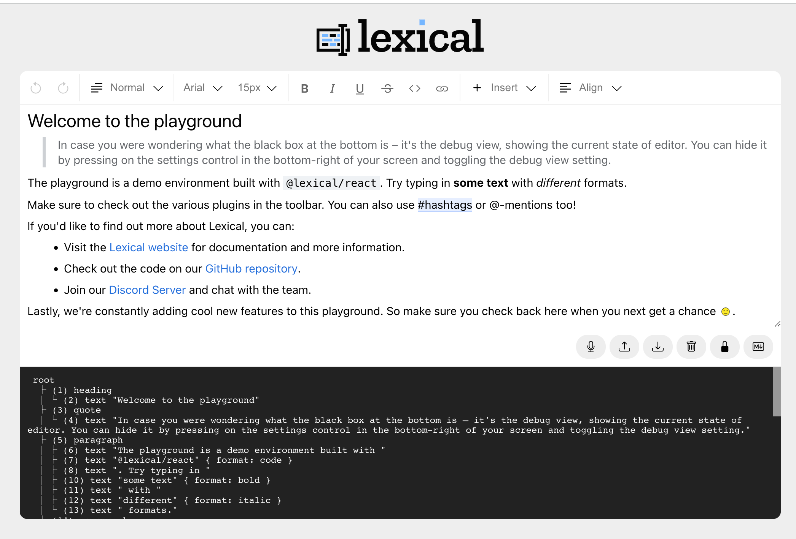

봄엔 역시 기상이변

<!-- more -->

---

## 배워가기

### requestAnimationFrame

화면에 새로운 애니메이션을 업데이트 할때 `requestAnimationFrame()` 메소드를 호출하면 브라우저가 리페인트를 수행하기 전 애니메이션 함수를 실행한다.

`setTimeout()`, `setInterval()`은 비동기로 처리되므로 프레임의 시작 시간을 보장할 수 없어서, 60프레임의 프레임 시간(16ms) 를 초과하여 프레임 누락 현상이 발생할 수 있다.

> 60프레임이라는 것은, 1초에 60회를 콜백을 수행한다는 뜻이다. 1초 즉 1000ms동안 60회 콜백이 실행된다는 것은, 콜백이 한번 실행되는 데 약 16ms(1000ms / 60)가 걸린다는 것으로 해석할 수 있다. 일반적으로 `requestAnimationFrame()` 함수는 초당 60프레임에 해당하는 주기로 호출되며, 대부분 브라우저에서는 현재 모니터의 출력 주기와 같게 호출된다.

`requestAnimationFrame()` 은 60프레임을 찍어낼 여유가 생길때마다 애니메이션 코드가 실행된다. 좀 더 정확히는 60프레임이 아닌 디스플레이 주사율(Ex: 60Hz, 144Hz 등)에 맞추어서 실행하게 된다.

**Ref** https://blog.makerjun.com/411591d9-c47b-4d8d-8f9e-1246d8dd1a2f

### 206 Partial Content

HTTP 206 Partial Content는 Range 헤더에 기술된 데이터 범위에 대한 요청이 성공적으로 응답되어 바디에 해당되는 데이터를 담고 있다는 것을 알려준다.

```
HTTP/1.1 206 Partial Content
Date: Wed, 15 Nov 2015 06:25:24 GMT
Last-Modified: Wed, 15 Nov 2015 04:58:08 GMT
Content-Range: bytes 21010-47021/47022
Content-Length: 26012
Content-Type: image/gif
```

해당 응답값을 이용하면 동영상 스트리밍을 만들 수 있다. 미리 볼 수 있는 데이터를 206을 이용해 넣어두면, `<video>` 태그가 알아서 처리해준다.

**Ref** https://developer.mozilla.org/ko/docs/Web/HTTP/Status/206

### dp: density-independent pixel

dp(density-independent pixel)는 1인치당 픽셀 밀도에 따라 크기가 일관된 UI를 보여줄 수 있는 단위다.

- ppi(pixel per inch) - 1인치에 들어가는 px량
- dp = 1px \* 160 / ppi
- px = 1dp \* ppi / 160

ex) 아이폰 11 프로에 너비 200에 알맞는 사이즈는?

- `200 * 458 / 160 = 572.5px` 짜리 이미지 써야한다.

### autocomplete

텍스트와 숫자를 입력할수 있는 `input`, `texture`, `selects`, `form` 요소에 `autocomplete` 속성을 이용하여 자동완성 기능을 사용할 수 있다. (email, username, family-name 등)

속성에 `autocomplete=off`를 넣어주면 브라우저의 자동완성을 금지한다. 보안상 문제로 자동완성을 사용하지 않아야 할 경우 지정할 수 있다.

하지만 대부분의 모던 브라우저에서는 `autocomplete=off`로 지정하더라도, 계정 이름과 비밀번호 저장 여부에 대해서는 자동완성을 막을 수 없다. 이런 경우 `autocomplete=new-password` 속성을 주면 새로운 비밀번호를 입력하게끔 만들어, 자동완성을 방지할 수 있다. (하지만 `new-password`는 safari 브라우저 에서는 아직 지원하고 있지 않다.)

### Fetch API

`fetch()`의 request body에 `File` 타입의 인자를 담으려고 하면 타입 에러가 난다.

```jsx
// body 에서 타입 에러
async (file: File) => {
  await fetch(url, { body: file });
};
```

fetch의 body는 `ArrayBuffer` | `ArrayBufferView` | `NodeJS.ReadableStream` | `string` | `RLSearchParams` | `FormData` | `undefined` 타입을 가질 수 있는데, file의 경우 `Blob` 타입이기 때문에 해당되지 않는다. (API 명세에는 Blob/File 를 가지는 것으로 나오기 때문에 JavaScript에서는 가능하다.)

위 문제는 두 가지 방법으로 해결할 수 있다.

첫 번째는, `Blob` 타입인 파일을 `FileReader` API 를 통해 `ArrayBuffer`로 읽는 것이다.

```jsx
const reader = new FileReader()
reader.onloadend = async () => {
  const arrayBuffer = reader.result // string | ArrayBuffer | null
  await fetch(url, { body: arrayBuffer as string | ArrayBuffer })
}
reader.readAsArrayBuffer(file)
```

두 번째는, `FormData` 인터페이스를 이용하는 것이다.

```jsx
const formData = new FormData();
formData.append("files", files);

fetch(url, { body: formData });
```

**Ref**
https://developer.mozilla.org/ko/docs/Web/API/Fetch_API
https://developer.mozilla.org/ko/docs/Web/API/FormData

### 딥링크 vs 모바일 딥링크

딥링크와 모바일 딥링크는 다르다. 흔히 얘기하는 딥링크는 모바일 딥링크이다.

- 딥링크: 특정 페이지에 도달할 수 있는 링크
  - 그냥 링크: https://www.youtube.com/
  - 딥링크: https://www.youtube.com/watch?v=kHvOq16eyU8

모바일 딥링크는 모바일 어플리케이션의 특정 페이지에 도달 할 수 있는 링크로, 주로 `Scheme://Path` 의 형태를 가진다. 웹의 프로토콜인 `http://` 처럼 유튜브는 `youtube://`, 배민은 `baemin://` 라는 프로토콜을 가지고 있다.

딥링크에는 3가지 방식이 있다

1. URI Schemes - iOS (iOS9 이전까지의 표준 딥링크 형식)
2. **유니버셜링크(Universal Links) - iOS (iOS9부터 그 이후의 표준 딥링크 형식)**
3. Android App Links - AOS (유니버셜링크와 같은 방식으로 동작)

딥링크 기술의 변화

- **다이렉트 딥링크(Direct Deep Link)**

  - 초창기의 딥링크 형태. 앱이 설치된 유저의 경우 앱의 특정 페이지로 이동된다.
  - 한계점: 앱이 설치되지 않은 유저의 경우 각 플랫폼의 앱스토어로 이동하며, 설치 후 앱을 열었을 때 딥링크는 유실된다.

- **디퍼드 딥링크(Deferred Deep Link)**

  - 다이렉트 딥링크의 한계점 극복: 설치 후 앱을 열었을 때에도 링크가 유실되지 않고 특정 컨텐츠로 이동된다.
  - 한계점: 플랫폼(iOS, AOS)별로 각각 링크를 만들어야 한다.

- **원링크(One Link)**
  - 하나의 링크에서 각각의 플랫폼으로 자동 분기처리해준다.

### React-Native와 React의 V-DOM

React-Native는 React의 V-DOM을 기반으로 동작한다.

React의 V-DOM은 성능 최적화 기능을 수행하는 것으로 많이 알려져있다. V-DOM은 또 개발자의 코드와 실제 렌더링되는 것 사이의 중간 레이어를 담당한다. 따라서, ‘실제화면에 어떻게 보여야할지에 대한 추상화의 역할’ 도 수행한다.

즉 React가 ‘개발자 코드’를 ‘V-DOM’으로 만들어 ‘웹브라우저’에 표현하는 것이라면,’React-Native’는 ‘개발자 코드’를 ‘V-DOM’으로 만들어 ‘모바일플랫폼’에 표현하는 것이다.

> 단, 렌더링 정보가 담긴 V-DOM에서 실제 플랫폼 인터페이스를 호출하는 **브릿지**는 따로 만들어야 한다. 오픈소스 등을 보면 React를 이용하여 window/우분투/VR 어플을 개발하는 경우도 있는데, 이것도 모두 누군가 V-DOM 플랫폼을 잇는 **브릿지**를 개발한 것이다.

### React에서의 XSS(cross-site-scripting)

일반적으로 리액트 DOM은 jsx 내 모든 값을 렌더링 이전에 자동으로 이스케이프 하기 때문에 일반적인 공격은 작동하지 않는다. 그러나 위지윅 에디터 같은 html 문자열을 html 형태 그대로 보여줘야되는 경우 `innerHTML` 을 사용해야되는데, 이때 XSS 공격에 노출될 수 있다. 이때 React에서 사용할 수 있는 것이 `dangerouslySetInnerHTML`이다.

`dangerouslySetInnerHTML`은 리액트에서 `innerHTML` 대신에 DOM에 바인딩할 수 있는 메소드로, `innerHTML`과 동일한 기능이지만 위험하다는 것을 상기시키기 위해 이렇게 명명했다.

`innerHTML` 와의 차이점은 `dangerouslySetInnerHTML` 은 React diffing 알고리즘에서 수정된 노드를 무시하도록 설계되어 있어 해당 노드의 검사를 우회하기 때문에 성능상의 이점이 있다는 것이다.

**🧼 HTML sanitizer**
`dangerouslySetInnerHTML`의 값은 jsx처럼 자동으로 이스케이프되지 않기 때문에 기본적으로 XSS 공격에 노출되어 있다. 이를 방지하기 위해 HTML sanitizer 를 통해 HTML 의 모든 위험한 부분을 제거하고 안전한 부분만 남길 수 있다.

sanitizer 를 자체적으로 개발하기보다는 오래 유지되어온 [DOMPurify](https://www.npmjs.com/package/dompurify) 같은 라이브러리를 사용하거나, JavaScript의 최신 API인 [Sanitizer API](https://developer.mozilla.org/en-US/docs/Web/API/HTML_Sanitizer_API)를 사용하나다.

```jsx
// XSS 공격


// HTML sanitizer 적용

// DOMPurify sanitizer 예제
import DOMPurify from 'dompurify';
const content = ''

return (<div dangerouslySetInnerHTML={{__html: DOMPurify.sanitize(content)}}></div>);
```

👩‍🏫 개발자가 DOMPurify 라이브러리에 의존하지 않도록 되도록 `dangerouslySetInnerHTML` 속성에 할당하는 기능을 캡슐화한 컴포넌트로 구성하는 것이 좋다.

### fast-forwarded merge vs 3-way merge

**fast-forwarded merge**
`master` 브랜치에서 분기한 `bugfix` 브랜치가 있다고 가정해보자. `master`의 이력을 전부 포함하고 있는 `bugfix` 브랜치를 `master` 브랜치로 머지하려고 했을 때, `master` 브랜치가 `bugfix` 브랜치로 이동하기만 해도 내용을 모두 적용할 수 있다. (이때, `master` 브랜치는 `bugfix` 브랜치가 분기된 후로 변경되지 않은 상태여야 한다.)
이러한 머지를 fast-forwarded merge라고 한다.

**3-way merge**
앞선 상황에서 `bugfix` 브랜치가 분기된 후 `master` 브랜치에 새로운 커밋이 추가되었을 때는 fast-forward를 할 수 없다. 그래서, `master`와 `bugfix`의 공통 조상 커밋(base)과 각 브랜치의 가장 마지막 커밋 2개를 이용하여 새로운 커밋을 만드는데 이를 3-way merge라고 한다.
이때 base 커밋을 참고하면서 각 브랜치의 마지막 커밋들의 변경사항을 서로 체크하며 머지가 이루어진다. 3-way merge가 진행되었을 때는 `Merge made by the 'recursive' strategy.` 라는 메시지가 뜬다.

### TypeScript의 interface override

`A` interface를 extends하는 `B` interface가 있을 때, `A`의 프로퍼티 `C`를 `B`에서 override 하고 싶다면 override하려는 타입은 `C`의 서브타입이어야 한다.

```tsx
interface A {
  C: number | string;
}

interface B extends A {
  C: number; // boolean 으로 override 할 수는 없다
}
```

`C`의 서브타입이 아닌 다른 타입으로 override하고 싶다면 `Omit` 등을 이용한 유틸리티 타입을 사용해야 한다.

> 👩‍🏫 ambient type definition (.d.ts에서 한 타입 선언)에서는 어떤 타입이던 override 할 수 있다.

### React-Router v6

React-Router v6 에서는 `usePrompt`, `useBlocker`가 더이상 지원되지 않기 때문에 페이지 이탈시 프롬프트 창을 띄우기 위해서는 자체적으로 로직을 구현해줘야 한다.

구현하기 위해서는 [history](https://github.com/remix-run/history/tree/main) 라이브러리 인스턴스를 사용해야 하는데, `history` 인스턴스에 접근하려면 라우터에 이와 같은 방법으로 주입시켜주어야 한다.

```jsx
import * as React from "react";
import * as ReactDOM from "react-dom";
import { unstable_HistoryRouter as HistoryRouter } from "react-router-dom";
import { createBrowserHistory } from "history";

const history = createBrowserHistory({ window });

ReactDOM.render(
  <HistoryRouter history={history}>
    {/* The rest of your app goes here */}
  </HistoryRouter>,
  root
);
```

또는 `UNSAFE_NavigationContext`를 이용하여 전역컨텍스트로 가져올 수 있다.

```jsx
import { BrowserHistory } from "history";
import React, { useContext } from "react";
import { UNSAFE_NavigationContext } from "react-router-dom";

export default function useHistory(): string {
  let [state, setState] = React.useState<string>(window.location.pathname);

	// 커스텀 라우터로 래핑하거나 라우터에 history 인스턴스를 넣어주지 않고 BrowserHistory를 가져온다
  const navigation = useContext(UNSAFE_NavigationContext)
    .navigator as BrowserHistory;
  React.useLayoutEffect(() => {
    if (navigation) {
      navigation.listen((locationListener) =>
        setState(locationListener.location.pathname)
      );
    }
  }, [navigation]);

  return state;
}
```

`history.block`으로 현재 페이지에서 벗어나는것 을 사전에 차단할 수는 있지만, `beforeunload` 핸들러를 내부에서 컨트롤하기 때문에 라우트 이동을 직접적으로 멈추게 할 수는 없는 것 같다.

**Ref** https://reactrouter.com/docs/en/v6/api#unstable_historyrouter

### webpack file-loader의 context 옵션

`context` 옵션을 제공하면, 해당 폴더를 기준으로 asset의 위치가 결정된다.

폴더 구조가 아래와 같이 되어있을 때,

```
-assets
-src
```

`context: "src"`로 설정되어 있으면 asset들은 `build/_/assets`에 생성된다.

### filter 안에서 async 쓰기

JavaScript의 `Array.prototype.filter()` 메서드에는 콜백으로 async 함수를 전달할 수 없다. `forEach()`와 `filter()` 등의 메서드는 동기적으로 동작하기 때문이다.

`map()`과 `Promise.all()`을 이용해서 우회하는 방법을 사용해야 한다.

```jsx
const arr = [1, 2, 3, 4, 5];

const asyncFilter = async (arr, predicate) => {
  const results = await Promise.all(arr.map(predicate));

  return arr.filter((_v, index) => results[index]);
};

const asyncRes = await asyncFilter(arr, async (i) => {
  await sleep(10);
  return i % 2 === 0;
});

console.log(asyncRes);
// 2,4
```

**Ref**
https://stackoverflow.com/questions/47095019/how-to-use-array-prototype-filter-with-async
https://advancedweb.hu/how-to-use-async-functions-with-array-filter-in-javascript/

### compilerOptions target vs lib

tsconfig.json의 `compilerOptions`에는 `target`과 `lib`을 설정할 수 있다.

```tsx
"compilerOptions": {
  "target": "es5",
  "lib": ["es6", "dom", "es2017"],
  // ...
}
```

둘의 차이점은 다음과 같다.

- target
  - TypeScript가 JavaScript 어떤 레벨로 컴파일될지를 명시한다.
  - ES5로 지정할 경우 다운그레이드된다.
- lib
  - 프로젝트에 사용할 타입 정의들로로, 브라우저 런타임에 어떤 문법들이 사용될 수 있는지 명시한다.
  - target을 ES6로 올리지 않으면서도 필요한 최신 문법들을 사용할 수 있다
  - 만약 `lib` 항목을 정의하지 않았다면 `target` 항목에서 지정한 ECMAScript의 버전에 따라 기본값이 정의된다.
  - **ES5의 기본 값:** `dom`, `es5`, `scripthost`
  - **ES6의 기본 값:** `dom`, `dom.iterable`, `es6`, `scripthost`

`target`과 `lib` 외에도 `module`이 함께 언급되는 경우가 있다. `module`의 경우에는 오로지 모듈 시스템을 어떤 버전으로 할 것인지만 정한다. (`commonjs`, `ES Module` 등)

**Ref**
https://www.typescriptlang.org/tsconfig#target
https://norux.me/59

### `try~catch`에 `finally`까지 써줘야 하는 이유

```jsx
try {
  // ...
  setLoading(true);
} catch (e) {
  // ...
} finally {
  // ...
  setLoading(false);
}
```

만약 `finally`문이 아닌 `catch`문에서 `setLoading(false)`를 해준다면, 에러가 발생하지 않아 `catch`문이 실행되지 않는 경우 `loading`은 영원히 `false`로 바뀌지 않을 것이기 때문이다…

---

## 이것저것

- RN은 JavaScript로 작성한 코드가 native에서 사용하는 코드로 변환되는게 아니라, RN을 사용해 만든 프로젝트에 [JavascriptCore](https://developer.apple.com/documentation/javascriptcore)라는 엔진이 탑재되어서, 우리가 작성한 JavaScript 코드들을 앱 내에서 실행시켜주는 것이다.

- AxiosError - axios 요청 중 발생하는 에러 타입 (`config`, `request`, `response` 등의 데이터를 갖고 있다.)이다. `axios.isAxiosError(error)` 로 AxiosError 타입인지 여부를 체크할 수 있다.

- ‘can’t perform a React state update on an unmounted component.’ 에러는 컴포넌트 A를 언마운트 시킨 시점에 A의 state를 변경하려고 할 때 발생한다. `useEffect` 콜백의 리턴문에서 cleanup 처리를 해서 해결할 수 있다. ([Ref](https://kyounghwan01.github.io/blog/React/cant-perform-a-React-state-update-on-an-unmounted-component/))

- 배포 환경에서 실제 로컬환경과 같은 의존성 설치를 위해서 package-lock.json을 원격 저장소에 반드시 push해야 한다.

- `URLSearchParams`를 활용해서 query params를 쉽게 컨트롤할 수 있다. 하지만 모던 브라우저에서만 사용이 가능하기 때문에, `query-string`이라는 라이브러리를 사용하기도 한다.

- 타입스크립트에서 타입은 값들의 **집합**이라고 생각하면 된다. 그래서 공집합은 `never` 타입이며, 따라서 `never` 타입으로 선언된 변수의 범위는 공집합이기 때문에 아무런 값도 할당할 수 없다.

- git은 commit, tree, blob를 `.git/objects` 폴더에 저장하기 때문에 `git reflog`를 통해 삭제된 브랜치(commit)를 복구할 수 있다. (이때 git은 항상 로컬 브랜치의 reflog만을 저장한다.)

- jenkins pipeline에서 agent가 any로 설정되어 있으면 이미지를 자동적으로 불러오기 때문에 node 버전이 상황에 따라 달라질 수 있다.

- jest에는 istanbul이 default로 탑재되어 있어, coverage reporter로 cobertura를 설정하면 diff 에서 어떤 라인이 테스트되었는지 안되었는지를 나타낼 수 있다.

  ```
  npm run test:coverage -- --ci --reporters=default --reporters=jest-junit --coverageReporters=cobertura"
  ```

- npm 커맨드에서 `--ignore-scripts` 를 쓰면 npm scripts의 pre-, post- scripts 실행을 막을 수 있다.

  - ex) `DISABLE_ESLINT_PLUGIN=true npm run build:prod --ignore-scripts` - npm run prebuild 가 실행되지 않는다

- type도 `[key]` 를 활용해 객체 형식 타입의 property의 타입을 가져올 수 있다.

  ```tsx
  type A = {
    a: "hi" | "bye";
    b: number;
  };

  type B = A["a"]; // 'hi' | 'bye'
  ```

- tsconfig에 paths alias를 설정해두면 IDE에서는 잘 동작하는 것처럼 보이지만, 실행할 때 해당 path를 못 찾을 수 있기 때문에 webpack 설정도 함께 해줘야 한다.

  ```jsx
  // tsconfig.json
  // ...
  "paths": {
    "~/*": ["src/*"] // *를 사용하려면 배열로 적어준다.
  }

  // webpack.ts
  "resolve": {
    // ...
    alias: {
      '~': path.resolve(__dirname, 'src'),
    },
  }
  // baseUrl에 따라 다를 수 있다.
  ```

- GitLab CI에서는 환경 변수를 설정해줄 수 있다. 환경 변수로 설정해준 값은 빌드 로그에 노출되지 않기 때문에 Secret Key 같은 값들을 사용할 때 유용하다. GitLab Repo → Settings → CI/CD → General → Variables 에서 설정 가능하다.

- 중첩 `setTimeout`을 이용하는 방법은 지연 간격을 보장하지만 `setInterval`은 이를 보장하지 않는다. `setInterval`은 callback을 호출하는데 소모되는 시간도 포함하기 때문이다. 그래서 CPU가 과부하 상태인 경우, 브라우저 탭이 백그라운드 모드인 경우, 노트북이 배터리에 의존해서 구동 중인 경우에 시간지연에 영향을 줄 수 있다.

- 컨텍스트 밖에서 스타일을 제공하는 것은 지양하자. 스타일이 변경되면서 컨텍스트 전체가 새로 렌더링 되어 성능 저하를 야기할 수 있다.

- `table`의 `tr`에는 `border` 프로퍼티가 없기 때문에, `td`에 먹여야 한다.

- 컴포넌트의 Props가 빈 인터페이스라면 `Record<string, never>`를 사용할 수 있다.

---

## 기타

### aws의 Lambda Function URLs 공개

aws에서 람다에 https 엔드포인트를 추가 할 수 있는 Lambda Function URLs를 공개했다. 드디어 엔드포인트가 필요한 간단한 웹훅이나 기능을 구현할 때 API gateway를 따로 생성할 필요가 없어졌다고 한다.

**Ref** https://aws.amazon.com/ko/blogs/aws/announcing-aws-lambda-function-urls-built-in-https-endpoints-for-single-function-microservices/

### 제품 중심으로 사고하는 소프트웨어 엔지니어 되기

1. 프로덕트 아이디어/의견 내기에 적극적이다.
2. 비즈니스, 유저의 행위, 데이터에 관심 가진다.
3. 호기심, 그리고 날카롭게 “왜”라고 질문한다.
4. 소통을 잘하며, 비개발직군과 좋은 관계를 유지한다.
5. 프로덕트/개발의 트레이드오프를 솔직하게 말한다.
6. 엣지케이스를 실용적으로 다룬다.
7. 프로덕트 검증 사이클을 빠르게 돌린다.
8. E2E 프로덕트 피처에 오너십을 가진다.
9. 반복되는 배움의 사이클을 통해 프로덕트에 강한 영감을 얻는다.

**Ref** https://blog.pragmaticengineer.com/the-product-minded-engineer/

### CRA의 React 18 대응

급하다 급해

**Ref** https://github.com/facebook/create-react-app/releases/tag/v5.0.1

### `@types/react18`에서는 `children`을 직접 명시해라?

라는 Dan 형의 트윗이다. `React.FC`가 불필요하며 사용을 권장하지 않는다고도 한다.

**Ref** https://twitter.com/dan_abramov/status/1512833611401150474

### facebook/lexical

페이스북에서 오픈소스로 공개한 텍스트 에디터다.



오~ 뭐지.

‘Lexical is a framework’라며 뭔가 웅장하게 선보인 것 같다. Editor 인스턴스도 있고, state도 있다. 뭔가 React스럽게 만들려고 한 것 같다. 자체적인 DOM Reconciler를 가지고 성능까지 개선했다고 한다. 역시 페이스북엔 이상한 사람들이 많다…

**Ref** https://github.com/facebook/lexical

### 스타트업을 떠나며 알게된 것들

슬픈 이야기들이 많다. 그중에서도 ‘실패는 그다지 도움이 되지 않는다.’라는 말은, 초기 스타트업 뿐 아니라 인생에서 마주하는 여러 상황에도 들어맞는 말인 것 같다.

**Ref** https://velog.io/@koeunyeon/스타트업을-떠나며-알게-된-것들?fbclid=IwAR3w2lk-esiRIu5Di8wIDoAEFmaturyzUcrORD_oaVZ-A73lXv_RU8molK8

---

## 마무리

예상했던 것처럼 벚꽃이 지고 또 다시 기상이변이 시작되었다. 다이내믹 코리아는 지지 않아! 비도 오고 바람이 너무 심하게 불어서 추웠다. 집에만 콕 박혀있다가, 하루는 김치전에 막걸리 먹으러 나갔당.

다음주부터는 거리두기가 완전 해제된다고 한다. 다음달이면 실외 마스크도 해제될 것 같다. 언젠간 올 날이고, 그렇게 바랐던 날이지만 괜히 엄청 이상하다. 이미 몸은 10시 귀가에 맞춰져버렸고, 마스크를 벗으면 왠지 부끄러울 것 같다. 그래도 바깥 공기 아낌없이 마셔야지.

드디어 팀원 분들도 만날 수 있게 되었다. 그때까지 제발 아무 일도 일어나지 않았으면 좋겠다… 🤷‍♀️
