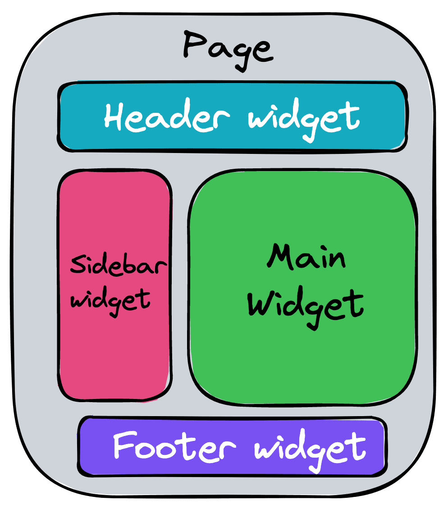
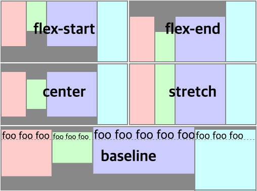

추석 연휴 어디갔는디

<!-- more -->

---

## 배워가기

### Widget Driven Development

위젯 기반 개발(실제 통용되는 용어는 아니다.) 방법론은, 모든 페이지를 '위젯'으로 구분한다. 아래처럼.



각각의 위젯은 서버에서 불러오는 데이터를 중심으로 구분되며, 다음과 같은 특징들을 가진다.

- UI에 필요한 데이터를 불러오고 제공한다
- 필요 시 서버에 데이터 변경을 요청한다
- UI에 데이터를 표현한다
- 로딩 상태 UI를 가진다
- 에러 상태 UI를 가진다

위젯별로 관련된 파일들을 같은 디렉토리로 분류함으로써 각 Page의 모양이 동일해지고 Page와 연관된 컴포넌트 및 로직들의 거리가 가까워질 수 있다. 마치 React18에서 SSR을 할 때 실시간 스트리밍처럼 페이지의 각 UI를 부분별로 나눠서 렌더링하는 것과 같은 느낌?! 그리고 각각의 UI 위젯이 어떤 API에 의존하는지 투명하게 볼 수 있으며, 이 투명성 덕분에 외부와의 의존성을 낮출 수 있다.

**Ref** <https://alexei.me/blog/widget-driven-development/#widget-driven-development>

### 자바스크립트의 `in` 연산자

자바스크립트의 `in` 연산자는 객체의 value가 아닌 key를 확인한다.
따라서 array에서는 올바르게 동작하지 않는다. array에서는 `includes()` 메서드를 사용하자.

```jsx
"a" in ["a", "b", "c"]; // false
["a", "b", "c"].includes("a"); // false
```

**Ref** [https://stackoverflow.com/questions/33505144/in-operator-issue-in-javascript](https://stackoverflow.com/questions/33505144/in-operator-issue-in-javascript)

### 자바스크립트와 타입스크립트 객체의 key 사용하기

까먹지 말자. 자바스크립트 객체의 모든 key는 string 타입이다

```jsx
const membersPerOrderCount = {
  2: 300, // key는 string인 '2'로 해석된다.
  3: 210,
  4: 90,
  5: 50,
  6: 0,
};
```

타입스크립트에서 위와 같은 객체의 아이템들을 순회하기 위해 `Object.keys()` 메서드를 사용하면 에러가 발생한다.

```tsx
Object.keys(membersPerOrderCount)
  // 🚨 Type 'string' is not assignable to type '2 | 3 | 4 | 5 | 6'.
  .map((key: keyof typeof membersPerOrderCount) => (
    // ...
  )
```

`Object.keys(membersPerOrderCount)`는 자바스크립트 객체 key의 특성에 의해 암묵적으로 string 타입으로 변환됐는데, `map()` 콜백함수에서 사용되는 `keyof typeof membersPerOrderCount`은 `2 | 3 | 4 | 5 | 6` 즉 `number`의 유니온이기 때문이다.

이 문제를 해결하기 위해서는 처음에 객체를 선언할 때 인덱스 시그니처를 활용해주거나,

```tsx
const membersPerOrderCount: { [key: string]: number } = {
  2: 300,
  3: 210,
  4: 90,
  5: 50,
  6: 0,
};
```

객체의 key들을 순회하기 전에 모두 `number` 타입으로 바꿔주는 방법이 있다.

```tsx
Object.keys(membersPerOrderCount)
  .map(Number)
  .map((key: keyof typeof membersPerOrderCount) => (
    // ...
  ))
```

**Ref** <https://stackoverflow.com/questions/56804096/object-keys-using-numbers-in-typescript>

### 타입스크립트의 index signature

타입스크립트의 index signature의 타입은 string, number, symbol 그리고 template literal type만 가능하다..? 😲😲😲 string, number, symbol은 알았는데, template literal도 가능한지는 몰랐다.

template literal type은 이렇게 쓰나보다. 그냥 literal type은 안 되는데, template literal을 쓰면 무조건 고유한 값이 되는 건가? 아무튼 유용하게 사용할 수 있을 것 같다.

```tsx
type B = { [T in keyof typeof A as `x${T}`]: A[T] };
```

**Ref** [https://stackoverflow.com/questions/66824966/indexed-types-and-template-literals-prefix-every-key](https://stackoverflow.com/questions/66824966/indexed-types-and-template-literals-prefix-every-key)

### align-items: baseline

css flex를 사용할 때, `align-items: baseline`을 활용하자. 얼핏 보면 `align-items: flex-start`와 다름 없지만, flex container 내부의 각 아이템들이 담고 있는 contents(텍스트)의 높이가 다를 때, 텍스트의 baseline에 맞추어 아이템을 정렬할 수 있다.



**Ref** [https://css-tricks.com/almanac/properties/a/align-items/](https://css-tricks.com/almanac/properties/a/align-items/)

### 타입스크립트 `never`는 이상해

[타입스크립트 챌린지]()를 풀다가, `IsNever<T>` 타입을 만드는 문제가 나왔다.

아래처럼 호기롭게 작성했으나...

```tsx
type IsNever<T> = T extends never ? true : false;
```

이렇게 하면 `IsNever<never>`가 `true`가 아닌 `never`가 나온다. 아니 `false`도 아니고 `never`라니?

[어떤 해설](https://stackoverflow.com/questions/65492464/typescript-never-type-condition)을 찾아보니,

- 모든 `T` 는 `T | never` 와 같기 때문에
- 모든 `T extends A ? B : C` 는 `(T | never) extends A ? B : C`와 같아서,
- `[T] extends [never] ? B : C` 와 같이 `[]` 로 감싸 조건부 타입의 분배를 막아줘야 한다고 한다.

즉, 아래와 같이 작성한다.

```tsx
type IsNever<T> = [T] extends [never] ? true : false;
```

이게 무슨소리냐... 하면,

조건부 타입들은 유니온에 따라서 분배된다. 즉

```tsx
type StringOrNumber = string | number;
```

일 때

```tsx
// StringOrNumber extends A ? B : C
// -> (string | number) extends A ? B : C
// -> (string extends A ? B : C) | (number extends A ? B : C)
```

가 되는 것이다.

그런데, `never` 타입은 좀 특이하다. `never`는 empty union이다. 즉 집합의 관점에서 '공집합'이라는 뜻이다. `type IsNever<T>`와 같은 타입에서 제네릭에 `never`가 들어가면, `extends` 키워드에서 분배법칙이 적용될 것이 없다! 있을 수 없는 경우기 때문에, `never`를 반환하는 것이다. 심오한 `never`의 세계...

**Ref**

- <https://stackoverflow.com/questions/65492464/typescript-never-type-condition>
- <https://github.com/microsoft/TypeScript/issues/31751#issuecomment-498526919>

---

## 이것저것

- eslint-config-naver ([Ref](https://github.com/naver/eslint-config-naver/blob/master/STYLE_GUIDE.md))
  - 마지막 업데이트가 2017년이긴 하지만 흔히들 많이 사용하는 Airbnb 컨벤션([https://github.com/airbnb/javascript)을](https://github.com/airbnb/javascript)%EC%9D%84) 기본으로 하고 있어서 추가적인 설정들을 확인하기 좋다.
  - cf) [Airbnb Javascript Style Guide 한국어 링크](https://github.com/tipjs/javascript-style-guide)
- `git stash`로 특정 파일만 임시저장하기
  - `git stash push -m 'modified 중 App.tsx 파일만 임시저장' src/App.tsx`
  - `git stash push -m '하위 파일들 한번에 임시저장' src/components/\*`
- Gitlab CI Pipeline을 수동으로만 실행하고 싶다면 workflow rule을 아래와 같이 설정해주면 된다.
  ```yaml
  workflow:
    rules:
      - if: '$CI_PIPELINE_SOURCE == "push"'
        when: never
      - when: always
  ```
- `n` 패키지 - node version을 왔다갔다 하는 경우 간편하게 사용할 수 있는 패키지 ([Ref](https://www.npmjs.com/package/n))
- string spread operator

  ```jsx
  let string = "string"

  string.split("") // before
  [...string] // after
  ```

- `text.link()`
  ```jsx
  html = "<a href='" + url + "'>" + text + "</a>"; // before
  html = text.link(url); // after
  ```
- scss에는 `darken()`, `lighten()` 메서드가 있다. 밝기를 조절한다.

  ```css
  darken($color, $amount)
  ```

  ([Ref](https://sass-lang.com/documentation/modules/color))

---

## 기타

### Kestrel

이름도 어렵다. MS에서 만든 차세대 크로스플랫폼 웹서버라고 한다.

**Ref** <https://docs.microsoft.com/ko-kr/aspnet/core/fundamentals/servers/kestrel?view=aspnetcore-6.0>

### Widget Driven Development

위에서 설명한 글!

**Ref** <https://alexei.me/blog/widget-driven-development/>

---

## 마무리

아이폰14가 나왔다. 와치와 에어팟도 새로 나왔는데, 별 관심은 없다. 탈모폰이라는 수치를 겪고 그 못생긴 노치 대신 나올 것이라는 갤럭시 st 펀치홀... 모양으로 애플이 이를 갈고(?) 만든 것 같은 그 이름도 웅장한 다이내믹 아일랜드!! <https://www.youtube.com/watch?v=WuEH265pUy4> 영상에서 확인할 수 있다. 사실 애플에서 뭘 낼 때마다 별 관심 없었는데, 3년 쓴 핸드폰도 아직 멀쩡하지만 슬슬 맛이 가려고 해서 바꿀 때도 된 것 같고... 한번 쓱 보던 찰나에 뭔가 혁신적인 개발을 한 것 같다. 근데 왜 기본 모델은 노치 그대론데 ㅡㅡ 다이내믹 아일랜드. 멋지긴 하지만 프로의 어마무시한 가격과 그보다 더한 3구 인덕션 카메라는 아직도 내겐 진입장벽이다. 딥퍼플 색상도 어른간지고 예쁘긴 한데... 일반 모델의 라일락도 좋아 ㅎㅎ 근데 진짜 이러다 맥북/에어팟/아이폰 이번에 새로 다 사게 생겼다. 내돈...

이제 추석이당. 뭔가 처음으로 돈을 받는다기보단 더 쓰는 추석이 되었다. 내 생일인데... 회사에서 받은 상품권도 엄마 드리고, 사촌동생들 용돈도 챙겨주고, 그리고 한가위 특별 할인 쿠폰을 받아 내 가을옷들도 무더기로 사고(???) 신나~ 맛있는 거 많이 챙겨먹고 발목에 살 좀 붙여서 와야겠다.
