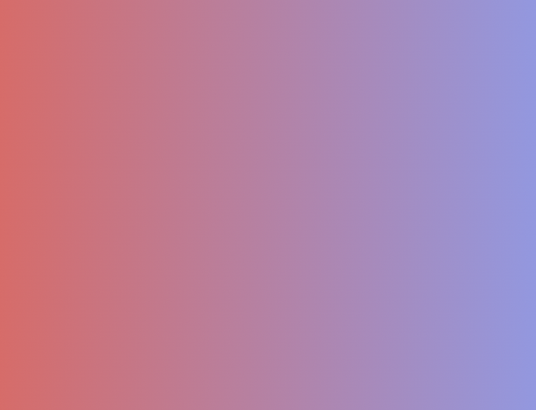
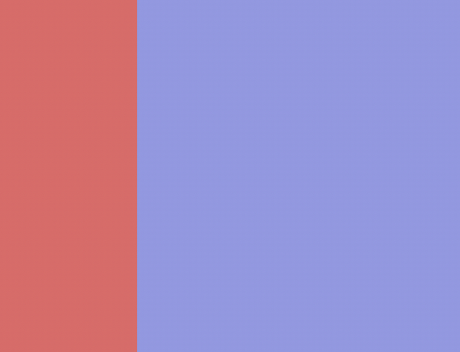
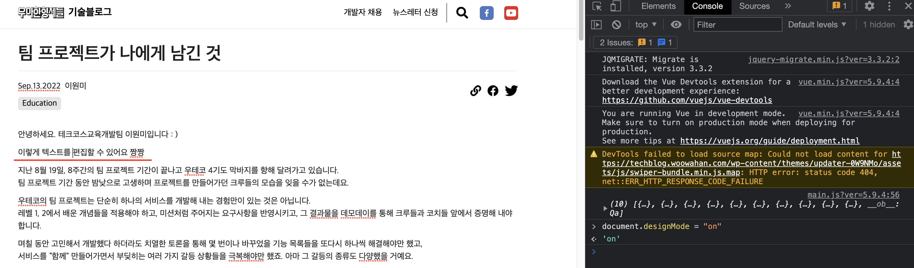

명절 증후군

<!-- more -->

---

## 배워가기

### element.scrollIntoView

- DOM 내장함수
- 호출 된 요소가 사용자에게 표시되도록 요소의 상위 컨테이너를 스크롤한다.
- 옵션*(기본값 *)\

  - **behavior**
    - 동작을 지정한다.(auto\*, smooth)
    - ‘smooth’로 지정하면 스크롤이 부드럽게 동작한다.
    - 기본값 auto
  - **block**
    - 수직 정렬을 지정한다.(start\*, center, end, nearest)
    - nearest는 만약 타켓의 아랫 부분이 화면에 위치하고 있다면 타겟의 조상 요소의 top: 0으로 위치하게 되며 만약 타켓의 위에 위치하고 있다면 타겟의 조상요소의 bottom: 0으로 포커스가 가게 되며 이미 화면에 타겟이 보인다면 그대로 둡니다.
  - **inline**
    - 수평 정렬을 지정한다. (start, center, end, nearest\*)

cf) 사파리 계열에서는 `scrollIntoView`의 `options` 지원이 안되서 polyfill을 추가해야 한다. 많이 사용하는 polyfill: [smoothscroll-polyfill](https://www.npmjs.com/package/smoothscroll-polyfill)

**Ref**

- <https://developer.mozilla.org/ko/docs/Web/API/Element/scrollIntoView>
- <https://worker-k.tistory.com/entry//자바스크립트로-클릭하면-타겟이-있는-화면으로-스크롤-이동하게-하기>

### 자바스크립트의 배열

일반적으로 알려진 배열 자료구조와 자바스크립트의 배열은 다르다.

일반적인 배열 자료 구조는 동일한 크기의 메모리 공간이 연속적으로 나열된 형태이다. 그래서 인덱스를 통해 검색할 때, 아래의 수식이 정립이 될 수 있다. (배열의 시작주소가 1000일 경우)

- 인덱스가 0인 요소의 메모리 주소 : 1000 + 0 \* 8 = 1000
- 인덱스가 1인 요소의 메모리 주소 : 1000 + 1 \* 8 = 1008
- 인덱스가 2인 요소의 메모리 주소 : 1000 + 2 \* 8 = 1016

그리고 일반적인 배열에서는 항상 연속적으로 메모리 공간이 나열되어야 하므로, 삽입이나 삭제가 이루어지면 요소를 연속적으로 정렬해줘야 한다.

하지만 자바스크립트의 배열은 배열 요소를 위한 메모리 공간이 항상 동일한 크기를 갖지 않아도 되고, 연속적으로 이어져 있지 않을 수도 있다. (연속적으로 이어지지 않은 배열을 “희소 배열” 이라고도 한다)
아래 코드와 같이 자바스크립트의 배열은 배열의 동작을 흉내낸 객체 형태임을 알 수 있다.

```jsx
console.log(Object.getOwnPropertyDescriptors([1, 2, 3]));
/*
{
  '0': { value: 1, writable: true, enumerable: true, configurable: true },
  '1': { value: 2, writable: true, enumerable: true, configurable: true },
  '2': { value: 3, writable: true, enumerable: true, configurable: true },
  length: { value: 3, writable: true, enumerable: false, configurable: false }
}
*/
```

위에서 알 수 있듯이, 자바스크립트 배열 요소는 프로퍼티 값이고, 자바스크립트에서 사용하는 모든 값은 객체의 프로퍼티 값이 될 수 있으므로 어떤 타입의 값이라도 배열의 요소가 될 수 있다.

```jsx
const arr = [ 'string', 10, true, null, undefined, NaN, Infinity, [ ], ...]
```

그럼 왜 자바스크립트 배열은 객체 형태로 배열의 동작을 흉내내었을까?

일반적인 배열의 경우 인덱스로 접근할 때, 연속적으로 이어져있는 덕분에 쉽게 접근할 수 있다는 장점이 있다.
하지만 자바스크립트의 배열인 경우 해시 테이블로 구현된 객체이다보니, 인덱스로 배열 요소에 접근할 때는 일반적인 배열보다는 느리다고한다.

그럼에도 자바스크립트 배열을 다르게 구현한 이유는 특정 요소를 탐색 및 요소를 삽입,삭제 하는 경우에 일반적인 배열보다 빠르게 동작하는 성능에 중점을 두었기 때문이라고 한다.

**Ref** <https://poiemaweb.com/js-array-is-not-arrray>

### linear-gradient 그라데이션 없이 만들기

css background의 속성으로 줄 수 있는 `linear-gradient`의 문법은 다음과 같다.

```css
.selector {
  background: linear-gradient(90deg, #e66465, #9198e5);
}
```

첫 번째 파라미터로 방향 또는 각도를 넣을 수 있으며, 그 다음 파라미터로는 그라데이션을 구성할 색상들을 입력한다. 색상들에 더해 값을 넣을 수도 있는데, 처음에는 이 값들이 각 색상이 차지하는 영역인 줄 알았다!

그래서

```css
.selector {
  background: linear-gradient(90deg, #e66465 30%, #9198e5 70%);
}
```

위와 같이 작성하면 `#e66465`가 30%, `#9198e5`가 70%로 중간 blur 없이 두 색상 사이가 딱 끊겨 나오는 줄 알았는데, 여전히 그라데이션 blur가 적용되고 있었다 🤔



불친절한 MDN을 뒤로하고, 여러 블로그를 찾아본 결과 `linear-gradient`에서 각 색상의 `%`는 차지하는 비율이 아닌, 색상의 위치를 나타내는 지표임을 알게 되었다.

```css
.selector {
  background: linear-gradient(90deg, #e66465, #e66465 30%, #9198e5 30%);
}
```

이렇게 하면 중간이 딱 끊긴 그라데이션 완성~!



**Ref**

- <https://css-tricks.com/css3-gradients/>
- <https://aboooks.tistory.com/362>

### string normalize

문자열을 유니코드 정규화 방식(Unicode Normalization Form)에 따라 정규화된 형태로 반환한다. 만약 주어진 값이 문자열이 아닐 경우에는 우선 문자열로 변환 후 정규화한다.

이게 대체 머선 말인고...

```jsx
// U+D55C: 한(HANGUL SYLLABLE HAN)
// U+AE00: 글(HANGUL SYLLABLE GEUL)
var first = "\uD55C\uAE00";
```

이런 유니코드 문자열로 이루어진 한글 각 음절이, 정규형 정준 분해(NFD - 초성/중성/종성의 자소분리가 일어나는 것)를 거치면

```jsx
var second = first.normalize("NFD");
console.log(second); // '\u1112\u1161\u11AB\u1100\u1173\u11AF'
```

이렇게 분리되고, 다시 정규형 정준 결합(NFC)을 거치면 자소분리되었던 한글이 통합된다.

```jsx
// U+D55C: 한(HANGUL SYLLABLE HAN)
// U+AE00: 글(HANGUL SYLLABLE GEUL)
var third = second.normalize("NFC");
console.log(third); // '\uD55C\uAE00'
```

cf) `normalize()` 함수의 인자에 아무것도 넣지 않는 경우, 기본값으로 "NFC"가 사용된다고 한다.

이때 `second`와 `third`는 서로 다른 글자로 취급된다.

```jsx
console.log(second === third); // false
```

브라우저의 file input 등에서 사용자가 첨부한 파일의 이름이 한글일 때, `ㅍㅏㅇㅣㄹㅇㅣㄹㅡㅁ`과 같은 식으로 초성/중성/종성이 분리되는 경우에 파일명을 다시 제대로 만들어주기 위해 사용될 수 있다.

**Ref** [http://www.devdic.com/javascript/refer/native/method:1390/normalize()](<http://www.devdic.com/javascript/refer/native/method:1390/normalize()>)

## 이것저것

- 개발자도구 console에서 `document.designMode = "on"` 명령어를 통해 간편하게 텍스트를 변경해볼 수 있다.
  
- Next.js에서 SSG를 사용할 때 `getStaticProps()` 에 `revalidate` 옵션을 넣으면 ISR(Incremental Static Regeneration - 증분 정적 사이트 재생성)을 사용할 수 있다.
  ```jsx
  export async function getStaticProps() {
    return {
      props: { data: someData }
      revalidate: n, // n초마다 데이터를 다시 가져온다. 서버에서 n초간 캐싱 한 다음, 데이터를 refetch하고 페이지를 rebuild 한다.
    }
  }
  ```
- Docker Container의 CLI에 접근하려면 `docker exec -it ${Container ID} /bin/bash` 명령어를 입력한다.
- `.gitkeep` 파일은 특정한 “기능“을 수행하는 파일이 아니다. git에는 완전히 비어있는 디렉토리를 올릴 수 없기 때문에 일종의 컨벤션처럼 더미 파일을 생성할 때 이 이름을 사용하는 것 뿐이다. ([Ref](https://git.wiki.kernel.org/index.php/Git_FAQ#Can_I_add_empty_directories.3F))
- iOS 브라우저에서는 실제 유저의 인터랙션이 있는 경우에만 키패드를 노출시킬 수 있다. 즉, 컴포넌트가 마운트되자마자 `$input.focus()`, `$input.click()` 등을 호출하여도 키패드가 올라오지 않는다
  [Ref](https://stackoverflow.com/questions/54424729/ios-show-keyboard-on-input-focus)
- [eslint-plugin-unused-imports](https://www.npmjs.com/package/eslint-plugin-unused-imports) 플러그인을 추가하면 `--fix`로 사용하지 않는 import를 자동으로 제거할 수 있다.

---

## 기타

### Next.js 13에 추가된 레이아웃 RFC

`app/layout.js`를 만들어 여러 페이지 간에 공통된 레이아웃 컴포넌트를 공유할 수 있다고 한다.

10월 25일에는 Next.js Conf도 있다고 한다! ([링크](https://nextjs.org/conf))

**Ref** <https://vercel.com/blog/next-js-layouts-rfc-in-5-minutes>

### html 네이티브 팝업

기존엔 `dialog`라는 게 있었다는데... ([출처](https://developer.mozilla.org/ko/docs/Web/HTML/Element/dialog)) 있는지도 몰랐다. 대중화가 안되어 있었나보다.

아무튼 popup이라는 게 새로 나온다는데, `document`와는 별도의 레이어에서 뜬다고 한다. 마치 React Portal처럼...


**Ref** <https://developer.chrome.com/blog/pop-ups-theyre-making-a-resurgence/>

### 크롬 개발자도구 꿀팁

selector를 이리저리 가져오는 내용들이 대부분이다. 생각보다 그다지 유용하진 않다 🙄 (나한테는)

**Ref** <https://developer.chrome.com/blog/devtools-tips-13/>

### 웹 표준 미니앱

미니앱이라는 이름은 처음 들어봤는데, 이미 우리 주변에서 쉽게 접할 수 있는 종류의 것들이었다. 확장성, 웹 표준, 사용자에게 전달하는 가치와 유용성을 모두 고려한 미니앱을 만들기 위한 필요 조건들이 까다로워 보이지만 또 재밌어 보인다!

**Ref** <https://cho.sh/ko/blog/A370F3>

### 어도비의 피그마 인수

이렇게 하나둘씩 먹는구나..!

**Ref** <https://news.hada.io/topic?id=7407&fbclid=IwAR0vUbIT5NAH8t52GGNVVuHNS-uTgsW8nT74cFRUvUqLUJPh6YNpiIK7SJ4>

---

## 마무리

월요일까지 알차게 쉬고, (추석 연휴 겸 생일이었다!) 대략 월요일 저녁 8시쯤부터 우울해졌다... 화요일 아침은 정말 눈 뜨기가 싫었다. 목요일까지도 명절이 끝나 괴로워하는 꿈을 꾸었다. 정말 못살아

드디어 블로그를 다시 출판했다. 거의 두 달만. 흑흑 160개 글 일일이 옮기느라 죽는 줄 알았다. 그런데 아직까지도 일부 설정이 뜻대로 되지 않고 있다 🤯

그리고 올해 취업을 준비하는 놀토 팀원의 연락으로... 오랜만에 놀토 앱을 들어갔다. 정말 아기자기하고 귀여웠구만. 아직까지도 연락하고 있는 우리 팀원들 그립다~!
