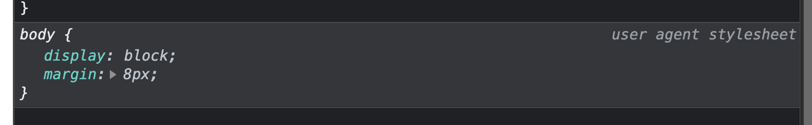

영어공부 잘 해보자구

<!-- more -->

---

## 배워가기

### 웹 폰트 렌더링 방식

브라우저는 렌더링 과정에서 웹 폰트가 다운되지 않았으면 해당 텍스트의 렌더링을 차단한다.

- FOUT(Flash of unstyled Text): 웹 폰트가 적용되지 않은 폰트 상태(unstyled)에서 폰트가 바뀌면서 텍스트가 번쩍이며 글꼴을 대체한다.
- FOIT(Flash of invisible Text): 웹 폰트가 적용되지 않은 텍스트가 보이지 않는 상태에서 폰트가 바뀌면서 텍스트가 번쩍이면서 텍스트를 보여준다.

IE는 FOUT 방식으로 차단하고, 그 외 브라우저는 FOIT 방식으로 차단한다.

### CSS `font-display`로 웹 폰트의 로딩 상태에 따른 동작 설정하기

CSS의 `font-display` 속성으로 웹 폰트의 로딩 상태에 따른 동작을 설정할 수 있다.

- `swap`: FOUT 방식 - 웹 폰트 로딩 여부와 관계없이 항상 텍스트를 보여준다.
- `block`: FOIT 방식 - 웹 폰트가 로딩되지 않았을 때는 텍스트를 렌더링하지 않는다.(최대 3초)

  - 3초가 지나면 웹 폰트가 로딩되지 않았더라도 폴백 폰트(기본 폰트)를 보여주고 웹폰트가 다운 완료되면 렌더링한다.

- `fallback`: 100ms 동안 텍스트가 보이지 않고 그 후 폴백 폰트로 렌더링한다.

  - 3초 내에 웹 폰트가 다운로드 되면 웹 폰트로 전환되지만, 3초 내에 웹 폰트가 다운되지 않는다면 폴백 폰트를 유지한다.
  - 3초 이후 다운로드된 웹 폰트는 웹 페이지에 바로 적용되지 않지만 캐시에 남아 추후 사용자가 재방문 시 바로 웹 폰트가 적용된다.

- `optional`: 100ms동안 텍스트가 보이지 않고 그 후 폴백 폰트로 전환한다.

  - 브라우저가 네트워크 상태에 따라 글꼴을 다운로드 할지, 글꼴을 다운로드 하지 않을지 결정한다.

참고로, pretendard의 `font-display` 는 기본으로 `swap` 이다

크롬, 파이어폭스 등의 브라우저들은 FOIT 방식으로 폰트를 렌더하기 때문에 네트워크 환경이 좋지 못한 사용자를 고려하려면 `font-display` 를 `swap` 등으로 변경해주는게 좋다.

**Ref**

- [Controlling Font Performance with font-display](https://developer.chrome.com/blog/font-display)
- [웹 폰트 사용과 최적화의 최근 동향](https://d2.naver.com/helloworld/4969726)

### pnpm의 중복 패키지 제거 방법

**tl;dr**
linux계열에서 pnpm은 hard-link를 이용해서 중복된 패키지들을 store로 관리한다. 윈도우에서는 [junctions](https://docs.microsoft.com/en-us/windows/win32/fileio/hard-links-and-junctions)을 사용한다.

파일 시스템을 참조하는 방식들을 살펴보자.

- inode
  - 리눅스 시스템에서 i-node란, 파일에 대한 정보(메타데이터)를 가진, 일종의 데이터를 말한다.
  - 파일이나 디렉토리는 고유한 i-node를 가진다. 그 결과로 빠르게 파일과 디렉토리를 찾을 수 있다.
  - `ls -i` 를 통해서 i-node 번호를 볼 수 있다.
- soft-link (symbolic link)
  - `ln -s` 명령어로 생성할 수 있으며, 일종의 바로가기라고 생각하면 된다.
  - soft-link는 원본 파일과 다른 inode를 가지고 있다.
  - 원본이 삭제되면 접근이 불가능하다. 원본 파일명을 변경해도 접근이 불가능하다.
- hard-link
  - `ln` 명령어로 생성한다.
  - 원본파일과 동일한 i-node를 가지며, 복사본과는 다르다. 복사를 통해 생성한 파일은 다른 i-node를 가진다.
  - **같은 i-node를 가지기 때문에 전체 디스크에서 용량도 추가되지 않는다.**
  - 원본 파일을 삭제해도 파일에 접근할 수 있음

pnpm의 hardlink와 store prune은 다음과 같다.

- pnpm hard-link
  - pnpm으로 패키지를 다운받으면 npm과 달리 node_modules에 저장되는 것이 아니라 디스크에 있는 `.pnpm-store`에 다운받고 hard link를 만들어서 node_modules에 저장한다.
  - 이런 방식으로 중복되는 패키지를 없애서 디스크 용량을 절약할 수 있다.
- pnpm store prune
  - 어떤 프로젝트에서도 사용하지 않는 패키지들을 pnpm 스토어에서 제거한다.

### `<meta />` 태그로 구글 번역기의 실행 막기

`<meta *name*="google" *value*="notranslate" />` 를 삽입해서 페이지에서 google 번역기가 실행되는걸 막을 수 있다.

class에 `notranslate`을 주거나 다음 메타태그를 사용하는 것도 동일하다.

```jsx
<meta name="google" content="notranslate" />
```

단 class에 옵션 부여 시 해당 태그 번역이 안될 뿐, 번역 버튼은 보인다. (`<meta />` 태그 사용 시 번역 버튼 자체가 보이지 않는다.)

> \+ HTML 명세에 `translate` 속성도 있다.
>
> ```html
> <div translate="no"></div>
> ```

**Ref** [https://html.spec.whatwg.org/multipage/dom.html#attr-translate](https://html.spec.whatwg.org/multipage/dom.html#attr-translate)

### 헤더에 `position: fixed` vs `position: sticky`

- `fixed`를 먹인 요소는 쌓임 스택에서 제거되어, 다른 요소들이 해당 공간을 침범할 수 있게 된다. 따라서 헤더를 fixed로 둘 경우, 헤더의 높이만큼 컨텐츠 영역에 padding-top을 먹여야 한다.
- `sticky`를 먹인 요소는 쌓임 스택에 남아있어, 다른 요소들이 해당 공간을 침범하지 않는다. 따라서 헤더를 sticky(그리고 top: 0)로 둘 경우, 컨텐츠 영역에 별도의 조치가 필요하지 않다.

**Ref** [https://dev.to/luisaugusto/stop-using-fixed-headers-and-start-using-sticky-ones-1k30](https://dev.to/luisaugusto/stop-using-fixed-headers-and-start-using-sticky-ones-1k30)

### html `<meta />` 태그의 `description` vs `og:description`

- `description` - 서치 엔진에 잡힐 수 있다.
- `og:description` - facebook같은 소셜 플랫폼에 사용된다.

둘의 `content` 가 같은 경우 합쳐서 쓸 수도 있다

```jsx
<meta
  name="description"
  property="og:description"
  content="배달의민족 사장님들을 위해 메뉴부터 광고까지, 가게 관리에 필요한 모든 서비스를 제공합니다."
/>
```

**Ref**

- https://stackoverflow.com/questions/38173163/seo-meta-tag-ogdescription-vs-description
- https://stackoverflow.com/questions/6203984/combining-the-meta-description-and-open-graph-protocol-description-into-one-tag

### `useEffect`의 실행 시점을 믿지 마세요

`useEffect` 는 일반적으로 DOM paint 이후에 실행되지만, `useLayoutEffect`에서 상태 업데이트가 발생한 경우 `useEffect`는 paint 이전에 실행될 수도 있다.

1. React update 1: 가상 DOM 렌더링, effect 스케줄링, DOM 업데이트
2. `useLayoutEffect` 호출
3. **상태 업데이트,** 리렌더링 스케줄링
4. **`useEffect` 호출**
5. React update 2
6. update 2로부터 `useLayoutEffect` 호출
7. React는 제어권을 넘기고, 브라우저가 새로운 DOM을 **paints**
8. update 2로부터 `useEffect` 호출

**→ `useEffect`가 업데이트 이후에 호출될 것이라고 믿지 말아라!**

**Ref** <https://blog.thoughtspile.tech/2021/11/15/unintentional-layout-effect/>

### IME

IME(Input Method Editor, 입력 방식 편집기)는 한글처럼 조합이 필요한 언어를 작성하는데 필요한 OS 부속 프로그램이다. (송 -> ㅅ + ㅗ + ㅇ)

운영체제와 브라우저는 이벤트를 중복처리하기 때문에 한글 입력이 중복으로 입력되는 경우가 생길 수 있다.

브라우저 이벤트에서는 `CompositionEvent`를 제공하는데, 컴포지션 세션(composition session)은 다음의 단계로 나뉜다.

- compositionstart
- compositionupdate
- compositionend

따라서 현재 `Composition` 이벤트가 발생중일 때, 이벤트 핸들러에서 return 시키면 중복 입력 문제를 해결할 수 있다. (event의 `isComposing` 속성으로 이벤트가 발생중인지 체크할 수 있다.)

### `disabled` 된 요소는 이벤트가 트리거 되지 않는다.

`disabled` 된 요소는 이벤트가 트리거 되지 않는다.

`hover` 로 트리거 되는 `<Input>` 컴포넌트가 있을 때 아래와 같이 사용하면 `hover` 가 트리거되지 않아 동작하지 않는다.

```tsx
<Tooltip text="hello world">
  <Input disabled />
</Tooltip>
```

이 때 이벤트를 트리거하기 위해서는 `div` 와 같은 요소로 한번 감싸 해당 요소에서 이벤트가 트리거하게 하면 된다. - 아래와 같이 코드를 작성하면 `hover` 로 트리거 되는 `<Input>` 컴포넌트는 정상 동작한다.

```tsx
<Tooltip text="hello world">
  <div>
    <Input disabled />
  </div>
</Tooltip>
```

### vite 알아보자

vite는 빌드 시 외부 의존성은 esbuild로, 소스코드는 rollup으로 번들링한다. 외부 의존성은 일반적으로 그 내용이 변하지 않기 때문이다.

중요한 것은, esbuild는 타입 정보 없이 Transpilation만 한다는 것이다. 따라서 `const enum`, 타입만 가져오는(import) 기능을 지원하지 않는다

이를 감지하기 위해 tsconfig에 `"isolatedModules": true`를 필수로 설정해줘야 한다.

vite는 소스코드 build 과정에서 rollup을 사용하는데, rollup은 기본적으로 상대경로로 import되는 모듈만 대상으로 한다. 절대경로 import는 런타임에 필요한 외부종속성으로 처리한다. 즉 `import ‘react’`, `import ‘react-query’`와 같은 것들은 무시한다는 얘기다.

이때 경고가 뜨는데, `externals`에 해다 옵션들을 명시해서 경고를 띄우지 않을 수 있다.

프로젝트에서 모노레포 공통 코드인 packages를 코드셰어링 형태로 공유하여 사용처의 환경에서 빌드하는 경우가 있다. 이때 사용처의 packages.json에서 `@packages`의 의존성을 명시하고 import하기 때문에 코드상으로는 외부 의존성처럼 보인다.

하지만 rollup은 `@packages`를 외부 의존성으로 인식해서 빌드대상에 포함하지 않는다. 따라서 rollup에게 특정 상대 모듈은 build에 포함시킬 것을 알려야하는데, 이를 위해 `@rollup/plugin-node-resolve` 플러그인을 사용해야 한다.

### 타입 전용 import/export

`import type { SomeThing } from “./some-module.js”`, `export type { SomeThing }` 등은 타입만을 위한 구문이며, 컴파일시 완전히 제거된다.

따라서 class를 위와 같은 방식으로 import/export하면 extends에 사용한다거나, 인스턴스를 생성하기 위해 사용할 수 없다.

### Next.js 이모저모

next는 dev server와 prod server를 구분한다

- `next dev` - dev 서버를 실행시킨다
- `next build && next start` - prod 서버를 실행시킨다

dev에서는 fast refresh같은 개발 편리성을, prod에서는 빌드 최적화 등의 추가작업을 제공해준다.

> Next.js의 `getInitialProps`는 항상 서버에서 실행되는 것을 보장하지 않는다. 대신 항상 서버 실행이 보장되는 `getServerSideProps`를 사용하자

**Ref**

- [https://nextjs.org/learn/foundations/how-nextjs-works/development-and-production](https://nextjs.org/learn/foundations/how-nextjs-works/development-and-production)
- [https://upmostly.com/nextjs/getserversideprops-vs-getinitialprops-getstaticprops-in-next-js](https://upmostly.com/nextjs/getserversideprops-vs-getinitialprops-getstaticprops-in-next-js)

### Edge Runtime

엣지 런타임은 표준 Web API의 서브셋이며, ‘엣지’라는 명칭은 특정한 지역이 아닌 즉각적인 서버리스 컴퓨팅 환경을 가리킨다.

프레임워크 제작자들의 엣지 컴퓨팅과 웹표준에 기반한 오픈소스 도구 제작에 도움을 주고자 설계되었다. Next.js같은 프레임워크에 통합될 목적으로 설계되었으며, 미니멀하고 보안과 성능이 우수하다.

엣지 런타임 기반으로 설계된 프레임워크는 어디서든 실행될 수 있다. (뭔가 너무 추상적인…🤔)

**Ref**

- [https://edge-runtime.vercel.app/](https://edge-runtime.vercel.app/)
- [https://vercel.com/blog/introducing-the-edge-runtime](https://vercel.com/blog/introducing-the-edge-runtime)

### UTC, GMT

- **GMT** - 그리니치 평균시
- **UTC** - 국제 표준시로, 1970년 1월 1일 자정을 0 밀리초로 설정하여 기준을 삼아 그 후로 시간의 흐름을 밀리초로 계산한다.

UTC는 사실상 GMT를 계승한 것이다. 초의 소숫점 단위에서만 차이가 난다.

### datestring

`new Date()`의 인자 값으로 datestring을 사용할 수 있다.

ex) `2012-01-26T13:51:50.417-07:00` , `'2007-04-05T14:30Z'`

- `YYYY-MM-DD` – 년:월:일
- `"T"` 는 `YYYY-MM-DD` 구분자로 쓰임
- `HH:mm:ss.sss` – 시간:분:초.밀리초

이때 마지막 `Z` 파트는 zone에 대한 정보를 담는다.

Z파트에서 `Z` 문자만 오면 UTC+0을 의미하며,(`'2007-04-05T14:30Z'`), Z파트를 생략하면 로컬 타임으로 설정된다.

```jsx
let d = new Date("2007-04-05T13:00");
d.toISOString();
// '2007-04-05T04:00:00.000Z'
// 한국은 UTC+9 때문에 9시간이 빠져서 나온다.
```

> **ISO 8601** 날짜 형식
>
> 01/05/12는 January 5, 2012, or May 1, 2012. 등등 다양하게 표현가능하다.
> 이런 모호한 날짜표현을 해결하기 위한 동일한 날짜/시간 형식을 사용한다. 이 표준이 ISO 8601이다.
> `toISOString` 메소드는 date객체를 **ISO 8601** 규칙 기반으로 [UTC](https://ko.wikipedia.org/wiki/UTC) 날짜 및 시간을 표현해준다.

### Next.js에서 react-query 사용하기

react-query에서 서버사이드에서 query fetching을 할 수 있는 방법을 크게 두 가지

1. `initialData` 사용
2. `<Hydrate />` 사용

제시하고 있는데, 여러 이슈 때문에 2. `<Hydrate />`를 권장하고 있는 것 같다.

이때 `<Hydrate />`를 쓴다고 앱의 모든 query들이 서버사이드에서 불러와지는 것이 아니라, 서버사이드에서 부르고 싶은 query는 next의 `getStaticProps`에서 `prefetchQuery`를 통해서 불러오고, 클라이언트에서 부르고 싶은 query는 그냥 일반적인 방식으로 리액트 컴포넌트 내에서 호출하면 된다.

> Next는 `prefetchQuery` 호출 시 `queryClient`에 지정 queryKey와 fetch data를 매핑해서 저장한다. 해당 `queryClient`를 dehydrate해서 클라이언트의 `<Hydrate />` 에 전달하면 클라이언트에서 사용하는 `queryClient`에서 해당 데이터를 사용해서 미리 queryKey-data 매핑을 해두기 때문에, 이후 동일한 queryKey로 fetching이 이루어질때 그 값을 바로 사용할 수 있는 거십니다. 결국 모든 query를 클라이언트에서 호출하는 로직이 있긴 해야 한다.

**Ref** https://react-query-v3.tanstack.com/guides/ssr#using-nextjs

### 자바스크립트 `void`

**`void` 연산자**는 주어진 표현식을 평가하고 `undefined`를 반환한다.

ex) 함수 즉시 실행

```tsx
void (function iife() {
  console.log("iife is executed");
})();
// Expected output: "iife is executed"
```

오직 `undefined` 원시값을 얻기 위해 `void 0` 또는 `void(0)`처럼 사용할 수도 있다.

```tsx
void 0; // undefined
```

**Ref** [https://developer.mozilla.org/ko/docs/Web/JavaScript/Reference/Operators/void](https://developer.mozilla.org/ko/docs/Web/JavaScript/Reference/Operators/void)

### `setImmediate`

수행시간이 긴 작업을 끝내고 브라우저가 이벤트나 화면 업데이트 등의 작업을 끝낸 직후에 콜백 함수를 실행하기 원할 때 사용한다. (? 언제 실행되는지 모르겠다…)

비동기로 실행하고 싶지만 최대한 빨리 실행하고 싶을 때 사용한다. (`setTimeout(() => {}, 0)` 보다 먼저 실행되는 것 같다.)

표준 API가 아니라 브라우저에서는 사용할 수 없다. Node.js 10+에서만 사용 가능하다.

**Ref**

- [https://developer.mozilla.org/en-US/docs/Web/API/Window/setImmediate](https://developer.mozilla.org/en-US/docs/Web/API/Window/setImmediate)
- [https://inpa.tistory.com/entry/NODE-📚-이벤트-루프-🔁-setTimeout-setImmediate-processnextTick](https://inpa.tistory.com/entry/NODE-%F0%9F%93%9A-%EC%9D%B4%EB%B2%A4%ED%8A%B8-%EB%A3%A8%ED%94%84-%F0%9F%94%81-setTimeout-setImmediate-processnextTick)
- [https://nodejs.dev/en/learn/understanding-setimmediate/](https://nodejs.dev/en/learn/understanding-setimmediate/)

### 리액트에서 데이터를 로딩하는 3가지 방법

- **Fetch-on-render** - 1차 render을 모두 마친 후 필요한 데이터를 로딩 한다
  - 부모-자식 컴포넌트의 render가 모두 이루어진 후, useEffect or query hook 등에 등록된 data fetching이 완료되면 해당 데이터로 다시 렌더링한다
  - 하위 컴포넌트를 내려가면서 렌더링하고, data fetching 요청을 하는게 반복되기 때문에 부모 컴포넌트가 리렌더링되는 이유로 하위 컴포넌트의 data fetching이 여러번 실행될 수도 있다. (네트워크 워터풀)
  - ex. fetch in useEffect
- **Fetch-then-render** - 자식 컴포넌트를 render하기 전에 필요한 데이터를 모두 로딩한다.
  - 상위에서 필요한 데이터를 한번에 모두 받고 렌더링이 진행되기 때문에, 워터폴 문제가 발생하지 않는다
  - 다만 부분적으로 데이터를 가져오고 변경하는게 어렵고, 따라서 유지보수가 힘들다
  - ex. relay without suspense
- **Render as you fetch** - 렌더링과 데이터 페치를 동시에

  - 각 컴포넌트가 자신에게 필요한 data fetching 로직을 가질 수 있다.
  - data fetching을 하는 동안 컴포넌트의 렌더링을 막지 않는다.
  - Suspense에 data가 fetching중인지 알려주도록 구현해야한다. fetching하는 동안 fallback UI를 보여준다.
  - ex. relay with suspense

### 사용자의 접속 형태 분석하기

- 사용자가 새로고침으로 접속했는지 여부
  - window.performance.navigation.type === 1 (TYPE_RELOAD)
- 사용자가 뒤로가기로 접속했는지 여부
  - window.performance.navigation.type === 2 (TYPE_BACK_FORWARD)
- 사용자가 인식하는 페이지 로딩 시간
  - window.performance.timing.loadEventEnd - window.performance.timing.navigationStart
- HTTP 요청에서 응답까지 걸린 시간
  - window.performance.timing.responseEnd - window.performance.timing.responseStart

---

## 이것저것

- woff2 폰트는 모든 폰트 포맷 중 용량이 가장 작고, 모든 브라우저에서 사용 가능하다. (이제 safari에서도 지원한다.)
- 브라우저 마음대로 `body` 태그에 `margin: 8px` 를 넣는 경우가 있다
  
  - 사용자들 보기 좋으라고 그렇게 만들었다고 한다. CSS로 직접 빼줘야 한다;
- github action의 checkout@v3을 사용해서 checkout 할 때에는 `with: ref: main`과 같이 branch를 명시한다. 기본적으론 push 등 action이 발생한 branch로 이미 checkout 되어 있지만, `git checkout HEAD^` 을 사용하면 좀 더 마음이 편해질 수 있다.
- Headless UI Component: 기능은 있지만 스타일은 없는 컴포넌트
- `git checkout -f` - 커밋되지 않은 변경 사항을 제거할 때 사용할 수 있다. 다만 unstage 상태의 파일의 변경사항이 모두 사라지니 조심하자.
- 쉘 명령어: `test -d` - 해당 파일이 존재하는지 여부를 반환한다.
  - ex) `test -d node_modules || npm install --legacy-peer-deps`
- 월드카페 - 열린 대화, 친밀한 대화를 촉진하고, 아이디어들을 연결하여 집단 지성에 이를 수 있게끔 구조화된 대화 프로세스이다.
- `"eslint.workingDirectories": [{ "mode": "auto" }]` - 여러 프로젝트가 존재하는 레포의 경우(ex. 모노레포) 각기 다른 설정의 린트 구성 파일을 가져야할 때 설정한다.
- webpack 에서 [proxyTarget](https://joshua1988.github.io/webpack-guide/devtools/webpack-dev-server.html)을 사용하면 개발환경 API에 cors 오류 없이 API 요청을 보낼 수 있다.
- github에는 코드 리뷰 리마인더가 기본으로 있다. ([Ref](https://docs.github.com/en/organizations/organizing-members-into-teams/managing-scheduled-reminders-for-your-team))
- KDA는 Key Information / Decisions / Action Items
- deduping - 리액트 쿼리의 맥락에서 중복된 요청을 단일 요청으로 처리해주는 것을 의미한다.
- mermaid 를 사용하면 git graph 도 이쁘게 그릴 수 있다 ([https://mermaid.js.org/syntax/gitgraph.html](https://mermaid.js.org/syntax/gitgraph.html))

---

## 기타공유

### 당신이 모르는 자바스크립트의 메모리 누수의 비밀

메모리 누수는 부주의 또는 일부 프로그램 오류로 인해 더 사용되지 않는 메모리를 해제하지 못하는 것이다. 간단히, 어떤 변수가 100M의 메모리를 점유한다고 할 때, 이 변수가 사용되지 않더라도 수동 또는 자동으로 해제되지 않아 계속 메모리를 점유하는 것을 말한다.

자바스크립트를 사용하며 어떤 상황들에서 메모리 누수가 발생할까? 다음은 공통적인 사례들이다.

- 클로저의 잘못된 사용
- 의도치않게 생성된 전역 변수
- 분리된 DOM 노드
- 콘솔 출력
- 해제하지 않은 타이머

크롬 DevTools로 자바스크립트 애플리케이션의 메모리 사용량을 관찰할 수 있다.

⬇️ 이어서 보기 (엄청 흥미로우니 꼭 보기)

**Ref** https://ui.toast.com/posts/ko_20210611

### state-of-js 2022

프론트엔드 프레임워크로 스벨트가 점점 떠오르고 있다 😯 언젠가 한번 써봐야 하는데

빌드 툴로는 vite가 심상치 않아보인다.

**Ref** https://2022.stateofjs.com/en-US/

### Promise는 왜 취소가 안 될까?

TC39에서 처음에 Promise의 취소 기능을 제안할 때는, Promise의 3가지 상태(pending/fulfilled/rejected)에 더해 새로운 '취소 상태(canceled)'의 필요성을 주장했다. 이 과정에서는 취소 상태와 함께 '취소 토큰(Cancel Token)'을 도입하자는 제안도 있었다.

```jsx
const cancelToken = new Promise((resolve) => {
  document.getElementById(“cancelButton”).onclick = () => resolve();
});

function timeout(ms, cancelToken) {
  return new Promise((resolve, reject) => {
    const timeoutHandle = setTimeout(() => resolve(), ms);
    cancelToken?.then(() => clearTimeout(timeoutHandle));
  });
}

timeout(10000, cancelToken).then(() => alert(“timeout!”));
```

그러나 Promise로 취소 토큰을 구현하면 취소 여부를 동기적으로 알 수 없다는 단점이 있다.

따라서 동기 및 비동기 방식에 사용할 수 있을 분 아니라, 취소 기능과 관련된 다양한 편의 기능을 제공하면서 범용성이 있는 인터페이스를 가지는 취소 토큰 표준이 최종적으로 제안되었다.

> 이때 제안된 취소 토큰은 비록 표준으로 채택되지 못했지만, Axios에서 [요청을 취소하기 위한 기능](https://axios-http.com/kr/docs/cancellation)에서 구현되었다.

그러던 와중에 `AbortController`와 `AbortSignal`이 등장했는데?!

⬇️ 이어서 보기 (+ 광고 SDK에서 렌더링 취소 문제를 해결한 방법)

**Ref** https://tech.kakao.com/2023/01/11/promise-cancelation-in-javascript/

---

## 마무리

신년이라 그런지 TIL을 많이많이 올려주시는 중... 나도 동참하기로 했다. 하루에 하나라도 배우기!

신년 목표같은거 구체적으로 세우지 않는 편이지만, 2주째 영어공부 열심히 하고 있다. 원서 읽기도 재미있다. 끝까지 흥미 잃지 않고 노력해서 호주 가서 날라댕겨보자 🦘
