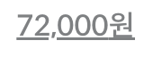

2월 마지막주네...

<!-- more -->

---

## 배워가기

### 자바스크립트 객체 vs Map

자바스크립트에서 키가 여러 개고, 키를 자주 추가하거나 제거하는 경우 일반 객체 대신 `Map`을 사용하면 더 빠르게 키를 추가/제거할 수 있다.

> V8 엔진의 경우, `Map` 객체와 일반 객체 간의 차이가 크게 있진 않다. 결국 Map의 하부 구현이 V8 내에서 hashmap으로 구현된 Object Element가 재활용 된 것이기 때문이다.

### AWS 권한 경계 설정

AWS 권한 경계를 설정하면, 자격증명 기반 정책과 권한 경계의 교집합 부분의 정책만 허용된다. 역할 전환을 통해, 하나의 계정에 역할에 따라 다른 권한을 줄 수 있다.

역할은 계정뿐만 아니라, 서비스에도 줄 수 있다. (EC2에도 s3 read 역할 등을 부여할 수 있음.)

### 리액트 컴포넌트 디버깅 방법

크롬 개발자 도구의 `Sources` 탭에서 cmd + p 를 통해 컴포넌트를 찾을 수 있다.

해당 파일 라인에 브레이킹 포인트를 잡을 수 있으며, 컴포넌트 내의 속성도 확인할 수 있다.

### HTMLElement.focus()의 옵션

- `preventScroll`
  - 기본값은 false이며, 요소에 포커스하기 위한 스크롤을 막을것인지 여부
  - true로 설정하면 현재 view 밖의 요소에 포커스는 되지만 스크롤되지 않는다

💡 mdn에는 `focusVisible`도 있는데, 일단 react에서는 지원하지 않는 것 같다..

### useEffect의 dependency array

useEffect의 dependency array는 primitive type이라면 값이 변경될 때, object라면 reference가 변경될때마다 감지한다.

object의 값이 변경될 때를 감지하고 싶다면 `use-deep-compare-effect`의 `useDeepCompareEffect` 를 사용할 수 있다. 하지만 보통의 경우 deep compare보다 나은 방법이 있기 마련이니 사용하기 전에 다시 한 번 고민해보라고 한다.

### typeorm의 `@ManyToMany`

A 엔티티가 B의 여러 인스턴스를 가지고, B 엔티티가 A의 여러 인스턴스를 가질 때 `@ManyToMany` relation을 사용할 수 있다.

이때 `@JoinTable()`로 A와 B 사이 엔티티를 생성해주어야 하는데, 한쪽에서만 지정하면 된다.

A 인스턴스에 붙은 모든 B 인스턴스들을 불러오려면, `find()` 함수의 `FindOptions`를 사용해야 한다.

```jsx
// 예시: Question과 Category가 @ManyToMany 관계일 때
const questionRepository = dataSource.getRepository(Question);
const questions = await questionRepository.find({
  relations: {
    categories: true,
  },
});
```

### text-decoration-skip-ink

`text-decoration: underline;` 을 적용한 요소에서 underline이 텍스트를 뚫고 지나갈(?) 때,



`text-decoration-skip-ink: none` 을 해주면 뚫지 않고 예쁘게 그려줄 수 있다


### `useRef()`에는 배열을 넣을 수도 있다

당연. 객체를 넣는 거니까... 🙄

비슷한 요소들을 모두 ref로 관리할 때 편리하다

```jsx
const inputRefs = useRef([]);
// ...
<Input ref={(el) => (inputRefs.current[0] = el)} ... />
<Input ref={(el) => (inputRefs.current[1] = el)} ... />
<Input ref={(el) => (inputRefs.current[2] = el)} ... />
```

### next.js ssg에서 path 파라미터 사용하기

ssg에서 path 파라미터를 대응하기 위해서는 path 파라미터에 해당하는 모든 id값을 불러오고 html을 만들어야 한다.

이때 id를 url query로 받게되면, 하나의 html 파일에서 모든 id에 대한 처리가 가능해지기 때문에 path params 대신 url query를 사용한다.

ex) `libraries/[id]` → `libraries/detail/id=[id]`

---

## 이것저것

- POP (Point of Presence) - 라우터나 스위치같은 것을 통틀어서 실제 사용자가 네트워크 접속하는 그 접속 지점
- 엣지 서버 (Edge Server) - 실제로 컨텐츠가 캐싱되는 서버 (더 좁은 개념)
- 라스트마일 배송 (Last Mile Delivery) - 주문한 물품이 배송지를 떠나 고객에게 직접 배송되기 바로 직전의 마지막 거리 내지 순간을 위한 배송
- 유용한 Terminal 애플리케이션 - [thefuck](https://github.com/nvbn/thefuck) - 명령이 틀렸을 때 fuxx를 입력하면 수정해준다.
- 워크플로를 최적화 할 수 있는 유용한 툴 - [script kit](https://www.scriptkit.com/) - JS로 커스텀 할 수 있다.
- `structuredClone` - 자바스크립트에서 지원하는 객체 Deep Copy 함수 ([링크](https://developer.mozilla.org/en-US/docs/Web/API/structuredClone))
- `console.table` : 배열 형식으로 된 객체를 깔끔하게 볼 수 있다.
- [Web Components 표준](https://developer.mozilla.org/en-US/docs/Web/Web_Components/Using_templates_and_slots)과 [Vue.js](https://vuejs.org/guide/components/slots.html#scoped-slots) 모두 `<slot>` 태그가 있다.
- 필드테스트 - 직접 사용해보고 그 체험기를 올리는 테스트
- [uvu](https://github.com/lukeed/uvu) - Jest에 비해 빠르고 가벼운 테스트 러너. util 함수 등 만을 테스트 한다면 jest의 좋은 대안이 될 수 있을 것 같다.
- padding이나 margin 등에서 사용하는 top, left, right, bottom의 뭉텅이를 부르는 `inset`이라는 단어가 있다. 타이핑할 때 `type Inset = { top?: number; left?: number; right?: number; bottom?: number }`
- [FormData](https://developer.mozilla.org/en-US/docs/Web/API/FormData) 객체는 XMLHttpRequest 전송을 위해 설계된 특수한 객체이다. 문자열화 할 수 없기 때문에 `console.log()` 를 이용해 바로 print할 수 없다.
- SKU(스큐; stock keeping unit) - 재고 관리 코드, 즉 재고를 관리하기 위해서 주로 사용하는 코드로 상품당 유니크한 코드
- eslint-plugin-import는 import/export 구문에 대한 lint를 지원한다. 그중에서도 `import/no-restricted-paths` 를 사용하면 파일 간 import해올 수 있는 규칙을 정할 수 있다. (의존성 관리)

---

## 기타공유

### Sentry의 Session Replay

Sentry에 새로 추가된 (alpha) Replays는 rrweb.io 을 기반으로 하여 사용자 세션을 영상으로 만들어 준다. 에러 발생 전 후의 상황을 영상으로 참고할 수 있다.

사용자 세션에서 개발자 도구를 연 것 과 같이 network, dom event 등 모든 사용자 상호 작용도 볼 수 있다. 매우 유용해 보인다 😎

**Ref** <https://www.youtube.com/watch?v=sZwMmiwBwho>

### Next.js 13.2

- 빌트인 SEO 지원: 정적/동적 메타 태그를 위한 새로운 Metadata API
- 라우트 핸들러: Web 요청과 응답에 기반한 커스텀 요청 핸들러
- 서버 컴포넌트용 MDX: 서버사이드에서 Markdown에 리액트 컴포넌트 사용
- Rust MDX Parser: 새로운 Rust plugin으로 더 빠른 마크다운 파싱
- 에러 오버레이 개선: 가독성을 위해 Next.js와 React stack trace를 분리
- 정적 타입 링크 (베타): next/link에 타입스크립트 타입 체크 제공
- Turbopack 개선 (알파): Webpack loader와의 호환성 제공 및 개선된 지원
- Next.js 캐시 (베타): 점진적 ISR과 코드 변경 시 더 빠른 재배포

**Ref** <https://nextjs.org/blog/next-13-2>

---

## 마무리

오랜만에 팀원 분들과 회식으로 맛난 거 먹고, 다같이 옹기종기 앉아서 불타는 금요일 야근 🔥 그래도 이렇게 함께하니 재밌었당.

주말엔 호주가서 서핑한다고 연습 겸 실내서핑 갔다가 팔꿈치도 다치고 온갖 근육통을 얻은 채 돌아왔다 🫠 그래도 엄청 재밌었다. 바다서핑은 또 어떤 맛일까 🏄‍♀️
