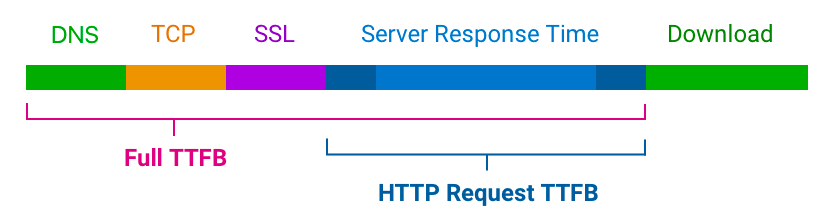

참을성이 없던 아이

<!-- more -->

---

## 배워가기

### 타입스크립트 number union 한방에 string union으로 바꾸기

타입스크립트에서 number union을 한방에 string union으로 바꿔보자

```tsx
type NumberIncludedUnion = 100 | 200 | 300 | "none";
type StringUnion = `${NumberUnion}`; // '100' | '200' | '300' | 'none';
```

### CVA

- tailwind에서 variant 기반 스타일링을 가능하게 해준다.
- tailwind css 뿐 아니라 css, scss에서 가능하다. 즉 css in js가 아닌 환경에서 variant 기반 스타일링을 가능하게 해준다.
- [Stitches](https://stitches.dev/docs/variants)와 [Vanilla Extract](https://vanilla-extract.style/documentation/api/style-variants/)을 모방한 것이다.

다음과 같이 `buttonStyle`을 `cva`로 지정한 후,

```jsx
const buttonStyle = cva(
  "flex items-center justify-center px-4 py-2 rounded font-medium focus: outline-none",
  {
    variants: {
      intent: {
        primary: "...",
        secondary: "...",
      },
    },
    defaultVariants: {
      // ...
    },
  }
);
```

컴포넌트에서 가져다 쓸 수 있다.

```jsx
<button className={buttonStyle({ intent: "primary" })} />
```

**Ref** <https://cva.style/docs>

### 타이머 함수 모킹 API

- `jest.useFakeTimers()`
  - 타이머 모킹을 활성화한다.
- `jest.runAllTimers()`
  - 타이머 큐가 빌 때까지 이전에 호출한 모오오든 타이머를 실행한다.
  - 이 때 타이머 중 무한으로 동작하는 setInterval이 있었다면 `Aborting after running 100000 timers, assuming an infinite loop!"` 같은 실패 메시지를 보게된다.
  - 💁‍♀️ 이때 사용하면 좋은 건 `jest.runOnlyPendingTimers()`
- `jest.advanceTimersByTime(n)`
  - n밀리초 만큼 모오오든 타이머를 전진시킨다.

### 문자열에 포함된 공백 제거 성능 벤치마크

5,100,000글자 기준/5.1MB

1. `spilt(' ').join('')` ---- 82.53 ms
2. `replace(/\+s/g, '')` ---- 144.96 ms
3. `replaceAll(' ', '')` ---- 129.23 ms

### 테스트 검증 API `toBeVisible`

단순 DOM 트리에 포함됐는지를 확인하는 `toBeInTheDocument`보다 상세하게 검사한다.

실제 화면상에 보이는지 다음 항목을 통해 검증한다.

1. **display** not equal to none
2. **opacity** greater than 0
3. **hidden attribute** does not exist
4. **visibility** not equal to hidden or collapse
5. checks for element, if it’s document and **parent is visible**

### 마우스 이벤트의 동작 감지 순서

1. 사용자 마우스를 누르면 -> `mousedown` event 발생

- 이때, 특정 영역에 `focus` 된 요소가 이미 존재한다면 해당 요소의 `blur`(`focusout`과의 차이는 bubbling에 있다) event가 발동한다.

3. 마우스에서 손가락이 떨어지면 -> `mouseup` event 발생
4. `click` event 발생

- 여기서 blur이벤트를 막고 싶다면? -> mousedown의 이벤트핸들러에 `preventDefault()`를 실행시켜 기본 동작을 막는다.

> 👩‍🏫 주의!
> `click` 이벤트는 `mousedown`과 `mouseup` 사이가 아닌, `mouseup` 이벤트가 끝난 후 실행된다!

### [Violation] 'input' handler took 524ms

input onChange 이벤트 실행 시 위와 같은 warning 메시지가 뜨면서 실행이 너무 느릴 때

-> onChange handler로 실행되는 state updater 함수가 해당 컴포넌트의 리렌더링을 유발하는데, 이 컴포넌트가 너무 무겁거나 계산이 큰 로직이 포함되어 있지 않은지 확인하자!

### webpack config `resolve.fallback`

Webpack 5는 더 이상 Node.js의 핵심 모듈을 자동으로 폴리필하지 않는다. 즉, 브라우저 등에서 실행되는 코드에서 사용하는 경우 npm에서 호환되는 모듈을 설치하고 직접 포함해야 한다.

Webpack이 resolve 시 node.js 폴리필을 찾지 못하면 명시한 fallback 경로로 가서 폴리필을 찾도록 해준다.

```jsx
resolve: {
  modules: ['./src', './node_modules'],
  extensions: ['.ts', '.tsx', '.js', '.json'],
  alias: { common: path.resolve('...') },
  fallback: {
    events: require.resolve('events/'),
    buffer: require.resolve('buffer/'),
    querystring: require.resolve('querystring-es3'),
  },
},
```

**Ref** <https://webpack.kr/configuration/resolve/#resolvefallback>

### nest.js에 rxjs 짬뽕하기

nest에서 제공하는 HttpService의 get, post 등의 요청이 `Observable<AxiosResponse<T>>` 타입의 값을 반환하기 때문에,

observable 타입의 값을 다루는 rxjs의 메서드를 이용하여 원하는 값을 정제할 수 있다.

```tsx
import { HttpService } from '@nestjs/axios';
import { firstValueFrom } from 'rxjs';

async getRegistryInfo(name: string) {
  return this.httpService.get<NexusRegistryResponse>(
    `${NEXUS_NPM_URL_PREFIX}/${name}`,
  );
}

async getLibraryMeta(name: string) {
    try {
      const { data } = await firstValueFrom(await this.getRegistryInfo(name));
			// ...
		}
		// ...
}
```

> rxjs `firstValueFrom`
>
> - observable을 구독하여 observable을 promise로 바꿔준다. observable에서 도착하는 첫 번째 값을 promise로 resolve하고 구독은 종료된다.

**Ref** https://rxjs.dev/api/index/function/firstValueFrom

### CSSStyleDeclaration

- CSS 선언 블록 객체
- 다음 세 가지 API에서 사용된다
  - `HTMLElement.style`
  - `CSSStyleSheet`
  - `Window.getComputedStyle()`
- 사용할 수 있는 프로퍼티의 목록은 → [MS TypeScript 공식문서에](https://microsoft.github.io/PowerBI-JavaScript/interfaces/_node_modules_typedoc_node_modules_typescript_lib_lib_dom_d_.cssstyledeclaration.html)

**Ref** https://developer.mozilla.org/en-US/docs/Web/API/CSSStyleDeclaration

### TTFB

- Full TTFB는 브라우저에 HTML 응답의 첫 번째 바이트가 도착하는 데까지 걸리는 시간을 의미한다
- 다음 과정을 포함한다
  - DNS lookup
  - TCP connection
  - SSL connection
  - Document HTTP request (응답을 다운로드하는 시간은 제외, 오직 첫 번째 바이트까지의 시간만포함)
  - 처음 URL 요청에서부터의 모든 redirect


- 800ms 정도의 TTFB가 양호하며, 1.8s가 넘어가면 개선이 필요하다

**Ref** https://www.debugbear.com/docs/metrics/time-to-first-byte

---

## 이것저것

(이번주는 적을 게 없네? 🙃)

---

## 기타공유

### Partytown

Partytown은 리소스를 많이 사용하는 스크립트를 메인쓰레드가 아닌 web worker에 재배치함으로써 lazy-load를 해주는 라이브러리다. 메인쓰레드를 코드 전용으로 지정하고, 써드파티 스크립트를 web worker에 맡김으로써 사이트의 속도를 높인다.

전에 어디선가 들어본 것 같은데, 참신한 라이브러리구만

Partytown을 적용할 각 써드파티 스크립트에 다음 script 구문을 삽입하여 사용한다.

```jsx
<script type="text/partytown">...</script>
```

**Ref**

- <https://github.com/BuilderIO/partytown>
- <https://partytown.builder.io/>

### MacOS Safari Web apps

애플에서 요런 것도 만들고 있었구나 😯

웹사이트를 Mac Dock에서 사용할 수 있는 앱으로 옮겨놓은 형태다.

**Ref** <https://developer.apple.com/videos/play/wwdc2023/10120/>

### 키오스크와 모바일앱의 접근성 지키기

키오스크 편리하지만 공공성을 너무 해쳐 진짜 반대하는 사람 중 하나로써~

드디어 이런 게 나왔구나. 2023년이 되어서야...

그럼에도 실제 노령자층이나 장애인들에게 실질적인 도움이 되는지는 궁금하다.

뭐든 차근차근 나아지겠지 🤷‍♀️

**Ref** <https://www.mohw.go.kr/react/al/sal0301vw.jsp?PAR_MENU_ID=04&MENU_ID=0403&page=3&CONT_SEQ=375590&fbclid=IwAR3BygEFMXBOCVv1wKLhbRrfa2pyvcNVaBGMw-srGZGmStugpoda5LURAGo_aem_th_AUzJfOcoB8SzXOEuzQDDt6yJTgXGC62sou_ZWUP8BG1xDiVloUbxe7DuyWIfW5j-LHE>

### useHooks - hook 모아보기

ui.dev 팀에서 만들었다고 한다. (무슨 팀인지 모른다 ^^;)

**Ref** <https://usehooks.com/>

### AlphaDev의 짱빠른 알고리즘 발견

적은 데이터에서 "70%" 개선, 많은 데이터에서도 1.7% 개선...

이제 AI가 알고리즘도 만들어주는 세상이라니. 머지 않았다. (?)

**Ref** <https://news.hada.io/topic?id=9352>

### WASIX 신규 출범

wasmer 그룹에서 새로 마련한 WASI의 superset(WASI를 기반으로 하는 시스템 호출 확장)으로, 현재까지 C와 Rust로 제공한다. (C ffi/addon을 통한 확장이 가능해 node 등 다양한 런타임에서의 wrapping 확장이 가능하다.)

계획대로만 진행된다면 현재의 작업환경을 아무런 변경없이 WASI-based로 이전하는 것까지도 가능할 것으로 보인다.

> **🤔 WASI가 뭐였지...**
> 브라우저 외부에서 WebAssembly를 사용하기 위한 Mozilla 프로젝트로, WebAssembly 환경이 운영 체제에서 제공하는 기능에 액세스 할 수 있도록 한다.

**Ref**

- <https://wasix.org/>
- <https://blog.desdelinux.net/wasi-un-proyecto-de-mozilla-para-usar-webassembly-fuera-del-navegador/>

---

## 마무리

실행력은 대단하지만 참을성도 기다릴 줄도 모르던 바보같은 애는 커서도 여전히 그런 어른이 되었당

이런 날도 있고 저런 날도 있는 거지 싶지만 조금만 더 맘놓고 기다릴 줄 안다면 더 나은 내일이 되지 않을까 😙
