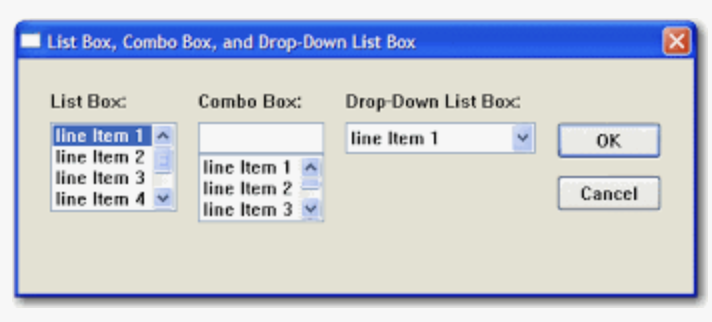

어느덧 2023년도 반

<!-- more -->

---

## 배워가기

### Wrapper Component

- unknown 컴포넌트들을 감싸고 자식 컴포넌트들을 렌더링하는 데 기본 구조를 제공하는 컴포넌트
- 모달, 템플릿 페이지, 정보 타일 등 반복적인 UI를 생성하는 데 유용하다

**Ref**

- https://www.digitalocean.com/community/tutorials/how-to-create-wrapper-components-in-react-with-props
- https://dev.to/taiwobello/how-to-create-a-wrapper-component-in-react-29p

### `useRef`의 내부 구현 방식

```tsx
// Inside of React
function useRef(initialValue) {
  const [ref, unused] = useState({ current: initialValue });
  return ref;
}
```

첫 번째 렌더 시에, `useRef`는 `{ current: initialValue }`를 반환한다. 이 객체는 리액트에 저장되고, 따라서 다음 렌더 시에도 같은 객체(참조값)가 반환된다. `useRef`는 항상 같은 객체를 반환하기 때문에 `useState`의 setter는 사용되지 않는다. (unused)

### window.location의 href vs replace vs assign

- `.href` - 전체 URL을 반환한다.
- `.replace()` - 파라미터로 전달한 URL로 리다이렉트하면서 전달된 URL의 리소스로 현재의 리소스를 교체한다. (현재 페이지를 저장하지 않기 때문에, 뒤로가기 불가)
- `.assign()` - 파라미터로 전달한 URL에서 리소스를 로드하는 메서드

**Ref** https://im-developer.tistory.com/219

### fast-check

자바스크립트에서 속성 테스트를 도와주는 [fast-check](https://github.com/dubzzz/fast-check) 라이브러리가 있다.

'몽키 테스트'의 어원을 본따서 로고를 원숭이로 그린 것 같다


### Curl(Client URL) 명령어 주요 옵션

- -X(--request): 요청시 사용할 메소드의 종류 (GET, POST, PUT, PATCH, DELETE)
  - 아무것도 작성하지 않으면 기본 GET으로 동작
- -H: 전송할 헤더를 지정
  - 여러 줄의 헤더를 작성할 때는 `\`로 구분한다

**Ref** [https://inpa.tistory.com/entry/LINUX-📚-CURL-명령어-사용법-다양한-예제로-정리](https://inpa.tistory.com/entry/LINUX-%F0%9F%93%9A-CURL-%EB%AA%85%EB%A0%B9%EC%96%B4-%EC%82%AC%EC%9A%A9%EB%B2%95-%EB%8B%A4%EC%96%91%ED%95%9C-%EC%98%88%EC%A0%9C%EB%A1%9C-%EC%A0%95%EB%A6%AC)

### 크롬 개발자도구로 측정하는 metrics

크롬 performance tab의 metrics와 lighthouse의 metrics가 다른 이유

- lighthouse는 3g 환경에서의 mid-level 디바이스 환경에서 캐시 없이 측정한다
- performance 탭은 기본으로 cache를 사용하고, network와 디바이스 power가 throttle되지 않는다

**Ref** https://support.google.com/webmasters/thread/68347665/why-are-performance-metrics-different-in-the-lighthouse-report-and-performance-tab?hl=en

### `<video><source src="..." /></video>` 태그를 사용할 때 주의점

`src`에 들어가는 url이 바뀌더라도 React는 어떤 video를 업데이트해야 할지 몰라서 리렌더링을 해주지 않는다. 따라서 `<video>` 태그에 unique한 key를 넣어줘야 한다…

```tsx
<video key={url} autoplay loop muted>
  <source src={url} type="video/mp4" />
</video>
```

### `@font-face` 이모저모

`@font-face`는 웹폰트를 불러오는 방법으로, 사용될 폰트를 가리키는 이름을 선언하고, 매칭되는 소스 경로를 작성한다.

이때 주의할 점은, `@font-face` 를 읽었을 때 바로 폰트를 불러오는 것이 아니라는 것이다. 실제로 페이지에서 쓰였을 때 불러온다.

다음과 같이 작성했을 때,

```css
@font-face {
  font-family: "Web Spoqa Han Sans Neo";
  font-style: normal;
  font-weight: 400;
  src: url("https://baemin-font/SpoqaHanSansNeo-Regular.woff2") format("woff2"),
    url("https://baemin-font/SpoqaHanSansNeo-Regular.woff") format("woff"),
    url("https://baemin-font/SpoqaHanSansNeo-Regular.ttf") format("truetype");
}
```

이렇게 `src` 에 여러 개 `url`(폰트 타입별)이 명시되어 있을 때, 브라우저는 지원하는 폰트 타입을 찾을 때까지 목록에서 하나씩 읽어나간다. 이때 지원하는 폰트 타입을 발견하면 다음 줄의 리소스는 읽어들이지 않는다

이는 브라우저가 `font-family` stack을 읽어들이는 방식과 같다

**Ref** https://stackoverflow.com/questions/13609119/if-multiple-sources-are-listed-in-an-font-face-are-all-of-them-loaded-on-the-c

### `<input>`의 `onChange`

`inputRef.current.value = ''`로 변경하고 `dispatchEvent(new InputEvent(‘change’, { bubbles: true }))` 로 작성할 경우, input의 `onChange` 이벤트핸들러는 호출되지 않는다.

리액트 내부에서 prev, next value 값이 동일하면 `onChange`를 호출하지 않기 때문이다.

`inputRef.current.value` 값을 직접 변경하더라도 리액트 DOM에서의 input 엘리먼트 value가 변경되지는 않는다.

🙃 `ref.current.value`는 조회목적으로만 사용하는게 좋겠다.

**Ref**

- https://stackoverflow.com/questions/23892547/what-is-the-best-way-to-trigger-change-or-input-event-in-react-js
- https://github.com/cypress-io/cypress/issues/536#issuecomment-308739206

---

## 이것저것

- 짤로 보는 ListBox vs ComboBox vs DropDown
  - 

---

## 기타공유

### <도서> 모던 웹을 위한 마이크로 프런트엔드

구성원 분의 마이크로 프론트엔드 추천 도서!

**Ref** <https://www.aladin.co.kr/shop/wproduct.aspx?ItemId=313280280>

### 소스 맵의 동작 원리는 무엇일까?

내가 좋아하는 재그지그님의 최신 포스트. 정말 블로그를 정성스럽게 쓰신다 ㅎㅎ

그리고 항상 궁금한데 귀찮아서(?) 외면했던 것들을 토픽으로 잘 골라내 주신다.

결론만 따오자면

> - 소스 맵의 정보에는 mappings 라는 속성이 있다.
> - 해당 속성은 A->B:C 형태의 문자열이 반복되는 구조로 되어있다.
> - A는 변환된 코드의 글자 위치, B는 원본 코드의 라인 위치, C는 원본 코드의 글자 위치를 나타내는 방식으로 원본 코드와 변환 코드를 매핑한다.

자바스크립트 소스맵을 매핑하는 방식이 뭔가 아주 심플하면서도 쫌쫌따리 귀엽다는 생각이 든다 ㅎㅎ

**Ref** <https://wormwlrm.github.io/2023/06/04/What-are-Source-Maps.html>

### "개발자가 수학에 투자하는 시간은 절대 낭비가 아닙니다"

ㅠㅠ 시러요 ㅠㅠ

**Ref** <https://yozm.wishket.com/magazine/detail/2093/>

---

## 마무리

2Q가 끝나고, 그래 어느새 올해도 절반이 지나가버렸따... 허허

난 아무 생각이 없고

영화 엘리멘탈을 보고왔다.

후기는 😭 (폭풍 오열)

인생 영화 3번째 갈아치우는 중

영화가 이렇게 예쁠 일이야!
