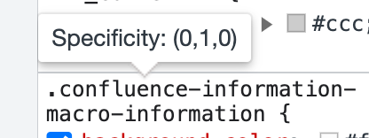

무서워서 못살겠어요 😇

<!-- more -->

---

## 배워가기

### 할루시네이션(Hallucination)

단어 자체의 뜻은 '환각'으로, 인공지능(AI)이 정보를 처리하는 과정에서 발생하는 오류를 뜻하기도 한다.

일반적인 '환각'과 구분하기 위해 Artificial Hallucination 이라고 부르기도 한다.

### switch true 문

switch 문을 값 뿐만 아니라 표현식과도 비교할 수 있다

```jsx
switch (true) {
  case 1 + 1 === 2:
    // 이는 true 이므로 해당 조건문이 실행된다.
    break;
  default:
    // 해당 코드는 실행되지 않는다.
    break;
}
```

종종 복잡한 if/else 문 대신 사용될 수 있다.

유용하게 사용될 수 있는 일반적인 시나리오는 데이터 유효성 검사가 실패하게 되는 일련의 기준들이 있고, 이를 이용해 데이터가 유효한지 검증할 때이다.

**Ref**

- https://ui.toast.com/posts/ko_20210603#switch-true
- 원본 https://seanbarry.dev/posts/switch-true-pattern

### LCOV

- GCC의 테스트 커버리지 툴인 gcov의 프론트엔드 버전 시각적인 툴
- “Lines Coverage” 또는 “Functions Coverage”
- gcov의 데이터를 수집하여 HTML 페이지를 생성한다

**Ref** https://www.enterprisedb.com/postgres-tutorials/how-use-lcov-analyzing-test-coverage-against-postgresql-source-code-and-examples

### gitlab ci `artifact`

- CI job이 생성한 결과를 파일 또는 디렉토리에 저장한다
- gitlab UI나 API를 사용하여 job artifact를 다운로드받을 수 있다

**Ref** https://docs.gitlab.com/ee/ci/jobs/job_artifacts.html

### swc

- Speedy Web Compiler
- Rust 기반의 병렬 처리를 활용한 아주 빠른 자바스크립트 컴파일러
  - 단일 스레드에서 babel보다 20배, 4개 코어에서 70배 빠르다고 한다.
- 컴파일 뿐 아니라 자바스크립트 번들러 기능도 제공한다.
- Next.js, Parcel, Deno 등에서 사용한다

### jest@29 변경사항

jest@29부터 `jestConfig.globals['ts-jest']`는 deprecated되었다.

```jsx
// 🚨 deprecated
globals: {
  'ts-jest': {
    isolatedModules: true, // Disable type-checking
  },
},
```

이제 `transform` 항목에 써줘야 한다

```jsx
// ✅ good
transform: {
  '^.+\\.tsx?$': [
    'ts-jest',
    {
      isolatedModules: true,
    },
  ],
}
```

### 트렁크 기반 개발(Trunk-Based Development)

- 모든 개발자가 트렁크(trunk or master)라는 단일 브랜치에서 직접 모든 작업을 하는 것
- 다음 특징을 갖는다.
  - 페어 프로그램 또는 몹 프로그래밍에 유리
  - 신뢰할 수 있는 빌드 필요
  - ‘Branch by Abstraction’ 또는 ‘Feature Flags’를 사용하여 작업이 완료되지 않는 부분 숨기기
  - 소규모 배치로 개발
  - 빠른 빌드 필요

**Ref** https://code-masterjung.tistory.com/73

---

## 이것저것

- `next.config.js` pageExtensions 설정을 통해 `pages/` 디렉토리에 page가 아닌 파일을 함께 배치할 수 있다. ([Ref](https://nextjs.org/docs/pages/api-reference/next-config-js/pageExtensions))
- LLM(Large Language Model) - 대형 언어 모델 (ex. OpenAI의 ChatGPT4)
- churn: 서비스 사용을 중단한 수 / churn rate: 고객 이탈률
- VS Code에서 현재 활성화된 파일 위치를 터미널에서 열기
  ```
    {
      "key": "cmd+t",
      "command": "workbench.action.terminal.newWithCwd",
      "args": {
        "cwd": "${fileDirname}"
      }
    }
  ```

---

## 기타공유

### CSS 명시도 관련 재밌는 자료

요즘 유행하는 맑눈광 같다... 나 원래 물고기 좋아하는데...

💡Tip) 크롬 개발자도구에서 Selector에 호버하면 명시도가 뜬다.



**Ref** https://specifishity.com/

### LocatorJS

개발 중인 컴포넌트의 소스 코드를 찾아주는 크롬 익스텐션이다. 요즘 엄청 핫한 것 같다.

세상이 엄청 좋아졌어~

**Ref** https://www.locatorjs.com/

### Overflow AI

StackOverflow도 AI 한단다. 그 개발자들만의 촌스러운 감성이 있었는데, 과연 답변이 어떻게 개선될지?

**Ref** <https://stackoverflow.blog/2023/07/27/announcing-overflowai/>

### structuredClone

자바스크립트에서도 이제 객체의 깊은 복사(deep clone)를 해주는 메서드가 생겼다.

이제 취업 준비 과정에서 재귀 과정을 통해 deepClone 메서드를 직접 구현하는 숙제 같은건 없어지려나...

**Ref** <https://developer.mozilla.org/en-US/docs/Web/API/structuredClone>

### pretty-ts-errors

타입 에러를 보기 예쁘게 만들어주는 vscode 익스텐션

**Ref** <https://marketplace.visualstudio.com/items?itemName=yoavbls.pretty-ts-errors>

---

## 마무리

이번주는 정말 사건사고가 많았다. 흉흉하고 너무 무섭다... 😵‍💫

테크트리 해커톤은 무사히 잘, 그래도 많은 것들을 해결하고 결정했다.

그치만 여전히 무서운 일들이 많아 신경이 잔뜩 긴장하는 나날들이다.
