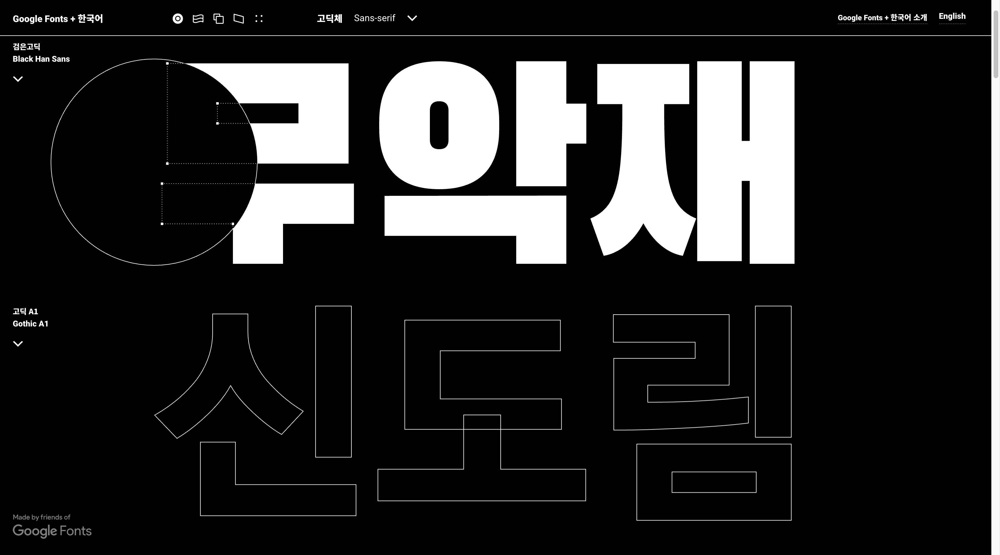

## 배워가기

### CloudFront에서 객체를 캐싱하는 시간 지정

- CloudFront 배포의 캐시 동작에서 최소값, 최대값 및 기본 TTL 값을 설정한다. 
- 오리진의 응답에 `Cache-Control` 또는 `Expires` 헤더를 포함한다. 

구체적인 속성의 종류는 👇링크에서 확인. 여러 개의 속성이 설정되었을 때 어떤 우선순위로 캐시 시간이 정해지는지 살펴보자! 

**Ref** https://docs.aws.amazon.com/ko_kr/AmazonCloudFront/latest/DeveloperGuide/Expiration.html#ExpirationDownloadDist


### react-router v6의 Ranked Router
    
```jsx
<Route path="/teams/:teamId" />
<Route path="/teams/new" />
```

위와 같은 순서로 `Route`를 설정했을 때, `/teams/new`로 가도 `new`를 `:teamId`로 해석하여 잘못된 URL로 떨어지지 않는다! 매칭 알고리즘이 알아서 매칭 우선순위를 계산하여 `/teams/new`로 이동시켜준다.

진작 이렇게 해주지!

**Ref** https://reactrouter.com/en/main/start/overview#ranked-route-matching

### react-router의 `BrowserRouter` vs `Router`

- [BrowserRouter](https://reactrouter.com/en/main/router-components/browser-router)
  - `<BrowserRouter>`는 clean URL을 사용하여 브라우저의 주소창에 현재 주소를 저장하고 브라우저의 빌트인 히스토리 스택을 이동할 수 있게 해준다. 
- [Router](https://reactrouter.com/en/main/router-components/router)
  - `<Router>`는 `<BrowserRouter>`나 `<StaticRouter>` 등의 모든 라우터 컴포넌트들이 공유하는 저수준 인터페이스다. 리액트의 관점에서, `<Router>`는 앱 전체에 라우팅 정보를 제공하는 [context provider](https://reactjs.org/docs/context.html#contextprovider)다. 

> 실사용 시에는 그냥 `<Router>` 대신 `<BrowserRouter>` 등을 쓰세요! 

### React Context의 Consumer

`Consumer`는 `useContext` 훅이 제공되기 전에 context를 읽어오는 수단이었다.

```tsx
function Button() {
  // 🟡 Legacy way (not recommended)
  return (
    <ThemeContext.Consumer>
      {theme => (
        <button className={theme} />
      )}
    </ThemeContext.Consumer>
  );
}
```

여전히 동작하지만, `useContext` 사용이 권장된다.

```tsx
function Button() {
  // ✅ Recommended way
  const theme = useContext(ThemeContext);
  return <button className={theme} />;
}
```

**Ref** shttps://react.dev/reference/react/createContext#consumer

---

## 이것저것 모음집
- `a |= b` - `a = a | b`와 같은 것
- git push 시 ‘stale info’ 메시지와 함께  `rejected`가 뜬다면 - `git fetch`를 한번 해본다
- jest 테스트 구문 - 여러 keydown을 발생시키고 싶을 때, 다음과 같이 연달아 쓸 수도 있다.
   - `await userEvent.keyboard('{ArrowDown}{ArrowDown}{Tab}');`

---

## 기타공유

### 구글 한국어 웹폰트 서비스

> Google Fonts는 머신 러닝에 기반을 둔 최적화 기술을 통해 한글 폰트를 동적으로 분할 다운로드합니다.

라고 한다. 

들어가자마자 보이는 화면 살짝 당황스럽다 



**Ref** <https://googlefonts.github.io/korean/>

### Figmagic

피그마 아무래도 제법 잘 나가는 걸지도? 

**Ref** <https://github.com/mikaelvesavuori/figmagic>

### million.dev

리액트 성능 최적화용 컴파일러로, 렌더링 시 JSX 요소가 많아질수록 DOM을 비교하는 과정(Reconciliation)을 처리하는 시간이 기하급수적으로 늘어나는 부분에 개입한다고 한다. 그냥 리액트를 사용하는 것보다 70% 빠르다고 한다 😲

리액트의 diffing step을 완전히 스킵하고, 변경이 필요한 DOM node를 직접 업데이트한다고 한다. Virtual DOM의 시대가 이렇게 저무는 것인가...

https://svelte.dev/blog/virtual-dom-is-pure-overhead과 같은 글들도 나오는 것을 보면. 시대가 다시 바뀌는 것 같기도. 그래서 리액트 팀에서는 Fiber를 내놓았지만, 다른 방식의 컴파일러들이 호시탐탐 노리고 있는 것 같다. 

**Ref** <https://million.dev/>

### HTML로 한번에 펼쳐지는 아코디언 만들기

**Ref** <https://developer.chrome.com/docs/css-ui/exclusive-accordion?hl=ko> 

---

## 마무리

---

새해가 시작된지 제법 지났는데 왜 이렇게 일은 하기 싫고 다른 것들만 재밌어 보이는지! 🙃 