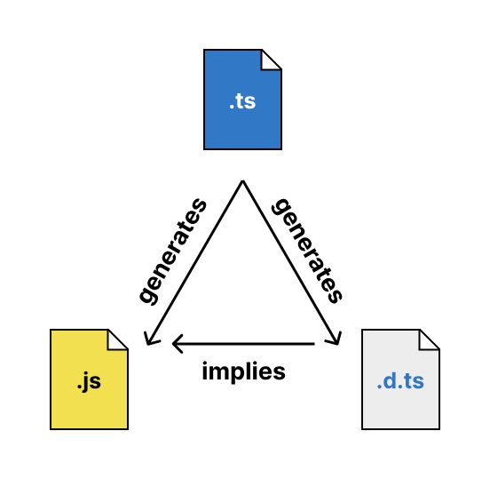

## 배워가기

--- 

### WebM
- an open web media project
- [구글](https://namu.wiki/w/%EA%B5%AC%EA%B8%80)이 2010년 5월 19일에 [VP8](https://namu.wiki/w/VP8)을 개발한 On2 테크놀로지를 인수하면서 함께 발표한 동영상 컨테이너
- 인터넷 영상 스트리밍에 최적화된 규격
- 일반적으로 사용하는 코덱이 H264라면, WebM은 VP8 또는 VP9 코덱을 사용하며 H264보다 다소 좋은 압축률을 가진다.
- 모바일 iOS, 크롬에서는 WebM을 지원하지 않음에 유의

**Ref** https://namu.wiki/w/

### `<video>` 태그 안에
    
```html
<video width="400" controls>
    <source src="mov_bbb.mp4" type="video/mp4">
    <source src="mov_bbb.ogg" type="video/ogg">
    Your browser does not support HTML5 video.
</video>
```

이렇게 작성하면, 태그 순서대로 fallback으로 떨어진다

### 타입스크립트 namespace vs modules
- 원래 Internal modules 였던 것이 → namespaces로, External modules 였던 것이 → 그냥 modules로 명명법 바뀌었다고 한다.
- TypeScript에서 `namespace`는 주로 코드의 논리적 그룹화를 위해 사용되며, 특히 **전역 네임스페이스 오염을 피하고** 코드가 서로 충돌하지 않도록 할 때 유용하다.
- 하지만 TypeScript의 최신 버전에서는 모듈 시스템(ES 모듈이나 CommonJS 모듈)을 사용하는 것이 더 일반적이며 권장된다. `namespace`는 주로 과거의 코드나 레거시 코드에서 볼 수 있으며, 모듈화가 덜 발달된 시기나 특정 상황에서 사용된다.
- **`namespace`와 모듈의 차이**
  - **네임스페이스**는 동일한 파일 내 또는 전역에서 같은 논리적 그룹을 만들고, 여러 파일에서 사용할 수 있다. 파일 간에 네임스페이스를 공유하려면 `<reference>` 태그를 사용하거나 같은 전역 스코프에서 동작해야 한다.
  - **모듈 시스템**(ES 모듈이나 CommonJS)은 파일 자체가 하나의 모듈로 간주되며, `import`, `export` 키워드를 사용하여 다른 파일 간에 코드를 가져오고 사용할 수 있다. 모듈은 파일 범위로 격리되므로 이름 충돌을 방지할 수 있다.

### 타입스크립트 declaration file의 역할

declaration file을 해석하는 방식은 이 파일들이 어디서 오는지 해석하는 것과 같다.

`tsc --declaration` 을 수행하면, 하나의 자바스크립트 파일과 하나의 declaration file이 생성된다.


    
컴파일러는 declaration file을 발견하면 해당 declaration file에 적힌 타입 정보로 기술된, 매핑되는 자바스크립트 파일이 있을 것이라고 가정한다. 성능상의 이유로, 모든 module resolution mode에서 컴파일러는 항상 타입스크립트와 declaration file을 우선 찾고, 하나 찾으면 그에 매핑되는 자바스크립트 파일을 찾지 않는다. 만약 컴파일러가 타입스크립트 input file을 찾으면, 컴파일러는 컴파일 이후 자바스크립트 파일이 있을 것이라 생각하고, 만약 컴파일러가 declaration file을 찾으면, 이미 컴파일이 진행됐으며 declaration file과 동시에 자바스크립트 파일이 생성되었음을 알게 된다.

즉 declaration file은 컴파일러에게 자바스크립트 파일이 존재할 뿐 아니라, 그 이름과 확장자를 알려준다.
    
| Declaration file extension | JavaScript file extension | TypeScript file extension |
| --- | --- | --- |
| `.d.ts` | `.js` | `.ts` |
| `.d.ts` | `.js` | `.tsx` |
| `.d.mts` | `.mjs` | `.mts` |
| `.d.cts` | `.cjs` | `.cts` |
| `.d.*.ts` | `.*` |  |

**Ref** https://www.typescriptlang.org/docs/handbook/modules/theory.html#the-role-of-declaration-files

### SRI, Subresource Integrity

브라우져가 원격 스크립트를 로딩할 때 원본 파일의 무결성 검증을 위한 매커니즘이 있다. 바로 SRI(Subresource Integrity)로, 파일 내용의 해시값을 `<script>` 태그의 `integrity`에 설정한다.

브라우져는 다운받은 파일의 해시값과 integrity에 설정한 값을 비교해 일치하면 스크립트를 로딩하고, 불일치하면 로딩하지 않고 콘솔에 오류를 표시한다. 스크립트의 내용이 중간에 변조되어 실행되는 것을 브라우저 차원에서 방지하기 위해 사용한다.

**Ref** https://developer.mozilla.org/en-US/docs/Web/Security/Subresource_Integrity

### Blue/Green 배포 vs 카나리 배포

**[Blue / Green 배포]**

- 무중단 배포의 종류 중 하나이다.
- 이전 버전을 blue, 새로운 버전을 green이라고 칭하고 배포를 진행하지 않을 때는 하나의 버전만 연결되어 있다.
- blue랑 green은 동일한 서버이다.
- 로드밸런서의 라우팅을 순간적으로 전환해서 새로운 버전을 배포하는 방식이다.
- 빠른 롤백이 가능하고 운영환경을 유지하며 새로 배포될 버전에 대한 테스트도 가능하다.
- 자원을 두 배로 사용해야 한다는 단점이 있다.
- 기본적으로 Auto Scaling Group과 Load Balancer를 필요로 한다.
  - Auto Scaling Group: 인스턴스 크기 자동 조정 및 관리를 위해 EC2 인스턴스들을 논리적으로 모아둔 그룹이다. 이 그룹의 크기는 사용자가 설정한 용량의 인스턴스 수에 따라 달라지고, 수요에 맞게 자동 또는 수동으로 크기를 조정할 수 있다. 시작 템플릿을 이용하여 Auto Scaling 그룹을 생성할 수 있다.

**[카나리 배포]**

- 전체 인프라에 새로운 버전을 릴리즈하기 전에 변경 사항을 천천히 릴리즈하여 프로덕션 환경에 새로운 소프트웨어 버전을 도입하는 위험을 줄이는 방식이다. 
- 구버전 서버와 새버전 서버를 구성하여 일부 트래픽을 차츰차츰 새 버전으로 분산한다.
0 오류율 및 성능 모니터링에 유용하다.

## 이것저것 모음집

- `Array.prototype.toSorted()` - `sort()`에 대응되는 복사 버전의 메서드. 요소들을 오름차순으로 정렬한 새로운 배열을 반환한다. ([Ref](https://developer.mozilla.org/ko/docs/Web/JavaScript/Reference/Global_Objects/Array/toSorted))
- html `<small>` tag - copyright이나 법적 안내 문구와 같은 사이드-코멘트나 작은 프린트 문구에 사용한다. ([Ref](https://developer.mozilla.org/en-US/docs/Web/HTML/Element/small))

---

## 기타공유

---

### 순환참조 잡아내는 도구

- https://www.npmjs.com/package/madge
- https://www.npmjs.com/package/dependency-cruiser
- https://www.npmjs.com/package/dpdm

## 마무리

---

낮에는 한여름이고, 겨울에는 한겨울 같은 날씨 🥶 대체 뭘 입고 다녀야 할지 가늠이 안 감.

인생에서 가장 큰 과제들을 헤쳐나가고 있는 요즈음이다. 

사실 가장 큰 과제는 한두 개가 아니었지... 

새삼 우리나라 사람들 정말 대단한 것 같아.