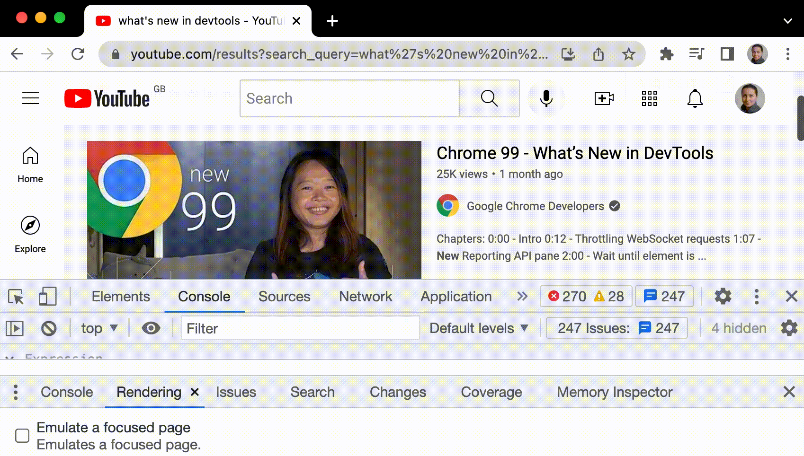

## 배워가기

--- 

### Web Crypto API
- cryptography를 이용하여 시스템을 빌드할 수 있도록 script가 보안 원시값을 사용하도록 허용하는 인터페이스
- Web Crypto API는 브라우저에서 암호화 작업을 수행할 수 있게 해주는 API다. 이는 클라이언트 측에서 안전하게 암호화, 복호화, 해싱, 키 생성 및 교환을 할 수 있도록 지원한다. Web Crypto API는 고성능 암호화 작업을 제공하며, 개발자가 직접 안전한 알고리즘을 구현하지 않아도 되는 장점이 있다. 예를 들어, 사용자의 민감한 데이터를 암호화하여 전송하거나, 데이터 무결성을 검증하는 데 활용된다.

**Ref** 
- https://developer.mozilla.org/en-US/docs/Web/API/Web_Crypto_API
- https://blog.logto.io/ko/web-cryptolo-ijeonhagi

### Grafana, Prometheus, Loki
    
**Grafana**

- **시각화 도구**: Grafana는 데이터를 시각화하고 대시보드를 만들어 실시간 모니터링을 할 수 있게 해주는 도구
- **다양한 데이터 소스 지원**: Prometheus, InfluxDB, Elasticsearch, MySQL 같은 여러 데이터 소스와 통합할 수 있어 한 곳에서 다양한 데이터들을 관리할 수 있다.
- **알람 및 알림 기능**: 설정된 임계치를 초과하면 알림을 보내는 등 모니터링에 필요한 기능을 제공한다.
- **주요 용도**: 시스템 상태, 성능 지표, 응답 시간, 트래픽 등 다양한 정보를 한눈에 보기 좋게 표현할 때 사용된다.

**Prometheus**

- **모니터링 및 경고 시스템**: Prometheus는 시계열 데이터베이스로, 애플리케이션의 메트릭(지표) 데이터를 수집, 저장, 분석할 수 있는 도구
- **Pull 방식 데이터 수집**: Prometheus는 모니터링 대상 서버나 애플리케이션에서 데이터를 가져오는 방식(pull)을 사용한다. 각 서비스에서 메트릭을 노출하면 Prometheus가 주기적으로 데이터를 가져간다.
- **강력한 쿼리 언어**: PromQL이라는 쿼리 언어를 제공하여 복잡한 데이터 쿼리와 분석이 가능하다.
- **주요 용도**: 서버 CPU, 메모리 사용량, 요청 수, 에러 수와 같은 시스템 상태와 성능 메트릭을 수집하여 모니터링하는 데 주로 사용된다.

**Loki**

- **로그 수집 및 분석 시스템**: Loki는 로그를 수집하고, 분석할 수 있도록 만들어진 로그 관리 시스템
- **메트릭과 연관성 강화**: Prometheus 메트릭과 연관된 로그를 함께 볼 수 있도록 설계되었다. 이 때문에 로그 메타데이터를 중심으로만 인덱싱하여 빠르게 조회할 수 있다.
- **가벼운 구조**: 인덱싱이 간단하여 ElasticSearch와 같은 로그 시스템보다 가볍고 설정도 쉬운 편이다.
- **주요 용도**: 애플리케이션 로그나 오류 로그 등을 수집하고, 문제 발생 시 그 원인을 분석할 때 사용된다. Prometheus와 함께 사용하면 로그와 메트릭을 연계하여 보다 쉽게 원인을 파악할 수 있다.

> 👩‍🏫 정리
> - **Grafana**: 데이터 시각화 및 대시보드 도구
> - **Prometheus**: 시계열 데이터베이스, 모니터링 및 알람 도구
> - **Loki**: 로그 수집 및 분석 도구 (로그 기반 모니터링)

### tsconfig `noUncheckedIndexedAccess`

`false` 설정 시 객체, 배열 인덱스 접근 시 undefined를 고려하지 않는다.
```tsx
const obj: Record<string, string> = {}; 
const core = obj['core'] // string 타입

const arr: string[] = [];
const first = arr[0] // string 타입
```

배열의 arr[0]으로 접근할 때는 undefined를 고려하지 않기 때문에 위험하다.

> `noUncheckedIndexedAccess`에 `false` 값을 주고 싶다면 `Array.prototype.at`으로 접근하는 것이 더 안전하다. 

## 이것저것 모음집

---

- `merge commit`은 2가지 부모를 가지기 때문에, `merge commit`을 `revert` 할 때는 `--mainline` 옵션으로 어떤 부모를 기준으로 돌릴지 명시해줘야 한다.
  ```bash
  git revert -m [돌아갈 부모 번호] <merge-commit-hash>
  ```
  - 돌아갈 부모 번호는 `git show <merge-commit-hash>` 나 `git cat-file -p <merge-commit-hash>`로 확인할 수 있다.

## 기타공유

---

### 크롬 개발자도구의 Emulate a focused page 기능

포커스를 페이지에서 DevTools로 전환하면 포커스로 트리거되는 일부 오버레이 요소가 자동으로 숨겨진다. 

ex) 드롭다운 목록, 메뉴 또는 날짜 선택 도구

check_box 포커스가 설정된 페이지 에뮬레이션 옵션을 사용하면 포커스가 있는 것처럼 이러한 요소를 디버그할 수 있다.



**Ref** https://developer.chrome.com/docs/devtools/rendering/apply-effects?hl=ko#emulate_a_focused_page

### Napkin.ai

텍스트 입력시 시각화 자료를 생성해주는 도구

**Ref** https://www.napkin.ai/

### zerox

손글씨/표도 인식하는 OCR 오픈소스

**Ref** https://github.com/getomni-ai/zerox

### ko-date-parse

한국어로 된 날짜와 시간 표현을 파싱해주는 라이브러리

ex) '내일' -> 10월 28일 날짜 객체

**Ref** https://github.com/youngkyo0504/ko-date-parse

### HAR (HTTP ARchive format)

네트워크 요청을 전부 기록한 json 형태의 파일

활용처는 다음과 타다. 

- 성능이슈 검토: 느린 페이지 로딩, 특정 작업을 수행할 때 타임아웃 발생
- 페이지렌더링 검토: 페이지 포맷 오류, 정보 누락

### TanStack Start 

TanStack 아저씨 진짜 신기하네...

풀스택 리액트 개발 도구라는 것 같다.

**Ref** https://www.youtube.com/watch?feature=shared&v=AuHqwQsf64o

### component-party

UI라이브러리 문법을 비교할 수 있는 사이트

**Ref** https://github.com/matschik/component-party.dev

### Programming Should Be Simple

ㅋㅋㅋ 오랜만에 정말 공감가는 영상

**Ref** https://www.youtube.com/watch?v=swXWUfufu2w

---

## 마무리 

인생 과제들을 조금 정리해가는 듯 싶더니

그동안 누적된 스트레스에 몸이 단단히 고장나고 말았다.

나약한 인간에 비해 인생은 너무 어려워 😞
