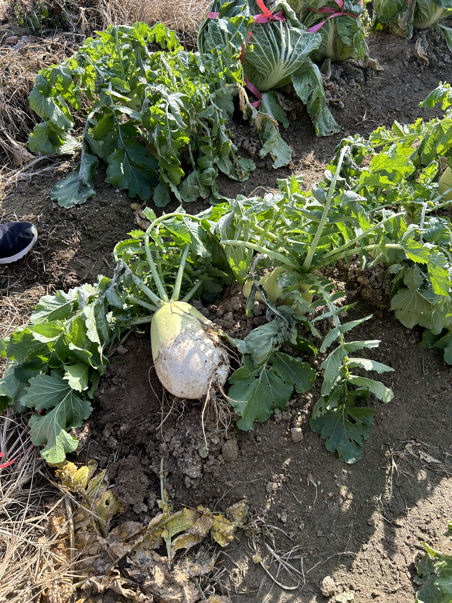

## 배워가기

--- 

### Web Worker API

- 스크립트 연산을 웹 어플리케이션의 주 실행 스레드와 분리된 별도의 백그라운드 스레드에서 실행할 수 있는 기술
- 웹 워커를 통해 무거운 작업을 분리된 스레드에서 처리하면 주 스레드(보통 UI 스레드)가 멈추거나 느려지지 않고 동작할 수 있다

**Ref** https://developer.mozilla.org/ko/docs/Web/API/Web_Workers_API

### @tanstack/react-virtual

- `overscan`
    - 보이는 영역의 위/아래에 렌더되는 아이템의 개수
    - `overscan` 값을 늘리면 virtualizer를 렌더링하는 시간이 늘어나지만, 스크롤을 할 때에 virtualizer의 위 아래에 아이템이 채워져있지 않은 문제를 해결할 수 있다.
    - 즉 사용자가 스크롤하기 전에 더 많은 항목이 미리 렌더링되므로 새 데이터를 로드할 시점을 앞당길 수 있다.

- `observeelementoffset`
    
    ```jsx
    observeElementOffset: (
      instance: Virtualizer<TScrollElement, TItemElement>,
      cb: (offset: number) => void,
    ) => void | (() => void)
    ```
    
    - scrollElement가 바뀔 때 scrollElement의 초기 사이즈 측정과 scroll offset의을 알아야 할 때 사용된다.

> 왜 때문에 option 이름을 camelCase로 안 했을까... ☺️

### react-query에서 전역적으로 에러 처리하는 법

```jsx
const queryCache = new QueryCache({
  onError: (error) => {
    console.log(error)
  },
  onSuccess: (data) => {
    console.log(data)
  },
  onSettled: (data, error) => {
    console.log(data, error)
  },
})
```

- `QueryCache` 는 tanstack query에서의 저장 메커니즘이다. 모든 데이터, 메타 정보, query의 상태를 갖고 있다.

**Ref** https://tanstack.com/query/v4/docs/reference/QueryCache

## 이것저것 모음집

---

## 기타공유

---

### 슬랙 메시지 이쁘게 보내기

**Ref** https://jsx-slack.netlify.app/#home

### 타입스크립트 tsc trace 를 보고 싶다면

**Ref** https://www.npmjs.com/package/@typescript/analyze-trace


## 마무리

---

다시 한번 인생에서 고민의 시간들을 보내다가... 

주말에 갑자기 배추 뽑으러 감.

엄마가 김장한다 그래서 수육 먹으러 갔다가. 

삼촌 농장에서 사촌동생과 함께 무랑 배추 잔뜩 뽑고 왔다. 

내 힘이 이렇게 쎘었나, 두 봉다리씩 옮기고 집에 와서 바로 뻗을 줄 알았는데, 

신기하게 체력이 남아돌아 이것저것 하다가 

수육은 개뿔 라면 먹고 블로그 쓰다 잠. 

