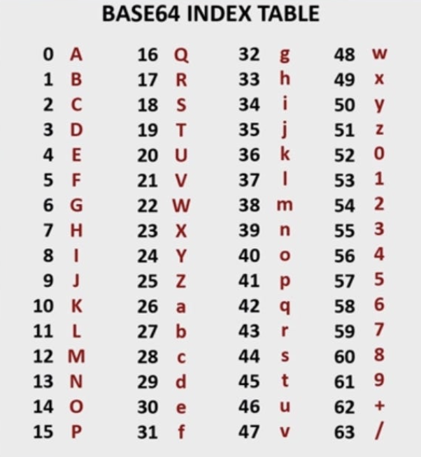

## 배워가기

---

### 자바스크립트 소스맵

소스맵(Source map)은 압축된 JavaScript 코드와 원래의 JavaScript 코드 간의 대응 관계를 나타내는 파일이다. 즉, 소스맵은 압축된 JavaScript 코드에서 오류가 발생했을 때, 오류 메시지를 보다 쉽게 이해할 수 있도록, 오류가 발생한 원래의 JavaScript 코드 위치를 찾아준다.

**소스맵의 매핑 정보** 
생성된 파일의 라인은 ';'을 통해 구분되며, 각 라인의 대한 매핑정보를 [라인 내 열인덱스, 원본파일의 인덱스, 원본파일의 행, 원본파일의 열]로 표현하고, 해당 매핑정보를 ','를 통해 구분한다. 

이때 base64 VQLs(Variable Length Quantity)로 인코딩되는데,
[라인 내 열인덱스, 원본파일의 인덱스, 원본파일의 행, 원본파일의 열]의 값이 base64 vqls 인코딩되어 AAAA, SAAS 같은 값이 된다.




**소스맵 옵션**
- nosources - 에러 위치 정보는 제공하지만, 원본소스는 제공하지 않는다. 
- cheap - 불필요한 \n을 날려 열매핑 정보를 포함하지 않는다. 열 매핑 정보가 없어졌으므로, 빌드 속도가 향상된다.
- eval - 변환된 코드가 eval안으로 들어가 빠른 rebuild가 가능하다.
- inline - 소스맵파일이 따로 생성되지 않고, 번들안에 주석으로 들어간다. 

### 테스트의 목적은 버그의 박멸이다.

테스트는 현재 인지하고 있는 플로우 내에서 버그가 있는지 없는지 알려준다. 하지만 예상치 못한 버그가 있는지는 알려주지 않는다. 즉 테스트 코드로 작성되어 있는 범위 내에서 의도한 대로 동작하고 있는지 알려주지만,(**존재**) 예상하지 못한 버그가 있는지(**부재**)에 대해서는 미리 알 수 없다. 버그가 있다는 것을 미리 알았더라면 테스트 코드로부터 인지하기 전에 고치지 않았을까?

이것은 버그를 **사전에 방지하는데 집중하지 말자**는 것을 의미한다.

테스트 케이스를 작성하면서 *'발생할 수 있는 모든 케이스를 전부 대응했나?'* 길게 고민하는 대신, 테스트 코드에 들어가는 시간을 줄이는 것이 효율적이다. 놓치게 되는 테스트 케이스는 QA 과정을 거치면서 발견되던가 사용자로부터 사용되면서 발견될 수 있다. 대신 발견된 버그는 코드로 **재현**하고 그 존재를 테스트 케이스로 추가하여 **트래킹** 해야 한다. 이런 과정을 거치면서 경험치가 쌓이고 놓치는 케이스가 점점 적어질 것이라고 생각한다.

테스트는 버그의 존재를 알려줄 뿐, 부재를 알려주지 않는다.

**Ref** [https://blog.jbee.io/developments/테스트에+대한+오해와+사실](https://blog.jbee.io/developments/%ED%85%8C%EC%8A%A4%ED%8A%B8%EC%97%90+%EB%8C%80%ED%95%9C+%EC%98%A4%ED%95%B4%EC%99%80+%EC%82%AC%EC%8B%A4)

### 파일 간 ci configuration 공유

`include` 키워드로 파일간 ci configuration을 공유할 수 있다.

하지만 Anchors는 파일간 공유가 안 된다는 점에 주의해야 한다.

```yaml
# .default.yml

.default_scripts: &default_scripts
  - ./default-script1.sh
  - ./default-script2.sh

job1:
  script:
    - *default_scripts
    - ./job-script.sh
```

```yaml
# .default.yml을 include하는 파일
include : .default/yml

job2:
  script:
    # 이것은 안됨 ❌
    - *default_scripts
    - ./job-script.sh
```

> `extends`를 사용하면 Anchor도 공유가 가능하다. 

**Ref** <https://docs.gitlab.com/ee/ci/yaml/yaml_optimization.html> 

## 이것저것 모음집

---

- Headless component 라이브러리 - 로직만 구현되어 있고, 스타일은 회사와 제품에 맞게 커스텀할 수 있는 라이브러리. 다들 접근성을 염두에 두고 Aria를 정교하게 달아두었을 뿐만 아니라, 키보드 접근이나, focus 관리, 화면 크기에 따른 처리 등을 정교하고 세밀하게 구현해두었다. ([Ref](https://tech.wonderwall.kr/articles/a11ydriventestautomation/))
- html 요소의 `title` 속성 - 요소에 대한 지침 또는 설명 등의 참고할 만한 정보를 나타낸다. 일부 데스트탑 브라우저에서는 툴팁(tooltip)으로 표시한다. 
- npm의 `engine-strict` 옵션 - 현재 Node.js 버전이 지정된 버전과 일치하지 않으면 패키지 설치가 실패하도록 한다 ([Ref](https://hyunbinseo.medium.com/specify-node-npm-version-per-project-e362f40d7cea))


## 기타공유

---

### 미국 백악관, 연방사이버국의 "안전하고 측정 가능한 소프트웨어 논의"

> "미래의 프로그램은 memory-safe한 프로그램이어야 할 것이다"
> "메모리 안정성 기법이 적극적으로 적용된 Rust를 통해 작성하는 방법이 있다"
> - 미국 백악관, 연방사이버국의 "안전하고 측정 가능한 소프트웨어 논의"에 대해

**Ref** <https://www.whitehouse.gov/oncd/briefing-room/2024/02/26/press-release-technical-report/> 

### pmndrs/uikit

개발 단계에 있는, react-three-fiber를 기반으로 한 uikit이다. 

저작자는 uikit을 통해, WebGL 및 WebGPU 상에서 3d user interface와 더불어 SEO, a11y를 지원할 수 있다고 밝히고 있다. 

만약 이 방법이 우아하게 동작한다면, 웹 플랫폼은 현재의 생산성 수준에서 크게 벗어나지 않는 범위에서 훨씬 rich한 프로덕트를 제공할 수 있을 준비가 된 것이다. 

(기존의 WebGL 프로젝트와는 달리 웹 플랫폼의 장점인 타 플랫폼 대비 압도적인 접근성을 유지할 수 있을 것이다.)

**Ref** <https://twitter.com/0xca0a/status/1762971357430587440?s=20> 

## 마무리

---

올해 2월은 날짜도 짧으면서 질기게 5주까지 채우다니! 4년 만에 돌아오긴 윤년이긴 했지만. 

올 것 같지 않았던 3월이 와버리고, ~마지막~ 드럼 공연을 성황리에 올리고 은퇴 선언을 번복하기에 이르는데... 