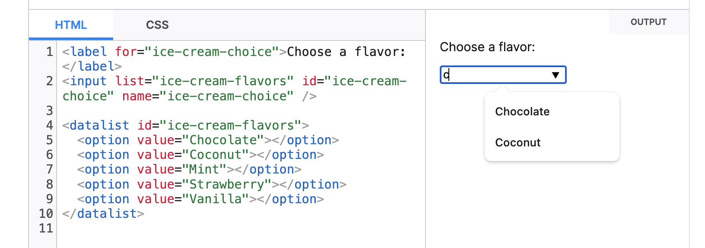

## 배워가기

---

### tsconfig 속성들
 
- `references`
  - 프로젝트에 `references`를 명시하면 타입스크립트 프로그램을 작은 조각들로 나눈다. 이렇게 하면 컴포넌트 간의 로직 분리를 통해 빌드 속도와 에디터 속도를 빠르게 할 수 있다. 
  - 타입스크립트를 이용하여 모노레포를 구성하는 경우, 프로젝트의 `references` 속성으로 서로 의존하고 있는 모듈들을 중복없이 순차적으로 빌드할 수 있다. 
- `emitDeclarationOnly`
  - `d.ts` 파일만 emit하며, `.js` 파일은 emit하지 않는다. 다음 두 가지 경우에 유용하다.
    - 자바스크립트 파일을 생성하기 위해 타입스크립트가 아닌 트랜스파일러를 사용하는 경우
    - 사용자에게 `d.ts` 파일만 제공하기 위해 타입스크립트를 사용하는 경우 
- `esModuleInterop`
  - `esModuleInterop`이 설정되지 않은 상태에서 타입스크립트는 CommonJS/AMD/UMD 모듈을 ES6 모듈과 동일하게 취급한다. 이는 두 가지 이슈를 초래할 수 있다. 
    - ES6 모듈 스펙은 namespace import(`import * as x`)를 오로지 객체로만 취급하여, 타입스크립트는 이를 `= require("x")`와 동일하게 취급한다. 그러면 타입스크립트는 import를 함수로 취급하여 호출할 수 있게 된다. 이것은 스펙을 따르지 않는 것이다.
    - ES6 모듈 스펙이 정확하지만, CommonJS/AMD/UMD 모듈로 이루어진 대부분의 라이브러리들은 타입스크립트처럼 엄격하게 스펙을 따르지 않는다. 
  - `esModuleInterop`을 활성화하면, 이 두 가지 문제를 해결해준다. 우선 컴파일러의 동작을 바꾸고, 헬퍼 함수를 이용하여 자바스크립트로 생성된 소스코드와의 호환성을 맞춘다. 
  - 즉, `esModuleInterop`은 ES6 모듈의 사양을 준수하여 CommonJS/AMD/UMD 모듈을 가져올 수 있게 해준다. 
- `allowSyntheticDefaultImports`
  - 모듈이 명시적으로 default export를 작성하지 않은 경우, import문을 다음 대신
    ```jsx
    import * as React from "react";
    ```
  - 다음과 같이 작성할 수 있게 해준다.
    ```jsx
    import React from "react";
    ```

**Ref** 
- <https://www.typescriptlang.org/tsconfig> 
- <https://blog.shik.kr/typescript-project-reference> 
- <https://pewww.tistory.com/26> 


### pnpm -F

pnpm workspace에서, 특정 워크스페이스에 대해서만 실행

```bash
pnpm —-filter
```

### eslint의 `root: true`

ex) 모노레포 구조의 프로젝트인 경우

- `root: true`를 만날 때까
- 또는 상위 디렉토리가 없을 때까지 타고 올라가면서

eslint config 파일을 찾아 병합한다. 

즉, `root: true`를 설정하면 상위로 parent 타고 올라가서 config 파일을 병합하는 것을 막을 수 있다는 말이기도 하다.

한편, 명시적으로 extends를 사용하는 경우, 자동 상속된 설정보다 우선 적용된다.


### jest manual mocks

Q. 자바스크립트 프로젝트에서 __mocks__ 폴더 하위에 axios.ts 이름으로 파일을 생성하면, jest가 axios 실행 시 해당 코드를 자동으로 참조하게 되나?
    
A. 예, Jest가 **`__mocks__`** 폴더 하위에 특정 모듈 이름과 일치하는 파일이 있으면 해당 파일을 모듈의 모킹(mocking)으로 자동으로 참조합니다. 따라서 **`__mocks__`** 폴더 안에 **`axios.ts`** 파일을 만들면 Jest가 axios 모듈을 호출할 때 해당 모듈을 자동으로 가로챌 것입니다.

다만, 주의해야 할 몇 가지 사항이 있습니다:

1. 파일 이름이 모듈 이름과 일치해야 합니다. 예를 들어, axios를 모킹하려면 파일 이름을 **`axios.ts`**로 지정해야 합니다.
2. 파일의 경로는 프로젝트의 루트 디렉토리 아래에 **`__mocks__`** 폴더 안에 있어야 합니다.
3. 모듈의 경로가 **`node_modules`** 내에 있는 경우 Jest는 모듈을 실제 모듈 대신 **`__mocks__`** 폴더 내의 모킹된 파일로 대체합니다.

따라서 프로젝트의 루트 디렉토리에 **`__mocks__`** 폴더를 만들고 그 안에 **`axios.ts`** 파일을 만들면 Jest가 axios를 호출할 때 해당 모듈을 자동으로 모킹된 파일로 대체할 것입니다.

이를 **jest manual mocks**라고 한다.
    
**Ref** https://jestjs.io/docs/manual-mocks

### peer dependencies는 왜 쓸까?

프로젝트에서 사용하는 `some-library` 패키지의 버전과, 프로젝트에서 의존하는 A 패키지가 의존하는 `some-library` 패키지의 버전이 다른 경우 A 패키지에서 peer dependency에 `some-library` 패키지의 버전을 명시하여 필요한 패키지의 버전을 알려준다. 

**Ref** 
- https://bohyeon-n.github.io/deploy/etc/peerdependencies.html
- [https://velog.io/@johnyworld/Peer-Dependencies-에-대하여](https://velog.io/@johnyworld/Peer-Dependencies-%EC%97%90-%EB%8C%80%ED%95%98%EC%97%AC)

### useEffect의 오해와 진실

- 오해 - `useEffect`에 첫번째 인자로 전달한 함수는 **항상** repaint 후에 실행한다
- 진실 - 항상 그런 것은 아니다

> the browser may repaint the screen before processing the state updates inside your Effect.
> [useEffect – React](https://react.dev/reference/react/useEffect)

### datalist 요소 꿀팁 

input에 list로 연결하면 autocomplete을 지원한다.


<br />

**Ref** https://developer.mozilla.org/en-US/docs/Web/HTML/Element/datalist

### input `webkitdirectory` 

`<input>` 태그의 `webkitdirectory` 속성을 사용하면, 파일 대신 디렉토리를 선택할 수 있다.

**Ref** https://developer.mozilla.org/en-US/docs/Web/API/HTMLInputElement/webkitdirectory

## 이것저것 모음집

---

...

## 기타공유

---

...

## 마무리

---

벌써 3월도 끝! 1분기도 어느새 끝!

달리기를 하면 벌써 땀이 주륵 나는 날씨가 되어버렸고

평일엔 이유 모르게 술 마시러 다니느라 바빴고 

이번주도 역시나 혼자서도, 둘이서도 잘 노는 힐링 주말 😌 