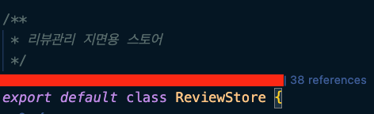

## 배워가기

---

### @module-federation/typescript
- module federation에서 remote app끼리 타입을 공유하여 타입 안정성을 보장하도록 해준다
- 하지만, 런타임의 1회 수행 이후에 타입을 사용할 수 있다 (type definition 다운로드 이후)
- host는 type 다운로드만, remote는 type 제공만 가능
- 양방향 타입 제공은 의존성 문제로 이어질 수 있다는 의견도 있지만, 관련 라이브러리도 있긴 하다. ([native-federation-typescript](https://github.com/ilteoood/native-federation-typescript))

**Ref** https://www.npmjs.com/package/@module-federation/typescript

### git history를 유지하면서 폴더/파일을 복제하는 법

`git mv`를 사용해서 도전해보자.

**1. git mv로 이름바꾸기**
```bash
git mv original copy
git commit -n -m "rename original to target name"
```

**2. 해시값 기억해두고 커밋 리셋하기**
```bash
REV=`git rev-parse HEAD`
git reset --hard HEAD^
```

**3. 다시 git mv로 temp 만들기**
```bash
git mv original temp
git commit -n -m "rename file to temp"
```

4. 기억해둔 해시값으로 merge + 충돌 해결하기
```bash
git merge $REV
git commit -a -n -m "resolve conflict and keep both files"
```

5. git mv로 temp를 다시 원본이름으로 바꾸기 
```bash
git mv temp original
git commit -n -m "restore name of copy"
```

작성한 대로 실행하면 히스토리가 original과 copy에 모두 유지된다.

### video to PIP

재생하는, 또는 재생하려는 video 를 PIP로 전환할 수 있다. (사파리 WebKit 기준)

- `requestPictureInPicture()` - 사용자 액션(이벤트)가 필요하다.
- `video.webkitSetPresentationMode('picture-in-picture')` - 사용자 액션 없이 스크립트로도 실행 가능하다.

하지만 지원되는 환경에 차이가 있으니 확인해보자. 

api 지원 확인 방법

- `document.pictureInPictureEnabled`
- `video.webkitSupportsPresentationMode('picture-in-picture')`

### vite 설정 이모저모

- `vite-plugin-libcss` 
  - 자바스크립트 번들에 css import 구문을 자동으로 삽입해주는 라이브러리
- `vite.config`의 `build.cssCodeSplit`
  - CSS 코드 스플리팅 활성화 여부
  - false일 경우, 모든 CSS 코드가 하나의 CSS 파일로 추출된다.
  - 기본값은 true, 단 `build.lib`을 명시하면 false

### `background-clip: border-box`

`background-clip`의 기본값은 `border-box`다. 

해당 값이 `border-box`일 때는 background에 준 색깔이나 이미지가 border까지 영향을 준다.

border는 그대로 그려지게 하고 싶으면 `background-clip`을 `padding-box`로 설정해야한다.

### Screen_Wake_Lock_API

화면 꺼짐을 막을 수 있는 API 😲

**Ref** https://developer.mozilla.org/en-US/docs/Web/API/Screen_Wake_Lock_API

### tailwind css와 jest

tailwind-css는 jest에서 인식하지 못한다. 생각해보면 당연하게 스타일 정의가 안되어 있기 때문이다. 

이를 해결하기 위해서는 RTL render 시점에 style을 직접 주입해서 해결할 수 있다.

1. tailwind preflight를 파싱해서 활용한다.

```bash
npx tailwindcss -i ./src/index.css -o ./src/__tests__/mocks/index.css (모킹 파일 생성할 위치)
```

2. RTL `render`를 할 때 style 태그를 생성하고 스타일을 주입한다.

```jsx
render(<컴포넌트 />)

/** tailwind css 주입 */
const style = document.createElement('style');
style.innerHTML = fs.readFileSync('src/__tests__/mocks/index.css', 'utf8');
document.head.appendChild(style);
```

### `<script>`와 `<iframe>`, 어디까지 알고 있니? 

- `<script>` 태그에 `type="module"` 지정 시 자동으로 `defer` 처리된다.
- `<iframe>` 태그에 `srcdoc`을 사용하면 URL 없이 HTML string을 주입할 수 있다 
  ```jsx
  <iframe srcdoc="<html><script>....</script></html>"></iframe>
  ```

- `<script>` 태그에 `type="importmap"` 지정 시 모듈을 더 짧은 이름으로 resolve할 수 있다
  ```jsx
  <html>
    <script type="importmap">
      {
        "imports": {
          "canvas-confetti": "https://esm.sh/canvas-confetti"
        }
      }
    </script>
    <script type="module">
      import confetti from 'canvas-confetti';

      confetti();
    </script>
  </html>
  ```

### header에 캐시 컨트롤을 빼먹으면 무슨 일이?

header에 캐시 컨트롤을 빼먹으면, 브라우저는 기본으로 캐싱을 한다.

🤔 얼마나?
👉 `(Date - LastModified) / 10` 의 시간만큼

🤔 왜?
👉 RFC 7234 스펙에 정의되어 있다. 여러 브라우저(크롬, 사파리)와 웹뷰도 같게 동작한다.

이전에 블로그로 작성한 내용입니다만
문득 달력보니 5월이길래 생각났어요.
17년 대통령 선거 준비할 때 실제로 겪은 일이거든요 

**Ref** https://medium.com/a-day-of-a-programmer/756158e22f2d

### SafeTest

넷플릭스에 채택되었다고 하는 통합/E2E 테스트 프레임워크로, Playwright의 강력한 기능을 그대로 사용할 수 있다. 

ex) 
- 스크린샷 디핑 (diffing)
- 트레이스 뷰어 (Trace Viewer)
- 동영상 녹화

Cypress나 Playwright를 이용할 경우 OAuth와 같은 외부 서비스 종속성으로 인해 컴포넌트 렌더링 자체가 불가능하여 테스트를 할 수 없다는 문제점이 있으나, 이러한 복잡한 인증 과정을 setup 단계에 수행할 수 있는 [솔루션을 제공](https://github.com/kolodny/safetest/blob/main/README.md#authentication)한다. 

### RAM의 비밀

RAM은 휘발성 저장 장치이지만 전원이 차단 되어도 잠깐의 시간동안 데이터가 남아 있을 수 있는데, 이 때를 이용해 정보를 탈취하는 것을 '콜드 부트 공격'이라고 한다.

신기한 건, 냉각 스프레이를 뿌려 메모리를 말 그대로 '얼리면' 데이터가 꽤 오랫동안 남아있어 이 같은 방식을 사용하기도 한다.

### TypeScript `satisfies` 

객체의 value들이 유니온일 때 `satisfies`를 사용하면 정확하게 key-value 타입을 매핑할 수 있다.

`Record`를 사용해 객체의 key를 타입으로 검증하려는 상황에서 사용할 수 있다.

```tsx
const obj: Record<'a' | 'b', string | string[]> = {
  a: 'hello',
  b: ['hello', 'world'],
};

obj.a.toUpperCase(); // 🚨 ERROR: Obj.a는 'string | string[]' 타입이므로, 'toUpperCase' 메서드를 사용할 수 없습니다.

const satisfiedObj = {
  a: 'hello',
  b: ['hello', 'world'],
} satisfies Record<'a' | 'b', string | string[]>;

satisfiedObj.a.toUpperCase(); // ✅ Ok
```

### npm package의 ^(캐럿)과 ~(틸드)

npm 패키지에서 캐럿이나 틸더 사용 시 설치 가능한 높은 버전으로 맞춰주게 된다.

ex)
- package A
  - `"package": "^1.13.2"`
- package B
  - `"package": "^1.13.4"`

인 경우 lock 파일에서 해당 패키지는 1.13.4 로 맞춰지게 된다.

### JSX 요소 사이 공백 방지

소나큐브에서 JSX 요소 사이 누락된 공백을 방지하기 위해 다음과 같이 명시하기를 권장한다.

- 공백 문자가 있는 경우 
  - `{' ‘}` -> `<div>Here is some{' '}<a>space</a></div>`

- 공백 문자가 없는 경우 
  - `{/* */}` -> `<div><a>No space</a>{/* */}between these</div>`

### Mixed content page

콘텐츠를 불러오기 위해 HTTP로 요청을 보내는 HTTPS 페이지를 일컫는 말.

대부분의 브라우저는 mixed active content 가 로드되지 않도록 막는다. (일부 mixed display content 포함)

### `git rev-parse`

- `git rev-parse --show-toplevel` 현재 인식되는 git의 root 경로 (.git이 있는 경로)를 반환한다.

- `alias root=cd $(git rev-parse --show-toplevel)` 설정을 해두면 `root` 한방에 언제 어디서든 프로젝트 최상위로 갈 수 있다

cf) 모노레포에서 활용하기 좋다. 
 
> vscode의 경우 `terminal.integrated.env.{os}` 로 환경변수에 `${workspaceFolder}` 변수를 주입해 워크스페이스의 root를 지정할 수 도 있다!

### `useEffect`의 callback은 언제 실행되나? 

정리!

`useEffect` callback은 DOM 조작이 끝난 후에 실행된다. 대부분의 경우, paint 이후에 비동기적으로 실행되지만 최신 UI 업데이트가 중요하다고 판단되는 경우(예를 들어 사용자 인터랙션이나 layout effect로 스케줄링되는 리렌더링 동작이 있는 경우), 또는 단순히 React가 내부적으로 그렇게 할 시간이 있다고 판단될 경우 React는 callback을 paint 이전에 동기적으로 실행할 수도 있다. 

`useEffect` 문제 하나씩 풀어야겠다 💃 

**Ref** https://jser.dev/2023-08-09-effects-run-paint/


## 이것저것 모음집

--- 

- superstruct - 컴파일과정에서 에러를 잡아내는 타입스크립트와 달리, 런타임 시 데이터의 정합성을 검증하는 도구 ([Ref](https://docs.superstructjs.org/))
- remix v3 은 react router v7로 머지돼서 출시될 예정이다. (remix 는 잠시 😴) 기존 remix 유저는 react-router 버전 7이 릴리즈되면 react-router 로 import만 변경해주면 된다고 한다.


## 기타공유

--- 

### numeronym

- 긴 영어단어를 `첫 글자 + 중간 글자 수 + 마지막 글자` 로 줄여부르는 것을 가리킨다
- ex. kubernetes → k83, accessibility → a11y
- 개발자들이 자주 사용하는 numeronym 사이트 https://numeronym.dev/

### VSCode에서 코드 Reference 보기 

[show reference in VSCode](https://stackoverflow.com/questions/45490475/how-do-i-show-reference-count-in-visual-studio-code)를 사용하면!



intelliJ에서 제공하는 Reference를 볼 수 있다. 클릭해서 바로 넘어가는 것도 가능하다 😉 

### React 19 대신 18.3! 

리액트 19가 곧 나오려는 시점에서 바로 19를 업그레이드 하기보다, 18.3으로 먼저 업그레이드를 하면서 자연스럽게 19로의 업데이트를 준비하자! 

버전 18.3은 18.2와 동일한 기능을 제공하지만, deprecated되는 API에 대해 경고를 띄운다. 

**Ref** https://react.dev/blog/2024/04/25/react-19-upgrade-guide

### structural search and replace

텍스트 검색시 `$A`와 같은 변수로 특정 값을 치환하고, 쉽게 수정할 수 있다. (복잡한 검색 시, 정규식으로 처리할 필요가 없다)

nvim에는 nvim.ssr이 있고, JetBrain IDE에서는 built-in으로 지원한다.

VSCode에서는 [ast-grep](https://ast-grep.github.io/)에서 지원한다. 단순 문자열 치환이 아니라 ast기반으로 만들어졌다. 

### React Native IDE

Software Mansion에서 만든 RN 개발용 VSCode Extension으로, Expo 못지않게 RN계에 진심인 곳 중 하나다.

기능은 다음과 같다.

- VSCode 창 안에서 시뮬레이터를 띄우고
- debug 메시지를 확인하고
- 코드에 breakpoint를 걸거나
- element를 찍어서 코드로 바로 이동하거나
- navigation도 바로 하거나 (아직 expo router만, react-navigation 안됨)
- (코드를 살짝 추가해서) 컴포넌트만 독립적으로 시뮬레이터에 띄워볼 수 있음

**Ref** https://ide.swmansion.com/

### dagrejs

(어떻게 읽는거지... 다그래? 요즘 사람들 다 그래~)

특정 형태의 트리를 그리기 위해 노드를 배치하는 로직이 구현된 라이브러리.

노드 배치 로직만 구현되어 있으며, 트리의 구성 노드의 좌표값이 계산되어 반환된다. 실제로 그려지는 부분에 대해서는 d3와 같은 라이브러리를 사용하면 된다.

빠르게 특정 형태의 트리를 그리고 싶을 때 사용하면 편할 것 같다.

**Ref** https://github.com/dagrejs/dagre

### React 19의 CSS-in-JS 지원

```jsx
<style>{` p { color: red; } `}</style>
```

넘 낯선 코드 

**Ref** https://react.dev/reference/react-dom/components/style

### GPT-4o

어떻게 읽는 거람? 지피티-포오? (ㅋㅋㅋ)

음성 어시스턴트 모델의 도입이라니. 영화 Her의 세계가 점점 더 가까워진다. (시러 ㅠ)

**Ref** https://www.aitimes.com/news/articleView.html?idxno=159625

## 마무리

--- 

여기저기 장미가 예쁘게 피어났다 🌷 

어느덧 많이 더워진 5월의 날씨 

왠지 혼자서는 부정적인 감정과 언행만 튀어나오는 것 같아서 

다시 한번 따뜻한 봄같은 사람이 되어보자고 다짐해보는 한 주 