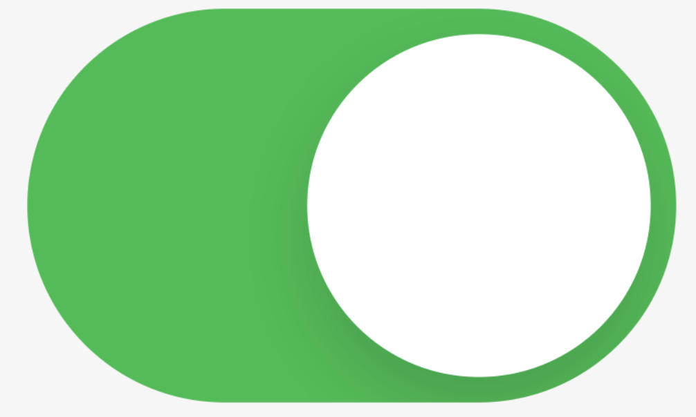

## 배워가기

---

### react-router `index`

React Router v6에서 추가된 `index routes`는 특정 경로에 대한 기본 경로(default route)를 설정하는 방법이다.

즉, 경로가 정확히 일치하지 않을 때 기본 경로를 지정할 수 있다.

```jsx
<Route path="teams" element={<Teams />}>
  <Route path=":teamId" element={<Team />} />
  <Route path="new" element={<NewTeamForm />} />
  <Route index element={<LeagueStandings />} />
</Route>
```

위와 같이 라우팅 지정 후 `/teams`로 접근하면, `<LeagueStandings />` 컴포넌트로 랜딩한다. index routes는 부모 라우트의 경로에 있는 outlet에 렌더된다.

**Ref** https://reactrouter.com/zh/main/start/concepts#index-routes

### yaml 파일에 custom `rules` 추가하는 방법
    
rule을 지정한 yaml 파일을 만들고, 

```yaml
# rules.gitlab-ci.yml
.rules:
  ON_MANUAL:
    - when: manual
  ON_ALL:
    - when: always
    - if: '$CI_MERGE_REQUEST_TITLE =~ /^Draft:.*/'
      when: never
    - if: '$CI_MERGE_REQUEST_TITLE =~ /^WIP:.*/'
      when: never
  ON_MR:
    - ... 
```

다음과 같이 다른 yaml 파일에서 가져다 쓸 수 있다. 

```yaml
init: 
  # ....
  rules:
    - !reference [.rules, ON_ALL]
``` 

### 헬스 체크란?

- 서비스의 고가용성(HA, High Availability), 고성능을 위한 부하 분산 등의 이유로 우리는 서버의 이중화(혹은 그 이상)를 하고, 앞에서 어떤 서버로 요청을 보낼지 라우팅 역할을 하는 로드 밸런서를 둔다. 

- 로드 밸런서에서는 각 서버의 헬스 체크 API를 호출해서 해당 서버가 현재 서비스 가능한 상태인지 아닌지 주기적으로 점검한다.

- **헬스 체크는 정상적으로 서비스가 가능한 서버에만 트래픽을 보내서 서비스의 고가용성을 확보**하는 데 도움이 된다.

**Ref** https://toss.tech/article/how-to-work-health-check-in-spring-boot-actuator

### `Drag` 이벤트

- `dragStart` - 사용자가 객체(object)를 드래그하려고 시작할 때 발생
- `drag` - 대상 객체를 드래그하면서 마우스를 움직일 때 발생
- `dragEnter` - 마우스가 대상 객체의 위로 처음 진입할 때 발생
- `dragOver` - 드래그하면서 마우스가 대상 객체의 영역 위에 자리 잡고 있을 때 발생
- `drop` - 드래그가 끝나서 드래그하던 객체를 놓는 장소에 위치한 객체에서 발생. 리스너는 드래그된 데이터를 가져와서 드롭 위치에 놓는 역할
- `dragEnd` - 대상 객체를 드래그하다가 마우스 버튼을 놓는 순간 발생

끄악. 섬세해서 좋지만 너무 많다 🤯 

> - 드래그 앤 드롭 이벤트를 위한 모든 이벤트 리스너 메소드(event listener method)는 `DataTransfer` 객체를 반환한다.
> - 만일 파일을 드래그 드롭 하는 것이라면, `dataTrasfer`의 `files` 프로퍼티로 접근하여 파일 정보를 가져올 수 있다.

**Ref** https://inpa.tistory.com/entry/드래그-앤-드롭-Drag-Drop-기능

### CSS `touch-action`

요소의 영역이 터치스크린에서 어떻게 조작될지 결정한다. (예: zoom event 등)

`pan-x`, `pan-y` 설정이 유용해보인다.

인스타그램 클론앱 등에서 활용하거나, 스크롤 시 화면의 가장자리에서 화면 요소가 튕기는 문제 해결 가능할듯

> `touch-action: none`은 접근성 문제 등이 발생할 수 있으므로 주의해서 사용해야 한다.

**Ref** 
- https://developer.mozilla.org/en-US/docs/Web/CSS/touch-action
- https://wit.nts-corp.com/2021/07/16/6397

### JavaScript `addEventListener`의 `passive` 옵션

`Passive Event Listeners`란 [DOM Spec](https://dom.spec.whatwg.org/#dom-addeventlisteneroptions-passive)에서 명시하고 있는 기능 중 하나다. `touch`, `wheel` 등 일부 이벤트에서 동작을 최적화하여 스크롤 퍼포먼스를 **대폭**(MDN의 표현을 인용하자면 '획기적으로') 향상시킬 수 있는 웹 표준 기능이다.

스크롤 할때 발생하는 터치 이벤트들이 브라우저에서 발생하면, 브라우저는 터치 이벤트 수신기가 스크롤을 취소할지 여부를 알 수 없으므로 항상 수신기가 끝날 때까지 기다렸다가 페이지를 스크롤한다. passive 옵션을 사용함으로써, 브라우저에게 스크롤을 기다리지 않고 즉시 스크롤해도 됨을 알리는거다.

`touchstart`, `touchmove` 핸들러의 결과를 기다릴 필요가 있기 때문에 `preventDefault()`를 이용하여 부분적으로 무효화한다. 웹 상의 터치 이벤트 핸들러 대다수는 실제로 `preventDefault()`를 호출하지 않으므로 브라우저는 불필요한 스크롤을 차단하는 경우가 있다.

**Ref** 
- https://withhsunny.tistory.com/106
- https://velog.io/@sejinkim/Passive-Event-Listeners
- https://m.blog.naver.com/PostView.naver?isHttpsRedirect=true&blogId=crazymonlong&logNo=221580029479

### `Location.origin`

현재 URL의 유니코드 시리얼라이즈된 문자열을 반환한다. 

**Ref** https://developer.mozilla.org/en-US/docs/Web/API/Location/origin

### 크롬 브라우저의 탭 그룹

크롬 브라우저의 탭 그룹은 browser의 객체가 아니라 chrome의 객체이다.

따라서 `browser.tabs` 로 가져온 tab의 타입에는 groupId 가 존재하지 않는다.

groupId는 `number | undefined` 타입으로, 그룹에 속해 있지 않을 경우 undefined라고 생각하기 쉽지만 -1이다.

## 이것저것 모음집

---

- webpack dev server는 파일이 변경되었을 때 다시 로드하기 위해 WebSocket을 사용한다. ([Ref](https://webpack.kr/guides/development-vagrant/))


## 기타공유

---

### jscodeshift

자바스크립트와 타입스크립트 파일에서 codemod를 적용하여 마이그레이션을 자동으로 해준다. 

예를 들어, react-query v4를 사용하던 프로젝트에서 react-query v5로 마이그레이션을 할 때 코드 수정 작업을 자동화할 수 있다. 

추상 구문 트리(AST)를 이용하여 코드를 수정하는 방법을 제공한다. 

**Ref** 
- https://github.com/facebook/jscodeshift
- https://toss.tech/article/jscodeshift

### Safari 17.4, 네이티브 스위치 추가

다음 코드 한 줄로 구현이 가능하다.

```jsx
<input type=checkbox switch checked>
```

<div style="width: 360px; margin: auto">
  
</div>
<br />

단점: 아직 Safari에서만 쓸 수 있다 :웃으며_눈물을_흘리는_얼굴:

## 마무리 

--- 