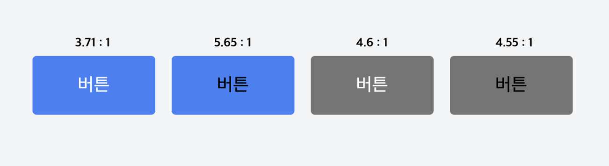

## 배워가기

--- 

### turbo 레포 중첩하기

루트 경로에 turbo.json 을 두고, 하위 패키지에 turbo.json 을 또 두고 싶다면?

`extends` 키워드를 사용하면 된다.

```jsx
{
  "extends": ["//"],
}
```

`["//"]`와 같이 작성하면, 루트 경로의 털보 설정을 상속받도록 한다.

### HTML autocomplete의 진화

- 타입이 공백 구분 리스트로 바뀌었다.
- `section-*` - 같은 유형의 데이터지만 값은 다른 자동완성을 지정할 수 있다. 
  - e.g. `autocomplete="section-buyer name"` vs. `autocomplete="section-recipient name"`

**Ref** https://sorto.me/docs/Web/HTML/Attributes/autocomplete

### FSD 아키텍처

FSD(Feature Sliced Design; 기능 분할 설계) 아키텍처
   
- **Layers**
  - 최상위 디렉토리이자 애플리케이션 분해의 첫 단계
  - 레이어의 수는 최대 7개로 제한
    - app/ processes(deprecated)/ widgets/ features/ entities/ shared

- **Slices**
  - 각 레이어는 애플리케이션 분해의 두 번째 수준인 슬라이스라는 하위 디렉토리를 가진다.
  - 슬라이스에서 연결은 특정 비즈니스 엔티티에 관한 것

- **Segments**
  - 각 슬라이스를 세그먼트로 구성된다.
  - 세그먼트는 목적에 따라 슬라이스 내의 코드를 나누는 데 도움이 된다.
  - 일반적으로 사용되는 세그먼트들은 다음과 같다.
    - api/ UI/ mode/ lib/ config/ consts

**Ref** 
- https://velog.io/@jay/fsd
- https://emewjin.github.io/feature-sliced-design/

### CQS(Command Query Separation)

모든 객체의 메소드를 작업을 수행하는 **command**와 데이터를 반환하는 **query** 2가지로 구분하는 디자인 패턴이다. 

**Command**
- 작업을 수행하는 메서드로, 객체의 내부 상태를 바꾸지만 값을 반환하지는 않는다.
- 자바스크립트의 setter에 해당한다.

**Query**
- 객체 내부 상태를 바꾸지 않고 객체의 값을 반환하기만 한다.
- 자바스크립트의 getter에 해당한다.

CQS 패턴에서 중요한 것은, 하나의 메소드가 command이면서 query 일 수는 없다는 점이다. 

CQS 패턴을 사용하면 '읽기'와 '쓰기'를 분리할 수 있다는 장점이 있다.

하지만 관리해야하는 객체가 많아질 수록 query, command도 많아지기 때문에 중복되는 코드가 발생할 수 있다. 

**Ref** https://medium.com/@su_bak/cqs-command-query-separation-pattern-이란-f701eabf8754

### sass의 nested style break changes

CSS가 nested style rule을 변경함에 따라 sass 작성 방식도 바뀌었다. 

순서에 주의해서 작성하자.

**[SASS]**
```css
.example {
  color: red;

  a {
    font-weight: bold;
  }

  font-weight: normal;
}
```

**[AS-IS]**
```css
.example {
  color: red;
  font-weight: normal;
}

.example a {
  font-weight: bold;
}
```


**[TO-BE]**
```css
.example {
  color: red;
}

.example a {
  font-weight: bold;
}

.example {
  font-weight: normal;
}
```

**Ref** https://sass-lang.com/documentation/breaking-changes/mixed-decls/

## 이것저것 모음집

--- 

- VirtualKeyboard API - 태블릿, 모바일 기기, 그리고 기타 키보드 사용이 불가한 디바이스에서 가상 키보드를 활용할 수 있다. ([Ref](https://developer.mozilla.org/en-US/docs/Web/API/VirtualKeyboard_API))

- pnpm Catalog - monorepo 내 여러 패키지에서 단일 버전을 바라보게 할 수 있다. 버전을 업데이트할 때도 pnpm-workspace.yaml 한 군데만 변경하면 된다.

- d3, 그리고 d3-scale - d3-scale은 추상 데이터를 시각적 표현으로 스케일한다. 실질적으로 좌표계에 표시하기 위한 방법([Ref](https://d3js.org/d3-scale))

## 기타공유

---

### oxc-project

우월한 구문분석기를 기반으로 트랜스파일링, 린팅, 포맷팅, 미니파잉, 리졸빙 등을 하나의 툴체인으로 제공할 수 있도록 하겠다는 프로젝트.

(oxc = OXidation Compiler를 기반으로 하는, oxc_ast/ oxc_parser/ oxc_resolver/ oxlint 등의 프로젝트가 배포되고 있다.)

- oxc는 swc 대비, 대략적으로 3배 빠르다고 발표 (싱글스레드 기준)
- oxlint는 eslint 대비, 약 50배 빠르다고 발표
- 힙 메모리 할당을 최소화 및 최적화함 (AST 메모리 활용 시 할당 아레나를 통해 처리하는 등)
- 파서 차원에서 하지 않아도 될 처리들을 위임함
- oxlint의 경우, eslint는 하지 못하는 병렬 스레딩 처리 적용

기본적으로 구문분석기(parser)가 빠르기 때문에 이후의 툴이 모두 빨라지게 된다. 

> cf) simd 최적을 위한 자료구조를 활용하는 등의 처리도 포함됨.

**Ref** https://github.com/oxc-project

### 웹 접근성의 명도대비 

웹 접근성에서 익숙한 명도대비 기준은 3:1과 4.5:1로 나뉜다. 

하지만 이것이 사실은 사람이 받아들이는 것과 꽤나 다를 수 있다는 이야기. 

WCAG3에서 APCA(Advanced Perceptual Contrast Algorithm)을 채택했다.

이는 기존 명도대비 기준의 한계 개선을 위한 것으로 APCA 기준은 다음과 같다.
- 45 이상 - large text (예전의 3:1)
- 60 이상 -  body text (예전의 4.5:1)
- 75 이상 - Preferred level for body text



**Ref** https://brunch.co.kr/@heavenlych/2

### 크롬의 서드파티 쿠키 지원 지속 

그렇다고 한다. 

**Ref** https://privacysandbox.com/news/privacy-sandbox-update/

### Node.js nightly에 실험 기능으로 네이티브 TS 구동 추가

node.js 실험판인가보다.

시대의 흐름에 이제서야 따라가는 것 같다.

**Ref** https://github.com/nodejs/node/pull/53725

## 마무리

--- 

뭔가 배우는 게 덜한 것 같은 요즘... 아무 이유 없이 2주차를 몰아서 썼다. 

그랬더니 7월이 끝났다.

폭염주의보와 호우주의보가 번갈아가며 떨어지는 요즘

왠지 지루함이 계속되고 아직 초짜인 주제에 개발과 권태로움을 느끼는 요즘

밤새지 않는 해커톤으로 다시 기강 잡고 그래도 하는 대로 해봐야지. 