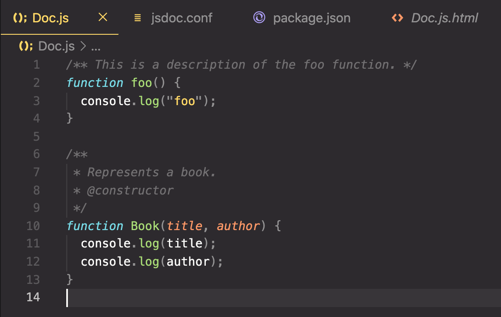
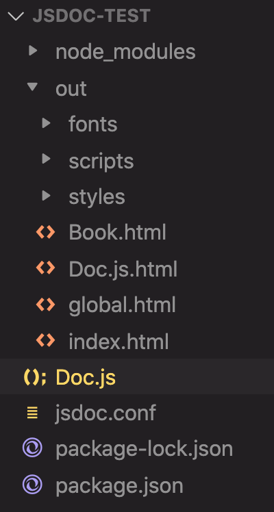
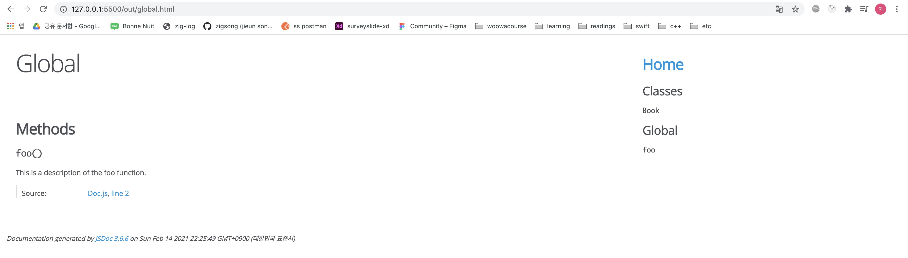

우테코 Lv1 Calculator PR로그

<!-- more -->

---

## cypress

- `context()` - `describe()`와 동일한 `mocha` 메소드이다.

- test case의 상당 부분은 함수화 가능하다.

- 함수 내부에 `cy` 메소드를 사용할 수 있다.

  ```jsx
  const calculationTest = (num1, operator, num2, expectedResult) => {
    numberClick(num1);
    cy.get('.operation').contains(`${operator}`).click();
    numberClick(num2);
    cy.get('.operation').contains('=').click();
    ...
  }
  ```

- random으로 값을 입력하지 말고 상황에 따라 test 쪼개기

- alert 등 window 메소드는 `stub` 사용하기

- 값이 ‘1’이고 class가 ‘digit’인 element를 구하는 코드

  ```jsx
  cy.get(".digits").contains("1");
  ```

---

## javascript

- `setEventListener`: addEventListener 함수들을 묶는 함수의 이름으로 적당한 것 같다.

- 예외 케이스 더 많이 생각하기! 🙄

- MVC 패턴 고려하기

- `Number.isNaN`

- 사칙연산을 객체로 다루는 방법

  ```jsx
  const operations = {
    "+": (a, b) => a + b,
    "-": (a, b) => a - b,
    "*": (a, b) => a * b,
    "/": (a, b) => a / b,
  };
  ```

- 출력 형식이 복잡할 때는 `this.formatTotal(this.total);`과 같은 방식으로 메소드를 분리하는 방법도 있다.

- dom을 가져오는 변수명 앞에는 `$` 붙이기

  ```jsx
  const $calculator = document.querySelector(".calculator");
  ```

- class형 컴포넌트에서 `this` binding 주의하기

  ```jsx
  this.$.digits.addEventListener("click", this.onClickDigit.bind(this));
  ```

- 특정 범위 안의 random number 구하기

  ```jsx
  function getRandomInput(max, min) {
    min = Math.ceil(min);
    max = Math.floor(max);
    return String(Math.floor(Math.random() * (max - min) + min));
  }
  ```

- `CustomEvent()` - click, change, submit 등의 이벤트와 마찬가지로 CustomEvent를 생성해서 사용할 수 있다! 넘나 신기하다.

- 🙄 Web Worker? - https://developer.mozilla.org/ko/docs/Web/API/Web_Workers_API

- DOM의 classList에 add, remove하는 방식 생각하기

**Ref**
https://im-developer.tistory.com/190

---

## JSDoc

javascript 애플리케이션이나 라이브러리의 API를 문서화해준다. 소스코드 파일에 주석을 달기 위해 사용되는 마크업 언어라고 할 수 있다.
기본적인 문법은 `/** ~ **/`를 사용하는 것이다.

```jsx
/** This is a description of the foo function. */
function foo() {}
```

JSDog tag를 활용할 수도 있다.

```jsx
/**
 * Represents a book.
 * @constructor
 */
function Book(title, author) {}
```

npm으로 jsdoc을 install한 후, docdash 등의 테마를 설정할 수도 있다.

```shell
npm i --save-dev jsdoc
npm install docdash
```

jsdoc도 뭔가 개별 설정이 필요하다 😬 어디선가 줍줍해 온 코드 복붙

```jsx
// jsdoc.conf
{
  "source": {
    "include": "./index.js",
    "includePattern": ".js$"
  },
  "plugins": [
    "plugins/markdown"
  ],
  "opts": {
    "template": "node_modules/docdash",
    "encoding": "utf8",
    "destination": "./docs",
    "recurse": true,
    "verbose": true
  },
  "templates": {
    "cleverLinks": false,
    "monospaceLinks": false,
    "default": {
      "outputSourceFiles": false
    },
    "docdash": {
      "static": false,
      "sort": true
    }
  }
}
```

설정이 완료되면 아래 커맨드로 HTML로 구성된 웹사이트를 확인하면 된다.

```shell
jsdoc [file].js
```



이렇게 코드를 임시로 쳐줬더니



이런 새로운 디렉토리, 파일들과 함께



이런 html 페이지가 생겼다! 😮 신기하다.

🙄 jsdoc을 global로 설치하면 잡다한 설정을 줄일 수 있다.

```shell
npm install -g jsdoc
```

jsdoc의 자세한 문법들은 [공식 문서](https://jsdoc.app/)를 참조하도록 하자.

**Ref**
https://jsdoc.app/about-getting-started.html
https://okayoon.tistory.com/entry/JSDoc를-사용해서-Javasript-문서화해보자
