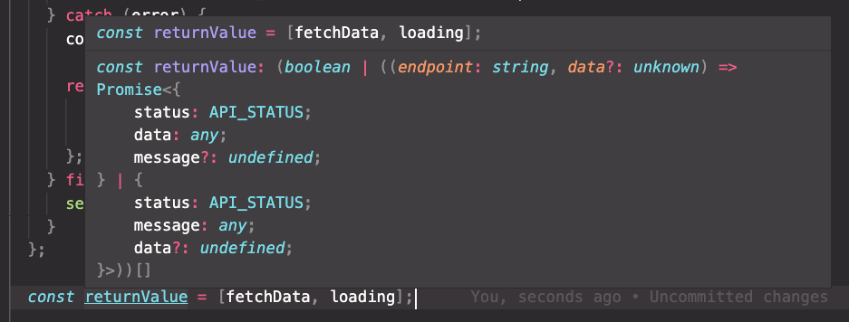
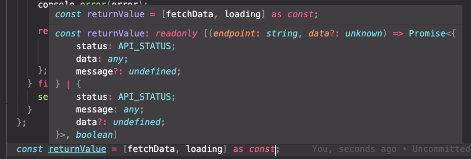

우테코 Lv2 subwaymap 학습로그

<!-- more -->

---

- [PR-Step1 바로가기](https://github.com/woowacourse/react-subway-map/pull/13)
- [PR-Step2 바로가기](https://github.com/woowacourse/react-subway-map/pull/31)

# 1️⃣ Step1

---

## CRA 앱에서 babel 설정을 도와주는 친구들

CRA로 React 앱을 만들면 babel 설정을 마음대로 하기가 어렵다. `.babelrc` 파일을 생성해도 적용이 되지 않는다. 이를 해결해주는 모듈이 몇 개 있다. 가장 대표적인 것은 **react-app-rewired**이다.

```shell
$ yarn add react-app-rewired
```

`package.json`의 `scripts`를 수정해준다.

```jsx
// package.json
"scripts": {
  "start": "react-app-rewired start",
  "build": "react-app-rewired build",
  "test": "react-app-rewired test",
  ...
},
```

`config-overrides.js` 파일을 만들어 설정을 바꿔준다. 이때 `customize-cra`를 사용하면 편리하다.

```jsx
// config-overrides.js
const { override, useBabelRc } = require("customize-cra");

module.exports = override(useBabelRc());
```

→ 이제 CRA에 설정된 값을 필요에 따라 override하여 사용할 수 있다.

**Ref**

- https://www.npmtrends.com/@craco/craco-vs-customize-cra-vs-react-app-rewired
- https://micalgenus.github.io/articles/2019-02/React-eject-없이-babelrc-적용

---

## NavLink

navigation bar를 구현할 때 사용한다. Router 구현 시, 현재 활성화된 URL에 해당한 링크만 하이라이팅해줄 수 있다.

```tsx
const NavBar = () => {
  const selectedNavStyle = {
    backgroundColor: PALETTE.DEFAULT_CREAM,
    borderRadius: '8px',
  };

  return (
    <NavLink to={ROUTE.LOGIN} activeStyle={selectedNavStyle}>
      <Styled.NavItem>로그인</Styled.NavItem>
    </NavLink>
    <NavLink to={ROUTE.SIGNUP} activeStyle={selectedNavStyle}>
      <Styled.NavItem>회원가입</Styled.NavItem>
    </NavLink>
  )
}
```

**Ref**
https://reactrouter.com/web/api/NavLink

---

## useFetch

useFetch는 일반적으로 get method를 사용하고, 어떤 데이터를 가져오는지 endpoint나 데이터의 키값을 정의한다. 일반적으로 GET요청을 가장 많이 사용하기 때문에 GET을 default method로 두고,(fetch의 기본 method도 GET) 나머지 요청이 필요할땐 인자로 넣어주자! 👍

이번에는 GET 요청 뿐 아니라 POST, PUT, DELETE에 대한 요청들도 한번에 처리해주기 위해 `fetchData` 메서드를 함께 리턴해주었다.

👾 제네릭을 이용하여 리턴할 데이터에 대한 타입도 명시해주면 좋다.

```tsx
type HTTP_METHOD = "GET" | "POST" | "PUT" | "DELETE";

const useFetch = (method: HTTP_METHOD = "GET") => {
  const [loading, setLoading] = useState<boolean>(false);
  const BASE_URL = useAppSelector((state) => state.serverSlice.server);

  const fetchData = async (endpoint: string, data?: unknown) => {
    setLoading(true);
    try {
      const response = await axios({
        method,
        url: `${BASE_URL}/${endpoint}`,
        data,
      });

      return { status: API_STATUS.FULFILLED, data: response.data };
    } catch (error) {
      console.error(error);

      return {
        status: API_STATUS.REJECTED,
        message: error.response?.data.message || ALERT_MESSAGE.SERVER_ERROR,
      };
    } finally {
      setLoading(false);
    }
  };

  return [fetchData, loading] as const;
};
```

`useFetch` hook을 사용하는 컴포넌트에서는 다음과 같이 작성한다.

```tsx
const StationPage = () => {
  const [getStationsAsync, getStationsLoading] = useFetch();
  const [addStationAsync, addStationLoading] = useFetch("POST");
  const [deleteStationAsync, deleteStationLoading] = useFetch("DELETE");
  const [editStationAsync, editStationLoading] = useFetch("PUT");

  // ...
};
```

---

## type assertion

useFetch hook에서 다음과 같이 리턴하면, 사용하는 측에서 배열의 각 원소에 대한 타입을 확신할 수 없다.

```tsx
// useFetch.ts
const useFetch = (method: HTTP_METHOD = "GET") => {
  // ...
  return [fetchData, loading];
};

// SomeComponent.tsx
const StationPage = () => {
  const [getStationsAsync, getStationsLoading] = useFetch();

  const fetchStations = () => {
    const res = await getStationsAsync(END_POINT.STATIONS);
  };
  // ...
};

// 🚨 This expression is not callable.
// 🚨 TNot all constituents of type 'boolean | ((endpoint: string, data?: unknown) => Promise<{ status: API_STATUS; data: any; message?: undefined; } | { status: API_STATUS; message: any; data?: undefined; }>)' are callable.
// 🚨 TType 'false' has no call signatures.
```

변수가 `const`로 선언되었다 할지라도, 객체 내부의 속성에 대한 타입은 넓은 범위로 추론되기 때문에 TypeScript 에러가 나는 것이다.

이런 경우, 타입 추론의 범위를 좁혀주기 위해 const assertion을 사용할 수 있다. `as const` 를 사용한다.

```tsx
return [fetchData, loading] as const;
```

그냥 객체로 리턴 시


`as const`로 리턴 시 (`readOnly`가 추가된다)



```tsx
const returnVal: readonly [typeof fetchData, boolean] = [fetchData, loading];

return returnVal;
```

코드가 아주 별로기 때문에 `as const`를 쓰는 편이 낫겠다.

**Ref**

- https://medium.com/@seungha_kim_IT/typescript-3-4-const-assertion-b50a749dd53b
- https://www.typescriptlang.org/docs/handbook/2/objects.html

---

## etc

### Redux toolkit slice에서 store값에 접근하기

`createAsyncThunk`의 `thunkAPI.getState`를 사용한다.

```tsx
export const requestGetUser = createAsyncThunk<
  { user: User },
  string,
  { dispatch: AppDispatch; state: RootState }
>("auth/getUser", async (accessToken, { rejectWithValue, getState }) => {
  const BASE_URL = getState().serverSlice.server;
  // ...
});
```

# 2️⃣ Step2

---

## etc

### useSelector에 제네릭으로 타입 넘겨주기

```tsx
const StationPage = () => {
  // const user: User | undefined = useAppSelector((state) => state.authSlice.data);
  const user = useAppSelector<User | undefined>(
    (state) => state.authSlice.data
  );
  // ...
};
```
