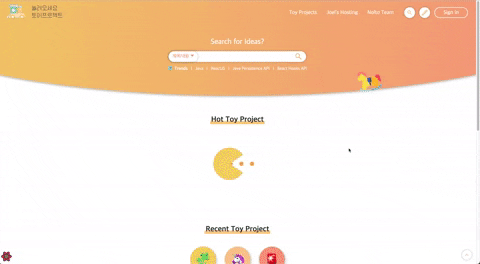

에러 핸들링

<!-- more -->

---

프로젝트를 진행하며 적용해보았던 Error Boundary와 Suspense 코드는 다음과 같다.
🍀 [여기서 읽기](https://zigsong.github.io/2021/07/24/fe-error-suspense/)

여기서 일부 코드 모듈화와 에러 상황에서의 사용자의 경험 개선을 위해 코드를 수정한 부분들이 있다.

### 1. 팀의 error code 매칭하기

기존의 `HttpError`가 http 응답에 기본적으로 담겨있는 `statusCode`를 갖는 대신 우리 팀에서 합의한 (커스텀한) `errorCode` 키들을 갖기로 했다. `errorCode`를 따로 만든 이유는, 같은 400 Bad Request라도 어떤 필드가 빠졌는지, 무엇을 잘못 입력해서 전송했는지 등 여러 가지 경우의 수가 있을 수 있기 때문이다.

```tsx
class HttpError extends CustomError {
  errorCode: ERROR_CODE_KEY; // custom한 errorCode 저장

  constructor(
    errorCode: ERROR_CODE_KEY,
    message?: string,
    errorHandler?: ErrorHandler
  ) {
    super(message, errorHandler);
    this.name = "HttpError";
    this.errorCode = errorCode;
  }
}
```

### 2. 공통적인 에러 처리 함수 모듈화하기

react-query hook에서 사용하는 함수들에서 공통적으로 반환하거나 throw하는 세부 구현 내용을 `resolveHttpError`라는 함수로 모듈화했다. `error` 객체와 `errorMessage`, 그리고 대다수의 경우 snackbar를 띄워줄 목적의 `errorHandler`를 인자로 받는다.

```tsx
const loadHotFeeds = async (errorHandler?: ErrorHandler) => {
  try {
    const { data } = await api.get("/feeds/hot");

    return data;
  } catch (error) {
    resolveHttpError({
      error,
      defaultErrorMessage: "인기 피드에 에러가 발생했습니다",
      errorHandler,
    });
  }
};

const useHotFeedsLoad = ({ errorHandler, ...option }: CustomQueryOption) => {
  return useQuery<Feed[], HttpError>(
    ["hotFeeds"],
    () => loadHotFeeds(errorHandler),
    option
  );
};
```

`resolveHttpError`의 세부 구현 내용은 아래와 같다. 디버깅용 `console.error`를 출력하고, 에러 응답의 타입에 따라 알맞는 에러 객체를 throw해준다. 매칭되는 에러 코드-메시지 쌍이 없을 경우를 대비하여 `defaultErrorMessage`를 넣어주었다.

```tsx
export const resolveHttpError = ({
  error,
  defaultErrorMessage,
  errorHandler,
}: ResolveHttpErrorResponseArgs) => {
  const errorResponse = error.response;

  console.error(error);

  if (!isHttpErrorResponse(errorResponse)) {
    console.error("에러 응답이 ErrorResponse 타입이 아닙니다");

    throw new CustomError(defaultErrorMessage, errorHandler);
  }

  const { data } = errorResponse;

  console.error(data.message);

  throw new HttpError(
    data.errorCode,
    ERROR_CODE[data.errorCode] || defaultErrorMessage,
    errorHandler
  );
};
```

### 3. 두 가지 방식으로 에러 알리기

미리 계획했던 대로, 컴포넌트에서 에러가 발생하면 아래 순서로 로직이 수행된다.

> 1. snackbar를 통해 사용자에게 에러 상황을 알린다.
> 2. 정상적인 컨텐츠가 보여야 할 자리에 custom한 error page를 렌더링한다.

```tsx
const HotFeedsContent = () => {
  const { data: hotFeeds } = useHotFeedsLoad({
    errorHandler: (error) => {
      snackbar.addSnackbar('error', error.message);
    },
  });

  return (
    // ...
  )
```

여기서 `useQuery`(위 컴포넌트에서는 `useHotFeedsLoad`)에 넘겨주는 `errorHandler`는, 이후 `useQuery`가 실행하는 콜백에서 에러 발생 시 throw할 에러 객체에 저장된다. 이 에러 객체는 `CustomError`를 상속받은 `HttpError` 클래스의 객체이며, `CustomError` 내부의 코드는 다음과 같다.

```tsx
export default class CustomError extends Error {
  name: string;
  errorHandler: ErrorHandler;

  constructor(message?: string, errorHandler?: ErrorHandler) {
    super(message);
    this.name = new.target.name;
    this.errorHandler = errorHandler;
    Object.setPrototypeOf(this, new.target.prototype);
  }

  // errorHandler를 실행한다.
  executeSideEffect() {
    if (this.errorHandler) {
      this.errorHandler(this);
    }
  }
}
```

`errorHandler`의 실제 실행은 `ErrorBoundary`에서 처리해주고 있다.

```tsx
export default class ErrorBoundary extends Component<Props, State> {
  // ...
  componentDidCatch(error: Error, errorInfo: ErrorInfo) {
    console.error("Uncaught error in Error Boundary:", error, errorInfo);

    if (error instanceof CustomError) {
      error.executeSideEffect(); // errorHandler를 실행한다.
    }
  }

  render() {
    // ...
  }
}
```

> **👾 왜 react-query의 onError 옵션을 사용하지 않고?**
>
> useQuery의 onError 콜백은 매 Observer, 즉 동일한 useQuery를 사용하는 곳에서 모두 호출된다. useQuery를 이용한 데이터의 fetch가 실패하면 모든 Observer에게 통지가 간다. 앱 전체에서 useHotFeedsLoad를 3번 사용하면, 3번의 onError 콜백이 호출되는 것이다!
>
> 스낵바가 3번씩 표시되는 문제를 해결하려면 Suspense와 ErrorBoundary를 걷어내고 useQuery 내부에서 useEffect를 사용해서 앱 전체에서 동일한 query key에 대한 에러핸들링을 1번만 수행할 수 있지만, 소중한(!) ErrorBoundary를 걷어낼 수 없어서 errorHandler를 따로 넘겨주는 방식을 사용했다.

이제 ErrorFallback 컴포넌트를 보여주는 로직을 살펴보자. HotFeedsContent는 부모 컴포넌트에서 `AsyncBoundary`에 감싸져 있다. 에러가 발생하면 throw된 error 객체는 `AsyncBoundary`에 걸려 `rejectedFallback`에 들어가는 컴포넌트를 보여준다.

```tsx
const Home = () => {
  // ...
  return (
    <AsyncBoundary
      rejectedFallback={
        <ErrorFallback
          message="데이터를 불러올 수 없습니다."
          queryKey="hotFeeds"
        />
      }
    >
      <HotFeedsContent />
    </AsyncBoundary>
    // ...
  );
};
```

아래와 같이 snackbar와 errorFallback 두 가지 방법으로 에러를 표시한다.



### 4. ErrorFallback에 queryKey 전달하기

여기서 뭔가 발견했다면 당신은 천재! 👀 커스텀한 에러 페이지를 가리키는 `ErrorFallback`에 `queryKey`라는 props를 넣어주었다.

```tsx
import { useQueryClient } from "react-query";

const ErrorFallback = ({ message, queryKey }: Props) => {
  const queryClient = useQueryClient();

  // prop으로 queryKey를 받았다면, 해당 queryKey가 갖는 데이터를 reset시켜준다.
  useEffect(() => {
    queryClient.resetQueries(queryKey && queryKey);
  }, []);

  return (
    <Styled.Root>
      <Styled.Image width="480px" src={catError} alt="error" />
      <Styled.Message>
        <Styled.ErrorText>ERROR</Styled.ErrorText>
        <Styled.ErrorDetail>{message}</Styled.ErrorDetail>
      </Styled.Message>
    </Styled.Root>
  );
};
```

에러가 터져 기존의 컴포넌트 대신 ErrorFallback 페이지를 보여줄 경우, react router를 통해 다른 페이지로 갔다가 다시 돌아왔을 때 기존 컴포넌트에서 api 호출을 다시 할 수가 없다. (기존 컴포넌트 대신 ErrorFallback 컴포넌트가 렌더링되고 있기 때문에)

따라서 ErrorFallback에서 react-query의 `resetQueries`를 통해 ErrorBoundary에 걸린 react-query의 `queryKey`에 해당하는 서버 데이터를 초기화해주었다. 그러면 새로고침 없이 다시 동일 페이지에 접속했을 때 필요한 서버 데이터를 다시 요청할 수 있다.

사실 이 부분에서 아무리 react-query의 각양각색 query refetch 메서드를 사용해도 문제가 풀리지 않아 며칠을 고생했는데, 완벽하진 않지만 ErrorFallback에 걸려버린 SPA의 한계를 인정하고 조금 복잡하더라도 원하는 목적대로 동작을 수행하기 위해 코드를 작성해 보았다.
