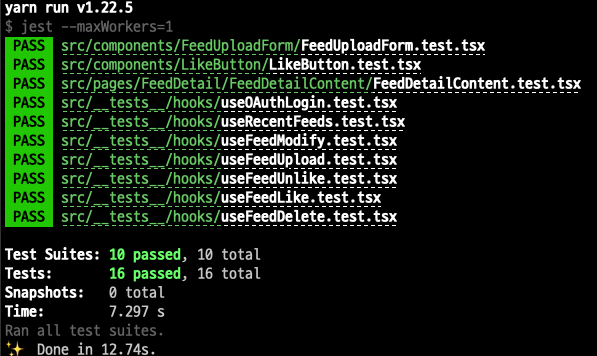

프론트엔드 테스트

<!-- more -->

---

### 🤔 고민

페어와 함께 프론트엔드 테스트를 고민했던 부분은 다음과 같다.

> - 작은 독립적인 단위부터, bottom-up 방식으로 테스트를 견고하게 쌓아가고 싶다.
> - 코드를 수정할 때마다 빠르게 피드백을 받아볼 수 있는 테스트를 원한다.
> - 앱 전체가 정상적으로 작동하지 않아도 부분적인 테스트가 가능하길 바란다.
> - 함수와 데이터 모킹을 통해 실제 동작을 확인하고 싶다.

무엇을 믿을지, 그리하여 **무엇을 테스트하지 않을지** 생각해야 했다. 예를 들어, React 컴포넌트에서 렌더링하는 JSX 요소에 등록한 이벤트 핸들러는 잘 동작할 것이라 믿는다. 그러나 컴포넌트에 전달되는 props에 따라 렌더링되는 내용이 달라진다면 그 부분은 테스트하는 의미가 있다. 사용자의 어떤 인터랙션에 의해 api가 호출된다면 이도 유의미한 테스트라고 생각한다.

많은 경우 프론트엔드 테스트를 **단위 테스트**, **통합 테스트**, **E2E 테스트**로 나누곤 한다. 현재 프로젝트에서 E2E 테스트까지 수행하기엔 테스트 비용이 너무나도 많이 들어갈 것 같고, 단위 테스트를 시작으로 서서히 통합 테스트를 해 나가기로 한 셈이다. 물론 단위 테스트와 통합 테스트의 경계는 너무나도 모호하지만.

페어는 비즈니스 로직과 UI 렌더링의 완전한 분리를 원했었다. React 컴포넌트는 정말로 마크업만 렌더링하고, 컴포넌트 내에서 상호작용이 발생하는 로직들은 전부 hook으로 분리하자는 것이었다. 실제로 다양한 출처들에서 그렇게 하고 있다는 점을 부정할 수는 없었지만, 재사용성도 없어 보이는 hook 로직들을 테스트를 위해 너무 많이 분리하는 것이 아닌가, UI만 렌더링하는 컴포넌트라면 사실상 container-presentational 컴포넌트의 관계가 되는 것이 아닌가 걱정했었다.

실제로 테스트가 어려운 코드는 잘못 짜여진 것일 수도 있다는 이야기까지 듣고 어느 정도 납득은 되었지만, 너무나도 낯설고 갈기갈기 찢겨버리는 듯한(?) 컴포넌트의 구조가 초래할 후폭풍이 괜시리 두려워 일단은 컴포넌트에 작성했던 비즈니스 로직은 그대로 두기로 했다. 서비스/렌더링 로직이 혼재되어 있는 각 컴포넌트에서 테스트를 진행하기가 아주 쉽지는 않았으나, 차근차근 채워 나가고 있다.

### react hook test

기존에 작성했던 react hook test 포스팅은 아래 링크에서 읽을 수 있다.
[msw](https://mswjs.io/)를 이용하여 서버 api 호출을 대신했다.
🍀 [여기서 읽기](https://zigsong.github.io/2021/08/01/fe-hook-test/)

### unit test

유닛 테스트라고 해야할지, 컴포넌트 단위 테스트라고 해야할지는 모르겠지만 최소단위의 컴포넌트에서 동작하는 로직에 대한 테스트 코드도 작성 중이다.

사용자의 특정 인터랙션에 따라 react-query hook이 호출되어야 하는 경우 jest의 `toHaveBeenCalled` 등의 assertion으로 확인하여 hook의 호출 여부를 확인하고자 했었는데, 해당 부분은 신뢰할 수 있는 부분, 즉 **테스트할 필요가 없는 부분**이라는 페어의 의견에 따라 따로 테스트를 해주지 않았다. 대신 jest로 해당 hook을 mocking하여 반환해야 하는 mock data들을 심어주었다.

> 👾 이때 `jest.mock`에 걸려 있는 콜백은 **함수를 리턴하는 함수**여야 한다. 애초에 함수의 동작을 mocking하는 것이기 때문에. 리턴되는 함수의 리턴값(말장난 같지만)의 타입에 정확히 맞춰서 mock data를 넣어주자!

```jsx
jest.mock("hooks/queries/useMember", () => {
  return () => ({
    userData: MOCK_USER.ZIG,
    isLogin: true,
    logout: () => console.log("logout"),
  });
});
```

`useMember` hook은 LikeButton 컴포넌트에 click 이벤트가 발생하면 특정 동작을 수행한다. 따라서 아래처럼 작성해주면, mocking된 브라우저의 공간에서 UI의 렌더링이 바뀌는 것을 확인할 수 있다.

```jsx
describe("LikeButton 테스트", () => {
  it("좋아요하지 않은 피드에서 좋아요 버튼을 누르면 좋아요 수가 1 증가한다.", async () => {
    const { getByRole, container } = customRender(
      <LikeButton feedDetail={MOCK_FEED_DETAIL} />
    );

    const likeButton = getByRole("button");
    const likeCountBefore = container.querySelector("span");

    expect(likeCountBefore).toHaveTextContent(
      MOCK_FEED_DETAIL.likes.toString()
    );

    fireEvent.click(likeButton);

    const likeCountAfter = container.querySelector("span");

    await waitFor(() => {
      expect(likeCountAfter).toHaveTextContent(
        (MOCK_FEED_DETAIL.likes + 1).toString()
      );
    });
  });
});
```



지금까지 깔끔하게 테스트 성공!

### 테스트 자동화

github husky를 통해 리모트 저장소에 push 전 테스트코드를 돌릴 수 있도록 해주었다.
🍀 [여기서 읽기](https://zigsong.github.io/2021/08/14/woowa-week-28/#테스트-자동화)

---

**Ref**

- https://jbee.io/react/testing-1-react-testing/
- https://jbee.io/react/testing-2-react-testing/
- https://meetup.toast.com/posts/174
- https://blog.mathpresso.com/모던-프론트엔드-테스트-전략-1편-841e87a613b2
- https://www.daleseo.com/jest-mock-modules/
