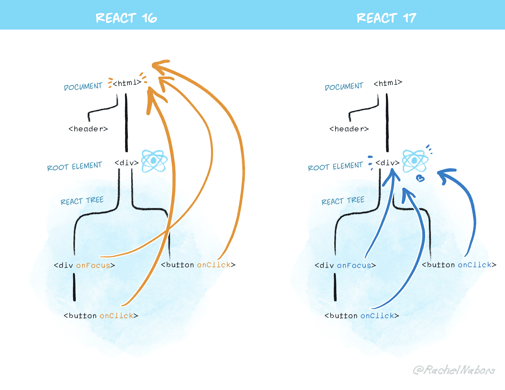

Storybook으로 컴포넌트 UI 테스트 | prop drilling | propTypes

<!-- more -->

---

## 페어 프로그래밍

콜린버스 타고 페어 프로그래밍 중…
항상 많이 맞춰주고, 배려해주고, 의견을 조심스럽게 말해주는 고마운 페어다!
아직 부족한 점이 많아서 함께 공부해 나가고 있다.

---

## 공부하기

### prop drilling

`threading`이라고도 불리는 prop drilling은, 리액트 컴포넌트 트리에서 데이터가 전달되는 과정을 가리킨다.

```jsx
function Toggle() {
  const [on, setOn] = React.useState(false);
  const toggle = () => setOn((o) => !o);
  return <Switch on={on} onToggle={toggle} />;
}

function Switch({ on, onToggle }) {
  return (
    <div>
      <SwitchMessage on={on} />
      <SwitchButton onToggle={onToggle} />
    </div>
  );
}

function SwitchMessage({ on }) {
  return <div>The button is {on ? "on" : "off"}</div>;
}

function SwitchButton({ onToggle }) {
  return <button onClick={onToggle}>Toggle</button>;
}
```

위의 예제에서, `on`이라는 상태와 `toggle`이라는 이벤트 핸들러가 각각 `SwitchMessage`와 `SwitchButton` 컴포넌트에 알맞게 들어가게 하기 위해서는 `Switch` 컴포넌트를 거쳐야 한다. `Switch` 컴포넌트는 그 자체로 `on`과 `toggle`이 필요하지 않지만, 그 자식 컴포넌트들에서 데이터가 필요하기 때문에 이 데이터들을 `props`로 넘겨준다. 이를 **prop drilling**이라고 한다.

prop drilling은 데이터의 흐름을 추적하기 쉽고 해당 값들이 어디서 사용되는지 파악하는 데 유리하다.

그러나 앱의 규모가 커짐에 따라 수많은 컴포넌트 레이어를 거쳐 prop drilling이 발생한다면 여러가지 문제가 발생할 수 있다.

- 일부 데이터의 자료형을 바꾸는 경우
- 필요보다 많은 props를 전달하다가 컴포넌트를 분리(또는 제거)하는 과정에서 필요없는 props가 남는 경우
- 필요보다 적은 props를 전달하면서 동시에 `defaultProps`를 남용하여 정말 필요한 props이 전달되지 못할 경우
- props의 이름이 중간에 변경되어서 값을 추적하기가 힘들어지는 경우

`render` 메소드를 성급하게 여러 블록으로 분리시키는 것은 prop drilling의 문제를 더욱 악화시킨다. 가능한 하나의 `render` 메소드를 사용하고, 실제로 필요한 경우에만 `render` 내의 블록들을 분리하자. 기억하지도 못할 여러 컴포넌트들에 `props`를 떠돌아다니게 하지 말자

> Fun fact, there’s nothing technically stopping you from writing your entire application as a single React Component

또 `defaultProps`의 사용을 지양하자. 정말 불필요한 prop에만 default 값을 부여하자.
마지막으로, 관련 있는 state는 가능한 가장 가까운 곳에 위치하는 것이 좋다! 😉

참고: [React Context API](https://ko.reactjs.org/docs/context.html)

**Ref**
https://kentcdodds.com/blog/prop-drilling

### 유연한 컴포넌트를 작성하기 위한 4가지 원칙 by Dan abramov

**원칙 1: 데이터 흐름을 중단해서는 안 된다.**
렌더링 내에서 데이터 흐름을 중단하지 말자. prop을 state에 복사하는 것은, 이후의 모든 업데이트를 무시하게 된다. 변화에 따라 업데이트되길 원한다면 prop을 계산한 값을 `render` 메소드 안으로 옮기는 것이다.

```tsx
class Button extends React.PureComponent {
  render() {
    const textColor = slowlyCalculateTextColor(this.props.color);
    return (
      <button
        className={
          "Button-" + this.props.color + " Button-text-" + textColor // ✅ 언제나 최신
        }
      >
        {this.props.children}
      </button>
    );
  }
}
```

또는 메모이제이션을 사용하여 특정 prop이 바뀔 때마다 고비용의 계산을 할 수 있다.

```tsx
function Button({ color, children }) {
  const textColor = useMemo(
    () => slowlyCalculateTextColor(color),
    [color] // ✅ `color`가 바뀌기 전에는 다시 계산하지 않습니다
  );

  return ( ... )
}
```

또, 부수효과(ex. 데이터 가져오기) 내에서 데이터 흐름을 중단하지 말자
데이터를 fetch해오는 url의 query가 바뀔 경우, 아래의 lifecycle 메소드를 이용하여 props의 변경을 제대로 반영할 수 있다.

```tsx
componentDidUpdate(prevProps) {
  if (prevProps.query !== this.props.query) { // ✅ 변경시에 다시 가져오기
    this.fetchResults();
  }
}
```

hook은 이러한 일관성을 정적으로 분석할 수 있게끔 해준다.

```tsx
useEffect(() => {
  function fetchResults() {
    const url = getFetchUrl();
    // 데이터 가져오기 실행...
  }

  function getFetchUrl() {
    return "http://myapi/results?query" + query + "&page=" + currentPage;
  }

  fetchResults();
}, [currentPage, query]); // ✅ 변경시에 다시 가져오기
```

`currentPage`, `query`는 부수효과의 ‘종속성’이 된다.

마지막으로, 최적화 내에서 데이터 흐름을 중단하지 말자.

**Ref** https://overreacted.io/ko/writing-resilient-components/

---

## 알아보기

### propTypes

React의 `propTypes`를 사용하면 TypeScript를 사용하지 않고도 컴포넌트가 받아야 할 `props`의 타입을 확인할 수 있다.

```jsx
import PropTypes from "prop-types";

class Greeting extends React.Component {
  render() {
    return <h1>Hello, {this.props.name}</h1>;
  }
}

Greeting.propTypes = {
  name: PropTypes.string,
};
```

`isRequired` 옵션으로 해당 `prop`에 대한 강제성을 부여할 수 있으며, `defaultPropTypes`로 기본값을 설정할 수 있다.

```jsx
Greeting.propTypes = {
  name: PropTypes.string.isRequired, // 필수 prop
};

Greeting.defaultProps = {
  name: "Stranger",
};
```

`propTypes`는 성능상의 이유로 development mode에서만 확인이 가능하다.

**Ref** https://ko.reactjs.org/docs/typechecking-with-proptypes.html

### manifest.json

CRA 프로젝트 디렉토리를 정리하면서 public 폴더의 `manifest.json` 파일을 필요없겠지? 생각하여 지워버렸더니 에러 발생 😑

해당 파일은 앱에 대한 정보를 담고 있는 JSON 파일로, 배경색, 앱의 이름, 홈스크린 아이콘 등에 대한 정보를 담고 있다.

**short_name**: 사용자 홈 화면에서 아이콘 이름으로 사용
**name**: 웹앱 설치 배너에 사용
**icons**: 홈 화면에 추가할때 사용할 이미지
**start_url**: 웹앱 실행시 시작되는 URL 주소
**display**: 디스플레이 유형(fullscreen, standalone, browser 중 설정)
**theme_color**: 상단 툴바의 색상
**background_color**: 스플래시 화면 배경 색상
**orientation**: 특정 방향을 강제로 지정(landscape, portrait 중 설정)

**Ref** https://altenull.github.io/2018/03/09/웹앱-매니페스트-서비스워커-Web-App-Manifest-Service-Worker/

### css

- `input`, `img` 태그에는 `before`, `after` 등 pseudo element를 사용할 수 없다.
- `letter-spacing` 속성을 사용하여 자간을 조정할 수 있다.

### React의 ref

react-lotto 학습로그 참조

**Ref** https://cereme.dev/frontend/react-hooks-useeffect-useref-feat-closure/

### useState의 타입은?

Router 없이 state로 pagination을 구현하겠다고, state에 React Component 자체를 넣어봤다. 그리고 state를 찍어보았다.

대략 이런 셈

```jsx
const [currentPage, setCurrentPage] = useState(<CardList cards={[]} />);

useEffect(() => {
  console.log(currentPage);
});
```

과연 무엇이 찍혔을까?

```tsx
{
  $$typeof: Symbol(react.element),
  key: null,
  ...
}
```

신기한 것이 찍혔다. `$$typeof`이 뭘까?

React의 JSX에서 다음과 같이 리턴하면,

```jsx
<CardList cards={['zig', 'woo', 'yang']}>
```

실제로는 아래와 같이 컴파일된다.

```tsx
React.createElement(
  /* type */ "CardList",
  /* props */ { cards: ["zig", "woo", "yang"] }
  // ...
);
```

그리하여 해당 값이 콘솔에 아래와 같은 형태로 찍히는 것이다.

```tsx
{
  $$typeof: Symbol(react.element),
  key: null,
  props: {
    cards: [...]
  }
  ...
}
```

클라이언트 사이드 UI 라이브러리들이 보편화되기 전, HTML을 생성하고 DOM을 주입하기 위해서는 주로 아래와 같은 방법이 사용되었다.

```jsx
const messageEl = document.getElementById("message");
messageEl.innerHTML = "<p>" + message.text + "</p>";
```

이 코드는 정상 작동하겠지만, `message.text`에 ``와 같은 값이 들어온다면 어떨까? 누군가가 작성한 코드가 앱의 렌더된 HTML에 inject되는 XSS 공격이 발생할 수 있는 것이다.

이 때문에 React에서는 문자열 텍스트에 대한 이스케이핑이 기본으로 지원되어, `message.text`에 `` 등의 수상한 태그 문자열이 들어오면 이를 실제 DOM으로 변환시키지 않고 이스케이프한 뒤 DOM에 주입시킨다. `` 태그가 마크업 코드 그대로 표시되는 것이다.

(정말 임의로 HTML을 넣어야 하는 상황이라면, `dangerouslySetInnerHTML`을 사용할 수 있다.)

그러나 서버의 결함 등으로 인해 유저가 문자열 대신 임의의 JSON 객체를 입력하여 그 값이 서버에 저장될 수 있다면, React는 또다시 XSS 공격에 취약해진다. 그렇게 React 0.14부터는 모든 React element에 **`Symbol`** 태그를 달기로 했다.

JSON에는 `Symbol`을 넣을 수 없기 때문에, 서버에 보안 구멍이 생겨 텍스트 대신 JSON을 반환한다 하더라도 그 JSON에는 `Symbol.for('react.element')`를 포함할 수 없다. React는 `element.$$typeof`를 체크하여, 해당 키가 없거나 무효하면 React element 생성을 거부한다.

**Ref** https://overreacted.io/why-do-react-elements-have-typeof-property/

---

## 질문하기

### Component

### Q. 컴포넌트를 어느정도까지 분리 해야할까요? 또 어떤 경우 컴포넌트를 그룹화해서 하나의 컴포넌트처럼 보이게 하는 것이 좋을까요?

**Ref**

- https://developer.mozilla.org/ko/docs/Web/Web_Components
- https://overreacted.io/ko/the-elements-of-ui-engineering/
- https://overreacted.io/ko/writing-resilient-components/

### Props

- 리액트에서 속성을 불변 객체로 다루는 이유는 무엇일까요? 또, 불변 객체로 다루지 않았을 때 발생할 수 있는 이슈는 무엇일까요?
- 하위 컴포넌트에서 상위 컴포넌트의 상태인 Props 를 직접 수정할 수 없는 이유는 무엇일까요?
- Prop Drilling을 해결할 수 있는 방법은 Context API 혹은 Redux 같은 State Container와 Store Management뿐일까요?

### Storybook

- 스토리북을 이용하면 특히 어떤 컴포넌트나 페이지를 테스트할 때 이점이 있을까요?

### Hooks API

- class 컴포넌트는 더이상 필요가 없을까요?
- class 기반으로 구현할 때 컴포넌트마다 반복되는 로직을 재사용할 수 있는 방법은 무엇이 있을까요? (꼭 리액트에서만이 아니라 좀 더 일반적인 방법들에 대해서도 고민해볼까요?)
- ‘함수’가 어떻게 ‘상태’를 가질 수 있는 걸까요?
- useEffect 에서는 보통 어떤 작업들을 하게 될까요?
- Hooks를 사용할 때 반드시 지켜야 하는 사용 규칙은 무엇인가요?

### Controlled & Uncontrolled Components

- 제어 컴포넌트를 지향하라는 의견이 많은 이유는 무엇일까요?
- useImperativeHandle 이 언급되는 이유가 무엇일까요?
- 비제어 컴포넌트는 사용할 일이 없는건가요?

---

## 기타

### 고통없는 UI 개발을 위한 Storybook

UI 개발 환경이며 동시에 UI 컴포넌트 플레이그라운드라고 할 수 있는 storybooks
**Ref** https://jbee.io/tool/storybook-intro/

### React에는 ‘함수형 컴포넌트’가 없다

함수형 프로그래밍이란 보통 순수함수를 다루는 프로그래밍 기법을 가리킨다.
React에서 hook과 함께 등장한 형태의 컴포넌트는 ‘함수 컴포넌트’로, `useEffect` 등 사이드 이펙트를 이용한다.

**Ref** https://gyuwon.github.io/blog/2020/07/24/react-has-no-functional-components.html

### React 17 delegates events to root instead of document

기존에 React는 이벤트들을 `document`에 위임했다. 아래의 `input`에 걸린 `onChange` 이벤트를 `document` 전체에 위임하여 등록한 것이다.

```jsx
const MyComponent = () => {
  const handleChangeInput = () => { ... };

  return (
    <div id="container">
      <input onChange={handleChangeInput} />
    </div>
  );
}
```

여기서 id가 `container`인 요소에 `change` 이벤트를 걸고, 그 안에서 `e.stopPropagation()`을 호출하는 경우를 생각해보자.

```jsx
document.querySelector("#container").addEventListener("change", (e) => {
  e.stopPropagation();
  console.log("deter change event");
});
```

`e.stopPropagation()`이 이벤트 버블링을 막고 있기 때문에, input에 걸린 `handleChangeInput`의 동작이 실행되지 않는 문제가 발생한다.

이를 해결하기 위해, React 17부터는 `document`가 아닌 `root`에 이벤트를 위임한다.



**Ref** https://bigbinary.com/blog/react-17-delegates-events-to-root-instead-of-document

### React Best Practices

- Kent C. Dodds
- Dan Abramov
- Michel Weststrate

### Controlled Component vs Uncontrolled Component

**Uncontrolled 컴포넌트**
DOM에 있는 값을 필요할 때 직접 가져와 사용하는 방식으로, 사용자가 입력한 값이 화면에 보이는 값이 된다.

1. 사용자가 값을 입력한다
2. 화면에 입력값이 표시된다.
3. 이벤트 핸들러가 입력값을 컴포넌트에 전달한다
4. 필요한 로직을 수행한다.

**Controlled 컴포넌트**
React의 State로 값을 관리하는 방식으로, 사용자가 입력한 값이 아닌 react의 state 렌더 결과가 화면에 보인다.

1. 사용자가 값을 입력한다
2. 이벤트 핸들러가 입력값을 컴포넌트에 전달한다.
3. `setState`를 호출한다.
4. 화면에 입력값(state)이 표시된다.

**Ref** 하루(우테코 3기 FE 크루)

### Lottie

에어비앤비에서 만든 애니메이션 라이브러리

---

## 마무리

일이 밀리고 밀리기만 한다. 리액트도 리액트지만 CSS 너무 어렵다. 살면서 일이 이렇게 많을 수는 없을 거다.
