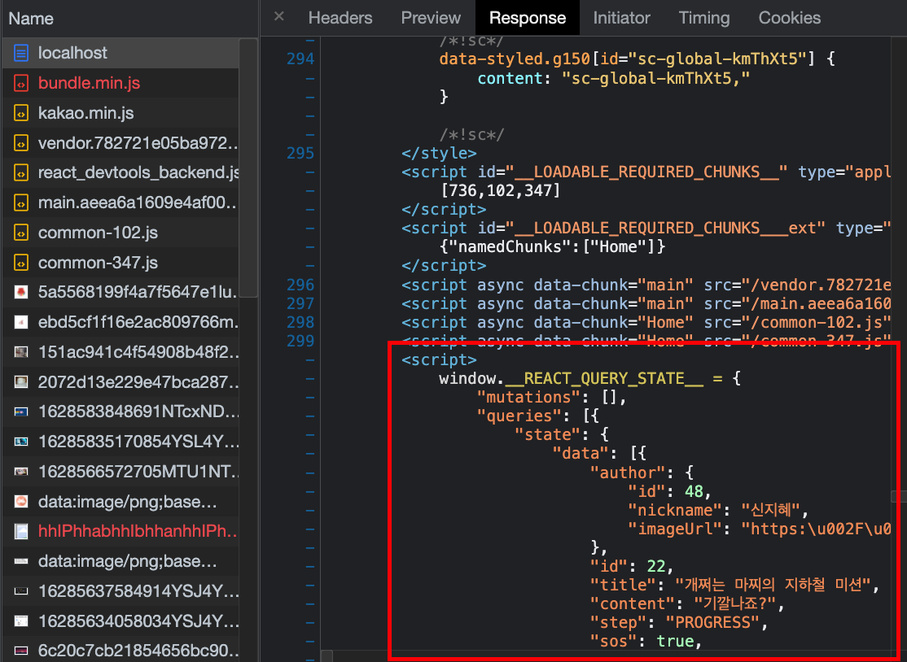

SSR 버그 고치는 중

<!-- more -->

---

## 놀토 프로젝트

SSR로 인한 각종 버그 고치기 대잔치…
react-query를 적용하여 피드 데이터까지 서버에서 미리 받아서 브라우저에 렌더링해주도록 했다.

### express 서버에서 react-query로 데이터 내려주기

접속한 앱의 페이지가 서버 데이터를 받아서 보여줘야 하는 컴포넌트라면, SSR 적용 시 서버에서도 함께 해당 데이터를 미리 받아서 내려주는 것이 좋다. 그래야 관련 피드를 검색했을 때 SEO에 반영되기 때문이다. 클라이언트에서 서버 데이터 fetch 사용하는 라이브러리인 react-query를 express 서버에도 적용시켜 보았다.

react-query 공식 문서에서 지원하는 SSR 작성 방식은 다음과 같다.

```jsx
// server.js
import { dehydrate, Hydrate, QueryClient, QueryClientProvider } from 'react-query';

function handleRequest (req, res) {
  const queryClient = new QueryClient()
  await queryClient.prefetchQuery('key', fn)
  const dehydratedState = dehydrate(queryClient)

  const html = ReactDOM.renderToString(
    <QueryClientProvider client={queryClient}>
      <Hydrate state={dehydratedState}>
        <App />
      </Hydrate>
    </QueryClientProvider>
  )

  res.send(`
    <html>
      <body>
        <div id="root">${html}</div>
        <script>
          window.__REACT_QUERY_STATE__ = ${JSON.stringify(dehydratedState)};
        </script>
      </body>
    </html>
  `)
}
```

약간 변형해서 다음과 같이 사용했다.

```jsx
app.get("/feeds/:feedId", (req, res) => {
  generateResponse(req, res, async (queryClient) => {
    await queryClient.prefetchQuery(
      [QUERY_KEYS.FEED_DETAIL, Number(req.params.feedId)],
      () => getFeedDetail(Number(req.params.feedId))
    );
  });
});
```

`generateResponse` 함수에서는 세 번째 인자로 전달 받은 query function을 실행하고, 해당 데이터를 serialize한 query data 정보를 클라이언트의 전역 변수(`window`)로 내려준다.

(전체 코드는 🍀 [여기서 읽기](https://zigsong.github.io/2021/10/02/ssr/))

그리고 이를 사용하는 클라이언트의 리액트 앱 진입점에서 다음과 같이 사용한다. 서버에서 내려주는 query data 정보를 window 객체에서 `__REACT_QUERY_STATE__`로 불러와, `Hydrate`를 통해 리액트 앱에 심어준다.

```jsx
import { Hydrate, QueryClient, QueryClientProvider } from "react-query";

const dehydratedState = window.__REACT_QUERY_STATE__;

const queryClient = new QueryClient();

ReactDOM.hydrate(
  <QueryClientProvider client={queryClient}>
    <Hydrate state={dehydratedState}>
      <App />
    </Hydrate>
  </QueryClientProvider>,
  document.getElementById("root")
);
```

개발자 도구의 Network 탭을 통해 서버에서 react-query 데이터를 내려주는 것을 확인할 수 있다!



**Ref** https://react-query.tanstack.com/guides/ssr

### SSR에서 React Portal 사용하기

SSR을 사용하니 react portal을 사용하는 SnackbarProvider 컴포넌트가 정상적으로 동작하지 않았다. BaseLayout이 SnackbarProvider 내부에 들어가버리는 바람에, snackbar가 뜨는 위치가 완전히 꼬여버린 것이다. 도대체 뭐가 문제인지 한참을 고민했다.

첫 번째 접근은, 서버가 React Portal을 이해하지 못하기 때문에 Portal은 클라이언트 단에서 처리해주자는 것이었다. React Portal은 현재 React app의 루트 컨테이너인 `<div id="root">` 외부에 DOM을 새로 생성하고, 해당 DOM 컨테이너에 컴포넌트를 렌더링하게 되므로 `<div id="root">`만 조작하고 있는 서버 단에서는 Portal의 렌더링을 컨트롤할 수 없는 것이다.

따라서 컴포넌트가 마운트되었을 때 비로소 Portal을 사용한 컴포넌트를 렌더링하는 방식으로 코드를 변경해주었다.

```tsx
const SnackbarProvider = ({ children }: Props) => {
  const [isMounted, setIsMounted] = useState(false);

  useEffect(() => {
    setIsMounted(true);
  }, []);

  return (
    <Context.Provider value={contextValue}>
      {children}
      {hasWindow &&
        isMounted &&
        ReactDOM.createPortal(
          snackbarElement,
          document.getElementById("snackbar-root")
        )}
    </Context.Provider>
  );
};
```

이제 SnackbarProvider는 올바른 위치에서 정상적으로 동작하지만, 어떤 이유에선지 서버에서 아무 데이터도 내려주고 있지 않았다. 그냥 다시 CSR이 된 것이다. 🤯

아래처럼 SnackbarProvider를 loadable을 이용해서 lazy loading해주어도 마찬가지였다. (`{ ssr: false }` 옵션을 적용했다.)

```tsx
// App.tsx
import SnackbarProvider from "contexts/snackbar/SnackbarProvider";

const SnackbarProvider = loadable(
  () =>
    import(
      /* webpackChunkName: "SnackbarProvider" */ "contexts/snackbar/SnackbarProvider"
    ),
  { ssr: false }
);

const App = () => {
  return <SnackbarProvider>// ..</SnackbarProvider>;
};
```

문제는 따로 있었다! styled-components는 하나의 전역 카운터를 두고 이를 기반으로 classname을 생성하는데, 현재 클라이언트 용 webpack.common.js와 서버 용 webpack.server.js가 서로 다른 babel 환경을 가지고 있어서 클라이언트에서 생성된 styled-component classname과 서버에서 생성된 classname이 달랐다.

이를 해결하기 위해서는 `babel.config.json`으로 통일된 babel 환경을 관리하거나 클라이언트와 서버가 같은 webpack 설정을 가지도록 하는 방법이 있다. 여기서는 후자의 방법을 선택하여, webpack의 `merge` 메서드를 활용했다. webpack.common.js와 webpack.server.js가 같은 `babel-plugin-styled-components` 플러그인을 사용함으로써, classname으로 컴포넌트 생성 시 서로 충돌이 발생하지 않는다.

**Ref** https://blog.shift.moe/2021/01/

---

## 공부하기

### JSON.stringify 대신 serialize를 하는 이유

SSR에서 react-query를 사용하며 서버에서 미리 받아오는 react-query의 데이터를 `window` 객체를 이용해 전역 변수로 내려줘야 했다. 이때 공식문서에서는 react-query 데이터 타입을 string으로 바꿔주기 위해 다음과 같이 `JSON.stringify`를 사용하고 있다. 가장 일반적으로 생각해볼 수 있는 방식이다.

```tsx
res.send(`
   // ...
     <div id="root">${html}</div>
     <script>
       window.__REACT_QUERY_STATE__ = ${JSON.stringify(dehydratedState)};
     </script>
   // ...
  `);
```

그러나 이때 누군가가 악의적으로 전역 변수에 script 태그를 삽입한다면? 😈

```tsx
<script>
  window.__userInJSON__ = {"username":"</script> <- 여기까지만 의도한 대로 실행 <script>alert(\"요건 몰랐지\")</script>"}
</script>
```

script 태그를 임의적으로 삽입하여 악의적인 동작을 수행하는 XSS 공격을 막기 위해 `</` 같은 문자를 `<` 같은 HTML 엔티티로 바꿔줘야 한다. 이때 serialize를 사용한다. URL 쿼리 파라미터들을 자동으로 연결해주는 역할만 해주는 줄 알았는데, 이런 기능까지 해주다니! 똑똑하고 유용한 친구다.

---

## 기타

### Responsive Images

**✅ 마크업 이미지**

- 이미지에 상대 크기 사용
- 높은 DPI 기기에서 srcset로 img 개선
- picture가 있는 반응형 이미지에서의 아트 디렉션
- 압축 이미지
- 자바스크립트 이미지 대체 - `pageload` 이벤트가 실행될 때까지 이미지 로딩을 지연
- 이미지 인라인 처리: 래스터(png, jpeg, webp) 및 벡터(svg)
- 데이터 URI - `img` src 요소를 Base64 인코딩 문자열로 설정
- CSS에서 인라인 처리 - HTTP 요청을 줄일 수 있다.

**✅ CSS의 이미지**

- 조건부 이미지 로딩 또는 아트 디렉션에 미디어 쿼리 사용
- image-set을 사용하여 고해상도 이미지 제공
- 미디어 쿼리를 사용하여 고해상도 이미지 또는 아트 디렉션 제공

**✅ 아이콘에 SVG 적용**

- 간단한 아이콘을 유니코드로 대체
- 복잡한 아이콘을 SVG로 대체
- 주의해서 아이콘 글꼴 사용

**✅ 성능을 위해 이미지를 최적화**

- 올바른 형식 선택: 벡터 이미지 및 래스터 이미지 고려, 올바른 압축 형식 선택
- 파일 크기 줄이기 - 저장 후 이미지 사후 처리(무손실 압축 등)
- image sprite 사용
- 지연 로딩 고려

**✅ 이미지는 절대 피하세요**

- 이미지에 삽입하는 대신 마크업에 텍스트를 배치
- CSS를 사용하여 이미지 대체

**Ref** https://developers.google.com/web/fundamentals/design-and-ux/responsive/images#replace_complex_icons_with_svg

### 레스토랑에 비유해서 알아보는 운영체제

**Ref** https://wormwlrm.github.io/2021/10/04/OS-Restaurant.html

### 웹 부트캠퍼 개발자를 위한 컴퓨터 과학

**Ref** https://www.wisewiredbooks.com/csbooks/index.html

---

## 마무리

끝나지 않는 SSR..!! 그 와중에 수업도 꽤 많았고, 시간도 부족했다. (하지만 타입스크립트 특강은 정말 재밌고 유익했다!) 면접도 한 개 봤다. 지난 미션을 오래오래 걸려 마쳤지만 더 대박인 마지막 미션도 나왔다. 감도 잡히지 않지만 유종의 미를 거두기 위해서 또 열심히 쏟아봐야겠다.

또 한 달 여 만에 놀토 팀원들을 만나러 갔다. 처음 가보는 잠콩에서는 오며가며 대략 20명의 크루를 만난 것 같다 🤣🤣🤣 정말 3개월 만에 루터도 가서 티셔츠와 후드티도 받아오고, 나 빼고 다 접종완료된 팀원들 덕분에 회식도 했다. 3개월 전보다 확실히 더 편해지고 끈끈해진 느낌이다. 모두 가고싶은 곳에 취업 잘 해서 한 턱씩 쏘는 날이 빨리 왔으면 좋겠다 😊
